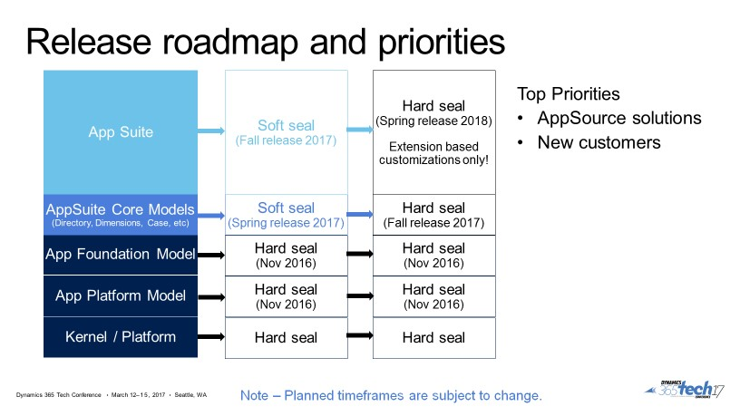

---

# required metadata

title: Application extensibility plans
description: This topic discusses the requirements and schedule for converting code from overlayering-based to extension-based.
author: FrankDahl
manager: AnnBe
ms.date: 07/10/2017
ms.topic: article
ms.prod: 
ms.service: dynamics-ax-platform
ms.technology: 

# optional metadata

# ms.search.form: 
# ROBOTS: 
audience: Developer
# ms.devlang: 
ms.reviewer: robinr
ms.search.scope: Operations, Platform, UnifiedOperations, AX Platform
# ms.tgt_pltfrm: 
ms.custom: 89563
ms.assetid: 
ms.search.region: Global
# ms.search.industry: 
ms.author: fdahl
ms.search.validFrom: 2017-07-10
ms.dyn365.ops.version: Platform update 1
---

# Application extensibility plans

[!include[banner](../includes/banner.md)]

Reducing implementation and upgrade effort is a major initiative for the Microsoft Dynamics 365 for Operations development team. The benefits of this initiative are to enable you to quickly take advantage of new innovations from Microsoft and your partners, reduce the total cost of ownership, and improve quality. A major part of this initiative is to change the customization approach for the product.  In Dynamics AX 2012, several extension capabilities were added to the product. For example, the ability to do event-based customization using method pre-and post-events was introduced. Extension capabilities have continued to grow in the evolution to Dynamics 365 for Finances and Operations, Enterprise edition.  

Extension-based customizations have several advantages over the legacy approach of overlayering-based customizations, especially when it comes to reducing implementation and upgrade effort.  
+ Overlayering-based customizations require code upgrade, recompile time, and extensive testing. This limits the ability to seamlessly apply hot fixes. These costs can be an inhibitor for customers to upgrade to newer versions containing innovations from Microsoft and partners.  
+ Extension-based customizations also improve the development experience. Models containing overlayered customizations must be in the same package as the base objects. This results in longer compile cycles and larger package distributions. Extensions are also much easier to unit test in isolation from the base object.  
+ Reducing upgrade costs through extension-based customizations reduces the support matrix for partners as fewer release combinations will need to be supported.

For these reasons, the product platform models, **AppPlatform** and **AppFoundation**, must use extension-based customizations. These models were sealed for overlayering in Platform update 3 (November 2016). Binary updates are now provided to these models on a monthly basis, achieving our goals of reducing upgrade cost and delivering innovation to our customers at a faster cadence. 

The following illustration shows the roadmap that we're following as we move to extensions, away from overlayering.

> [!NOTE]
> A soft seal results in a compiler warning upon overlayering. A hard seal results in a compiler error upon overlayering. 

The Modern support policy provides three years of support for a release. Given this, overlayered code will continue to be supported for three year after the next major release, planned for November 2017. However, this code will not be moved forward to subsequent product releases until the overlayered code is moved to extensions.  

There is a substantial amount of work for Microsoft, partners, and customers to accomplish this goal. Workshops, office hours, Help topics, and more are planned for training and collaboration in this ecosystem. Internally, we’ve already ramped up investment to build more extensibility features in both the core platform and the application. We’re working closely with partners with applications on AppSource to define patterns as they migrate to extensions.

The benefits of reducing upgrade friction and enabling innovation uptake will be worth the effort to remove overlayering.
