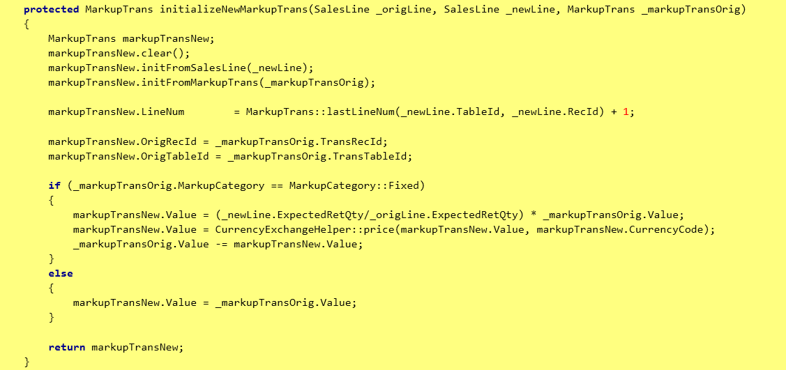
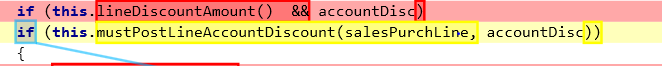

---
# required metadata

title: Write extensible methods
description: This article provides information about how to write extensible methods.
author: smithanataraj
manager: AnnBe
ms.date: 09/09/2018
ms.topic: article
ms.prod: 
ms.service: dynamics-ax-platform
ms.technology: 


# optional metadata

# ms.search.form: 
# ROBOTS: 
audience: Developer
# ms.devlang: 
ms.reviewer: kfend
ms.search.scope: Operations
# ms.tgt_pltfrm: 
ms.custom: 268724
ms.assetid: 
ms.search.region: Global
# ms.search.industry: 
ms.author: smithanataraj
ms.search.validFrom: 2018-09-09
ms.dyn365.ops.version: Platform update 20
---

# Write extensible methods

[!include [banner](../includes/banner.md)]

By default all public and protected methods in X++ are extensible by Chain of Command (CoC). 
When you make a method extensible, you should assess the exposed functionality of the method and the impact it can have when extended.

Before you make a method extensible, consider the impact the extensions might have on the scenario where the method is used. For example, allowing extensions to initialize a table record is low risk, whereas allowing extensions to skip a certain validation is higher risk depending on the business scenario. You may also want to consider the impact if the method is extended in parallel by other extensions. 
After you have made a method extensible, any future modifications to the method would be restricted due to the potential user impact when the method signature or logic is modified.
	
The following are some guidelines that could be applied when writing extensible code:
	
+ **Short and concise methods** - A method should only one responsibility. This enables easy extensions of the method which can only act on the given agenda of the method. For a simple example, keep the construction and initialization of a class object in two separate methods.

+ **Only expose what is necessary** - For any new class members or methods that are added, allow minimal access to all class members and methods by keeping them private. 

+ **Use private, protected, public and final explicitly** For methods and class fields, this will guide any extenders of your code to your extension points, while allowing you to keep full control of the parts the extender shouldn't care about or depend on.

+ **Method parameters**:
  - The method is most likely long and should be refactored. Consider if it qualifies to refactor the entire method into a class and/or split into multiple smaller methods requiring fewer parameters. 
  - In other cases, when several parameters are required, they often have a coherence that could be expressed by a class. Encapsulating these parameters in a class would make it easy to for extenders to add additional parameters and add additional parameters to the base method without breaking APIs in future. 

+ **Switch blocks**
  - Avoid switch blocks in the middle of methods. A switch block should be in its **own method** to allow extending it. 
  - **Long case blocks** are good candidates to refactor into a class/class hierarchy with subclasses for each of the case blocks.
		See ```SalesLineCopyFromSource``` class hierarchy, for example.
  - Having **default blocks** in switch statements makes the method having the switch block non-extensible.
  - Avoid having **throw statements within the default block** of the switch statement. This makes the switch statement non-extensible. One way to handle the throw in the default case is to refactor the switch block to a separate method that is extensible or make the entire method replaceable.
			
In the following example, the ```findOrderHeader``` is replaceable, which is another solution.

		    private Common findOrderHeader(boolean _forUpdate)
		    {
		        switch (this.InventTransType)
		        {
		            case InventTransType::Sales:
		                return this.salesTable(_forUpdate);
		
		            default: 
		                return this.findOrderHeaderDefault(_forUpdate);
		        }
		    }
		
		    [Replaceable]
		    protected Common findOrderHeaderDefault(boolean _forUpdate)
		    {
		        throw error(Error::wrongUseOfFunction(funcName()));
		    }

+ **While**
Avoid having **while** blocks in the middle of methods because it becomes more difficult to extend the **while** block. Ideally, logic within the **while** block should be in a separate method which enables extensions.

Not extensible code:

   
 
 Extensible code after refactoring:
 
 
 
 
+ **If..else statements**
	- To provide the ability to extend the conditions in an if statement, extract the logic in the if condition to a separate method.
	- Avoid having nested if..else blocks. This makes it difficult to change the logic in one of the blocks.
		- One way to resolve this is to refactor each of the conditions and the logic within each of the blocks into separate methods respectively. This allows you to extend the conditions or the logic within each block. 
	- When the if..else blocks are handling specialization, consider moving out the logic into a class hierarchy. 
			Eg. ```SalesLineCopyFromSource```
	- Having a throw in an 'else' block of a method (when the method only has an if..else), also makes the method non-extensible in certain scenarios. A way to handle the throw in the else is to refactor the conditions for the throw in a separate method.
		
+ Avoid using **PrmIsDefault**
When the method is overridden or wrappable, the caller of ```super()``` or ```next()``` provides all parameters, which always makes ```prmIsDefault()``` return false.

+ Avoid using **enumCnt**
At compile time, this method will use a numeric literal of the number of values an enum has. If the enum is extended or made extensible in the future, it will require your code to be recompiled. Instead use ```DictEnum.values()```.
		
+ **Construct methods** 
	- Use the ```SysExtension``` framework to allow easy extensions.
	- Avoid having a throw in factory methods. One way to resolve this is to extract the conditions for the throw in a separate method that is extensible. See more details in **Throw statements** section below.
	
+ **Static methods**
Static methods can't be extended with extra state. For example, a method extender can introduce properties that can be set by using parameter methods. When possible, use instance methods instead.

+ **Ability to extend part of the logic inbetween a long method** 
If it is not possible to refactor an entire method, but the goal is to make a part of the method extensible, apply the extract method refactoring. The new protected method must have a single responsibility and a name that conceptually and precisely describes its responsiblilty. This allows owners and all extenders to use the method without breaking each other. For example, initialization, insertion, updates to a table record, or instantiation and initialization of a class could be extracted out into smaller methods enables each of these for extensions. The original method then calls these individual methods, hence not breaking the callers to this method.
			
+ **Throw statements**
If a throw is added to an existing method that is extensible then it can potentially break extenders. Consider adding the conditions for the throw in an extensible method to give extenders the ability to leverage that as needed and get rid of the throw. 

Not extensible code:

 

Extensible code after refactoring:

 

+ CRUD statements 
	- Use Query objects in scenarios where the queries should be extensible. Implement a protected method which builds the query and may be several separate methods to add joined datasources, ranges and selection fields. This way different parts of the query are extensible individually.
	- Use ```SysQueryInsertRecordSet``` to convert insert_recordset to query.
	- Avoid using field lists in select statements. This will enable extenders to retrieve their additional fields without having to extend.
	- Use the **in** keyword in query ranges to allow extenders to add more values to the query range. This is recommended especially for query ranges with enum values.
