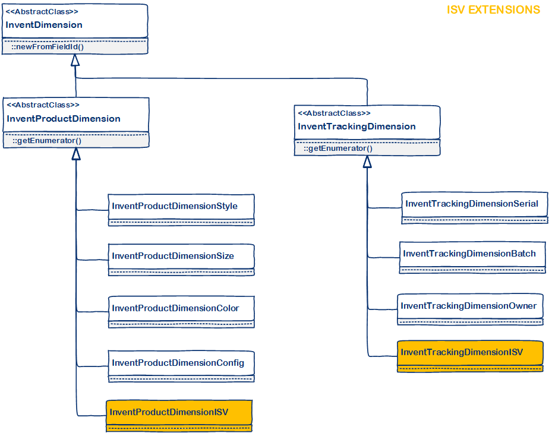
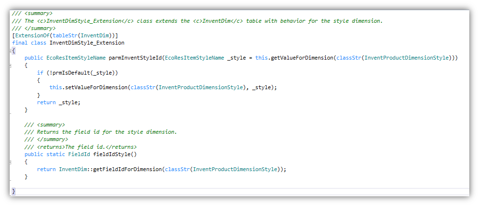
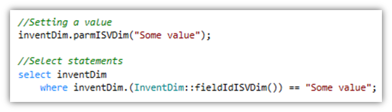

---

# required metadata

title: Price and discount extensibility
description: This topic describes how to add new inventory dimensions through extensions in Microsoft Dynamics 365 for Finance and Operations, Enterprise edition
author: MichaelFruergaard
manager: AnnBe
ms.date: 1/31/2018
ms.topic: article
ms.prod: 
ms.service: dynamics-ax-platform
ms.technology: 

# optional metadata

# ms.search.form: 
# ROBOTS: 
audience: Developer
# ms.devlang: 
ms.reviewer: AnnBe
ms.search.scope: Operations
# ms.tgt_pltfrm: 
ms.custom: 89563
ms.assetid: 
ms.search.region: Global
# ms.search.industry: 
ms.author: mfp
ms.search.validFrom: 2018-01-01
ms.dyn365.ops.version: Platform update 13
---

# How to add a new inventory dimension

It is now possible to add new inventory dimensions through extensions. This page describes the solution at a high level and provides pointer to a sample application containing an actual implementation.
There are several technical limitations influencing the design of the solution. The most significant is the SQL statements throughout the application containing where-clauses on InventDim. Most of these are implemented using macros - but that doesn't change the fact that SQL statements are not extensible. Many of the SQL statements could be rewritten to use Query objects (which are extensible) - still many delete_from and update_recordset would remain. A viable solution cannot require changes to these SQL statements when adding new dimensions.

Another mention-worthy technical limitation is the amount of inventory dimensions that can be supported. Each adds a small overhead, and the InventDimFixed EDT sets an upper-limit on 32. This EDT contains a bit mask for each dimension, and as the EDT is an integer that limit is 32. The provided solution stays within the limit of 32; if required in the future we could change InventDimFixed to be an Int64 (or better still a container, or even better remove it).

## Solution overview
The corner stone in the solution is that multi-roles partake in the life-cycle of a solution. This description is simplifying and generalizing, in real-life there is overlap between the roles, and sometimes it might even be the same person filling several roles.

### Microsoft
Microsoft provides a finite set of unused dimension fields.

On top of the 15 existing dimensions, Microsoft will support 10 generic dimensions. 8 will be string-based, 1 real-based and 1 utcdatetime based.  This brings the total number of inventory dimensions in the standard application to 25:
- 4 product dimensions: Color, Size, Style and Config.
- 5 tracking dimensions: Serial, Batch, Owner, Profile (Russia only) and GTD (Russia only).
- 6 storage dimensions: Site, Warehouse, Location, Status, License Plate and Pallet (for upgrade and migration only)
- 10 unassigned generic dimensions: InventDimension1 to InventDimension10.

In other words, Microsoft provides the physical schema.

### ISV-role
The ISV adds new inventory dimensions. The ISV solution provides all the specific functionality for the dimension, it must be strongly-type, maintainable, testable and performant. Further, the solution must be agnostic to other ISV's solutions.
The ISV builds a solution that doesn't reference the physical schema directly, but goes through an indirection. With the new X++ extension capabilities, this can also be done seamlessly. 
In other words, the ISV provides the logical implementation.

### VAR-role
The VAR must be able to deliver a fully functional system to a customer. The system can contain solutions from multiple ISVs - each potentially containing new inventory dimensions.  In total up-to 10 ISV dimension fields are supported.
The VAR provides the binding between the physical data model and logical implementation.

## Details
The first half of the solution is straight forward. A new class hierarchy is introduced. Each new dimension must be implemented in a new class deriving from either InventProductDimension or InventTrackingDimension. There is currently no support for storage dimensions. With this, ISVs can introduce new dimensions without having to change any of the logic on the InventDim table. 

To reference the new dimension in a strongly-typed fashion the ISV introduces a table extension class to the InventDim table. The extension classes for Style, Color and Size can be used as templates.
 

 
Now the dimensions can be referenced like this:

The ISV can now build logic including data model and user interface for maintaining the list of dimension values for the new inventory dimension.

The second half of the solution is the data model. The standard application will contain the following for each of the new dimension:
•	One Label file, 
•	One Configuration key, 
•	Two EDTs (for the field on InventDim and for the flag on InventDimParm), 
•	One field on InventDim table,
•	One field on InventDimParm table,
•	One field on InventDimFieldMap map - and one field on each of the (~30) tables mapped.

The VAR's job is to wire the ISV solution(s) to the available dimension fields on InventDim for a given customer.  We are aiming at minimizing this work. As of now, it includes:
- Implement the binding mapping - This is accomplished by extending the method InventDimFieldBinding.className2FieldName().
- Enable the configuration key(s).
- Extend the EDT(s) - to specify the right string size.
- Extend the Label file(s) - i.e. copy the ISV provided labels into the right label file.
- Extend the ProductDimensions or TrackingDimensions field groups on InventDim - and a few other tables, depending on the type of dimension.
- Extend relations and index as needed on InventDim.

## Sample application

A sample application is available here. It consists of 3 models: The ISV’s production code, the ISV’s test code, and the VAR’s integration code.  Together they provide a great starting point for implementing new inventory dimensions. The sample application introduces the new product dimension: Flavor. The application supports many end-to-end business scenarios, for example creating, buying and selling items with various flavors.

The sample application is made available on GitHub, please log issues directly there, and feel free to contribute by adding more coverage.
 

