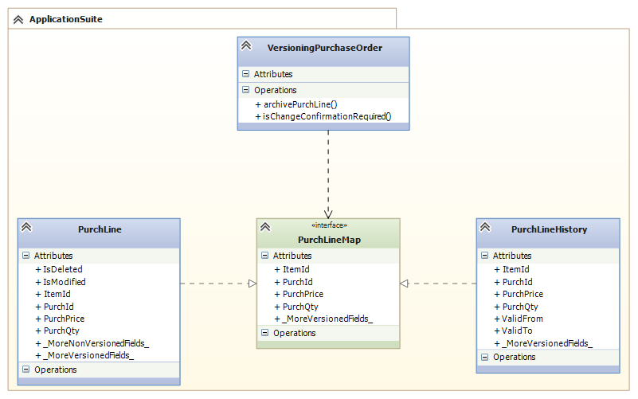
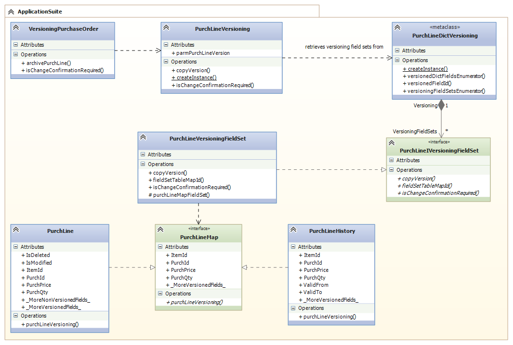
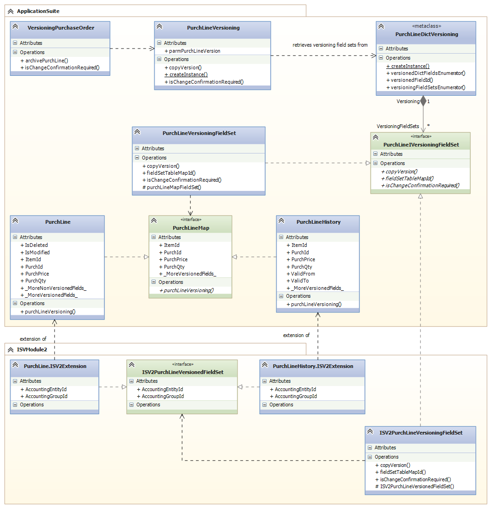

---

# required metadata

title: Extend table maps used for versioning
description: This topic describes how to extend table maps used for versioning.
author: LarsBlaaberg
manager: AnnBe
ms.date: 12/10/2017
ms.topic: article
ms.prod: 
ms.service: dynamics-ax-platform
ms.technology: 

# optional metadata

# ms.search.form: 
# ROBOTS: 
audience: Developer
# ms.devlang: 
ms.reviewer: robinr
ms.search.scope: Operations
# ms.tgt_pltfrm: 
ms.custom: 89563
ms.assetid: 
ms.search.region: Global
# ms.search.industry: 
ms.author: lolsen
ms.search.validFrom: 2017-07-01
ms.dyn365.ops.version: Platform update 11
---

# Extend table maps used for versioning

This topic applies to Dynamics 365 for Finance and Operations, Enterprise edition 7.3 and later.

## Refactor of PurchLineMap

When new fields are added to the PurchLine and PurchLineHistory tables using table extensions then the new fields must be copied between the tables whenever a purchase order is versioned. The PurchLineMap table map specifies the fields that must be copied between the PurchLine table and the PurchLineHistory table when a new purchase order version is created or edited. To accomplish this, the PurchLineMap map table needs to be extended to include the additional fields. Additionally, the PurchLineMap is used by the VersioningPurchaseOrder class when archiving purchase order lines. The model is shown in the following diagram.

To be able to specify new fields to be copied, the PurchLineMap table map logic and its usage have been refactored. The copy logic has been moved to the PurchLineVersioning class, so the VersioningPurchaseOrder class references the PurchLineVersioning class instead of the PurchLineMap table map. The PurchLineVersioning class delegates the logic to copy the fields and the logic to determine whether a confirmation is required the classes that the PurchLineIVersioningFieldSet interface. Each class that implements the interface is associated with a table map that specifies the fields to copy.

The PurchLineDictVersioning class is responsible for instantiating the PurchLineIVersioningFieldSet object using reflection. The PurchLineDictVersioning collects the entire set of fields which must be copied. The field data is collected based on all the table maps associated with a class that implements PurchLineIVersioningFieldSet. The following diagram displays the new classes and their dependencies.

# How to extend PurchLine and PurchLineHistory tables with new fields

Suppost that you want the ISVModule2 model to extend the PurchLine and PurchLineHistory tables with new fields that must be copied when creating a new version of a purchase order. To perform this task the developer of ISVModule2 must perform the following steps:
1. Add fields through table extensions to the PurchLine and PurchLineHistory tables.
2. Create a new table map containing the fields that must be copied, and implement the new table map on the two new table extensions.
3. Create a new class which implements the PurchLineIVersioningFieldSet interface and implement the required methods.
    - The copyVersion method must copy data between two records of the new table map type.
    - The fieldSetTableMapId method must return the id of the new table map.
    - The isChangeConfirmationRequired method must return true or false based on whether the change to the newly added field values requires a confirmation to be created.

The class and extensions described in these steps are shown in the following diagram.

