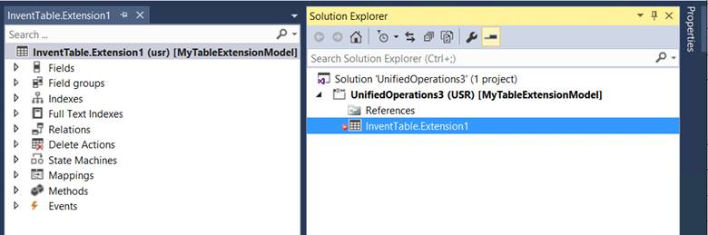

---
# required metadata

title: Modify the properties of a table
description: This topic describes how to modify properties on a table by using an extension.
author: ivanv-microsoft
manager: AnnBe
ms.date: 07/10/2017
ms.topic: article
ms.prod: 
ms.service: dynamics-ax-platform
ms.technology: 

# optional metadata

# ms.search.form: 
# ROBOTS: 
audience: Developer
# ms.devlang: 
ms.reviewer: robinr
ms.search.scope: Operations, Platform
# ms.tgt_pltfrm: 
ms.custom: 268724
ms.assetid: 
ms.search.region: Global
# ms.search.industry: 
ms.author: ivanv
ms.search.validFrom: 2017-07-01
ms.dyn365.ops.version: Platform update 4

---

# Modify the properties of a table

To modify properties on a table, you must create an extension of that table. In Application Explorer, right-click the table, and then select **Create extension**. A new table extension is created in the selected project, as shown in the following illustration.

 

You can now modify the following properties through the property sheet:

+ Created By
+ Created Date Time
+ Modified By
+ Modified Date Time
+ Country Region Codes

By setting the **Created By**, **Created Date Time**, **Modified By**, or **Modified Date Time** property to **Yes**, you help guarantee that a corresponding field is added to the table. Corresponding tracking information about the user is then stored in the table when records are created or updated. You can't set these properties to **No** if they are set to **Yes** on the base table.

By adding country or region codes to the list, you help guarantee that the corresponding table is also applicable when the system runs in the context of the specified country or region.
