---
# required metadata

title: Ledger account combinations
description: Ledger account combinations in the dimension framework
author: jasonsto
manager: jdinham
ms.date: 1/31/2019
ms.topic: article
ms.prod: 
ms.service: dynamics-ax-platform
ms.technology: 

# optional metadata

# ms.search.form: 
# ROBOTS: 
audience: Developer
# ms.devlang: 
ms.reviewer:
ms.search.scope: Operations
# ms.tgt_pltfrm: 
ms.custom: 11314
ms.assetid: 20e6b97e-30ed-48d4-b63c-a073f80300b2
ms.search.region: Global
# ms.search.industry: 
ms.author: rbrow
ms.search.validFrom: 2019-01-16
ms.dyn365.ops.version: AX 7.0.0

---

**Introduction**

In Dynamics AX 2009, dimensions were limited to a minimum of three and a maximum
of ten, and entered in a set order that required code customizations and
database synchronization for each dimension added. Then in Dynamics AX 2012, the
dimension framework was expanded to allow unlimited dimensions which can be
dynamically created by the user, and entered in any order. This has remained
true through Dynamics 365 for Finance and Operations. The unlimited nature of
the model, coupled with taking advantage of relational database design as well
as optimizing for performance requirements has led to a more complex data model
than existed in the past. 

**Part 1 – “What happens when I create a ledger account combination?”**

In this section, we will discuss the various areas of the dimension framework,
and how they work together to give a better understanding of “What happens when
I create a ledger account combination?”

The model below in figure 1.1 shows the various areas within the dimension
framework.

 
**Figure 1.1: Dimensions in framework**

This section covers the Dimensions, Dimension Values, Categorizations and
Backing Entities regions highlighted in figure 1 above in pale yellow.

**Dimension Attributes**

A dimension attribute, which will be referred to as a dimension, simply
represents an additional piece of classifying information that a user would like
to associate with a ledger account combination. It represents classes of things,
not specific instances. Examples of things that can be used to create a
dimension are Department, Cost Center, Expense Purpose, Customer, Vendor, Item –
which are all classes of entities that already exist in the system; or custom
entities that are specific to a particular installation such as license plate
number or event name or ticket number.

When a dimension is created, the user chooses to use values for it from either
an existing entity in the system such as Customers or Departments, or to create
a custom list. The dimension framework keeps track of a reference for this
dimension to a table in the system.  For existing entities such as Customers, a
reference to the CustTable table is used.  For custom entities that are defined
by the user, a reference to the DimensionFinancialTag table is used.  This
metadata about what a dimension represents is stored in the DimensionAttribute
table for each dimension defined. 

The following form shows an example of two dimensions, one to represent
customers that already exist in the application, and another that represents a
new custom list.

 
**Figure 1.2: Financial dimensions form**

The data is stored in the DimensionAttribute table. The SQL query below in
figure 1.3 shows some of the basic information associated with each dimension.

[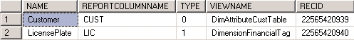](./media/FinancialDimensionSQL.png) 
**Figure 1.3: DimensionAttribute storage query results**

The **Type** determines whether the dimension is backed by an existing entity in
the system or a custom list.  It is also important to note that the dimension
framework does not directly reference the existing entity backing table such as
**CustTable**. Instead, a custom view is created to make an entity available in
the system for use in the dimension framework. As of Dynamics 365 for Finance
and Operations, 36 existing entities have been enabled to be used as dimensions
in the system by default.  

It is possible for a user to create more than one dimension based on the same
entity. There may be instances where an entity in the system is used for
multiple different purposes when classifying transaction activity in the
system.  In this case, multiple dimensions can be defined for it, one for each
of its purposes.  A common example would be a cost center backing entity used to
represent the primary cost center (e.g. selling) and the cost center the
transaction is being traded against (e.g. purchasing).

Internally, special dimensions exist that are automatically created to support
key functionality of the dimension framework. A primary example is the
**MainAccount** dimension. This allows a main account to be treated as a
dimension by the dimension framework, but also prevents it from being used by a
user to create a dimension. The other types of special dimensions are system
generated ones that are used by the dimension framework for internal purposes.

**Dimension Attribute Values**

A dimension attribute value is a specific instance of a dimension used within
the dimension framework. The values for a dimension are determined by the
ViewName specified on the DimensionAttribute record. In the case of an existing
entity, such as CustTable, values consist of the records in that table. In the
case of a custom list, it is a specific set of records within the
DimensionFinancialTag table.  Values that are available for a particular
dimension are viewable by clicking the “Financial dimension values” button on
the Dimension details form as shown in figure 1.2 above. When the list is
provided by an existing entity, such as CustTable, it is not editable from this
form. To create a new dimension value for Customer, the user would go directly
to the Customer form and create a new customer.  Once created, the new customer
will become available for use in the dimension framework. When the list is
provided by the user as a custom list, the user will be able to modify the list
directly on this form.

Example of a list of values provided by CustTable (with no values stored in the
dimension framework):

 
**Figure 1.4: Financial dimensions values form (existing list)**

 Example when provided by a custom list (with values stored in the dimension
framework):

[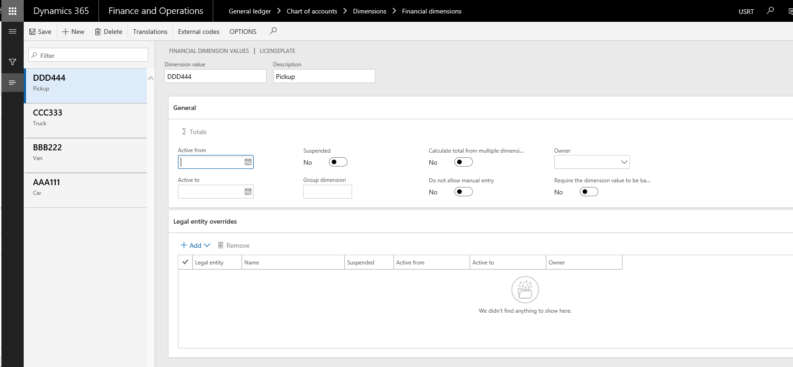](./media/FinancialDimensionValuesFormCustom.png) 
  **Figure 1.5: Financial dimensions form (custom list)**

[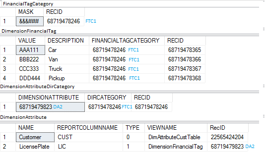](./media/DimensionSetupDataSQL.png) 
**Figure 1.6: Dimension setup tables query results**

In both of these cases, the Financial dimension values form is displaying what
values exist for the entity, not what values have actually been used within the
dimension framework.  The dimension framework representation of these values is
not created until it is used within the framework requiring it to hold a
reference to it. This allows for the ability for values to be deleted that have
not yet been used, and for storage size and performance optimization.

Once a dimension value is referenced requiring it to be saved by the dimension
framework, it is stored in the DimensionAttributeValue table.  This table is the
link between the DimensionAttribute and the specific RecId of the record in the
ViewName view or table referenced on the DimensionAttribute. Both the
DimensionAttribute and DimensionAttributeValue records are needed to navigate
back to the originating value that the user has entered.

In a system where nothing has been referenced by the dimension framework, there
will be no records in the DimensionAttributeValue table.

**Part 2: Dimension enumerations, default dimensions**

In this section we will cover the Dimension Enumerations and Default Dimensions
sections highlighted in pale yellow in the model in figure 2.1 below. 

Dimension enumerations and default dimensions are two storage mechanisms to
store a set of references to either dimensions or dimension values. These
commonly are exposed on a Financial dimensions tab on master data forms such as
Customers (CustTable) or Vendors (VendTable).

[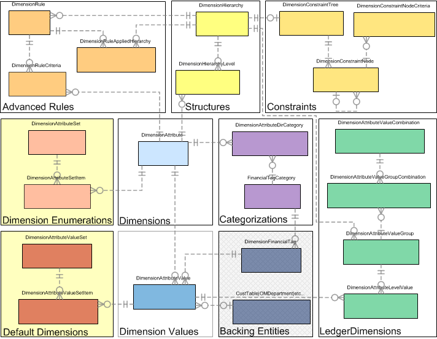](./media/SetsInFramework.png) 
**Figure 2.1: Sets in framework**

#### Dimension Enumerations

A dimension enumeration is a set of references to existing dimensions that are
persisted for later use. These dimensions have no particular ordering and no
constraints on which dimensions appear within the set by the dimension
framework. However, in most instances, the set is constrained by the consuming
code to the set of dimensions available in the current ledger.  A dimension
enumeration is stored in the DimensionAttributeSet and DimensionAttributeSetItem
tables.

The set specifies an enumeration type which is the enumNum() of the BaseEnum
that represents the source of enumeration values to associate with each
dimension. Therefore, this is a list of enumeration values as defined by the
developer; not a list of user-entered values from backing entities. In Dynamics
365 for Finance and Operations, an example of this is storage of a list of
dimensions that are to be Fixed, labeled as Fixed value, or NotFixed, labeled as
Not fixed, which are associated with each main account.

[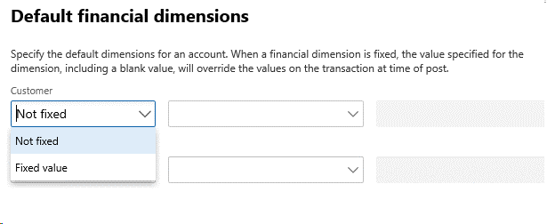](./media/DimensionEnumerationsOnForm.png) 
**Figure 2.2: Dimension enumerations on a form**

In the above example in figure 2.2, the enumeration DimensionFixed is used to
constrain the list of values in the drop down list.

[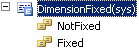](./media/DImensionEnumerationBaseEnum.png) 
**Figure 2.3: A dimension enumeration BaseEnum**

The value entered represents one item with a "1" EnumValue
(DimensionFixed::Fixed) and the other one with the default "0" EnumValue
(DimensionFixed::NotFixed).  The DimensionAttributeSet is stored as follows:

 
**Figure 2.4: Dimension enumeration storage query results**

The MainAccountLegalEntity record references the DimensionAttributeSet record by
its FixedDimensions field. The DimensionAttributeSet represents the combination
of dimensions for the enumeration type. The DimensionAttributeSetItem records
represent each dimension and enumeration value pair in the set, where the
enumeration value is represented by its integer value.

#### Default dimensions

Similar to how dimension enumerations hold a set of dimensions with an
associated enumeration value; a default dimension holds a set of dimensions with
specific dimension values. The name default dimensions comes from the fact that
these are typically entered on master data records and not directly on
transactions and are used in the defaulting of values into a ledger account
combination.  Similar to dimension enumerations, there is no specific structure
associated with these and in most instances the set is constrained by the
consuming code to the dimensions available for the current ledger.  A default
dimension is stored in the DimensionAttributeValueSet and
DimensionAttributeValueSetItem tables. 

**Figure 2.5: Default dimensions on a form**

In the above example in figure 2.5, the user has selected a dimension value to
associate with each dimension.  These values are stored in the
DimensionAttributeValueSet and DimensionAttributeValueSetItem tables as
follows: 

**Figure 2.6: Dimension value tables query results**

The MainAccountLegalEntity record holds a foreign key (FK) reference to the
DimensionAttributeValueSet table which represents the combination of entered
values. This table represents the set of dimensions value pairs held in the
DimensionAttributeValueSetItem table.

The DimensionAttributeValueSetItem table holds one record for each entered
dimension value, which references a DimensionAttributeValue.  No records are
stored for a dimension that has not been entered (left blank).  In the
DimensionAttributeValue table, there are now two records that were created when
the default dimension was entered because the dimension value has now been used
within the dimension framework. This links the dimension framework values with
the backing entities.  For performance reasons, the natural key (display value)
of the dimension value is stored on the DimensionAttributeValueSetItem table.

By following the link stored in the EntityInstance field on the
DimensionAttributeValue table, along with the associated ViewName on the
DimensionAttribute table, we can find the record in the originating tables of
CustTable (via the DimAttributeCustTable view) and DimensionFinancialTag to get
to the source of the values.

Part 3: Structures and Constraints
==================================

In this section, we will cover the Structures and Constraints regions
highlighted in pale yellow in the model below in figure 3.1.

As previously stated, the Dynamics 365 for Finance and Operations dimension
framework allows unlimited dimensions. Along with this is the ability for the
user to specify which dimensions to include in which order when entering a
ledger account combination and to constrain the values that can be entered for
each segment in that ledger account combination.

**Figure 3.1: Structures and constraints in framework**

#### Account structures

An example of an account structure appears below in figure 3.2:

**Figure 3.2: Account structure configuration form**

 This account structure, stored in the database in the **DimensionHierarchy**
table, is set up to require the entry of a Main account as the first segment of
a ledger account combination, followed by a customer and license plate number as
subsequent segments. This is the hierarchical order definition and is stored in
the database in the **DimensionHierarchyLevel** table.

**Figure 3: Structure query results**

Along with the order is the definition of constraints or the criteria that
defines the valid combinations of values. In this example, all segments must
have a value for the combination to be considered valid.  Any existing value
(already existing in the backing entity) may be entered and there are no
specific restrictions on the combinations of values that are valid.  This
criterion is stored in the DimensionConstraintTree, DimensionConstraintNode and
DimensionConstraintNodeCriteria tables.

**Figure 3.4: Simple constraints query results**

The above example in figure 3.4 shows the most basic constraint tree. Each of
the 3 constraint nodes have a \* (any existing value) constraint criteria
(stored as % in SQL and shown as "\<all values\>" in the UI) associated with
them. These constraints are used to both show what values may be entered for
each segment using a lookup, and validate values entered in the segment. These
constraints will eventually result in validation errors if improper values are
entered for a ledger account combination.

The dimension framework allows for significantly more complex constraint trees
where the value entered in on one segment drives the valid values allowed in the
subsequent segment. An example of the versatility is shown below in figure 3.5: 

**Figure 3.5: Constraint builder on the Configure Account Structure form**

Thus, a more complex constraint tree is shown in the following example:

[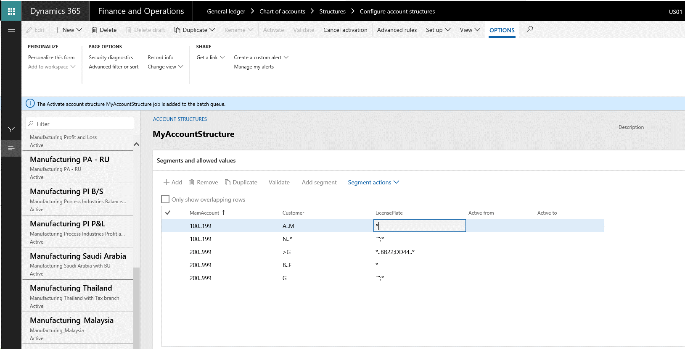](./media/AdvancedConstraintTreeExpandedOnForm.png)
**Figure 3.6: Advanced constraint tree expanded on form**

Resulting in the following constraint definition:

**Figure 3.7: Advanced constraint tree query results**

Note that in the case of entering [ 150 - B ] for a main account and customer,
that the user must enter a specific license plate number as well. However, if
the user enters [ 150 - W ] for a main account and customer, then no license
plate number is required. In both cases however, the user will always see 3
segments in the ledger account combination, even if one of them is left blank.
Examples of the effects of these structures, segments and constraints on the
entry of a ledger dimension account will be provided in a subsequent section
where we will discuss entry of ledger account combinations and their storage.

In case the user would like to only show trailing segments when they are
required to be entered, then advanced rules can be combined with the account
structure to provide the additional versatility.

**Part 4: Advanced Rules**

In this section, we will cover the Advanced Rules region highlighted in pale
yellow in the model below in figure 4.1.

While account structures and constraints allow the user to build very simple to
very complex trees of valid combinations, sometimes the business requirements
are to only show a dimension as a segment in an ledger account combination only
at certain times rather than just constrain the valid values allowed showing it
all the time. The use of advanced rules supports this requirement. 

[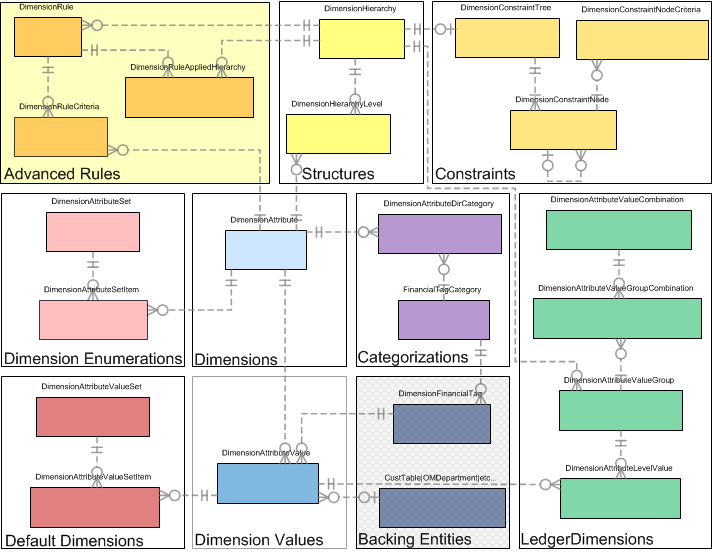](./media/AdvancedRulesGraph.png)
**Figure 4.1: Advanced rules in framework**

**Advanced rules**

Advanced rules can be added to an account structure and its constraints. While
versatile, there are guidelines when they should and should not be used for best
usability, performance and understanding:

-   Rules cannot replace the account structure.  A structure must always exist
    with at least a main account segment.

-   Rules cannot add dimensions before other segments already in the account
    structure.

-   Rules should not be used to replace the use of constraints in the account
    structure for additional dimensions that are always required regardless of
    the main account.

-   Rules should not be used to replicate segments that already exist in the
    account structure or other rules

-   Any duplication will automatically join and use the most restrictive
    constraint.

-   The location of the duplicated segment will only appear in the first
    occurrence of it.

Setting up an advanced rule involves defining a filter that controls when
additional segments are added to a ledger account combination, and then linking
rule structures (similar to account structures) that specify the additional
segments, their hierarchy order and any constraints between them to be added.

Assuming the following account structure is set up:

**Figure 4.2: Basic structure and constraints**

Let’s assume that a new advanced rule is needed to optionally add a segment (or
segments) only if the user has entered main account 145 and customers G thru Q:

[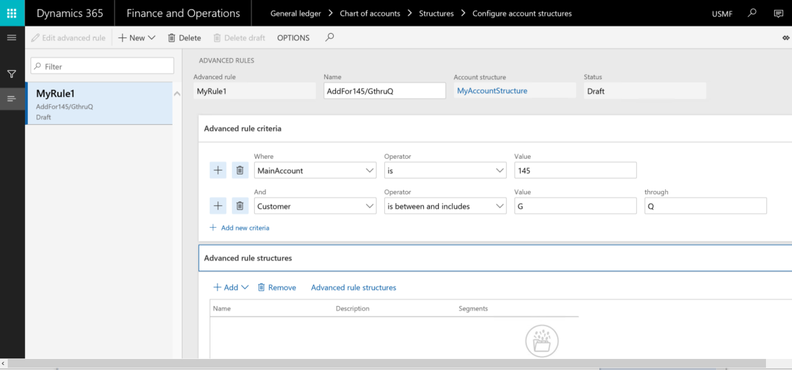](./media/AdvancedRuleForm.png)
**Figure 4.3: Advanced rule form**

Once the rule is configured, a structure and constraint definition needs to be
created to define what segments to add to the ledger account combination. This
is done by creating a new rule structure, similar to how an account structure is
created. These structures are not immediately bound to the rule, and as such can
be shared across multiple rules if necessary.

[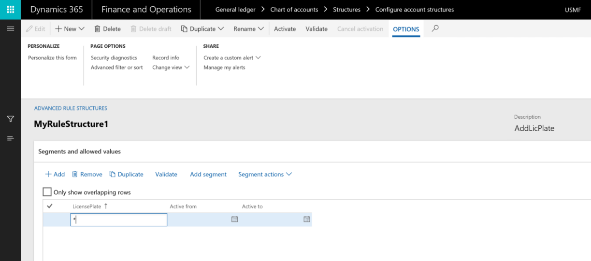](./media/AdvancedRuleStructureForm.png)
**Figure 4.4: Advanced rule structure form**

After the structure is created, it is added onto the dimension rule, and the
account structure along with the rule is then activated:

[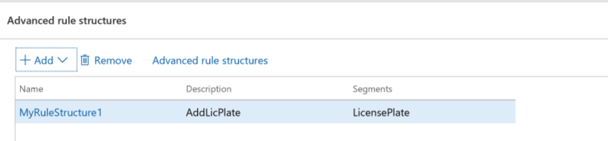](./media/AddedAdvancedRuleStructureToRule.png)
**Figure 4.5: Added advanced rule structure to rule**

The storage of this data uses some of the same tables as the storage of the
account structures discussed in the previous post.  The DimensionRule,
DimensionRuleAppliedHierarchy and DimensionRuleCriteria tables hold the data
specific to the definition of the rule and the link to the definition of the
rule structures.  The rest of the tables are shared with the account structure
definition:

[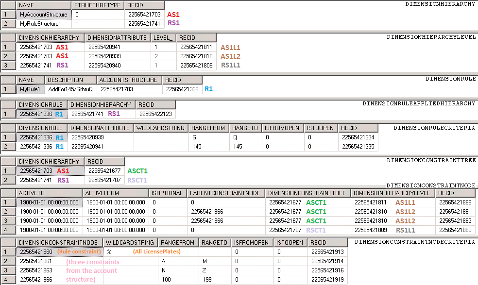](./media/CombinesStructureRuleandAllConstraintsSQL.png)
 **Figure 4.6: Combined structure, rule and all constraints query results**

**Part 5: Ledger dimensions**

In this part, we will cover the LedgerDimensions region highlighted in pale
yellow in the model below in figure 5.1.

Once all of the configuration data is set up, ledger account combinations can be
entered, validated and persisted. The primary consumption of the dimension
framework occurs when the application leverages this area.

[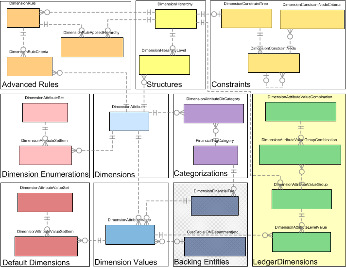](./media/LedgerDimensionStorageInFramework.png)
**Figure 5.1: Ledger dimension storage in framework**

Ledger dimension storage without rules

To understand LedgerDimensions, we need to understand how a ledger account
combination is entered by a user.

Using the account structure and rule setup from the previous section, we will
walk through the user interaction with the account entry control when an account
is entered. To refresh, the account structure appears as follows:

[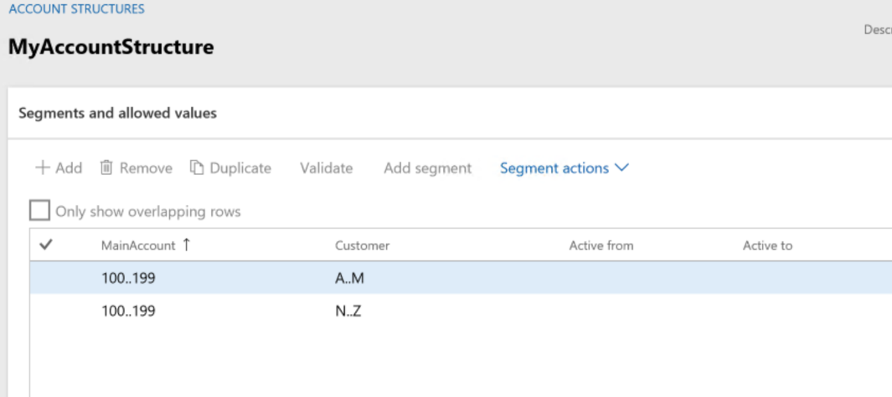](./media/BasicStructureAndConstraintForm.png)
**Figure 5.2: Basic structure and constraints**

There is a single account rule associated wit h the structure:

**Figure 5.3: Single rule added**

With the added structure defined as follows:

**Figure 5.4: Single structure added**

When a user first sees a ledger account field on a form, it will appear as
follows when focus is not in the field:

[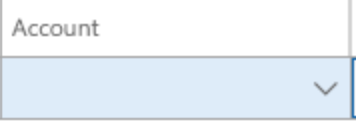](./media/EmptyLedgerAccountField.png)
**Figure 5.5: Empty ledger account field (without focus)**

When the user clicks into the field nothing changes. Clicking on the down arrow
will open the lookup and show you the possible segments. In this case there are
2 possible segments.

[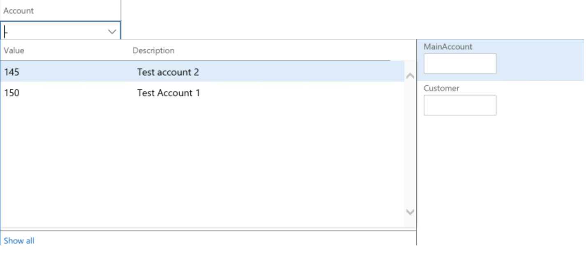](./media/InEditLedgerAccountFieldWithLookup.png)
**Figure 5.6: In-edit ledger account field with lookup**

The user then enters the combination of [ 150 - A ].

[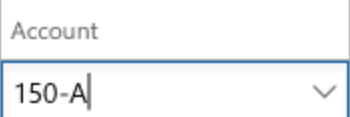](./media/CompletedLedgerAccountField.png)
**Figure 5.7: Completed ledger account field**

As soon as the second segment is entered and the user tabs out of the control,
the dimension framework saves the combination and then validates if the
combination is valid based on the constraints.  In this case, the combination is
valid. The user has the option of entering segments as a string or using the
lookup to enter values.

The following is known about the combination:

-   The account structure is "MyAccountStructure"

-   The first segment is the "MainAccount" dimension with a value of 150.

-   The second segment is the "Customer" dimension with a value of A.

-   No additional segments were added on as the values did not match any
    advanced rules associated with this account structure.

Therefore, the 2 segment values are stored as follows across the 4 tables:

**Figure 5.8: Ledger dimension storage query results**

The first table is named DimensionAttributeValueCombination as it stores a full
multi-segment account combination along with some de-normalized information
about the combination such as the concatenated segments as a single string, a
foreign key (FK) reference to the Account structure, and a FK to the MainAccount
(150) that was used.

Skipping the second table for now, the third table is named
DimensionAttributeValueGroup. It has this name as it stores each related group
of segments associated with each structure that is present in the combination.
In this case, there is only one structure, the Account structure, so there is
only one record here.

The fourth table, named DimensionAttributeLevelValue, stores the individual
segment values for each segment within the associated group or structure. One
record exists for each segment entered.  When a segment is empty, no values are
stored for it. Each record references the corresponding DimensionAttributeValue
record.  If an existing one is found it is referenced, or if one does not exist
for the value, it is created. This is the data linking the DimensionAttribute to
the real backing entity record.  In this case, one is for the MainAccount record
with an ID of 150, and one is for the CustTable record with an ID of A.

In order to link the group of the account structure values and the segment
values to the main record in the DimensionAttributeValueCombination table, a
record is inserted into the second table above in figure 8,
DimensionAttributeValueGroupCombination.

In order to save a single segment in a new combination at least one record is
inserted in each of these 4 tables.  An additional record is inserted in the
DimensionAttributeLevelValue table for each additional segment entered. 
Abstractly, these 4 tables are referred to as a LedgerDimension. A
LedgerDimension is expressed as a FK that references the RecId in the
DimensionAttributeValueCombination table.

**Ledger dimension storage with rules**

Building on the ledger dimension storage example started in the previous
section, we will add to the scenario and assume the user will go back and change
the values from [ 150 - A ] to [ 145 - Q ]. As we know from the advanced rules
previously set up, this will trigger a third segment to be added to the account
structure.

[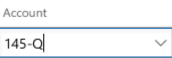](./media/LedgerAccountSegmentBeforeTab.png)
**Figure 5.9: In-edit ledger account segment (before tab)**

When the user types – after the second segment, a third segment is added to the
control and focus placed in it:

**Figure 5.10: In-edit ledger account segment (after tab)**

If you open the lookup while in the 3rd segment you will see the possible valid
values for the third segment.

[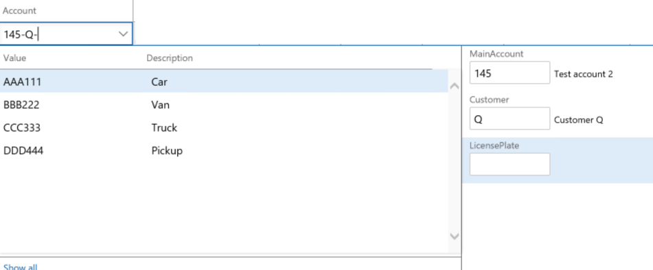](./media/LookupInSegment.png)
**Figure 5.11: Lookup while in new segment**

Now, the user can enter a license number:

[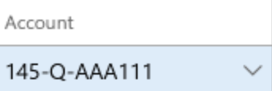](./media/CompletedLedgerAccountFieldWithAllRules.png)
**Figure 5.12: Completed ledger account field**

As soon as the third field is entered and the user tabs out of the control, it
will trigger the validation of the combination.  If it is valid, the combination
will be saved as a LedgerDimension.

The following is known about the new combination:

-   The account structure is "MyAccountStructure"

-   The first segment is the "MainAccount" dimension with a value of 145.

-   The second segment is the "Customer" dimension with a value of Q.

-   1 additional segment was added due to an account rule structure
    "MyRuleStructure1" being added due to the values matching the rule for the
    first two segments.

-   The third segment is the "LicensePlate" dimension with a value of AAA 111.

**Figure 5.13: Ledger dimension storage query results**

For this combination, a total of 8 rows were inserted across the 4 tables
storing the ledger dimension. The difference between the first ledger account
combination, discussed in the previous post, and this one is that multiple
structures are being used to drive the dimensions that make up the ledger
account combination. There are 2 records stored in the
DimensionAttributeValueGroupCombination and DimensionAttributeValueGroup tables,
each one representing a structure used and joined to the full combination.

Notice that each record has a new RecID assigned to it.  The combination of the
previous values is not updated, but rather a new combination is created making
the LedgerDimensions immutable.  This was done because there is no reference
counting maintained on the use of the combination. The same [ 150 - Q ]
combination originally entered may have been referenced from multiple tables
within the application before the user decided to change an instance to [ 145 -
Q - AAA 111].  Therefore, a new combination must be created and the reference
changed to it only from the table that the ledger account combination is being
changed on.

Because a user may change the combination on a record by adding or removing
segment values and a new LedgerDimension created, it is possible to end up with
unreferenced or orphaned LedgerDimensions over time. Allowing orphaned
combinations improves performance of the overall dimension framework to not
issue deletes across the tables in question when combination is changed.  It is
also likely after a combination is used once that it will be reused again and
removing it instantly on removal of the last reference may only result it in
being recreated again.  Orphaned LedgerDimensions are still structurally valid
and can be reused in the future if the combination of values in relation to the
structures and rules are entered again.  If a combination is ever entered a
subsequent time, no records are inserted and the existing reference is reused
providing greater performance.

Optimizations are also made for storage size and insert cost when advanced rules
are used.  Consider the following example as a new account combination is
entered:

[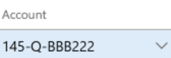](./media/ChangedLedgerAccountField.png)
**Figure 5.14: Changed ledger account field**

In this case, the only difference between the new combination and the previous
is that the license plate number (provided by the advanced rule) was changed.
The data storage of the combination will appear as follows (new records in
white):

**Figure 5.15: Additional ledger dimension storage query results**

In the creation of the new combination, the 5 records highlighted in white were
inserted:

-   1 in DimensionAttributeValueCombination

-   2 in DimensionAttributeValueGroupCombination

-   1 in DimensionAttributeValueGroup (instead of 2)

-   1 in DimensionAttributeLevelValue (instead of 3)

This is because the values stored as part of the account structure 'group' are
the same between the previous combination (DAVC2) and this combination (DAVC3). 
Those DimensionAttributeValueGroup and DimensionAttributeLevelValue records did
not need to be recreated. Instead, we were able to reuse 3 records and save
their insertion cost.

Alternately, had the structure associated with the account rule allowed blanks
for the license plate number, and a combination of just [ 145 - Q ] was created,
there would only have been 2 new records inserted instead:

-   1 in DimensionAttributeValueCombination

-   1 in DimensionAttributeValueGroupCombination

-   0 in DimensionAttributeValueGroup

-   0 in DimensionAttributeLevelValue

This is because all of the DimensionAttributeValueGroup and
DimensionAttributeLevelValue records already existed and could be fully reused
on the new combination. This is the primary reason why data should never be
directly modified within the LedgerDimension storage tables. A change to a
single record could affect not only all references to that ledger dimension but
also one or more other ledger dimensions and references to them.

Although partially collapsed in the above examples in figure 5.5 and figure 5.7,
there is a Hash code assigned to the DimensionAttributeValueCombination and
DimensionAttributeValueGroup tables. 

**Part 6: Advanced topics**

Concluding this article, we will discuss some of the advanced topics that
explain some of the deeper design and implementation decisions that drive the
way the dimension framework works.

The model below in figure 6.1 shows the various areas within the dimension
framework.

[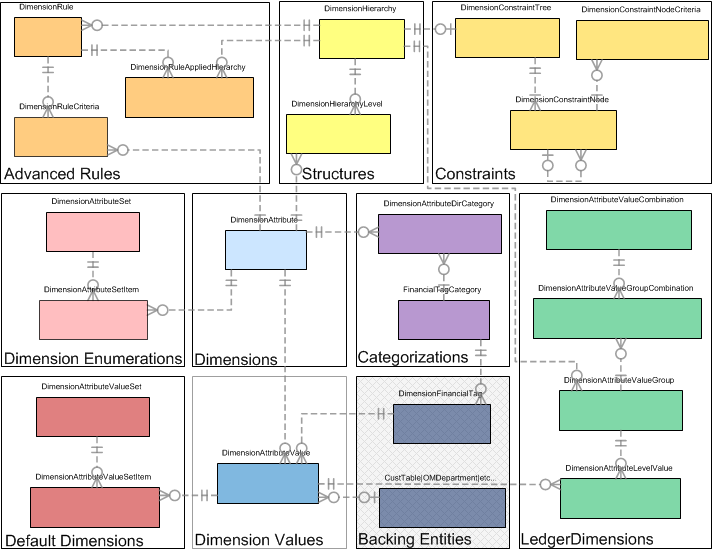](./media/OverallFramework.png)
**Figure 6.1: Overall framework**

**Hashes**

The design of the database storage in the dimension framework intends to:

-   Support immutable data where data is only inserted, never updated or deleted

-   Reuse previously created combinations to lower insertion costs

-   Avoid reference counting and maintenance of it

-   Provide fast performance to find an existing combination for reuse

As the dimension framework allows unlimited dimensions and unlimited structures
on a ledger account combination, it is difficult to create a single large or
multiple smaller queries to find an existing set or combination. Since the
number of records and order of those records is potentially different for every
combination, a hash-based solution was implemented.

This hash represents the unique information contained in the associated tables'
records for fast querying.  A single binary container field (160 bit, 20 byte
hash column) is stored to uniquely identify the data contained by the set or
combination.

The dimension framework uses hashes to uniquely identify data in the following
tables:

-   DimensionAttributeValueCombination

    -   Consisting of data from all the linked records in the
        DimensionAttributeValueGroup and DimensionAttributeLevelValue tables

-   DimensionAttributeValueGroup

    -   Consisting of data from the linked records in the
        DimensionAttributeLevelValue table

-   DimensionAttributeSet

    -   Consisting of data from the associated DimensionAttributeSetItem records

-   DimensionAttributeValueSet

    -   Consisting of data from the associated DimensionAttributeValueSetItem
        records

**Hash messages**

In order to produce a hash, a message is created containing individual ordered
information about the contents of the set or combination. It varies based upon
the particular hash being generated, but basically includes information about
the dimensions, values, and structures and their order within the set or
combination, if applicable. This information is internally calculated in a
prescribed manner and passed onto a hashing routine to generate a SHA-1 hash to
persist using a binary container. The exact order and contents of these messages
are provided by the methods within the storage supporting classes of the
dimension framework including the DimensionAttributeSetStorage,
DimensionAttributeValueSetStorage, and DimensionStorage classes.

**HashKeys**

In order to generate a hash message, something that uniquely identifies each
dimension, value and structure that makes up the combination is needed. While a
RecID can serve as a unique identifier, it is only considered a surrogate, as it
is not immutable and can change if the record were to be exported and imported
into a different system or partition, for example.  The RecID can be reassigned
during the import process.  Any hash that was created with a hash message using
a RecID could no longer be used to identify a combination in the dimension
framework for that new system or partition. Instead another identifier, a GUID,
is used. This GUID resides on the DimensionAttribute, DimensionAttributeValue
and DimensionHierarchy tables and is stored in the HashKey column.  Each time a
new record is created, a GUID is assigned and remains with that record to
uniquely identify it.

Risks of changing data directly

It is extremely important that no data be directly modified outside of the
application framework such as in SQL Server Management Studio. This extends to
modifying any data in any column of the table not just the columns discussed in
these posts; as well as replicating data from one row to another and attempting
to create 'new' sets or combinations outside of the dimension framework storage
classes.

It is also important to understand this when considering backups and only
partial restoration of data which could affect referential and hash integrity. 
For example, it would be problematic to only back up the LedgerDimension related
records and importing them into another partition without also bringing in all
of the other records in the dimension framework as well as all of the backing
entity records such as from the CustTable or others that were used in the
creation of any combinations. Any attempts to modify the data in these tables or
to synthesize GUIDs or hashes will lead to corrupt data and complex time
consuming analysis to find the source of the corruption and to try to undo it.

**Apparent duplicate combinations**

When browsing the tables of the dimension framework, it may appear that
combinations are duplicated when only viewing the DisplayValue field stored on
the records. This does not mean that duplicate combinations exist; rather it
means that data within the hash or joined tables is different even though the
DisplayValue appears the same.  The DisplayValue strings are stored on the
records to improve performance for some scenarios but are not used to uniquely
identify the record.

Consider an account structure with [ MainAccount - Department ] in one company
and another account structure with [ MainAccount - CostCenter ] in a different
company. It is possible for the DisplayValue of 2 combinations, one for each
account structure, to appear as " 145 - A ".  For the first account structure
"A" represents a Department within that company, but for the second it
represents a Cost center within that company.  Additionally, there are multiple
types of a LedgerDimension that are stored in the
DimensionAttributeValueCombination table including special ones for budgeting
that may appear the same from examining the DisplayValue field as other
combinations ones but hold different information internally and hold uniquely
different hash values.

**Versioning / date effective data**

The dimension framework does not support versioning or date effective data
directly. If any backing entities it references are versioned, and a new RecID
assigned to newer versions within the same table, the framework will properly
link to the correct version through the DimensionAttributeValue record. If the
same backing entity record is used and another table tracks revisions to it in
the owning module, then the dimension framework will not be able to know the
difference as the backing entity RecID would not be different between versions. 
None of the dimension framework tables (such as dimensions, structures, rules,
constraints) internally support versioning.  The previous versions are replaced
with a new version with no history maintained.

When a structure or rule is changed, and there are ledger account combinations
saved on unposted transactions, the dimension framework will create new
combinations and update any foreign key references to them on unposted
transaction tables. It will not change the original combinations as they may be
referenced from posted transactions.  The two combinations are not linked in any
way. There is not a way to determine the way a structure and its rules appeared
prior to change. Some information can be determined by the data stored in the
combination, but since blank values are not stored, it is incomplete and cannot
be used to reconstruct a previous version.

The dimension framework does supports valid from and valid to dates at the level
of a dimension value.  This indicates when the value is considered "valid" and
does not represent the historical state of the value in the same way that date
effective data does.f
