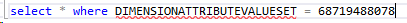

---
# required metadata

title: Dimension defaulting - Part 2 (Control uptake and storage)
description: Default dimensions control uptake and storage.
author: jasonsto
manager: jdinham
ms.date: 1/16/2019
ms.topic: article
ms.prod: 
ms.service: dynamics-ax-platform
ms.technology: 

# optional metadata

# ms.search.form: 
# ROBOTS: 
audience: Developer
# ms.devlang: 
ms.reviewer: robinr
ms.search.scope: Operations
# ms.tgt_pltfrm: 
ms.custom: 11314
ms.assetid: 20e6b97e-30ed-48d4-b63c-a073f80300b2
ms.search.region: Global
# ms.search.industry: 
ms.author: rbrow
ms.search.validFrom: 2019-01-16
ms.dyn365.ops.version: AX 7.0.0

---
**Introduction**

Continuing this series of blog posts, this post covers how default dimensions
can be added to a form to display and allow entry by the user.

This blog post series includes:

-   [Financial dimensions discovery](dimension-defaulting-part1.md)

-   Control uptake and storage (This post)

-   [Copy patterns](dimension-defaulting-part3.md)

-   [Merging patterns](dimension-defaulting-part4.md)

-   [Ledger dimension creation](dimension-defaulting-part5.md)

-   [Common pattern APIs] (dimension-defaulting-part6s.md)

**Form uptake and dimensions data model**

All forms displaying default dimensions use the *DimensionDefaultingController*.
The controller automatically handles displaying dimensions, loading and saving
values and user interaction. These uptake patterns are documented in the
[Accounts and Dimensions
whitepaper](http://technet.microsoft.com/EN-US/library/hh272858.aspx).

**Default dimension value storage**

The values associated with the dimensions are stored in a separate table apart
from the primary table referencing them. For example, the *LedgerJournalTable*
has a *DimensionDefault* column that holds a foreign key reference to a record
in the *DimensionAttributeValueSet* table. This is the parent record
representing the set of values displayed. Each individual value is stored as a
separate row in the *DimensionAttributeValueSetItem* table sharing the same
parent record foreign key. This data can be queried directly through these
tables or using the *DimensionAttributeValueSetItemView* as shown in Figure 1
below.

 
 
** Figure 1: SQL query and (column trimmed) output for all default dimension
values in one set**

 
**Figure 2: Default dimension entry**

**Empty values**

As shown in Figure 1 above, the dimension framework only stores rows for
dimensions that have a value entered. No data is stored for empty rows.
Therefore, once persisted, the framework does not have the ability to determine
the difference between a dimension that did not have a value and one that had a
value but was cleared out by a user. In order to save an empty value, a real
value must be created with a name indicating it is empty such as “empty”, “n/a”,
“\<cleared\>”, “*blank*”. The user can then select this value at entry time to
impact defaulting behavior as desired.

**Immutable data**

As with most all dimension data, the records that are inserted into the tables
above are immutable. They are only written initially and never subsequently
updated or deleted. In Figure 3, when the user adds a Project ID and then saves,
the query above in Figure 1 will still return the same three rows. The dimension
framework has created a new value set record and 4 additional value set item
records linking to the new value set as shown in Figure 4 below.
 
**Figure 3: Default dimension entry of one added value**
 
 
**Figure 4: SQL query and (column trimmed) output for all default dimension
values the new set**
