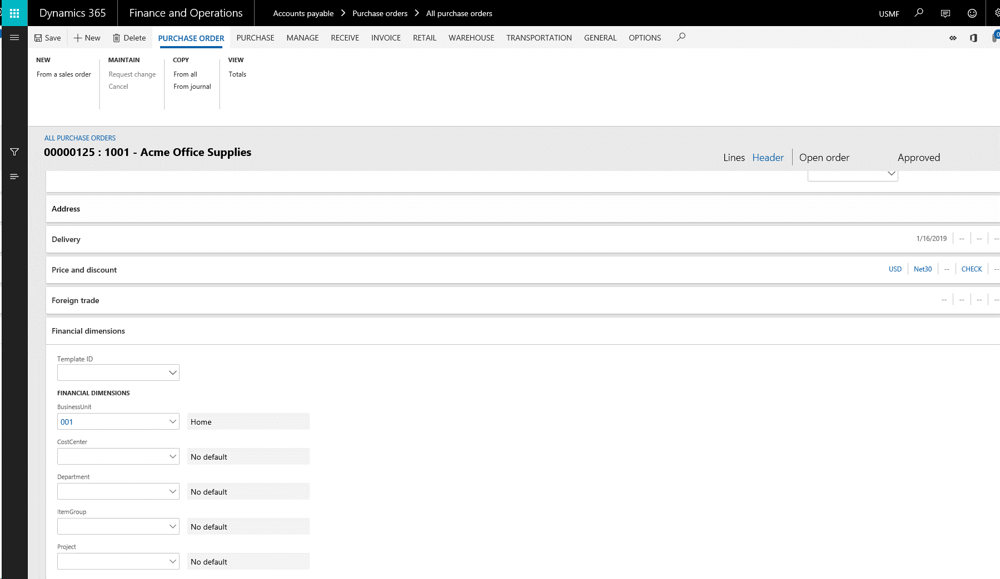
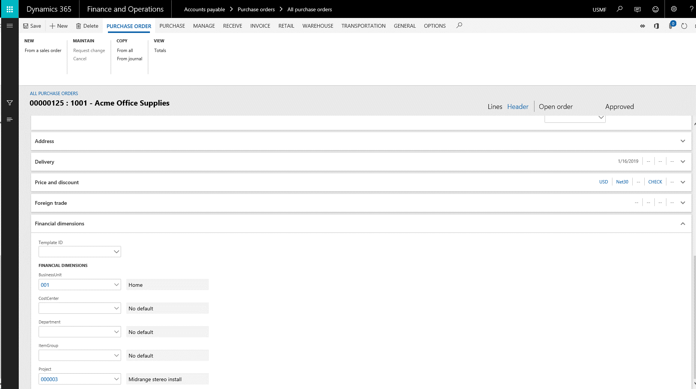
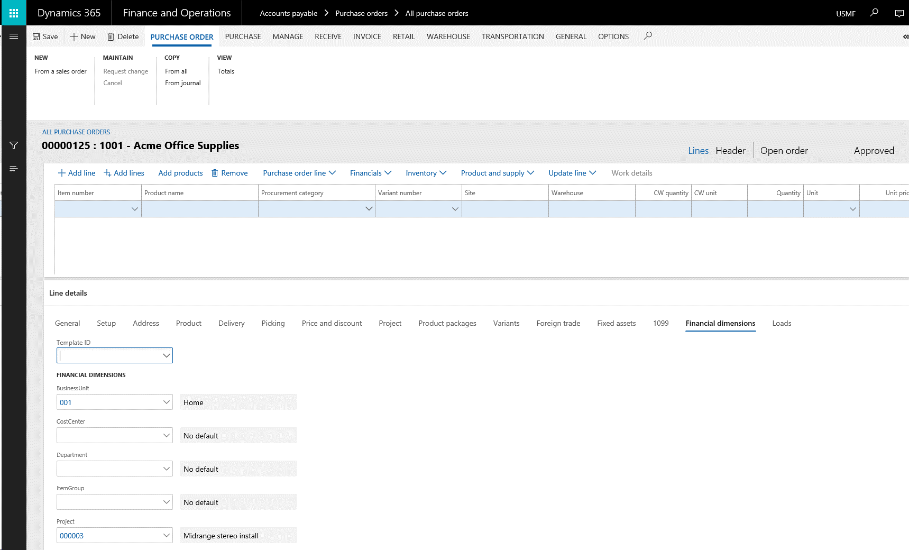

---
# required metadata

title: Dimension defaulting - Part 3 (Copy patterns)
description: Copy patterns for default dimensions
author: jasonsto
manager: jdinham
ms.date: 1/16/2019
ms.topic: article
ms.prod: 
ms.service: dynamics-ax-platform
ms.technology: 

# optional metadata

# ms.search.form: 
# ROBOTS: 
audience: Developer
# ms.devlang: 
ms.reviewer: robinr
ms.search.scope: Operations
# ms.tgt_pltfrm: 
ms.custom: 11314
ms.assetid: 20e6b97e-30ed-48d4-b63c-a073f80300b2
ms.search.region: Global
# ms.search.industry: 
ms.author: rbrow
ms.search.validFrom: 2019-01-16
ms.dyn365.ops.version: AX 7.0.0

---
**Introduction**

Continuing this series of blog posts, this section covers how default dimensions
are copied between entities.

This blog post series includes:

-   [Financial dimensions discovery](dimension-defaulting-part1.md)

-   [Control uptake and storage](dimension-defaulting-part2.md)

-   Copy patterns (This post)

-   [Merging patterns](dimension-defaulting-part4.md)

-   [Ledger dimension creation](dimension-defaulting-part5.md)

-   [Common pattern APIs] (dimension-defaulting-part6.md)

**Copy versus merge**

As initially described in the [Dimension defaulting in accounting distributions
series of blog
posts](http://blogs.msdn.com/b/ax_gfm_framework_team_blog/archive/2013/12/16/dimension-defaulting-in-accounting-distributions-blog-1-introduction.aspx),
default dimensions are typically copied or merged with other dimension
combinations to create ledger account dimensions. The dimension framework does
not set the precedence for defaulting.  Each form or process determines this
based on their business logic needs.

A hypothetical order document will serve as the basis for the examples below.
This could be a service order interacting with customers and containing line
item services, or a purchase order interacting with vendors and line item
inventory items. In terms of where default dimensions are entered, they could be
entered or overridden at different points in processing as shown in Figure 1
below.

**Figure 1: Default dimension sources on a typical document**

In the example of an order document, there are multiple default dimensions that
are available for the business logic to consider. The document header may have a
set of default dimensions like the purchase order in this example.  The customer
or vendor of the order, such as the vendor in this case, has a set of default
dimensions as well.  Depending on the business logic of the order, these
different sets of default dimensions may have different precedence when combined
together.  Some may have higher precedence and replace other default dimensions
while others may be merged together.

**Default dimension copy**

Figure 2 below shows a default dimension entered on a specific vendor account.
Figure 3 below shows the SQL query for the default dimension reference on the
vendor record and the resulting default dimension created.

**Figure 2: Default dimensions entered on a vendor account** 

DefaultDimensions3-SQLVendor.png

**Figure 3: SQL query and output showing default dimensions on vendor record**

Figures 4 and 5 below shows a new purchase order created for this vendor and the
SQL query and default dimension reference on the header record. In this case the
dimensions from the vendor replaced any dimensions already on the purchase order
header as soon as a vendor is selected, so a direct copy of the default
dimension foreign key was all that needed to be done as shown in Figure 6.

**Figure 4: Default dimension copied to a document header (Purchase order)** 

**Figure 5: SQL query and output showing default dimensions on purchase order
record**

**Figure 6: Code used to copy default dimensions from the vendor to the purchase
order**

Next, suppose the user enters a value for the Project dimension.  Figure 7
below, shows the header dimensions after that change. Figure 8 shows the SQL
query for the default dimension reference on the header record and the resulting
default dimension created.

**Figure 7: Default dimension modified by a user on a document header (Purchase
order)**

**Figure 8: SQL query and output showing updated default dimensions on purchase
order record**

Next, as the user changes to the Line view to enter the lines, Figures 9 and 10
below show default dimensions copied from the purchase order header and the code
copying the foreign key reference to the line. In this case, the line has not
yet been saved so the default dimension foreign key only appears in the table
buffer in memory. 

**Figure 9: Default dimension copied to a document line (Purchase order line)**

**Figure 10: Code used to copy default dimensions from the header to the line**
