---
# required metadata

title: Default financial dimensions
description: This topic describes default financial dimensions, starting from where the dimensions originate, the APIs used to merge them, and how they are used to create a ledger dimension.
author: jasonsto
manager: annbe
ms.date: 2/14/2019
ms.topic: article
ms.prod: 
ms.service: dynamics-ax-platform
ms.technology: 

# optional metadata

# ms.search.form: 
# ROBOTS: 
audience: Developer
# ms.devlang: 
ms.reviewer:
ms.search.scope: Operations
# ms.tgt_pltfrm: 
# ms.custom: 
# ms.assetid: 
ms.search.region: Global
# ms.search.industry: 
ms.author: rbrow
ms.search.validFrom: 2019-01-16
ms.dyn365.ops.version: AX 7.0.0

---
# Default financial dimensions
[!include [banner](../includes/banner.md)]

This topic explains default financial dimensions for developers and it will cover where the dimensions originate, the APIs used to merge them, and how they are used to create a ledger dimension. Examples showing the user interface as well as SQL table queries with output are included along with some explanation of APIs and usage examples. This topic uses examples from the demo data company USMF.

For conceptual information about financial dimensions and how they affect business processes, see [Financial dimensions](../../financials/general-ledger/financial-dimensions.md).

:::row:::
    :::column:::
    ### Default dimension entry
    There are over 250 pages in Microsoft Dynamics 365 for Finance and Operations that allow you to enter default financial dimensions. The dimensions are displayed on a FastTab that lists dimensions with values and descriptions. In standard demo data there are over 30 dimensions available but only five are displayed in this example of a Financial dimensions FastTab. 
    :::column-end:::
    :::column:::
       
    :::column-end:::
:::row-end:::
:::row:::
    :::column:::
    ### Dimensions list
    The dimensions are filtered first based on the list of all active account structures that are associated with the ledger of the current company or the company specified on a page. Finally, a union of all of the dimensions in these account structures, plus all active advanced rules associated with those structures is obtained. 
    :::column-end:::
    :::column:::
       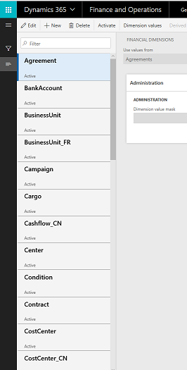
    :::column-end:::
:::row-end:::
:::row:::
    :::column:::
    ### Ledger page
    The **Ledger** page (**General Ledger > Setup > Ledger**) is where you can maintain the account structures for a company. 
    :::column-end:::
    :::column:::
       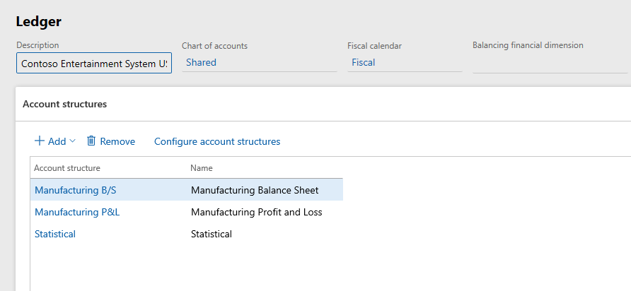
    :::column-end:::
:::row-end:::
:::row:::
    :::column:::
    ### Account structures with varying numbers of dimensions
    When you select the first account structure and click the Configure account structure button, you can tell how many dimensions are used by that account structure by counting the columns. The following two screenshots show an account structure that uses three dimensions and another account structure that uses five.  
    :::column-end:::
    :::column:::
    *Account structure with three dimensions*
       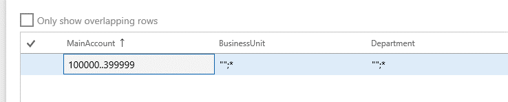
    *Account structure with five dimensions*
       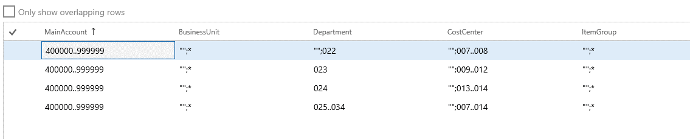
    :::column-end:::
:::row-end:::

Between the two account structures shown earlier, there are four unique dimensions. These four dimensions account for the dimensions that will display in the default dimensions. In addition to these dimensions, dimensions from advanced rule structures linked to those account structures through advanced rules are also examined. In this example, it results in a fifth dimension added to the default entry, Project.
It is also important to note that the MainAccount dimension is not shown in most default dimension lists. Budgeting is the exception because it does explicitly include the MainAccount as part of the list of default dimensions.

The following images show the advanced rule and structure that results in the project dimension being included in the default dimensions.

:::row:::
    :::column:::
    
    :::column-end:::
    :::column:::
    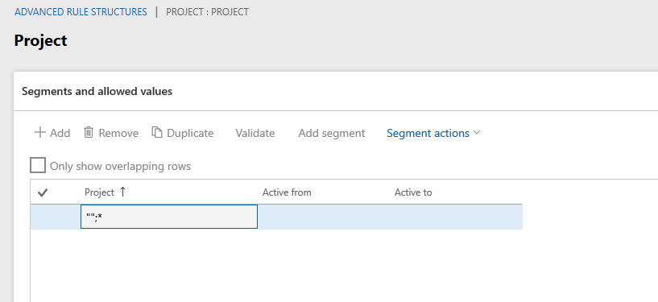
    :::column-end:::
:::row-end:::


### API for default dimensions list

The default dimension controller determines which dimensions are applicable for a company using the *DimensionCache::getDimensionAttributeSetForLedger()* API.

## Control uptake and storage

### Form uptake and dimensions data model

All forms displaying default dimensions use the *DimensionDefaultingController*. The controller automatically handles displaying dimensions, loading and saving values and user interaction. These uptake patterns are documented in the [Accounts and Dimensions
whitepaper](http://go.microsoft.com/fwlink/?linkid=213133).

:::row:::
    :::column:::
    ### Default dimension value storage
    The values associated with the dimensions are stored in a separate table apart from the primary table referencing them. For example, the *LedgerJournalTable* has a *DimensionDefault* column that holds a foreign key reference to a record in the *DimensionAttributeValueSet* table. This is the parent record representing the set of values displayed.  
    :::column-end:::
    :::column:::
    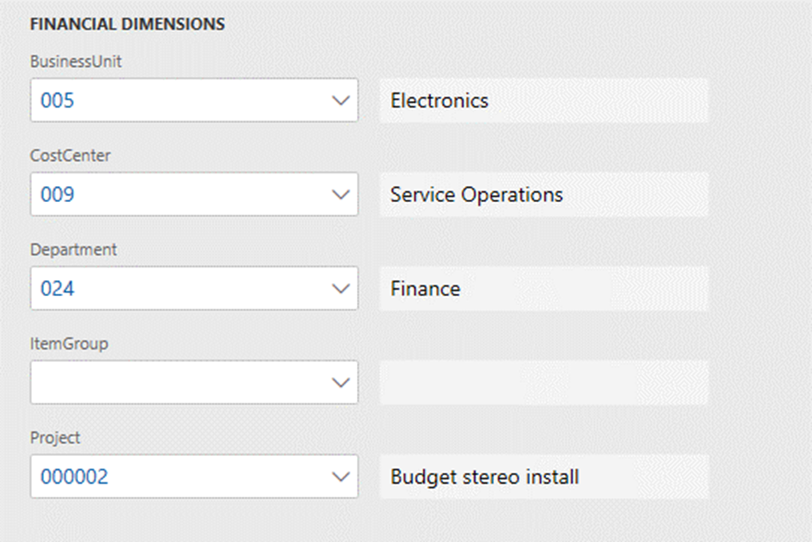
    :::column-end:::
:::row-end:::
:::row:::
    :::column:::
    Each individual value is stored as a separate row in the *DimensionAttributeValueSetItem* table sharing the same parent record foreign key. This data can be queried directly through these tables or using the *DimensionAttributeValueSetItemView* as shown here.
    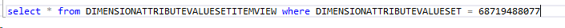 
    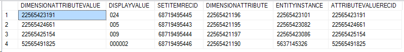
    :::column-end:::
:::row-end:::    
        


### Empty values

The dimension framework only stores rows for dimensions that have a value entered. No data is stored for empty rows. Therefore, once persisted, the framework does not have the ability to determine the difference between a dimension that did not have a value and one that had a value but was cleared out by a user. In order to save an empty value, a real value must be created with a name indicating it is empty such as “empty”, “n/a”, “\<cleared\>”, “\*blank\*”. The user can then select this value at entry time to impact defaulting behavior as desired.

:::row:::
    :::column:::
    ### Immutable data
    As with most all dimension data, the records that are inserted into the tables above are immutable. They are only written initially and never subsequently updated or deleted. In Figure 3, when the user adds a Project ID and then saves, the query above in Figure 1 will still return the same three rows. The dimension framework has created a new value set record and 4 additional value set item records linking to the new value set as shown in Figure 4 below. 
    :::column-end:::
:::row-end:::
:::row:::
    :::column:::
     output for all default dimension values the new set")
    :::column-end:::
    :::column:::
    
    :::column-end:::
:::row-end:::    


## Copy patterns
This section covers how default dimensions are copied between entities.

:::row:::
    :::column:::
    ### Copy versus merge
    Default dimensions are typically copied or merged with other dimension combinations to create ledger account dimensions. The dimension framework does not set the precedence for defaulting.  Each form or process determines this based on their business logic needs.
A hypothetical order document will serve as the basis for the examples below. This could be a service order interacting with customers and containing line item services, or a purchase order interacting with vendors and line item inventory items. In terms of where default dimensions are entered, they could be entered or overridden at different points in processing as shown in the following image.
    :::column-end:::
    :::column:::
    
    :::column-end:::
:::row-end:::

In the example of an order document, there are multiple default dimensions that are available for the business logic to consider. The document header may have a set of default dimensions like the purchase order in this example.  The customer or vendor of the order, such as the vendor in this case, has a set of default dimensions as well.  Depending on the business logic of the order, these different sets of default dimensions may have different precedence when combined together.  Some may have higher precedence and replace other default dimensions while others may be merged together.

**Default dimension copy**

:::row:::
    :::column:::
    A default dimension entered on a specific vendor account.
    :::column-end:::
    :::column:::
    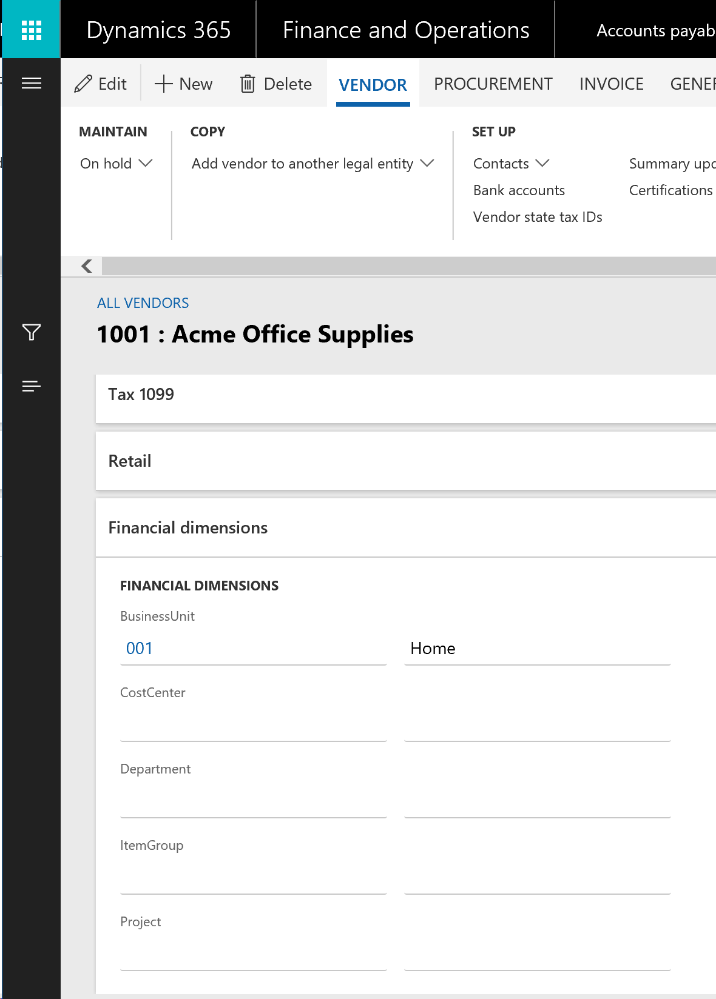
    :::column-end:::
:::row-end:::
:::row:::
    :::column:::
    The SQL query for the default dimension reference on the vendor record and the resulting default dimension created.
    :::column-end:::
    :::column:::
    
    
    :::column-end:::
:::row-end:::
:::row:::
    :::column:::
    Figures 4 and 5 below shows A new purchase order created for this vendor and the SQL query and default dimension reference on the header record. In this case the dimensions from the vendor replaced any dimensions already on the purchase order header as soon as a vendor is selected, so a direct copy of the default dimension foreign key was all that needed to be done as shown in Figure 6.
    :::column-end:::
    :::column:::
    ")
    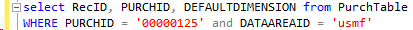
    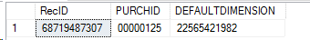
    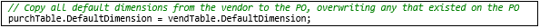
    :::column-end:::
:::row-end:::
:::row:::
    :::column:::
    Next, suppose the user enters a value for the Project dimension.  Figure 7 below, shows the header dimensions after that change. Figure 8 shows the SQL query for the default dimension reference on the header record and the resulting default dimension created.
    :::column-end:::
    :::column:::
    ")
    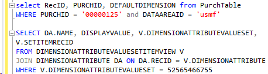
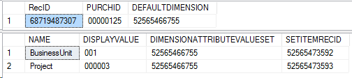
    :::column-end:::
:::row-end:::
:::row:::
    :::column:::
    Next, as the user changes to the Line view to enter the lines, Figures 9 and 10 below show default dimensions copied from the purchase order header and the code copying the foreign key reference to the line. In this case, the line has not yet been saved so the default dimension foreign key only appears in the table buffer in memory.
    :::column-end:::
    :::column:::
    ")
    
    :::column-end:::
:::row-end:::

## Merging patterns

This section covers how default dimensions are merged between entities.

**Default dimension merging**

Figure 1 below shows the user manually cleared the BusinessUnit dimension on the line, which in turn creates a new default dimension foreign key and updates the purchase order header.  Since the header has not yet been saved this updated foreign key is only visible on the table buffer in memory, but the new default dimension can be queried and found as shown in Figure 2 below. 

[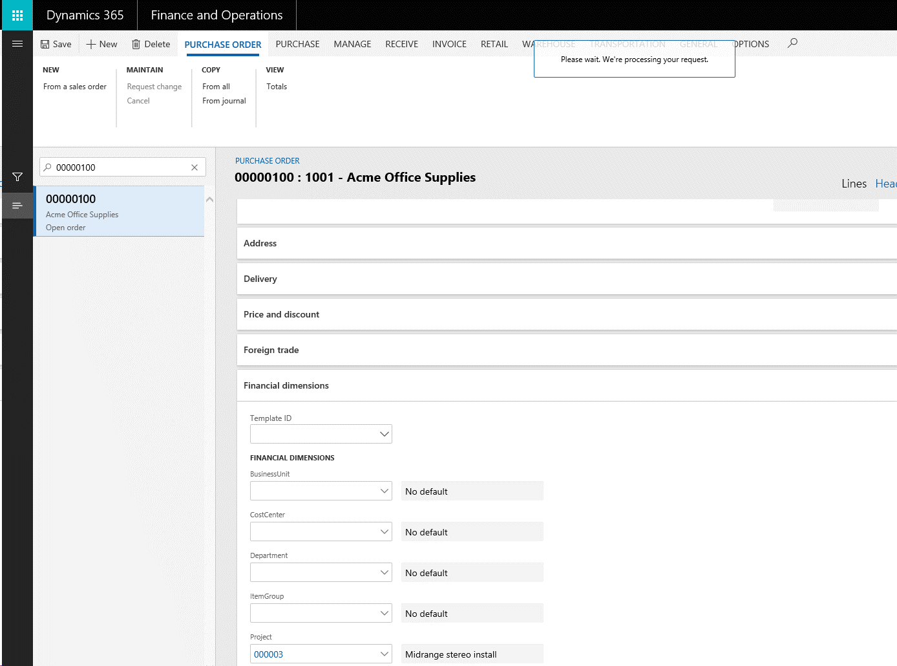](./media/DefaultDimension4-1DimOnLine.png)
**Figure 1: Default dimension modified on a document line (Purchase order
line)**

[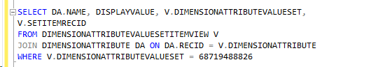](./media/DefaultDimension4-1SQLDimOnLine.png)
[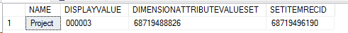](./media/DefaultDimension4-2SQLResultsOnLine.png)
**Figure 2: SQL query and output showing updated default dimensions**

Next, consider the item that the user will enter on the purchase order line. Figures 3 and 4 below show default financial dimensions on the released product and the SQL query and result for that default dimension in the database.

[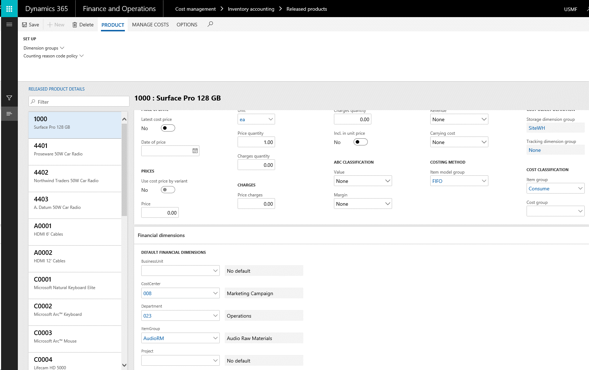](./media/DefaultDimension4-3Item.png)
**Figure 3: Default dimensions on an item**

[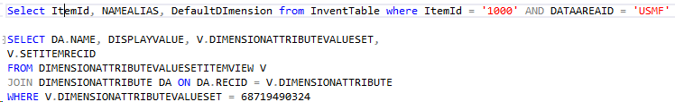](./media/DefaultDimension4-4SQLItem.png)
[](./media/DefaultDimension4-4SQLResultsItem.png)
**Figure 4: SQL query and output showing default dimensions on item record**

Next, the user enters the item on the purchase order line.  Figures 5 below shows the item selected on the purchase order line and the resulting default dimensions. In this case, the default dimension values were merged by the purchase order logic.

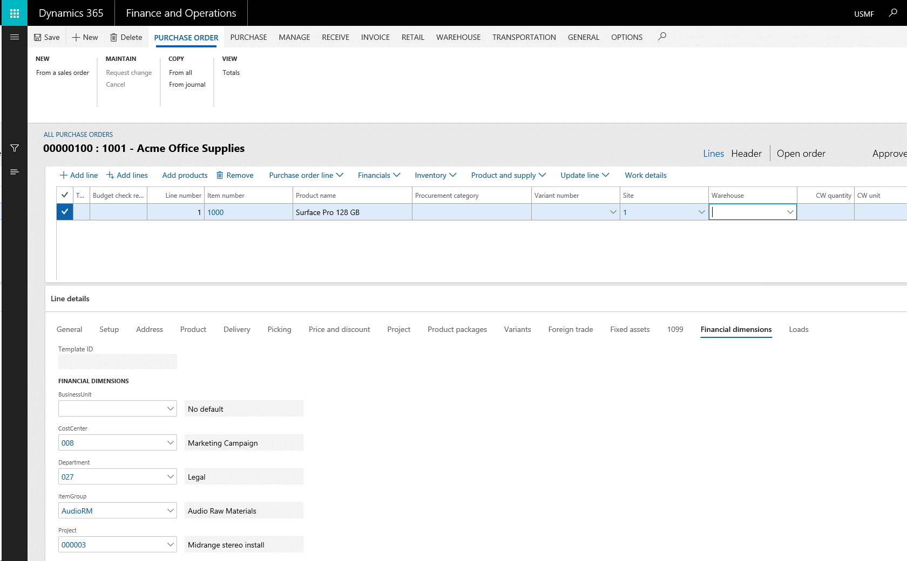
**Figure 5: Resulting default dimensions on a purchase order line**

[](./media/DefaultDimension4-6SQLOnItem.png)
[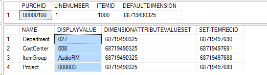](./media/DefaultDimension4-6SQLResultOnItem.png)
**Figure 6: SQL query and output showing default dimensions from item record on the purchase order line**

The purchase order logic merges the default dimensions from 3 different sources when the item is specified for a purchase order line as shown in Figure 7 below.

Order header default dimensions merged with the order line default dimensions = merged result 1 default dimensions

[](./media/DefaultDimension4Graph.png)
Item default dimensions merged with merged result 1 = final order line default dimensions (merged result 2)

[](./media/DefaultDimension4-7Graph2.png)
**Figure 7: Merging steps taken**

The tables in Figure 7 show the logical steps of  the merging that is occurring. However, these steps are combined during execution using the APIs provided by the dimensions framework. Figure 8 below shows the code needed to do all of the merging of the dimensions from the 3 sources shown above.

[](./media/DefaultDimension4-8CodeToMerge.png)
**Figure 8: Code used to merge the three sets of default dimensions**

## Ledger dimension creation
This section covers how default dimensions can be merged to create new ledger dimensions.

**Ledger dimension creation**

Default dimensions exist as a way to provide values that later will be used to create ledger account combinations used in journals and accounting distributions. Default dimensions provide the dimensions other than MainAccount needed for a ledger account combination, and can be combined with a default account, or another ledger dimension in order to produce one.  As defined in the [Ledger account combinations series of blog posts](http://blogs.msdn.com/b/ax_gfm_framework_team_blog/archive/2013/02/15/ledger-account-combinations-part-5-_2800_ledger-dimensions_2900_-.aspx), a ledger account combination is just a set of MainAccount and dimension values with structure and order applied.

[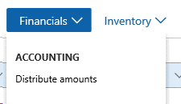](./media/DefaultDimension5-1AccountingDistributions.png) 

[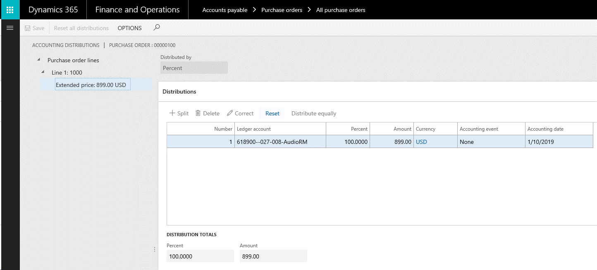](./media/DefaultDimension5-1AcctDistForm.png) 
**Figure 1: Accounting distributions from the purchase order line**

As shown in Figure 1 above, choosing the Financials-\>Distribute amounts option from the purchase order line the accounting distributions form opens. It already has a ledger account combination defaulted “618900--027-008-AudioRM”. From the previous blog post the values for the Project, CostCenter, ItemGroup and Department dimensions have been populated and a MainAccount defaulted from the posting item group on the item, as the Purchase expenditure for expense account for a purchase order as shown in Figure 2 below. The reason project is not shown is because it is not a part of the applicable account structure.

[](./media/DefaultDimension5-1SourceofMainAccountOnPO.png) 
[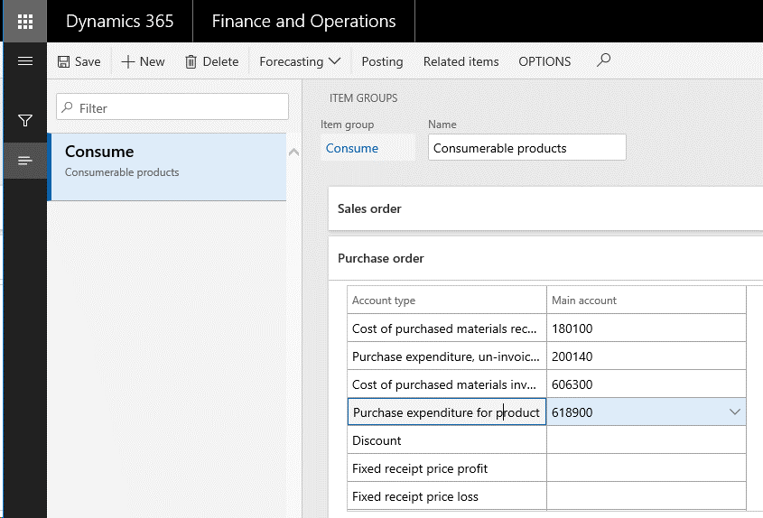](./media/DefaultDimension5-1SourceOfMAonPO2.png) 
**Figure 2: Source of a default (main) account for the item on the purchase order line**


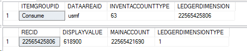


The code required to merge the default dimension on the purchase order line with the default account from the item group is shown the following figure. 

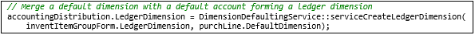

Similar to merging default dimensions, once merged, a newledger account combination is created as shown in the query in the following figure:


## Common pattern APIs

This section describes APIs used for most common defaulting patterns.

**Default dimension APIs**

The DimensionDefaultFacade and LedgerDimensionDefaultFacade classes provide the APIs are needed for defaulting scenarios. The LedgerDimensionFacade class contains methods for working with ledger dimensions. The methods are highly optimized for performance.

**Default dimensions**

The *serviceMergeDefaultDimensions()* API is the most commonly used API for default dimensions. It should be called whenever a new default dimension needs to be created from 2 to 4 other default dimensions. If more default dimensions need to be merged than 4, it can be called multiple times with the result of the prior call used as the first parameter to the subsequent call. This method will blindly merge all values whether they are valid or not.

**DimensionDefaultFacade::serviceMergeDefaultDimensions()**

```
public static DimensionDefault serviceMergeDefaultDimensions(
        DimensionDefault _value1,
        DimensionDefault _value2,
        DimensionDefault _value3 = 0,
        DimensionDefault _value4 = 0)
```

The *serviceReplaceAttributeValue()* API is useful in the case that a single dimension value needs to be copied from one default to another default set. The value specified will replace whatever value already exists in the source set.

**DimensionDefaultFacade::serviceReplaceAttributeValue()** 


```
public static DimensionDefault serviceReplaceAttributeValue(
        DimensionDefault _target,
        DimensionDefault _source,
        RecId _dimensionAttributeId)
```

The *serviceMergeValidDefaultDimensions* API is useful in the case where you want the merge to only merge values that are valid for the current ledger. It works exactly the same as *serviceMergeDefaultDimensions* but with the added check for valid values.

**DimensionDefaultFacade::serviceReplaceAttributeValue()** 


```
    public static DimensionDefault serviceMergeValidDefaultDimensions(
        DimensionDefault _defaultDimension1,
        DimensionDefault _defaultDimension2,
        DimensionDefault _defaultDimension3 = 0,
        DimensionDefault _defaultDimension4 = 0)
```

**Ledger dimensions**

The *serviceCreateLedgerDimension()* API is the most commonly used API for ledger dimensions. It should be called whenever a new ledger account combination needs to be created from a default account or existing ledger account combination and 0 to 3 default dimensions. If more default dimensions need to be merged than 3, it can be called multiple times with different sources taking the result of the prior call as the first parameter to the subsequent call. The MainAccount dimension is only retrieved from the supplied ledger dimension.

**LedgerDimensionFacade.serviceCreateLedgerDimension()**


```
public static LedgerDimensionAccount serviceCreateLedgerDimension(
        RecId            _ledgerDimensionId,
        DimensionDefault _dimensionDefault1 = 0,
        DimensionDefault _dimensionDefault2 = 0,
        DimensionDefault _dimensionDefault3 = 0)
    {
```

The *serviceCreateLedgerDimensionForType()* API is similar to the previous API but rather than creating a ledger account combination, it can create other ledger dimension types such as budget accounts or budget planning accounts specified by the LedgerDimensionType parameter.

**LedgerDimensionFacade.serviceCreateLedgerDimensionForType()**


```
 public static LedgerDimensionBase serviceCreateLedgerDimensionForType(
        LedgerDimensionType _ledgerDimensionType,
        LedgerDimensionBase _ledgerDimensionId,
        DimensionDefault    _dimensionDefault1 = 0,
        DimensionDefault    _dimensionDefault2 = 0,
        DimensionDefault    _dimensionDefault3 = 0)
```

The *serviceCreateLedgerDimForDefaultDim()* API is similar to the previous APIs, but the values from the default dimension are copied directly to the new ledger dimension, while the dimension values from the ledger dimension are merged afterwards. In the previous APIs, the ledger dimension values were copied, and the default dimension values were merged.

**LedgerDimensionFacade::serviceCreateLedgerDimForDefaultDim()**

```
public static LedgerDimensionBase serviceCreateLedgerDimForDefaultDim(
        DimensionDefault    _defaultDimension,
        LedgerDimensionBase _ledgerDimensionId)
```

The *serviceLedgerDimensionFromLedgerDims()* API is similar to the previous APIs but uses only ledger dimensions as sources to construct a new ledger dimension. The main account will only be retrieved from the first ledger dimension.

**LedgerDimensionFacade::serviceLedgerDimensionFromLedgerDims()**


```
public static LedgerDimensionAccount serviceLedgerDimensionFromLedgerDims(
        LedgerDimensionBase _ledgerDimensionId1,
        LedgerDimensionBase _ledgerDimensionId2 = 0,
        LedgerDimensionBase _ledgerDimensionId3 = 0,
        LedgerDimensionBase _ledgerDimensionId4 = 0,
        LedgerDimensionBase _ledgerDimensionId5 = 0)
```

The *serviceMergeLedgerDimensions()* API is similar to the previous API but is optimized to combine just 2 ledger dimensions. 

**LedgerDimensionFacade::serviceMergeLedgerDimensions()**

```
public static LedgerDimensionBase serviceMergeLedgerDimensions(
        LedgerDimensionBase _ledgerDimension1,
        LedgerDimensionBase _ledgerDimension2,
        LedgerDimensionType _ledgerDimensionType = LedgerDimensionType::Account)
```

The *serviceCreateLedgerDimFromLedgerDim()* API is useful when copying ledger dimensions from a historic posted document onto a new unposted document to ensure that it uses the current account structure configuration.  This will avoid validation errors when validating the new ledger dimensions during posting.

**LedgerDimensionFacade::serviceCreateLedgerDimFromLedgerDim()**

```
public static LedgerDimensionAccount serviceCreateLedgerDimFromLedgerDim(LedgerDimensionAccount _ledgerDimension)
```
