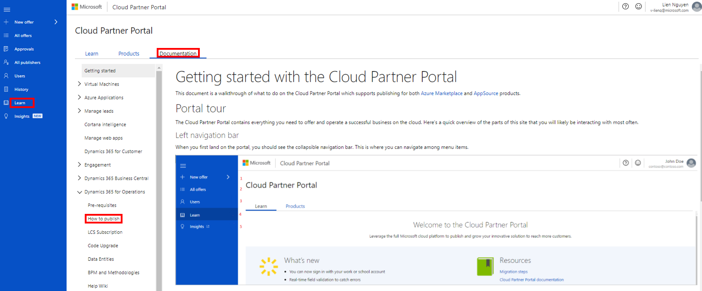

---
# required metadata

title: Stage and publish Finance and Operations solutions
description: This topic explains how to upload the marketing content for your Microsoft Dynamics Lifecycle Services (LCS) solution package to the Microsoft Cloud Partner Portal, and how to stage and publish your solution.
author: kfend
manager: AnnBe
ms.date: 06/20/2017
ms.topic: article
ms.prod: 
ms.service: dynamics-ax-platform
ms.technology: 

# optional metadata

# ms.search.form: 
# ROBOTS: 
audience: Developer, IT Pro
# ms.devlang: 
ms.reviewer: sericks
ms.search.scope: Lifecycle Services
# ms.tgt_pltfrm: 
ms.custom: 196873
ms.assetid: 80b0cc44-ffbe-400e-b902-60518a930b0d
ms.search.region: Global
# ms.search.industry: 
ms.author: omarc

---

# Stage and publish Finance and Operations solutions

[!include [banner](../includes/banner.md)]

This topic explains how to upload the marketing content of your Microsoft Dynamics 365 for Finance and Operations solution package to the Microsoft Cloud Partner Portal. It also explains how to stage and publish your solution. Access to the portal is granted after you've been formally onboarded and registered as a publisher by the Microsoft AppSource Team for Finance and Operations. To start the onboarding process, see [Tell us about your company](https://appsource.microsoft.com/partners/signup).

Before you can publish the marketing content for your Finance and Operations solution package to the Cloud Partner Portal, you must set up a Developer Center account with Microsoft. You can then upload your marketing content and manage the content through the lifecycle of application. For information about how to set up a Developer Center account, see [Create a Microsoft Developer account](https://azure.microsoft.com/documentation/articles/marketplace-publishing-accounts-creation-registration/).

## Upload marketing materials, set up legal information, identify the support team, and set up lead management
After you've been registered as a publisher on the Cloud Partner Portal, you can create your new offer, upload a marketing summary, a description of your solution, and other marketing materials, and set up lead management.

To access the instructions to create and publish your new offer from the Cloud Partner Portal, follow these steps.

1. In [the Cloud Partner Portal](https://cloudpartner.azure.com), select **Learn**.
2. Select **Documentation**.
3. Expand the **Dynamics 365 for Operations** node.
4. Select **How to publish**, and then follow the steps that are provided.

Additional resources
--------

[Publishing an App for Dynamics 365 for Finance and Operations in AppSource](lcs-solutions-app-source.md)
