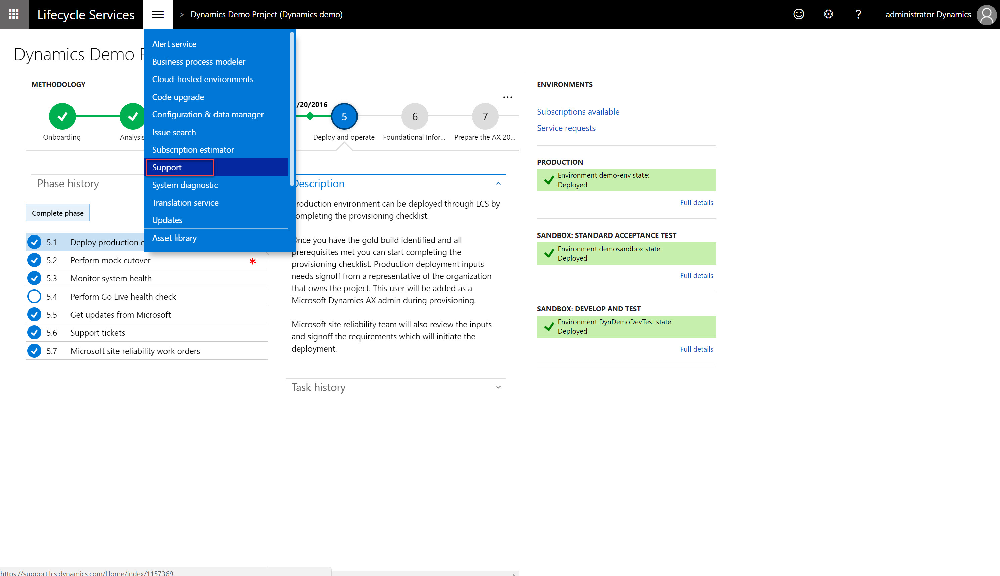
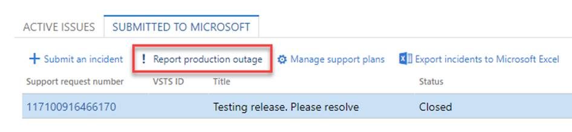
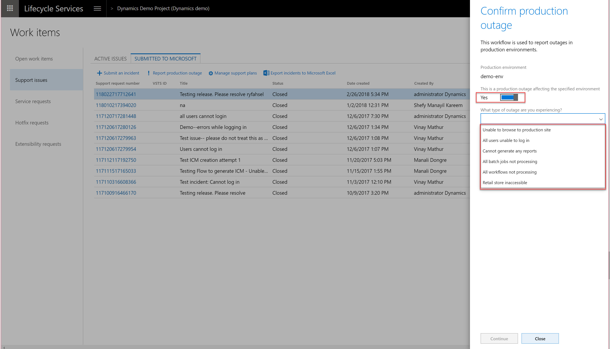
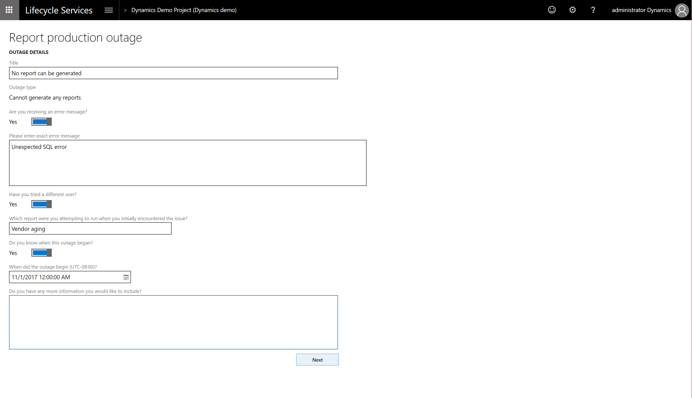
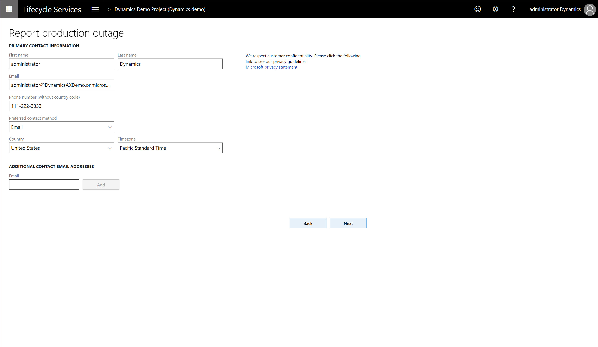
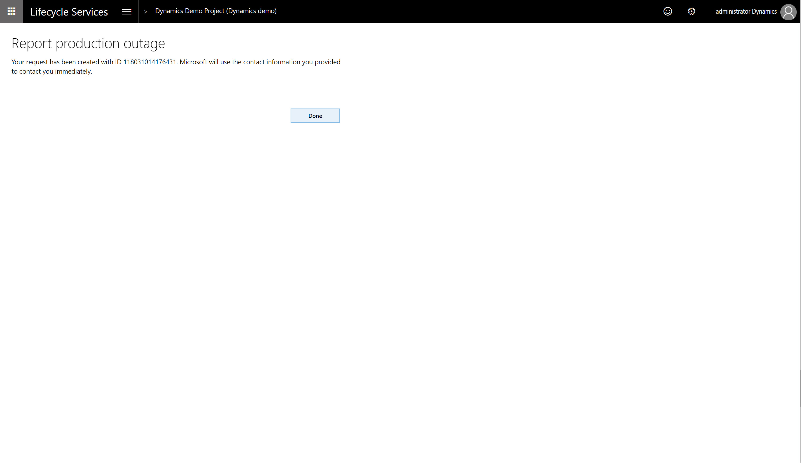

---
# required metadata

title: Manage Finance and Operations Support experiences
description: This topic provides information about using the Support tool to on Microsoft Dynamics Lifecycle Services to manage support incidents. 
author: kfend
manager: AnnBe
ms.date: 12/13/2017
ms.topic: article
ms.prod: 
ms.service: dynamics-ax-platform
ms.technology: 

# optional metadata

# ms.search.form: 
# ROBOTS: 
audience: Developer, IT Pro
# ms.devlang: 
ms.reviewer: kfend
ms.search.scope: Operations
# ms.tgt_pltfrm: 
ms.custom: 60373
ms.assetid: 0fa10573-8146-446e-8124-8a7af9546add
ms.search.region: Global
# ms.search.industry: 
ms.author: anupams
ms.search.validFrom: 2016-02-28
ms.dyn365.ops.version: AX 7.0.0

---

# Manage Finance and Operations Support experiences

[!include[banner](../includes/banner.md)]

To use the Support tool, you must have previously created a project in Lifecycle Services (LCS) and installed and ran the System diagnostics in your environment. For more information, see [System diagnostics (Lifecycle Services, LCS)](ax-2012/system-diagnostics-lcs.md).

## Open a new incident
1.  In LCS, use the **Support** tile to manage support incidents. To submit issues directly to Microsoft, go to the **Support** tile in your LCS project.

2.  On the **Submitted to Microsoft** tab, click the **Submit an incident** button.

3.  Select an issue category.

4.  Select an issue area.

5. In the **Describe your issue** window, enter the following:

 - Select **Yes** if the issue occured in an environment. Select the environment name.  
 - Enter a short description of your issue in the **Title** field.
 - Provide details about the issue detail and the steps needed to reproduce the error.
 - If applicable, enter an error message. 
 - If possible, attach screenshots that illustrate the problem. To do this, click **Attach file from computer**.
 
 > [!Note]
 > LCS Support will populate the top 10 "Possible issue solutions" via issue search results based on the your selection and input, and dynamically refresh these results as more details are provided during support case creation. 
 
 > Standalone Issue search is still accessible via the dropdown menu if you need to search for more solutions. 
 
 
 
6. Enter the primary contact information. These contact details will be used by the customer support team to contact you about the case.

7. Select the support contract and the severity level. 
  
  - Support contracts for on-premises products have limited incident counts. From the list of available support contracts, select the support option to use if you have multiple tier support contracts.  
  - Support contracts for cloud products have unlimited incidents, therefore, we show you the best available support plans. 

8. Click **Submit**. 

After you click **Submit**, an incident is created and added to the **Incidents** list. You will receive an email message from the Microsoft Support Engineer assigned to your case. 

## Manage support plans
If you purchased a support plan, such as **Premier Support** or **Advance Support for Partners**, you will need to add it to LCS Support before you create a new ticket.    

1. On the **Submitted to Microsoft** tab, click **Manage support plans**. 

   
   
2. On the **Manage support plans** page, click **Add contract** to enter the **Access ID** and **Password/Contract ID**.

    
   
   
# Report production outage
Report production outage provides a quick and effective channel to escalate  issues to Microsoft Support in the event that the services in a production environment are degraded or become unavailable.  

This feature is available to all customers that have purchased Dynamics 365 Finance and Operations, Enterprise edition and have **implementation** projects with a **production** environment deployed in LCS.  

A production outage is defined as **one or more system-wide issues on a live production environment that impact multiple users and prevent your business from performing daily operations**. 

**Reporting flow**
1. In a live production environment, a customer experiences an outage or other situation that prevents business from continuing.
2. The customer reports a production outage issue by using the LCS Support portal.
3. The customer selects a production outage issue and provides additional information.
4. A Microsoft support engineer acknowledges the production outage ticket within 30 minutes of submission and begins to immediately collaborate with stakeholders to investigate and resolve the issue.
5. A support engineer contacts the customer to provide a status update

**Access and availibility**

All users that have been added to a customer's implementation project have access to this feature. This includes project owners, organization admins, team members, and environment managers. 

This feature is available to:
- Dynamics 365 for Finance and Operation, Enterprise edition 
- Environments managed by Microsoft 
- A production environment in the LCS Project 
- All support plans

## Report a production outage
1. Log into you LCS project.
2. From the hamburger menu, click **Support**.

3. On the **Submitted To Microsoft** tab, click **Report production outage**.

4. Confirm the production outage, select the outage scenario from the drop-down list, and then click **Continue**.

5. Add a title and details about the outage, and then click **Next**.

6. Provide contact information, and then click **Next**. 

7. Click **Done**.

> [!Note] If you don't see your situation listed in the outage scenarios, enter a support incident through LCS.  If, during the initial investigation by a Microsoft support engineer, it is found the situation does not meet the current list of production outage scenarios, the support incident will be transferred to the correct support team and SLA based on your current support plan.

