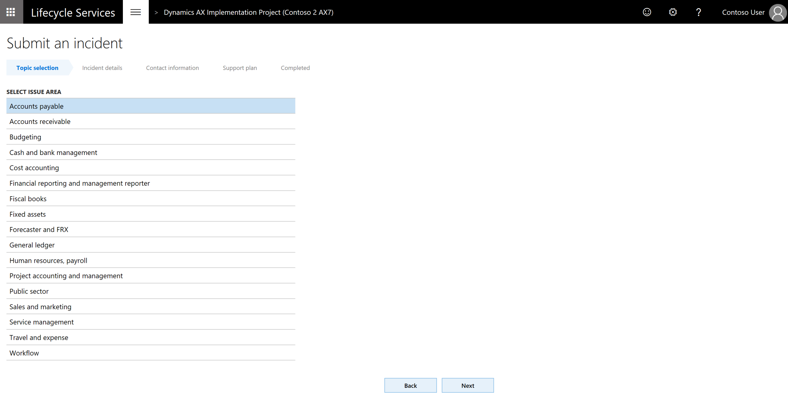
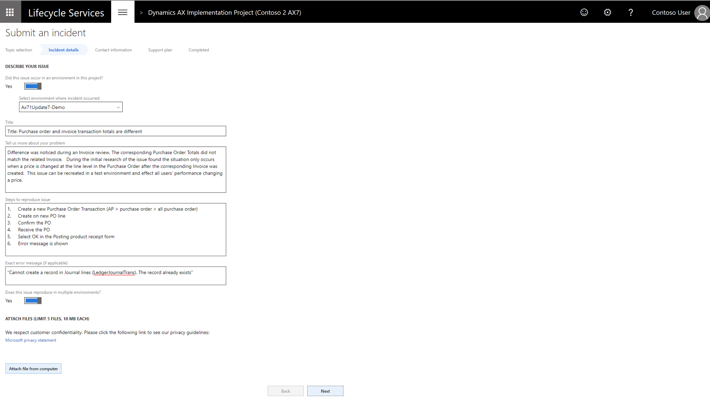
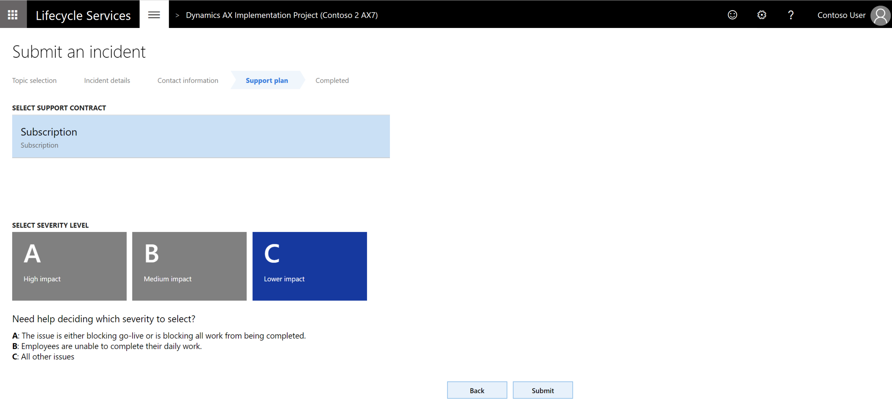
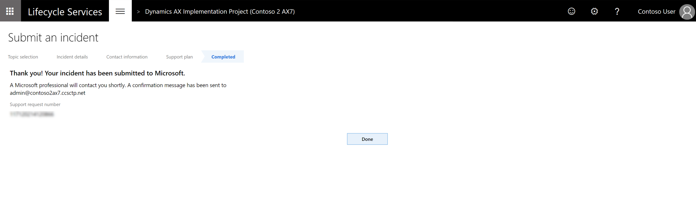

---
# required metadata

title: Manage Finance and Operations Support experiences
description: This topic provides information about using the Support tool to on Microsoft Dynamics Lifecycle Services to manage support incidents. 
author: kfend
manager: AnnBe
ms.date: 12/13/2017
ms.topic: article
ms.prod: 
ms.service: dynamics-ax-platform
ms.technology: 

# optional metadata

# ms.search.form: 
# ROBOTS: 
audience: Developer, IT Pro
# ms.devlang: 
ms.reviewer: kfend
ms.search.scope: Operations
# ms.tgt_pltfrm: 
ms.custom: 60373
ms.assetid: 0fa10573-8146-446e-8124-8a7af9546add
ms.search.region: Global
# ms.search.industry: 
ms.author: anupams
ms.search.validFrom: 2016-02-28
ms.dyn365.ops.version: AX 7.0.0

---

# Manage Finance and Operations Support experiences

[!include[banner](../includes/banner.md)]

To use the Support tool, you must have previously created a project in Lifecycle Services (LCS) and installed and ran the System diagnostics in your environment. For more information, see [System diagnostics (Lifecycle Services, LCS)](ax-2012/system-diagnostics-lcs.md).

## Open a new incident
1.  In LCS, use the **Support** tile to manage support incidents. To submit issues directly to Microsoft, go to the **Support** tile in your LCS project.

2.  On the **Submitted to Microsoft** tab, click the **Submit an incident** button.

3.  Before you submit an incident, use the Issue Search tool to search for existing solutions. You can search by description or object path in the Application Object Tree (AOT) of the issue. Click the Search icon.

4.  If you can't find an existing solution to your issue, click **Create incident** to create a new incident.

5.  Select an issue category.

6.  Select an issue area.

7. In the **Describe your issue** window, you need to do the following:

 - Select **Yes** if the issue occured in an environment. Select the environment name.  
 - Enter a short description of your issue in the **Title** field.
 - Provide details about the issue detail and the steps needed to reproduce the error.
 - If applicable, enter an error message. 
 - If possible, attach screenshots that illustrate the problem. To do this, click **Attach file from computer**.
 
 
 
8. Enter the primary contact information. These contact details will be used by the customer support team to contact you about the case.

9. Select the support contract and the severity level. 
  
  - Support contracts for on-premises products have limited incident counts. From the list of available support contracts, select the support option to use if you have multiple tier support contracts.  
  - Support contracts for cloud products have unlimited incidents, therefore, we show you the best available support plans. 

10. Click **Submit**. 

After you click **Submit**, an incident is created and added to the **Incidents** list. You will receive an email message from the Microsoft Support Engineer assigned to your case. 

## Manage support plans
If you purchased a support plan, you will need to add it to LCS Support before you create a new ticket.    

1. On the **Submitted to Microsoft** tab, click **Manage support plans**. 

   
   
2. On the **Manage support plans** page, click **Add contract** to enter the **Access ID** and **Password/Contract ID**.

    
