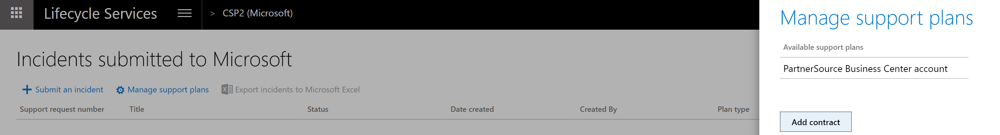
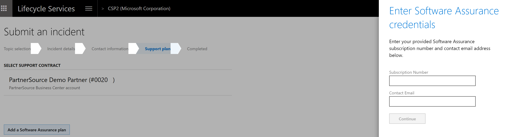

---
# required metadata

title: Manage Finance and Operations support experiences
description: This topic provides information about using the Support tool to on Microsoft Dynamics Lifecycle Services to manage support incidents. 
author: kfend
manager: AnnBe
ms.date: 02/25/2019
ms.topic: article
ms.prod: 
ms.service: dynamics-ax-platform
ms.technology: 

# optional metadata

# ms.search.form: 
# ROBOTS: 
audience: Developer, IT Pro
# ms.devlang: 
ms.reviewer: sericks
ms.search.scope: Operations
# ms.tgt_pltfrm: 
ms.custom: 60373
ms.assetid: 0fa10573-8146-446e-8124-8a7af9546add
ms.search.region: Global
# ms.search.industry: 
ms.author: anupams
ms.search.validFrom: 2016-02-28
ms.dyn365.ops.version: AX 7.0.0

---

# Manage Finance and Operations support experiences

[!include [banner](../includes/banner.md)]

To use the Support tool, you must have previously created a project in Lifecycle Services (LCS) and installed and ran the System diagnostics in your environment. For more information, see [System diagnostics (Lifecycle Services, LCS)](ax-2012/system-diagnostics-lcs.md).

## Open a new incident
1. In LCS, navigate to the project for which you want to file a support incident. 

2. Click the **Support** tile.
   

3. On the **Submitted to Microsoft** tab, click the **Submit an incident** button.
   

4. Select an issue category.
   

5. Select an issue area.
   

6. In the **Describe your issue** window, enter the following:

   - Select **Yes** if the issue occured in an environment. Select the environment name.  
   - Enter a short description of your issue in the **Title** field.
   - Provide details about the issue detail and the steps needed to reproduce the error.
   - If applicable, enter an error message. 
   - If possible, attach screenshots that illustrate the problem. To do this, click **Attach file from computer**.
 
   > [!NOTE]
   > When you create an incident, Issue search will populate the top 10 "Possible issue solutions" search results based on the your selection and input, and dynamically refresh these results as more details are provided during support case creation. 
   > 
   > Standalone Issue search is still accessible via the dropdown menu if you need to search for more solutions. 
 
   
 
7. Enter the primary contact information. These contact details will be used by the customer support team to contact you about the case.
   

8. Select the support contract and the severity level. 
    
   - Support contracts for on-premises environments have a limited incident count. 
   - Support contracts for cloud environments have an unlimited incident count. 
   - For on-premises products or cloud environments, from the list of available support contracts, select the support option to use if you have multiple tier support contracts. 
   

9. Click **Submit**. 

   

After you click **Submit**, an incident is created and added to the **Incidents** list. You will receive an email message from the Microsoft Support Engineer assigned to your case. 

## Support plans in Lifecycle Services
Support plan entitlements are derived based on several different identifiers. Not all will apply to your situation. If you are missing a support plan or entitlement in LCS, determine which identifier is needed to tie it to your project in LCS. If have more than one organization, note which one is current by clicking on your name in the upper-right corner of LCS. Select the organization that applies to your scenario and contains the benefits that you want to utilize.

### Unique contract ID/access ID
The following online support plans now require a unique contract ID/access ID combination linked to your login in LCS:

-   Unified
-   Premier
-   Advanced support for partners

If you do not know your unique contract ID/access ID combination, reach out to your account manager (TAM or SAM). He or she can create one for you.

To link your contract ID/accces ID to your account, complete the following steps:

From within a project, click **Support** from the main menu, and then click **Manage
Support plans**. Click **Add contract**.

Enter your access ID and your password or contract ID, and then click **Add
contract**.

### PartnerSource Business Center account
The following support plan incidents can be used as part of your PartnerSource Business Center (PSBC) account if they exist: 

> [!NOTE]
> No online support plans can be utilized through the PSBC account.

-   Advanced support for partners on-premises incidents
-   Advantage or Advantage + on-premises incidents
-   Other pay per incident types of plans with an existing incident count in PSBC

If you do not see the PartnerSource Business Center account, ensure that your login is added as a professional in your organization in PSBC. Make sure that you are logging in with the same Microsoft or work account login. This account is only applicable in an on-premises project.

### Login-specfic
The following incidents and support benefits will appear based on your login if applicable:

-   MPN gold and silver incidents
-   Signature cloud support
-   Individual incidents and 5 packs purchased on [support.microsoft.com/supportforbusiness] 

   > [!NOTE]
   > Incidents must be purchased with a Microsoft account such as \@hotmail.com or \@outlook.com. Work or Azure Active Directory accounts can not have incidents tied to them.

### Tenant subscription
The following entitlements will appear based on your subscription and ProDirect
purchases within your tenant organization:

-   Subscription
-   ProDirect

### Software assurance
The following entitlements can be added by linking a subscription number and contact email:

-   Software assurance

To add, click **Add a Software Assurance plan** while creating the support incident. Enter the subscription number and the contact email and then click **Continue**.

   
## Report production outage
Report production outage provides a quick and effective channel to escalate  issues to Microsoft Support in the event that the services in a production environment are degraded or become unavailable.  

This feature is available to all customers that have purchased Dynamics 365 Finance and Operations and have **implementation** projects with a **production** environment deployed in LCS.  

A production outage is defined as **one or more system-wide issues on a live production environment that impact multiple users and prevent your business from performing daily operations**. 

**Reporting flow**
1. In a live production environment, a customer experiences an outage or other situation that prevents business from continuing.
2. The customer reports a production outage issue by using the LCS Support portal.
3. The customer selects a production outage issue and provides additional information.
4. A Microsoft support engineer acknowledges the production outage ticket within 30 minutes of submission and begins to immediately collaborate with stakeholders to investigate and resolve the issue.
5. A support engineer contacts the customer to provide a status update

**Access and availibility**

All users that have been added to a customer's implementation project have access to this feature. This includes project owners, organization admins, team members, and environment managers. 

This feature is available to:
- Dynamics 365 for Finance and Operation 
- Environments managed by Microsoft 
- A production environment in the LCS Project 
- All support plans

### Report a production outage
1. Log into your LCS project.
2. From the hamburger menu, click **Support**.

3. On the **Submitted To Microsoft** tab, click **Report production outage**.

4. Confirm the production outage, select the outage scenario from the drop-down list, and then click **Continue**.

5. Add a title and details about the outage, and then click **Next**.

6. Provide contact information, and then click **Next**. 

7. Click **Done**.

> [!NOTE] 
> If you don't see your situation listed in the outage scenarios, enter a support incident through LCS. If, during the initial investigation by a Microsoft support engineer, it is found the situation does not meet the current list of production outage scenarios, the support incident will be transferred to the correct support team and SLA based on your current support plan.

