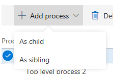
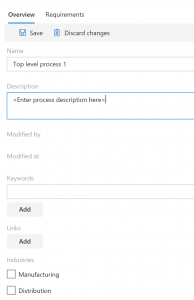
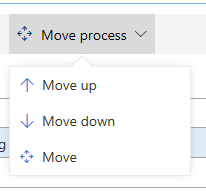
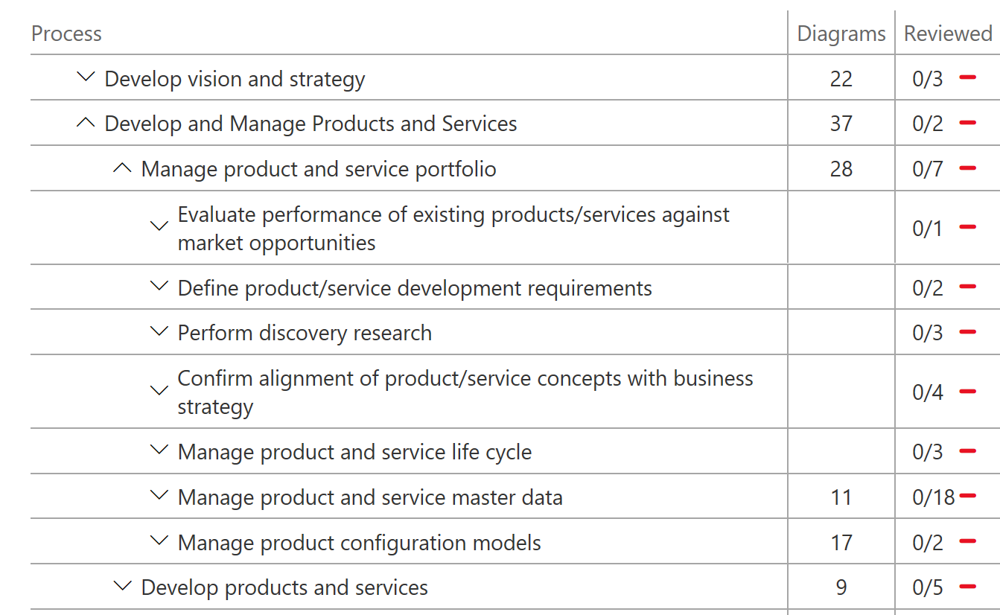
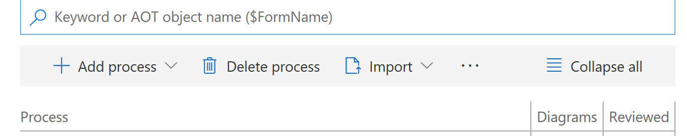
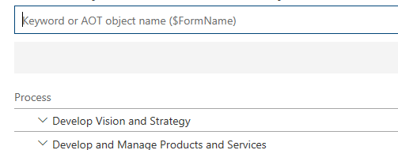

# Create, edit, and browse BPM libraries

[!include[banner](../includes/banner.md)]

This topic provides information about how to create or edit a Business process modeler (BPM) library.

## Create a BPM library

1. On the **Business process libraries** page, select **New library**.
2. Enter a name for the new library, and then select **Create**.

    The new library is now available to users in the current project.

3. Select the library to open it in BPM.

    You can now use BPM to build, edit, and browse your library.

## Add a new process

1. In the BPM library, select an existing process.
2. Select **Add process**. You can select to add the process as a child or a sibling of the selected process node. In this way, you can create a semantic hierarchy of business processes.

    

## Edit the properties of a process

1. In the BPM library, select the process node to edit.
2. In the right pane, on the **Overview** tab, select **Edit mode**.
3. Enter a name and description for the process node.
4. Select the industries and the countries or regions that the process applies to. You can also add keywords and links. Keywords let you define categories, work streams, or other metadata. Links (URLs) let you reference external sites or documentation.

    

5. When you've finished editing the properties, select **Save**.

## Move a process

You can move a process node or assign it to another parent node in the BPM hierarchy.

1. Select the process node to move, and then select **Move process**. You can select to move the process up or down, or you can select **Move** to see more options.

    

2. If you selected **Move**, you can browse the hierarchy, select a node to move the process to, and then select **Move as child** or **Move as sibling**. To cancel the move operation, select **Cancel**.

## Delete a process

To delete a business process, select the process to delete, and then select **Delete**.

## Copy a global or corporate library to your project

You can browse a BPM library that is a global library or a corporate library. However, before you can edit and work with a BPM library, it must be part of your project in Microsoft Dynamics Lifecycle Services (LCS). Libraries that are distributed by Microsoft appear under **Global libraries**, whereas libraries that are published by your organization appear under **Corporate libraries**.

Follow these steps to copy a global or corporate library to your project.

1. In your LCS project, open the **Business process libraries** page.
2. On the tile for the library that you want to copy, select the ellipsis button (…), and then select **Copy**.
3. Enter a name for the library, and then select **Create**.

## Browse a BPM library

1. On the **Business process libraries** page, double-click the tile for the library that you want to browse.
2. In the BPM library, select a process to view its substeps.

    

3. Use the buttons on the toolbar to add, delete, or import processes as a child or a sibling. You can also select **Collapse all** to view only parent processes. 

    

## Search a BPM library

You can search for words or phrases in your BPM library. The search functionality searches the names and descriptions of business processes.

- To search for a _word_, enter the search word in the search box, and then press Enter.
- To search for a _phrase_, put double quotation marks around the search phrase.

    For example, enter **technology** (word) or **"information technology"** (phrase) in the search box.

- You can also search for Application Object Tree (AOT) elements that are part of the task recordings for Microsoft Dynamics 365 for Finance and Operations, Enterprise edition, that are in your library. Typically, these AOT elements are the names of pages or menu items. When you search for an AOT element, prefix it with a dollar sign ($). For example, enter **$CustTable** in the search box.

