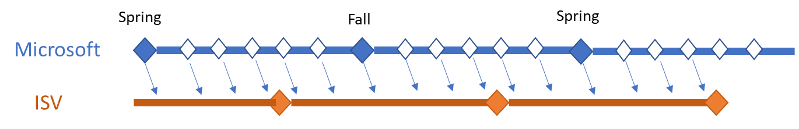

---
# required metadata

title: Delivering ISV Solutions for Dynamics 365 Finance and Operations using One Version
description: 
author: frandahl
manager: AnnBe
ms.date: 03/15/2019
ms.topic: article
ms.prod: 
ms.service: dynamics-ax-applications
ms.technology: 

# optional metadata

# ms.search.form: 
# ROBOTS: 
audience: Developer, IT Pro
# ms.devlang: 
ms.reviewer: sericks
ms.search.scope: Operations
# ms.tgt_pltfrm: 
# ms.custom: 
ms.search.region: Global
# ms.search.industry: 
ms.author: robinarh
ms.search.validFrom: 2019-3-31 
ms.dyn365.ops.version: Platform update 24 

---

# Delivering ISV Solutions for Dynamics 365 Finance and Operations using One Version

[!include [banner](../includes/banner.md)]

We have entered the era of Dynamics 365 Finance and Operations One Version. We now truly run a service with all the benefits that come with this. New updates are automatically broadcast with close to zero downtime, and customers enjoy the benefits of staying current with recent features and fixes without having to go through expensive upgrades. Feature management allows customers to control when new features are applied.

This means that you, as a partner, can innovate together with Microsoft to take advantage of new features without the waiting times that come with long release cycles. When your customers all run on current versions, you have fewer versions to maintain. You can instead focus on building quality into the solutions you bring to your customers.

Servicing current versions is more seamless and safer compared to earlier versions where patching required us to pull together individual fixes and merge them into a customer environment.

Quality is a cornerstone of One Version. Extensibility enables deployment of side-by-side solutions that provide customers more more choices in configuring their solutions.

Under One Version, customer user acceptance testing (UAT) and production environments are updated every month. It is critical we take every step to ensure that updates are done without causing issues. We acknowledge both technical and functional issues may come from updating environments.

+ Technical issues include breaking changes in APIs that are used by customizations in your solutions.
+ Functional issues seen from customers can be due to the untimely introduction of new features. Microsoft will put under feature management any new functionality that might impact existing processes. This lets customers control when new functionality is put into use, leaving time for them to validate, document, and train their users on the new features.
+ Functional issues might also be unintended changes that cause functional regressions.

Preventing technical or functional issues is a difficult proposition and requires a close coordination between Microsoft and you as an ISV partner. Our strategy is that you will adopt practices similar to our Microsoft practices. Over the next several months we will roll out new practices and tools to help empower you in this. We will update this guidance as the tools and practices evolve.

How we do this together is covered in these sections:
+	[Servicing customers](#servicing-customers)
+	[Compatibility](#compatibility)
    - [Runtime compatibility](#runtime-compatibility)
    - [Design time compatibility](#design-time-compatibility)
+	[Developing new releases](#developing-new-releases)
    - [Design for Extensibility](#design-for-extensibility)
    - [Data Upgrade](#data-upgrade)
    - [Feature exposure](#feature-exposure)
+	[Branches and builds](#branches-and-builds)
+	[Testing](#testing)
+	[Deploying updates](#deploying-updates)
+	[ISV solutions as part of One Version automated deployment?](#isv-solutions-as-part-of-one-version-automated-deployment)
+	[Do I ship binaries or source code?](#do-i-ship-binaries-or-source-code)

## Servicing customers

With Dynamics 365 for Finance and Operations on Azure we are running a solution as a service. We service companies 24/7 either proactively from alerts that report abnormal behavior or by request tickets raised by our customers in companies or by their partners. We have a range of tools available that help to support the running services, including usage data that is collected from the services. Much diligence goes around who can access customer systems to safeguard customer data.

When we analyze an issue, we may determine that it is related to your ISV solution. We report these issues to you so that you can follow up offline.

Companies can opt out of updates for two consecutive service updates before the next service update is applied to their environments. This means we can expect to see companies running on one of the last 3 monthly updates at any time.

When we resolve an issue that requires a code fix, we generally put it in the next monthly update. Highly critical reported issues like production outage may however mean a fix is provided for the version the customer is running.

Similar policies apply to your ISV solution, and you might also need to provide a code update. For your solution to be binary compatible with all your customers, it needs to be built on the oldest platform release you want to support. New updates from Microsoft promise backward binary compatibility. This compatibility gives you the option of maintaining only one servicing version of your solution that is based on the oldest of the 3 recent updates. This lets you maintain only one released solution, and you can use that solution to update all of your customers customers regardless of which of the most recent 3 updates they are running. As your customers adopt new Microsoft updates, you can choose to rebase your maintained solution to a newer release to keep current with the most recent 3 updates. 

This recommendation applies to servicing and maintaining your released solution. You will use a different approach for development of new releases of your solution. More information is available in the following sections of this document.

## Compatibility

We are diligent in ensuring compatibility with existing customizations. We achieve this by using strict practices in our engineering processes, along with tool and automation support that helps identify API contracts that are unintentionally broken. Telemetry allows our engineers to determine customizations that reference or extend a Microsoft API.

We are making a promise that Microsoft Finance and Operations updates that are applied to customer environments are functionally and binary compatible with existing customizations. The backward compatibility promise does not cover only APIs, it also includes functionality and user experience. All new experiences will be opt-in.

Any deprecation or breaking change in binary or functional compatibility will be announced 12 months in advance to provide ample time for you to align your customizations with an alternative design. You must pay attention to our monthly documentation updates and review the APIs that are marked as obsolete or internal. This allows you to manage changes in a timely fashion.

The following sections defines and describes the aspects of backward compatibility: runtime and design.

### Runtime compatibility

We promise that new updates are runtime backward compatible. This promise covers binary and functional compatibility. Runtime compatibility means customizations that exist on production and sandbox environments will continue to work after a new update is deployed on the environment. This includes both standard platform and application updates.

This also means that changes to the platform including changes to the compiler will be backward compatible with customizations that were compiled on an earlier platform.

The compatibility is only backwards. It is not possible to compile a customization on a newer platform and deploy this onto a customer environment that has not yet updated to that or a later version.

### Design-time compatibility

Design time backward compatibility means that a developer can apply an update to their development environment and can successfully compile their code without making any changes.

You must be aware of how APIs in your solution are used in your customers’ implementations, and how you use these APIs without causing breaking changes. This work includes being diligent about what is changed and relying on engineering best practices. Examples of what you should avoid are discussed in [Breaking changes](./extensibility/breaking-changes).

You should strive to meet a bar to Microsoft's bar, so that together we avoid creating regressions.

We promise binary compatibility and we also aim for design-time compatibility. However, there is a category of necessary changes that are **not** design time compatible but remain binary compatible. After applying an update, compiling your code may result in new errors or warnings. Some examples are that we make an enumeration extensible, we mark an API as obsolete or internal, or we introduce a new compiler error to avoid unsafe coding practices. These changes might require work on your solution. Design-time breaking changes that are binary compatible do not require a 12-month deprecation notice.

## Developing new releases

One Version together with running the solution as a service provides a great vehicle for collecting feedback. Feedback is useful for choosing which new features should be added to upcoming updates. Historically, we are used to new major releases with many new features, but the new model invites us to rethink this. We have moved to a series of continuous updates, where we gradually build on available capabilities of the system. In many cases one update will contain an initial small feature that we enrich with upcoming updates. There are instances where we need to stage for new features and initially hide or control adaption of new features by use of feature exposure.

We recommend that you follow a similar approach for your ISV solutions. You will benefit from quicker integration and extension of new standard features.

The frequency of your new releases can be independent from Microsoft’s, as shown in the following diagram. Consider a source code branching strategy as described later in this document.

What is essential is releasing with quality with every update. Testing helps assure quality is there, but quality needs to be built in during the design and implementation phases too. There are some new dimensions to consider under One Version.

### Design for extensibility

Designing your solution for extensibility means considering both how you customize by extending the standard application and how you enable customization of your ISV solutions by your customers and partners.

Ensure customizations are additive as opposed to intrusive, and follow the guidance found on the [extensibility home page]().

Do not become too creative in building your customization if you end up extending an API that is questionable. This leads to risk that later updates will break your solution. Instead, log an [extensibility request](./extensibility/extensibility-requests.md) for us to create a more explicit API that is more resilient to breakage.

Design solutions that are extensible. Take inspiration from [Write extensible code](./extensibility/writing-extensible-code.md).

Design for backward compatibility to avoid breaking any customer implementation. A good strategy is to be explicit about what you offer for hooking and wrapping extension code. You have great control over what methods you enable extensions for by how you decorate your methods. For more information, read [Attributes that make method extensible](./extensibility/extensibility-attributes.md).

### Data upgrade

There is no longer support for data upgrade jobs like those that existed with earlier versions of Finance and Operations. This is because we want to provide minimum downtime while updating a production environment.

The database synchronization is still executes during upgrade and supports basics like adding new tables, field, and indexes.

We are introducing new ways of driving data upgrade that execute asynchronously to prevent downtime. This is quite a different paradigm. Data upgrade will at times be triggered when a feature is enabled by a feature flag. This new approach for data upgrade will materialize with upcoming updates, and documentation resources will be available.

### Feature exposure

With One Version, updates are managed by Microsoft and pushed onto customer environments. Pushed updates should not require customers to adjust to functional changes and train their users on a monthly basis because of new or changed features. This should not cause the customer to delay updates to their environment.

Feature management is a new concept that empowers customers to decide when new or changed features are put into effect. This allows customers to review, validate, and document new or changed features before they are adopted. This also allows for training of users before enabling new or changed processes to reduce impact on daily operations. This puts the customer in control.

Feature management will be released in the upcoming monthly updates.

You should consider using feature management with your ISV solution to provide customers control on when new features are put into effect.

## Branches and builds

As an ISV, you should plan on a minimum of two source code branches, a servicing branch and a new development branch.

### Servicing branch

The servicing branch is used to produce bug fixes on the solution. The frequency of releases from the branch and distribution of the releases is determined by the ISV. The expectation is that these releases from the servicing branch will be binary cumulative releases.

The base Microsoft version used to build the solution should align with the oldest version thatused by a customer with the solution. In the One Version model that starts with 8.1, this is a maximum of three months old.

### Development branch

The development branch is used for developing new capabilities in the ISV solution. The frequency of releases from the branch is determined by the ISV. You do not have to synchronize with the monthly Microsoft releases. Decoupling from the Microsoft release schedule and delivering less frequently might be the best approach. A quarterly or bi-annual cadence is a good starting point.

The base Microsoft version in the development branch should be the latest released version available or the released version that you plan to be used for servicing when your release is planned to go out. The goal is that you innovate along with Microsoft by staying as current as is feasible and that your development model enables uptake of recent feature work.

## Testing

Microsoft has several checks and balances in its development process to ensure functional and binary compatibility. ISV solutions must be validated with each Microsoft release to ensure this compatibility. Doing this validation during the Partner Early Access Program (PEAP) phase of each release is an expectation.

Quick turnaround on feedback from you is very important, so that it is feasible to fix any issues before the monthly updates are deployed in customer environments. 

Test automation is important for quick validation of new updates. We plan to release the test framework and libraries to support you in building your test automation.

We have an extensive suite of tests that support our validation. We imagine that you as ISV’s will create your suites of automated tests too.

In addition to the SysTest automation framework that is aimed at developers, the [Regression Suite Automation Tool (RSAT)](using-task-guides-and-bpm-to-create-user-acceptance-tests.md) enables automation of business processes without the need to write code. The RSAT empowers functional users to record their critical tests and automate part of their UAT. You can also use the RSAT as you start building out your test automation.

Recently we released the [ATL automation framework]() with accompanying libraries. This framework is aimed at developers for building tests that are more comprehensive than unit tests. The libraries that come with the framework help make it seamless to compose tests. The ATL framework is valuable for you as ISV’s for building your suite of tests.

### Currently released product – test binary and functional compatibility

The currently released product that is maintained in the servicing branch should first be tested for binary and functional compatibility. The suite of your automated developer tests, automated functional tests, and manual tests for your ISV solution should be executed on an environment with the new version from Microsoft and your existing ISV solution. Since this is a test of binary and functional compatibility, the ISV solution should **not** be recompiled.  

If successful as expected, this step will validate that a customer installation of the current version of your ISV solution will not need to be updated when Microsoft broadcasts the new release to the customer.

If not successful, then you (the ISV) must notify Microsoft immediately through the [PEAP communication process](https://docs.microsoft.com/en-us/dynamics365/unified-operations/fin-and-ops/get-started/one-version#how-can-i-get-early-access-to-non-released-platform-updates) which uses Yammer and a issue notification process. The issue will either require a fix from Microsoft or a fix in your ISV solution which then may require updating customers from the servicing branch. In either case, Microsoft needs to know to become more proactive in its processes for future releases.

### Currently released product – test design time compatibility

The currently released product that you maintain in the servicing branch should then be tested for design time compatibility. To do this, you should compile the solutoin against a deployment of the new Microsoft release. While Microsoft’s goal is to minimize design time compatibility issues, there are situations where there might be an issue. One example is when an enumeration has been made extensible and the solution uses it in a manner that assumes an underlying integer representation (for example, using the enumeration value in a logical comparison or mathematical functions). While this code will continue to work in a customer deployment because the underlying values are maintained, a compiler error is generated and addressed for future releases. Another example of a design-time compatibility issue is when we introduce a new compiler error to protect against unsafe coding patterns. For more categories of design time compatibility issues, read [Breaking changes](breaking-changes.md).

You should executer your combination of automated developer tests, automated functional tests, and manual tests on an environment with the new version from Microsoft and your compiled ISV solution.

If successful, this step will validate that your ISV solution will not need to be updated even if source code is supplied to the customer and the customer recompiles the ISV solution.

If not successful and the issue is not one of the categories described in [Breaking changes](breaking-changes.md), the you (the ISV) must notify Microsoft immediately through the [PEAP communication process](https://docs.microsoft.com/en-us/dynamics365/unified-operations/fin-and-ops/get-started/one-version#how-can-i-get-early-access-to-non-released-platform-updates) which uses Yammer and a issue notification process. The issue will either require a fix from Microsoft or a fix in your ISV solution which then may require updating customers from the servicing branch. In either case, Microsoft needs to know to become more proactive in its processes for future releases.

### Currently released product – base build update

As we update your customers to new releases, you should update the base build periodically to match the oldest version used by a customer that is running your ISV solution.

### Solution in development

You validate your new solution development on the latest released version or on the released version you plan for servicing as your new release ships. Consider validation on the most current version in either case though, as this helps with early discovery of uptake work for you or issues. 

If an unexpected break occurs, then you (the ISV) must notify Microsoft immediately through the [PEAP communication process](https://docs.microsoft.com/en-us/dynamics365/unified-operations/fin-and-ops/get-started/one-version#how-can-i-get-early-access-to-non-released-platform-updates) which uses Yammer and a issue notification process.

## Deploying updates

One Version servicing includes automated update process to customer environments for Microsoft standard platform and application updates. This automation is not currently available for ISV solutions. For more information, read [ISV’s as part of One Version service updates](#isv-solutions-as-part-of-one-version-automated-deployment). 

For now, ISV solutions are updated manually. The binary backward compatibility enables safe update of the standard platform and application. Updating your ISV solutions will then happen offset of this controlled by you. 

The update process includes database synchronization, for example, adding new fields and indexes.

## ISV solutions as part of One Version automated deployment?

We have no plans to ship ISV solutions as part of the One Version automated deployment process. This is not to say that this cannot become an option at some point, but we must align engineering processes to make this feasible.

Here are some areas where alignment will be needed:
+	Feature management: Allowing users control of when new feature turn on.
+	Backward compatibility and compliance: Ensuring compliance with API customization usage.
+	Feature depreciation: Heads up time for depreciating features or APIs.
+	Test automation suite: Ongoing regression suite validation running hosted.
+	Testing during preview phase.
+	ISV solutions sign-off and upload: Based on current updates timely with release milestone.
+	Automated deployment scripts.
+	Zero downtime: For instant deployment of updates.
+	Data migration without downtime.
+	Support on-call duty for service of critical production issues.

## Do I ship binaries or source code?

Binary compatibility is supported as long as you do not recompile. We recommend your solution is not compiled on customer environments, but that you deploy pre-compiled binaries that you have prepared and validated. This provides you with the option that your solution binaries are created from your servicing branch based on an earlier version where this is practical.

If an implementation partner or customer compiles your solution on an updated environment, then new warnings and errors as mentioned under design compatibility may show. Therefore, we recommend that implementation partners do not compile your solution.

This does not imply that you cannot share your source code to help support debugging, for example. You should consider steps to avoid compilation of your code, so that you can avoid exposing to design time issues to implementation partners.

