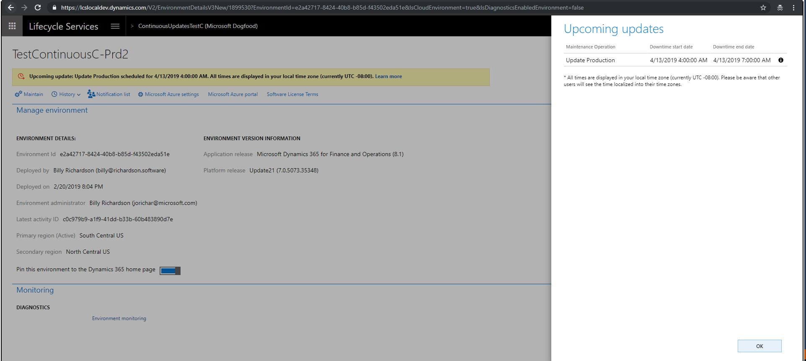

---
# required metadata

title: One Version overview
description: This topic gives an overview of the different experiences that encompass One Version.
author: meeram
manager: AnnBe
ms.date: 03/07/2019
ms.topic: article
ms.prod: 
ms.service: dynamics-ax-applications
ms.technology: 

# optional metadata

# ms.search.form: 
# ROBOTS: 
audience: Developer, IT Pro
# ms.devlang: 
ms.reviewer: sericks
ms.search.scope: Operations
# ms.tgt_pltfrm: 
# ms.custom: 
ms.search.region: Global
# ms.search.industry: 
ms.author: manado
ms.search.validFrom: 2019-3-31 
ms.dyn365.ops.version: Platform update 24 

---

# One Version overview

[!include [banner](../includes/banner.md)]

[!include [banner](../includes/coming-soon.md)]

The set of topics below are aimed at providing the information related to service updates for Dynamics 365 for Finance and Operations **8.1 and above** for the cloud releases.

- The release cadence and process is detailed  in the [Standard and First release service updates](../../fin-and-ops/get-started/public-preview-releases.md) topic.
- [Software lifecycle policy and cloud releases](../migration-upgrade/versions-update-policy.md) topic enumerates the details the service updates, availability and end of service.
- The [One Version service updates FAQ](../../fin-and-ops/get-started/one-version.md) topic is available for questions in the process, tools, planning, and Retail service updates.

The service update experience is composed of 4 distinct steps: 

- Onboard
- Notify
- Execute
- Validate

Each of these and related topics are enumerated below.

## Onboard
The customer can choose the maintenance window based on business constraints using the settings shown in the screen shot below. An upcoming calendar is available to help with planning.  New features are opt-in only and enabled by the user. All updates are applied on the user acceptance environment followed by production, giving time to the customer to validate as required. The customer can select the environment to update. There is also the ability to pause the update for up-to 3 months.

 

## Notify
To plan ahead and understand what's changing the [Release notes](https://docs.microsoft.com/en-us/business-applications-release-notes/april19/dynamics365-finance-operations/) will be available to look ahead and review the features up-to 3 months in advance.  The [What's new](https://docs.microsoft.com/en-us/dynamics365/unified-operations/fin-and-ops/get-started/whats-new-changed) topics will carry specific details about the specific month's update. An email notification will be sent 5 days in advance and a notification will pop-up in LCS just prior to an update as shown below.

## Execute
After the notification, Microsoft will apply the update (**auto update**) in the designated maintenance window. This operation will be followed by an email notification indicating the status of the update. The ability to **self-update** will also be available through LCS using the standard update experience. Fore more information, see [Apply updates to cloud environments](../deployment/apply-deployable-package-system.md). Opportunity to update the sandbox and other environments early is available through the **First release program** through [http://experience.dynamics.com](http://experience.dynamics.com).

## Validate
Once an update is complete on the user acceptance test environment, a basic business process test validation may be completed. To support this effort, a no-code automation test tool for business process testing is available. For more information, see [Regression Suite Automation Tool](https://www.microsoft.com/en-us/download/details.aspx?id=57357). Several customers have data integrations that are external and internal. It's recommended that the [Data task automation tool[../data-entities/data-task-automation.md) be used to test these scenarios.

