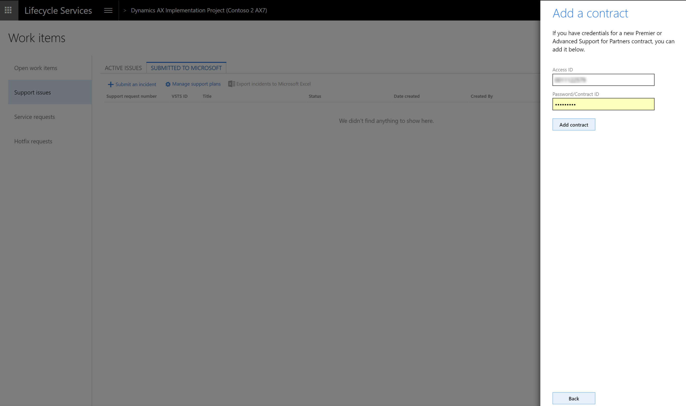
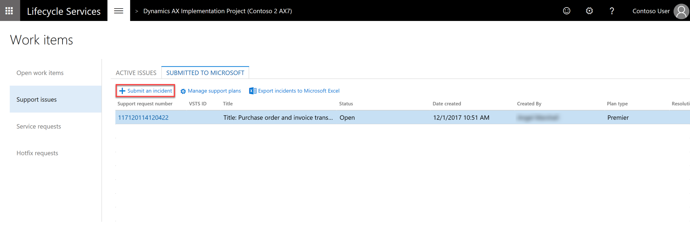
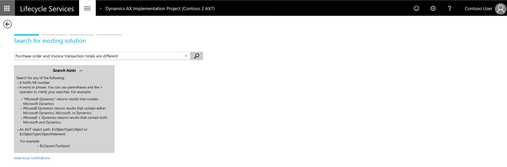
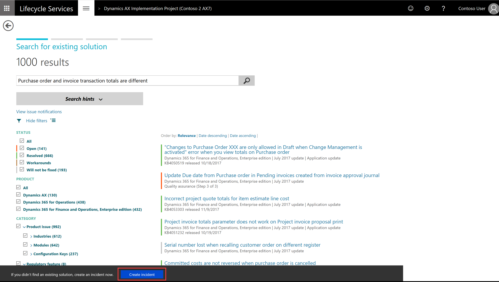
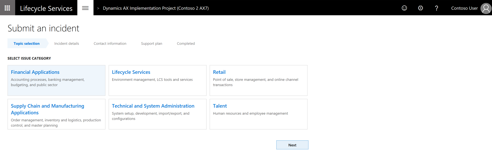
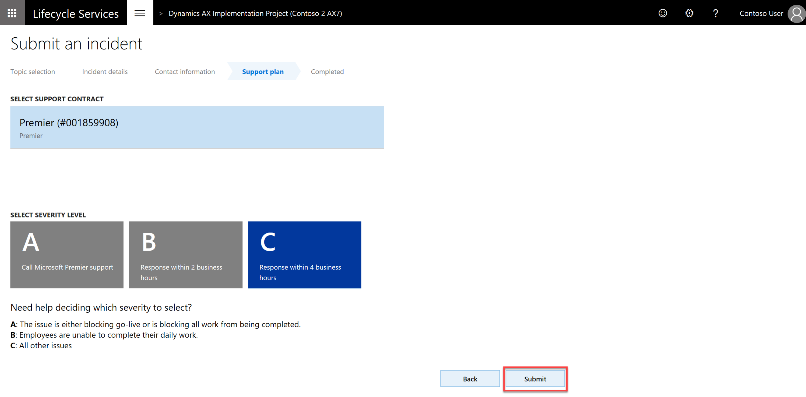

---
# required metadata

title: Log premier support tickets using Microsoft Dynamics Lifecycle Services
description: This topic shows how Microsoft Premier customers can submit a support incident for Microsoft Dynamics 365 for Finance and Operations, Enterprise editionby using Microsoft Dynamics Lifecycle Services (LCS).
author: kfend
manager: AnnBe
ms.date: 06/23/2017
ms.topic: article
ms.service: dynamics-ax-platform
ms.technology: 

# optional metadata

# ms.search.form: 
# ROBOTS: 
audience: Developer, IT Pro
# ms.devlang: 
ms.search.scope: Operations
# ms.tgt_pltfrm: 
ms.custom: 29531
ms.assetid: 2d342965-f297-42a2-b538-2f7ab77a0071
ms.search.region: Global
# ms.search.industry: 
ms.author: sigitac
ms.search.validFrom: 2016-02-28
ms.dyn365.ops.version: AX 7.0.0

---

# Log premier support tickets using Microsoft Dynamics Lifecycle Services

[!include[banner](../includes/banner.md)]

This topic shows how Microsoft Premier customers can submit a support incident for Microsoft Dynamics 365 for Finance and Operations, Enterprise edition by using Microsoft Dynamics Lifecycle Services (LCS).

1. In LCS, use the **Support** tile to manage support incidents. To submit issues directly to Microsoft, go to the **Support** tile in your LCS project.

[!Note]
If this is the first time you log a premier support ticket, you will need to add your premier support plan to LCS Support. Once the support plan is added, you won't have to do it again the next time you need to log a premier ticket. 
   - To do so, from the **Submitted to Microsoft** tab, click the **Manage support plans** button. 

   

   - In the **Manage support plans** slide, click **Add contract** to enter the **Access ID** and **Password/Contract ID** to add - contract. 

   

2. From the **Submitted to Microsoft** tab, click the **Submit an incident** button.

3. Before you submit an incident, use the Issue Search tool to search for existing solutions. Enter a description of the issue and click the search icon.

4. If you cannot find an existing solution to your issue from the Issue search tool, click **Create incident** to create a new incident.

5. Select issue category. 

6. Select issue area.

7. In the **Describe your issue** window -  
 - Toggle **Yes** if the issue occure in an environment and select the environment name.  
 - Enter a short description of your issue in **Title**
 - Provide issue detail and repo steps
 - If applicable, enter **error message**. 
 - It’s also a good idea to attach screenshots that illustrate the problem, to do this, use **Attach file from computer**.
 

8. Enter the **primary contact information**. These contact details will be used by the customer support to contact you about the case.

9. Select **support contract** and **severity level**. 

  [!Note]
  Selecting **Severity level A** will redirect you to a page that has the Premier support phone number, which you will need to call to report the issue. Severity issues B and C can be reported by continuing with this wizard.
  
10. Click **Submit** to complete. 

