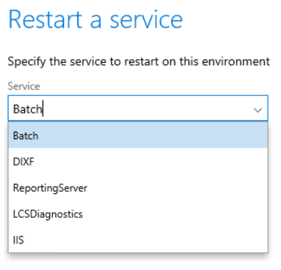

---
# required metadata

title: Restart environment services
description: This topic provides information about how to restart individual services on environments that are deployed through Lifecycle Services (LCS).
author: kfend
manager: AnnBe
ms.date: 03/01/2018
ms.topic: article
ms.prod: 
ms.service: dynamics-ax-platform
ms.technology: 

# optional metadata

# ms.search.form: 
audience: Developer, IT Pro
# ms.devlang: 
ms.reviewer: kfend
ms.search.scope: Operations
# ms.tgt_pltfrm: 
# ms.custom: 
ms.search.region: Global 
# ms.search.industry:
ms.author: manado
ms.search.validFrom: 2018-03-05
ms.dyn365.ops.version: 7.3
---

# Restart environment services

[!include[banner](../includes/banner.md)]

You can use the Restart Services functionality in Lifecycle Services (LCS) to restart individual services that are associated with a Tier 2, Tier 3, Tier 4, or Tier 5 Standard Acceptance Test (sandbox) environment that is deployed in a Microsoft subscription. The services that can be restarted using this feature are: 

- IIS 
- DIXF 
- LCS Diagnostics service  
- Batch 
- Reporting Server 

Any user that has been added as a project owner, organization admin, or environment manager in an LCS project has permissions to use this functionality.  

## Restart a service
To restart a specific service within a deployed environment, complete the following steps.

1. Navigate to the appropriate LCS project, and select the environment that you want to restart the service for. 
2. Open the **Environment details** page, click **Maintain**  and then select **Restart Services**. 
3. On the **Restart a service** slider, select the service that you want to restart, and then click **OK**.

The **Environment state** is updated when the service is restarted. 

4. To view the updated status, refresh the page. 
Note that because it can take only a few seconds for a service to restart, the environment state may have already reset to **Deployed**. An entry will be added to the **History** page when the restart is complete.  

