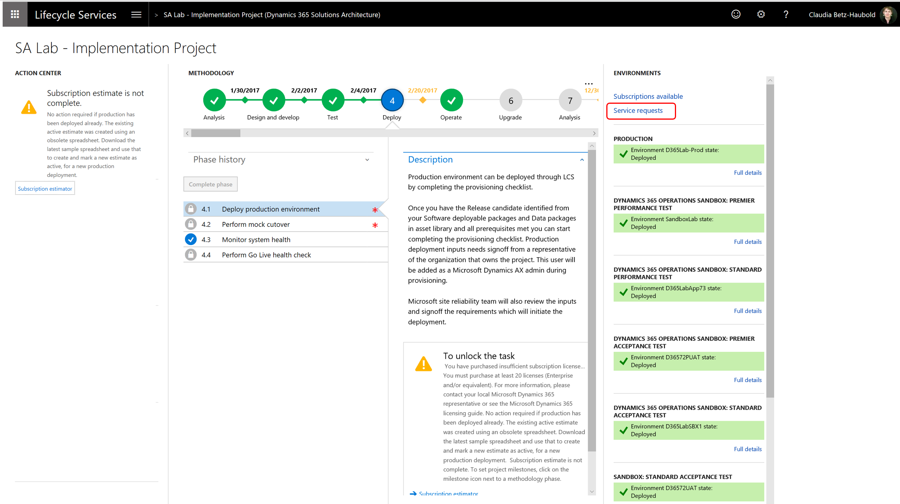
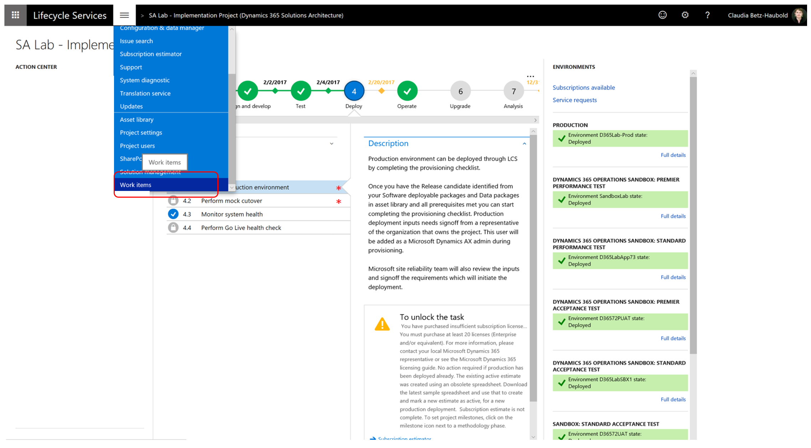
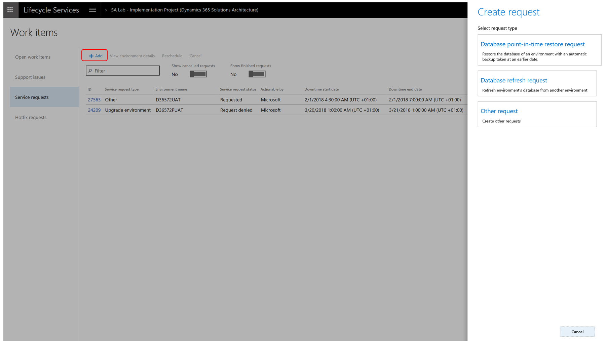

---
# required metadata

title: Submit a service request to the Dynamics Service Engineering team
description: You can submit service requests directly to the Dynamics Service Engineering team by using LCS. 
author: manalidongre
manager: AnnBe
ms.date: 04/06/2018
ms.topic: article
ms.prod: 
ms.service: dynamics-ax-platform
ms.technology: 

# optional metadata

# ms.search.form: 
# ROBOTS: 
audience: IT Pro
# ms.devlang: 
ms.reviewer: kfend
ms.search.scope: Operations
# ms.tgt_pltfrm: 
ms.custom: 254564
ms.assetid: 43ea0eae-34c8-4f97-8c98-c711844534d9
ms.search.region: Global
# ms.search.industry: 
ms.author: manado
ms.search.validFrom: 2016-11-30
ms.dyn365.ops.version: Platform update 3

---

# Submit a service request to the Dynamics Service Engineering team

[!include[banner](../includes/banner.md)]

A service request is a ticket for the Dynamics Service Engineering (DSE) team to perform a pre-defined set of tasks on your environments.

    > [!NOTE]
    > Do not use service requests for product issues. If you encounter a situation that does not fall into any of the tasks described in this article, file a support ticket. For more information on support tickets, see [Find support for Microsoft Dynamics for Finance and Operations](lcs-support.md).

You can submit service requests directly by using Lifecycle Services (LCS). You can also view which requests have been submitted, executed, and canceled on your environments.

    > [!NOTE]
    > Microsoft frequently reviews all incoming service requests. By selecting the correct service request type for your scenario, you help DSE to execute the request in a timely manner.

View service requests 
----------------------

There are two ways to view the service requests page.

- On the project dashboard, in the **Environments** pane, select **Service
    requests.**
 

- On the LCS menu, click **Support**, and on the **Work items** page, select
    the **Service requests** tab.

>   By default, the **Service requests** page contains all requests that are
>   currently active or have been denied. You can toggle the filter to show
>   canceled and finished requests.

>   After you have submitted a request, it will have a status of **Requested**.
>   Before the DSE team acts on the request, they may ask for clarification by
>   entering a **Comment**.

>   For example, you might receive a comment from the DSE team if the production
>   environment deployment request is not in the same data center as the data
>   center where your sandbox environments are deployed.
>   Carefully review the comments and provide any required clarifications in a comment. To view the details of a specific request, or
>   to submit comments on a service request, click the **ID**.

If you signed up for LCS Notifications, you will receive an email when the status of a service request changes or a comment has been made.

If you submit a service request to DSE to perform an action that is outside of their scope, the service request will be denied with a reason and a suggested action. Common examples of service requests that are denied are discussed later in this article.

Create service requests
-----------------------

There are two ways to create a service request, automatically and on demand. 

- **Automatically**: A service request is created automatically when you request an environment deployment, a package application, or an application upgrade. 
- **On demand**: A service request is manually created when you enter a request for a database refresh,
point-in-time restore, and other potential needs as described below.

### Automatically create new service requests

- **Environment deployment** – To set up deployment options and submit a
    request to the DSE team to deploy a new environment, go to the **Environments**
    pane, and then click **Configure**.

- **Package application** – To apply a package to the production environment, on the **Environment details** page, click **Maintain** to select the package to apply, and then select **Schedule**. For more information, see [Apply updates to a cloud environment](../deployment/apply-deployable-package-system.md).

- **Upgrade** – To have DSE upgrade one Sandbox, Standard Acceptance Test environment, or a production environment, on the **Environment details** page for the environment that you are upgrading, select **Maintain**, and then select **Upgrade**. For more information, see [Process for moving to the latest update of Finance and Operations](../migration-upgrade/upgrade-latest-update.md).

### Create new service requests on demand

1.  To create a new service request on demand, go to the **Service requests** page, and then click **Add**.

2.  Select the service request type that you want to create. The options on the page are tailored to the specific type of service request that you selected.

- **Database point-in-time restore request**: Use this request to restore a **non-production** database to a specific point in time. For more information, see [Request a point-in-time restore](../database/request-point-in-time-restore.md).

    > [!NOTE]
    > To restore a **production** database during the **cutover phase**, follow the process in the bullet point **Other request** later in this list.

    - If you need to restore a **production** database when you are already **live in operations**, submit a **support issue** through LCS.

- **Database refresh request**: Use this request to refresh a database from production to sandbox, or from one sandbox to another. For more information, see [Request a sandbox database refresh](../database/database-refresh.md).

    > [!NOTE]
    > To refresh a database from a sandbox to production during the **cutover phase**, follow the process outlined in the next bullet point, **Other request**.

- **Other request**: Use this type to request the following actions to be performed by the DSE team:

    - **Database refresh** of your configuration data to **production** during the **cutover phase.** For more information, see [Copy a Finance and Operations database from SQL Server to a production Azure SQL Database environment > Raise a service request to copy database](../database/copy-database-from-sql-server-to-azure-sql#submit-a-service-request-to-copy-the-database).

    > [!NOTE]
    > Phrase the service request exactly as described in the article.

    - **Restore** a **production** database during the **cutover phase** to a specific point in time.

    > [!NOTE]
    > Follow the same approach as described above for database refresh to production. However, the request must be worded as follows:**"This is a request for a point-in-time restore of production during the cutover phase. Restore point in UTC: \<mm/dd/yyyy hh:mm in UTC\>. I acknowledge that this will overwrite the database currently in production.”**

- Turn on **maintenance mode** in **production**. For details, see [Maintenance Mode](./sysadmin/maintenance-mode.md).
- Define explicit **IP whitelist rules** in **production**.
- Request **Power BI Embedded** to be activated on a Sandbox, Standard Acceptance Test environment, or production if you get the message “**Power BI embedded is not enabled. Please contact your system administrator.**”

    > [!NOTE] 
    > Use the **Other request** exactly as described above. If the request is formulated in a way that is not clear to the DSE team, they will post a comment asking for clarification. If the **Other request** is used for any request that is not listed above, the request will be denied.

Common examples of service requests that are denied:

- You submitted an **Other request** to do the following when it should have
    been a **Support issue**:

    -   **Activate** a new **subscription estimate** after you are live in
        Production or have requested Production.

    -   **Reset the Financial reporting data mart** in a release earlier than
        Finance and Operations Financial reporting release 7.2.6.0.

    -   Restore a production database after go-live.

    -   If you ran into an issue after DSE performed an application upgrade.

- You submitted an **Other request** for an action that you should have
    requested through a different request type, for example, a database refresh
    in a non-production environment.

- You submitted an **Other request** for an action that you should perform
    yourself, for example, a database upgrade on a development environment.
    
Service requests that are created on demand are not explicitly accepted by the DSE team. They are addressed during the specified downtime window unless the DSE team has commented on the request or had to deny the request. Review the comments in the service request for details.

Service request types and Service Level Agreements (SLA’s)
----------------------------------------------------------
|    Service   request type              |    Applicable environments                                                                         |    Requested   service                                                                                                          |    Lead   time                      |    Downtime                                                                                                             |
|----------------------------------------|---------------------------------------------------------------------------------------------------------|---------------------------------------------------------------------------------------------------------------------------------|-------------------------------------|----------------------------------------------------------------------------------------------------------------------------|
|    Environment   deployment            |    Any                                                                                                  |    Environment   deployment                                                                                                     |    SLA: within two business days    |                                                                                                                            |
|    Package   application               |    Production                                                                                           |    Deployable package application                                                                                             |    Five hours                          |    Five hours                                                                                                                 |
|    Upgrade                             |    One Sandbox: Standard Acceptance Test and Production                                               |    Customer who is live in production is requesting upgrade to the latest version of Dynamics for Finance and Operations    |    Five business days                  |    Eight hours                                                                                                                 |
|    Database point-in-time restore    |    Any Tier 2 or higher sandbox                                                                       |    Database point-in-time restore                                                                                             |    Five hours                          |    One hour                                                                                                                  |
|    Database refresh                  |    From production to any Tier 2 or higher sandbox; Between any two Tier 2 or higher sandboxes    |    Database refresh                                                                                                           |    Five hours                          |    One hour                                                                                                                  |
|    Other                               |    Production                                                                                           |    Database point-in-time restore                                                                                             |    Five hours                          |    One hour                                                                                                                  |
|                                        |    Production                                                                                           |    Database refresh                                                                                                           |    Five hours                          |    One hour                                                                                                                  |
|                                        |    Production                                                                                           |    Maintenance mode                                                                                                             |    Five hours                          |    Not applicable as the customer communicates on the service request when environment should be taken out of Maintenance Mode again.    |
|                                        |    Production                                                                                           |    IP whitelist rules                                                                                                           |    5 hours                          |    2 hours                                                                                                                 |
|                                        |    Production                                                                                           |    Power BI Embedded                                                                                                            |    5 hours                          |    2 hours                                                                                                                 |
|                                        |    Production                                                                                           |    Special fonts                                                                                                                |    5 hours                          |    2 hours                                                                                                                 |

