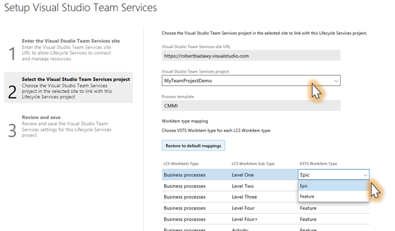
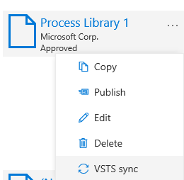
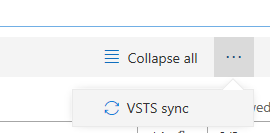
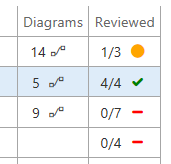
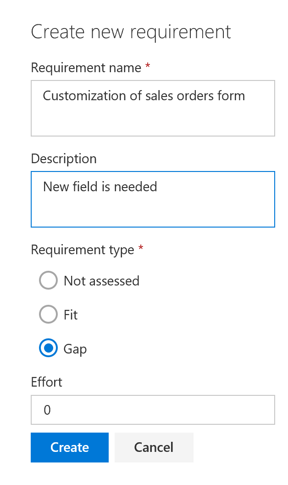

# Synchronize a BPM library with Visual Studio Team Services

[!include[banner](../includes/banner.md)]

You start the implementation stage of a project by synchronizing a Business process modeler (BPM) library with your project in Microsoft Visual Studio Team Services (VSTS). In this way, you can review processes and associate requirements with business processes. By synchronizing a BPM library with a VSTS project, you can also track the progress of your implementation project in VSTS, and can associate various work items with requirements and business processes. These work items include bugs, tasks, backlog items, tests, and documents.

Currently, VSTS doesn't support custom work item types or synchronization of business processes that have custom work item types and you will see a warning that confirms this. If you choose to ignore the warning and attempt a VSTS sync with a custom template, you can avoid synchronization issues by verifying the following for the template:
- Does not delete any work item type
- Does not delete any state of a work item type
- Does not add any required fields to a work item type

To learn more about VSTS, go to [www.visualstudio.com/team-services](http://www.visualstudio.com/team-services).

## LCS project settings: Set up VSTS

If you've already set up VSTS from Microsoft Dynamics Lifecycle Services (LCS), you can skip the procedures in this section.

### Create a personal access token

To connect to a VSTS project, LCS is authenticated by using a personal access token. Follow these steps to create a personal access token in VSTS.

1. Go to <https://www.visualstudio.com>, sign in, and find your VSTS project.
2. In the upper-right corner, hold the pointer over your name, and then, on the menu that appears, select **Security**.
3. Select **Add** to create a new personal access token.
4. Enter a name for the token, and then specify how long the token should last.
5. Select **Create Token**.
6. Copy the token to your clipboard.

    > [!NOTE]
    > You won't be able to find the token details again after you complete this step and move away from the page. Therefore, make sure that you've copied the token before you move away from the page.

### Configure your LCS project to connect to VSTS

1. In your LCS project, select the **Project settings** tile.
2. Select **Visual Studio Team Services**, and then select **Setup Visual Studio Team Services**. This configuration is required by many LCS tools. If you've already configured LCS to connect to your VSTS project, you can either skip this procedure or select **Change** to change the existing configuration.
3. Enter the root URL for your VSTS account, and the personal access token that you created earlier, and then select **Continue**.
4. Select your VSTS project.
5. Specify the mapping between LCS/BPM items and the associated VSTS work item types.

    

6. Select **Continue**, review your changes, and then select **Save**.

## Synchronize a BPM library with a VSTS project

After you've set up the connection between the LCS project and a VSTS project, you can synchronize a BPM library with the VSTS project. When you synchronize a BPM library with a VSTS project, a VSTS work item is created for each business process line in the BPM library. In addition, the hierarchy of business processes in BPM is reflected in the hierarchy of work items in VSTS. The type of work items that are created in VSTS depends on the settings of your LCS project.

This synchronization is a one-way synchronization. Changes in LCS are reflected in VSTS, but changes in VSTS aren't reflected in LCS.

The following information is synchronized:

- Business process names
- Business process descriptions
- Keywords (as tags)
- Countries or regions (as tags)
- Industries (as tags)

To synchronize a BPM library with a VSTS project, on the **Business process libraries** page, on the tile for the library that you want to synchronize, select the ellipsis button (…), and then select **VSTS sync**.

You can also start VSTS synchronization from the toolbar in a BPM library. Select the ellipsis button (…), and then select **VSTS sync**.

## Turn off synchronization of BPM with VSTS

To turn off synchronization, on the **Business process libraries** page, select the library that you want to stop synchronizing, select the ellipsis button (…), and then unselect **VSTS sync**.

## Review processes and add requirements

During the project phase where you're gathering requirements, you can use the BPM library to review business processes and tasks, and to identify requirements. In BPM, you can mark business processes as reviewed to track the review process.

To mark a process or one of its child processes as reviewed, select the process in BPM, and then, in the right pane, on the **Overview** tab, select **Mark as reviewed**.

When a business process is marked as reviewed, the **Reviewed** column is updated. This column shows the following information:

- A fraction indicates how many direct child processes have been reviewed.
- A symbol indicates how completely the process and its child processes have been reviewed:

   - **Green check mark** – The process and all its child processes have been fully reviewed.
   - **Yellow circle** – The process and its child processes have been partially reviewed.
   - **Red dash** – The process and its child processes haven't been reviewed.

If a BPM library is synchronized with a VSTS project, and you mark a process as reviewed in BPM, its status is changed to **Active** in VSTS.

While you're reviewing a business process that is connected to VSTS, you can add a requirement directly to your VSTS project.

1. Select a business process.
2. In the right pane, on the **Requirements** tab, select **Add requirement**.
3. Enter a name, description, and type, and then select **Create**.

    

    In VSTS, a requirement work item is created that is associated with the current business process.

To go to the VSTS work items that are associated with the current business process, on the **Requirements** tab, select the appropriate links.
