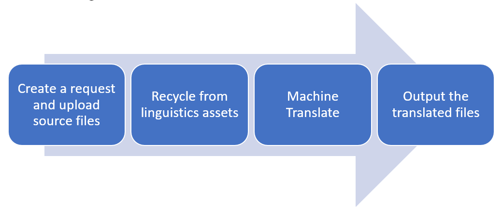

---
# required metadata

title: Microsoft Dynamics 365 - Translation Service
description: The Microsoft Dynamics 365 - Translation Service (DTS) is designed to enhance the partner and ISV translation experience of their solutions or when adding a new language for supported Microsoft Dynamics products.
author: kfend
manager: AnnBe
ms.date: 09/27/2017
ms.topic: article
ms.prod: 
ms.service: dynamics-ax-platform
ms.technology: 

# optional metadata

# ms.search.form: 
# ROBOTS: 
audience: Developer, IT Pro
# ms.devlang: 
ms.reviewer: kfend
ms.search.scope: Operations
# ms.tgt_pltfrm: 
ms.custom: 6154
ms.assetid: ejchoGIT
ms.search.region: Global
# ms.search.industry: 
ms.author: ejchoGIT
ms.search.validFrom: 2016-02-28
ms.dyn365.ops.version: AX 7.0.0

---

# Microsoft Dynamics 365 - Translation Service overview

[!include[banner](../includes/banner.md)]

The Microsoft Dynamics 365 - Translation Service (DTS) is designed to enhance the translation experience for partners and ISVs with their solutions or when adding a new language for [supported Dynamics products](./translation-service-overview.md#supported-products).  

DTS uses a custom-trained machine translation (MT) system for [Microsoft’s General Availability (GA) languages](./use-translation-service.md#glossary) to maximize the quality of the translation output. DTS also supports translation recycling from Microsoft Dynamics and partners/ISVs linguistic assets so that identical strings are translated one time and consistently. 

The following diagram shows a high-level view of how the service works. 
 
## Recycle existing translations
Recycling existing linguistic assets is enabled only when the assets are uploaded in the XLIFF translation memory (TM) zip file format. For more information, see [XLIFF TM zip file](./use-translation-service.md#xliff-tm).

## Custom-trained MT system
DTS uses Microsoft Translator Hub (MT Hub) from Microsoft Research to customize the MT system for Microsoft Dynamics products.
The use of the custom-trained MT system is limited to Microsoft’s Dynamics GA languages unless partners and ISVs upload XLIFF TM files that contain more than 10,000 translation units (TU). A TU typically contains a source string, translation, state, state qualifier, and note. In those cases, DTS will create a custom-trained MT that is specific to the request. 

## Supported products
DTS currently supports the following product versions.  

Product name |	Version |	File format supported |	Note
--- | --- | --- | ---
**Dynamics AX 2012**	| All versions	| .ktd, .ald	|
**Dynamics 365 for Finance and Operations, Enterprise edition** | All versions |	.label.txt	|
**Dynamics 365 for Retail** | All versions | .label.txt |
**Dynamics CRM**	| 2011-2016 |	.resx, .js	|
**Dynamics NAV** | 2015-2018	| .etx, .stx, .resx, .txt, .xml, .xlf |	.txt, .xml and .xlf are in NAV-specific formats

