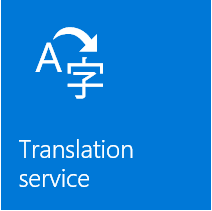
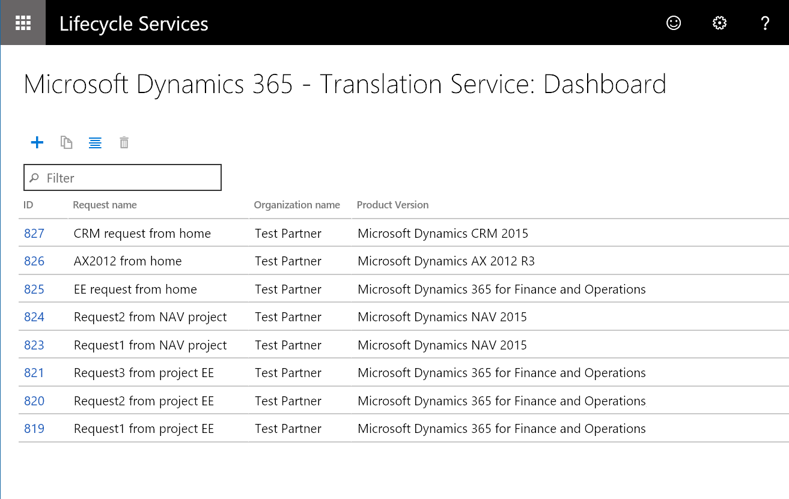
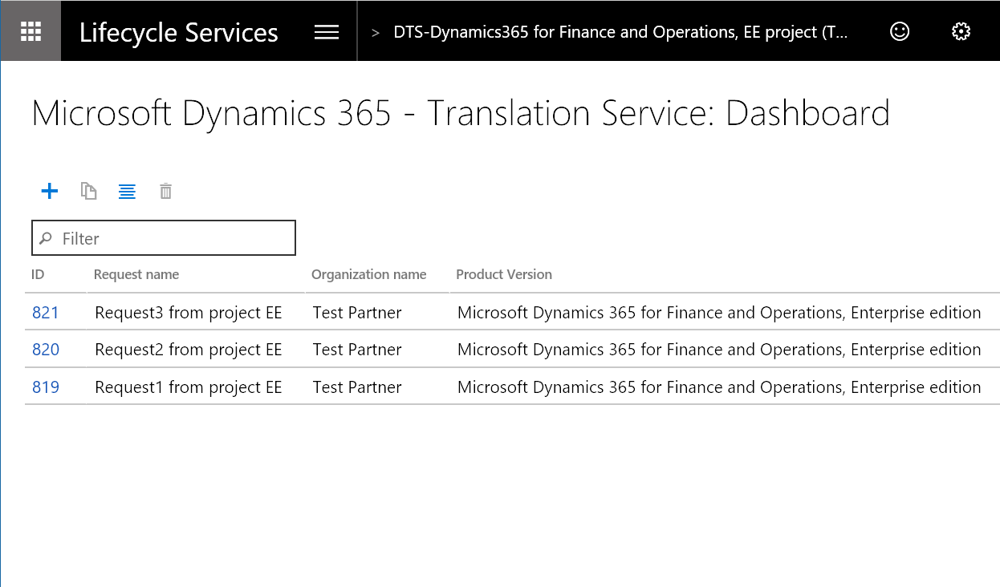

---
# required metadata

title: Microsoft Dynamics 365 - Translation Service
description: The Microsoft Dynamics 365 - Translation Service (DTS) is designed to enhance the partner and ISV translation experience of their solutions or when adding a new language for supported Microsoft Dynamics products.
author: kfend
manager: AnnBe
ms.date: 09/27/2017
ms.topic: article
ms.prod: 
ms.service: dynamics-ax-platform
ms.technology: 

# optional metadata

# ms.search.form: 
# ROBOTS: 
audience: Developer, IT Pro
# ms.devlang: 
ms.reviewer: kfend
ms.search.scope: Operations
# ms.tgt_pltfrm: 
ms.custom: 6154
ms.assetid: ejchoGIT
ms.search.region: Global
# ms.search.industry: 
ms.author: ejchoGIT
ms.search.validFrom: 2016-02-28
ms.dyn365.ops.version: AX 7.0.0

---

# Microsoft Dynamics 365 - Translation Service overview

[!include[banner](../includes/banner.md)]

The Microsoft Dynamics 365 - Translation Service (DTS), which is hosted in Microsoft Dynamics Lifecycle Services (LCS), is designed to enhance the translation experience for partners and ISVs with their solutions or when adding a new language for [supported Dynamics products](./translation-service-overview.md#supported-products).  

DTS uses a custom-trained machine translation (MT) system for [Microsoft’s General Availability (GA) languages](./translation-service-overview.md#glossary) to maximize the quality of the translation output. DTS also supports translation recycling from Microsoft Dynamics and partners/ISVs linguistic assets so that identical strings are translated one time and consistently. 

The following diagram shows a high-level view of how the service works. 
 
## Recycle existing translations
Recycling existing linguistic assets is enabled only when the assets are uploaded in the XLIFF translation memory (TM) zip file format. For more information, see [XLIFF Translation Memory (TM)](./use-translation-service-tm.md) topic.

## Custom-trained MT system
DTS uses Microsoft Translator Hub (MT Hub) from Microsoft Research to customize the MT system for Microsoft Dynamics products.
The use of the custom-trained MT system is limited to Microsoft’s Dynamics GA languages unless partners and ISVs upload XLIFF TM files that contain more than 10,000 translation units (TU). A TU typically contains a source string, translation, state, state qualifier, and note. In those cases, DTS will create a custom-trained MT that is specific to the request. 

## Supported products
DTS currently supports the following product versions.  

Product name |	Version |	User interface file format supported |	Documentation file format supported | Note
--- | --- | --- | --- | ---
**Dynamics AX 2012**	| All versions	| .ktd, .ald	| .docx |
**Dynamics 365 for Finance and Operations** | All versions |	.label.txt	| .docx | 
**Dynamics 365 for Retail** | All versions | .label.txt | .docx | 
**Dynamics CRM**	| 2011-2016 |	.resx, .js	| .docx | 
**Dynamics NAV** | 2015-2018	| .etx, .stx, .resx, .txt, .xml, .xlf | .docx |	.txt, .xml and .xlf are in NAV-specific formats

## Accessing the Dynamics 365 Translation Service
You can access the Microsoft Dynamics 365 Translation Service (DTS) from two places in Microsoft Dynamics Lifecycle Services (LCS):

- From the LCS home page
- From within an LCS project

### Accessing DTS from the LCS home page
Sign in to LCS, and scroll to the right side of the page. Expand the tiles waffle, and then select the **Translation service** tile to open the dashboard view for DTS. 

### Accessing DTS from within an LCS project
Create a new project, or open an existing project. In the project dashboard, in the **More tools** section, select the **Translation service** tile. Or open menus in the project dashboard and find **Translation service** in the list.

### Accessing DTS from the LCS home page vs. accessing it from within an LCS project
When you access DTS from the LCS home page and create a translation request, you can select the product to use for the request. You can then add more requests that use different products by switching the product selection. You don't have to exit the service and open a different translation project. This option is convenient when you work on multiple product translation projects. However, because you access the service outside an LCS project, no other users can view your requests on the DTS dashboard. This option gives you your own DTS dashboard that shows all the translation requests that you've made across all LCS projects and from the LCS home page. The following illustration shows an example of the DTS dashboard that you open from the LCS home page.

Because an LCS project is always tied to a product, any translation request that you submit from a project automatically carries the product type and version information from the project. You can't select a different product for the request. In an LCS project, the project owner and the users will have permission to access the DTS dashboard and the translation requests that are submitted from within that project. This option is useful when you work with a group of people on one product translation project in LCS. The following illustration shows an example of the DTS dashboard that you open from within an LCS project.

## Accessing LCS Preview features
LCS offers some services or features only as preview features for various reasons. There are two preview features that are available for DTS. To access the list of available preview features, from the LCS home page, find **Preview feature management** file. 

Select a feature you need and move the slider to **Yes** to enable the selected feature for you. 

#### Dynamics 365 Translation Service - Documentation Translation Support
You must turn this feature on if you want to translate a product or solution document (i.e. Microsoft Word document).

#### NAV product availability
You need this feature if you want to create a LCS project for NAV products and access DTS from within the project. 

For more information about how to use DTS, see [Microsoft Dynamics 365 Translation Service - User interface file translation](use-translation-service.md) and [Microsoft Dynamics 365 Translation Service - Documentation file translation](use-translation-service-ua.md). 

## Glossary
| Term                   | Description |
|------------------------|-------------|
| XLIFF                  | XML Localization Interchange File Format. XLIFF is an XML-based format that was created to standardize the way that localizable data is passed between tools during a localization process, and to serve as a common format for computer-aided translation (CAT) tool files. |
| Microsoft GA languages | A general availability of the Microsoft produced languages. This list varies depending on the product. |
| TU                     | A translation unit which typically contains a source string, translation, state, state qualifier, and note. |

