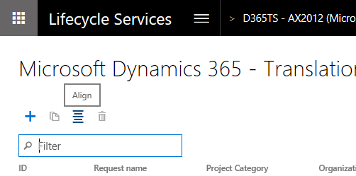
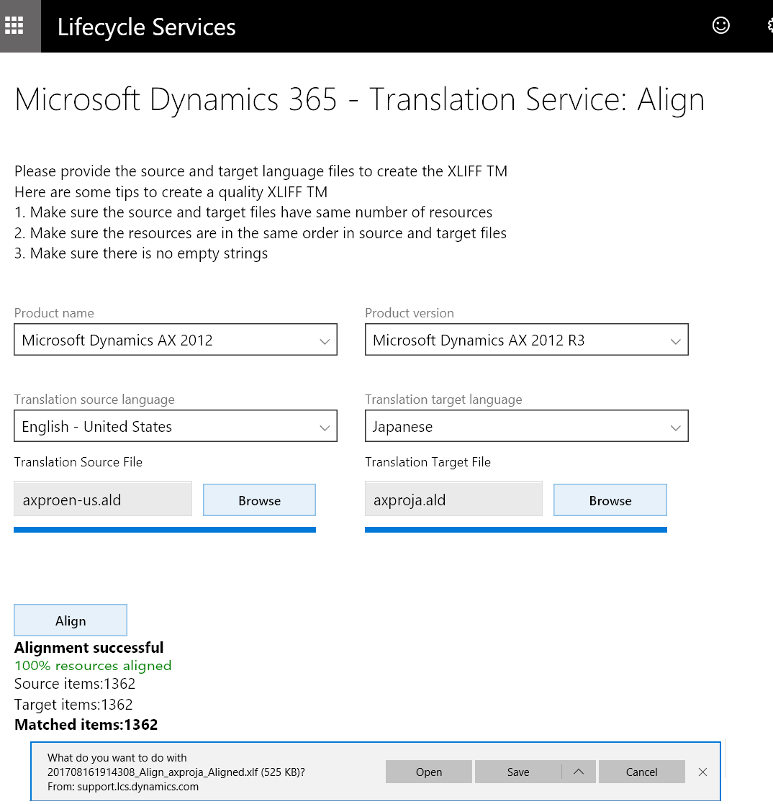
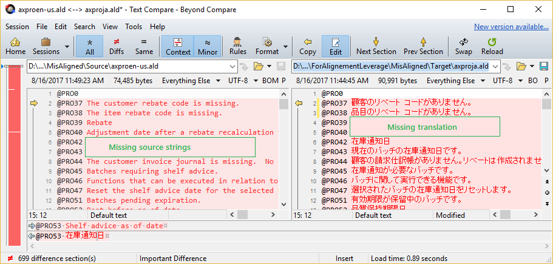
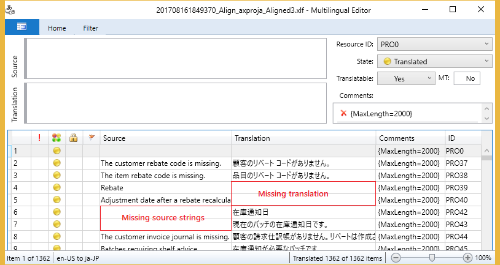

# Microsoft Dynamics 365 Translation Service user guide 

[!include[banner](../includes/banner.md)]

## Preparing a translation memory - Alignment
If you have files that were previously translated, you can recycle the translated files for a newer version of the source files by creating a translation memory (TM) that uses XML Localization Interchange File Format (XLIFF). On the DTS dashboard, select the **Align** icon to access the Align tool.

> [!NOTE]
> Align tool currently supports User Interface files only.  
> You might have to explicitly allow pop-up windows in your browser.

On the **Align** page, select the source language and target language, and select the files to align. Then select **Align** to complete the alignment. When the alignment is completed, a message box appears.

To create the best XLIFF TM, make sure that the following conditions are met:

- Both the source file and the target file have the same number of resources.
- The resources are in the same order in both the source file and the target file.
- There are no empty strings. The following illustration shows examples of empty strings from the source and the target.

These empty strings are inherited by the XLIFF TM. If a **Rebate** string in the source has an empty string in the target, it will likely be translated as an empty string if this XLIFF TM is used.

Although the Align tool can resolve some of these issues, it's easier if you prevent them before you see unexpected results in the output.

Review the aligned XLIFF file before you use it as a TM. Translation units (TUs) that have been reviewed should be marked as **Final** or **Signed off**, so that they aren't mistaken for unreviewed TUs.

