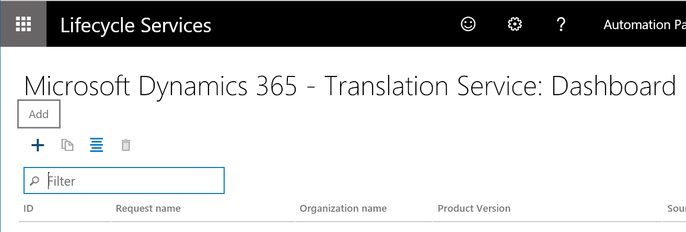
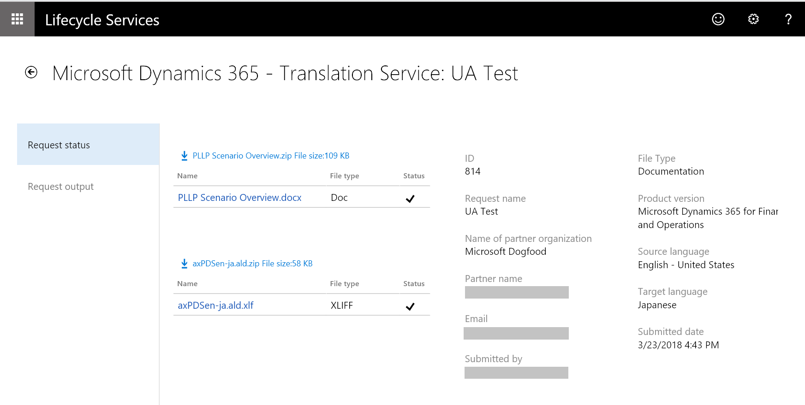
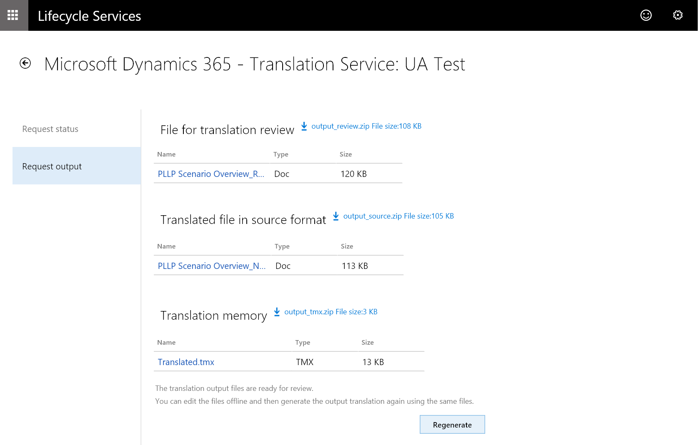

---
# required metadata

title: Microsoft Dynamics 365 Translation Service - Documentation file translation
description: This topic explains how to translate a documentation file for a Microsoft Dynamics product or solution.
author: kfend
manager: AnnBe
ms.date: 03/29/2018
ms.topic: article
ms.prod: 
ms.service: dynamics-ax-platform
ms.technology: 

# optional metadata

# ms.search.form: 
# ROBOTS: 
audience: Developer, IT Pro
# ms.devlang: 
ms.reviewer: kfend
ms.search.scope: Operations
# ms.tgt_pltfrm: 
ms.custom: 6154
ms.assetid: 
ms.search.region: Global
# ms.search.industry: 
ms.author: ejchoGIT
ms.search.validFrom: 2018-03-27
ms.dyn365.ops.version: AX 7.3.0

---

# Microsoft Dynamics 365 Translation Service - Documentation file translation

[!include [banner](../includes/banner.md)]

This topic explains how to translate a documentation file for Microsoft Dynamics products and solutions.

## Create a translation request
1. In Microsoft Dynamics Lifecycle Services (LCS), on the DTS dashboard, select **Add** to create a new translation request.

    

    You can open the DTS dashboard either from the LCS home page or from within a project. For more information, see [Accessing DTS](./translation-service-overview.md#accessing-dts).

2. Enter the required information for the request.

    | Field | Description |
    |-------|-------------|
    | Request name | Enter a name for the request. |
    | File type | Select **Documentation**. This option is only available if you've turned on the **Dynamics 365 Translation Service - Documentation Translation Support** preview feature in LCS. For more information, see [Accessing LCS preview features](./translation-service-overview.md#accessing-lcs-preview-features). |
    | Product name | Select a product name. If you accessed DTS from within an LCS project, this field is automatically filled in and is read-only. |
    | Product version | Select a product version. If you accessed DTS from within a LCS project, this field shows the default product version information from the project. However, you can select a different version. |
    | Target country/region | Select the country or region where the translated file will be released. |
    | Translation source language, Translation target language | Select the pair of languages to translate from and to. The fields list all the languages that are supported for the selected product name and version. Language names that are shown in **bold** type are General Availability (GA) languages for Microsoft Dynamics products. Therefore, Microsoft-trained machine translation (MT) systems are available in those languages. In other words, the MT system is trained on the terminology for Microsoft Dynamics. For non-GA languages, the MT system uses the general domain training. |

    > [!NOTE]
    > To take advantage of the Microsoft-trained MT system for Microsoft Dynamics linguistic assets, you must select **English – United States** as either the source language or the target language. Here is an example.
    >
    > | Translation source language | Translation target language | MT system that is used |
    > |-----------------------------|-----------------------------|------------------------|
    > | English – United States | Japanese | Microsoft-trained MT system |
    > | Japanese | English – United States | Microsoft-trained MT system |
    > | German | Japanese | Generic MT system, unless the user provides a translation memory (TM) that uses XML Localization Interchange File Format (XLIFF) and has more than 10,000 translation units (TUs) |

3. Select **Create**.

## Upload files
Select the plus sign (**+**) in each section to open the **File upload** page.

### Upload the files to translate (Required)
Currently, only files in Microsoft Word (.docx) format are accepted for translation. Create a zip file that includes all the .docx files that you want to translate. You can upload only one zip file.

### Upload XLIFF or TMX TM files (Optional)
If you have a TM in Translation Memory eXchange (TMX) format from a previous DTS request, and/or if you have a XLIFF TM from UI file translation, you can attach those TMs so that they can be recycled in the new document that you're submitting. Create a zip file that includes all the TM files. You can upload only one zip file.

After you've finished uploading files, select **Submit** to start the translation process. After you submit the request, a new request ID is created on the DTS dashboard. Select the request ID, and then, on the request details page, select the **Request status** tab to view a summary of the request and its status.

Note that the processing time depends on the number of requests that are in the DTS queue and the word count in the source files that you submit.

## After translation is completed
When processing of your translation request is completed, you receive an email notification from DTS. You can then view the result on the **Request output** tab of the request details page.

For documentation translation requests, three types of output file are available after the translation process is completed:

+ **File for translation review** – Download this file to review and edit the translated document strings in a table view. The file shows the source and target languages segments side by side.
+ **Translated file in source format** – Download this file if you don't intend to review or edit the translations. This file has the dame formatting style (title, headings, tables, etc.) as the source .docx file that you submitted, and it's ready to be used.
+ **Translation memory** – Download this file to recycle these translations the next time that you submit a translation request that uses a newer version of the source document.

### Review and edit the translations
DTS provides the translation review file in .docx format. You can download the file from the **Request output** tab of the request details page and open it in Word. The file provides a convenient table view, as shown in the following illustration. Therefore, you can easily compare the text in the source and target languages side by side. After you've finished reviewing the file, you must save it and upload it back to DTS to generate the updated .docx file output in the original formatting style that you submitted.

 
When you edit the .docx review file, note of the following guidelines:

+ Edit only the text in the **Target segment** column.
+ Don't add or remove rows.
+ Don't change the order of the rows or columns.
+ Don't add or remove the red tags. Most red tags represent formatting and styles.
+ If you must move the red tags, be careful that you don't switch a start tag (for example, **\<116\>**) and its end tag (**\</116\>**).

### Regenerate output files
When you've finished reviewing and editing a .docx review file, you must regenerate the output file in the source document style. You can then apply the latest translations (that is, your edited versions of the translations) to the documentation files in the target language.

1. On the **Request output** tab, select **Regenerate**. A new tab that is named **Regenerate(By Partner)** appears.
2. Select the plus sign (**+**) to open the **File upload** page.
3. Zip the edited XLIFF files, and then select **Upload**. Don't change the name that DTS provided for the .docx review file on the **Request output** tab.
3. You're prompted to confirm the upload action. DTS then regenerates the updated .docx file in the source document style. This process might require some time. When it's completed, you receive an automated email notification. You can then download the final output files on the **Regenerate(By Partner)** tab.

    

You can repeat the regeneration process as many times as you require.

For more information about the Microsoft Dynamics 365 Translation Service (DTS), see [Microsoft Dynamics 365 - Translation Service Overview](./translation-service-overview.md). For information about how to translate a user interface (UI) file, see [Microsoft Dynamics 365 Translation Service - User interface file translation](./use-translation-service.md).
