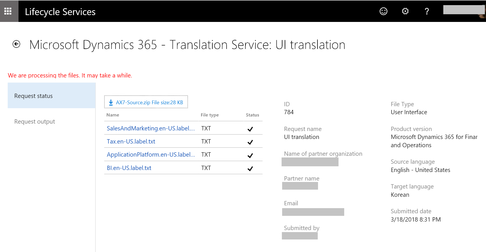
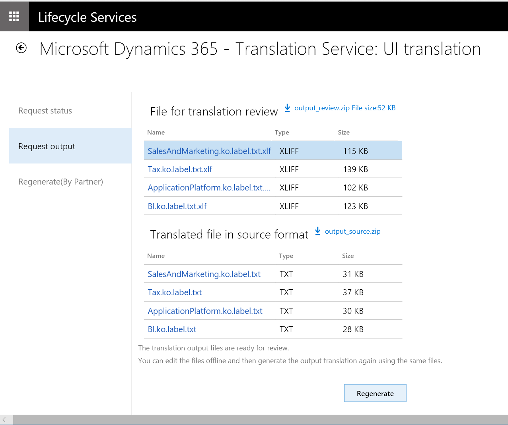
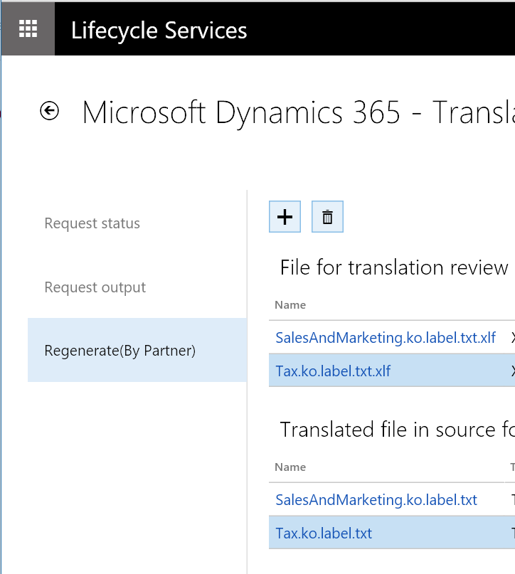

---
# required metadata

title: Translate user interface files
description: This topic explains how to use the UI translation service for Microsoft Dynamics 365 products.
author: kfend
manager: AnnBe
ms.date: 03/29/2018
ms.topic: article
ms.prod: 
ms.service: dynamics-ax-platform
ms.technology: 

# optional metadata

# ms.search.form: 
# ROBOTS: 
audience: Developer, IT Pro
# ms.devlang: 
ms.reviewer: kfend
ms.search.scope: Operations
# ms.tgt_pltfrm: 
ms.custom: 6154
ms.assetid: 
ms.search.region: Global
# ms.search.industry: 
ms.author: ejchoGIT
ms.search.validFrom: 2016-02-28
ms.dyn365.ops.version: AX 7.0.0

---

# Translate user interface files

[!include [banner](../includes/banner.md)]

This topic provides information about how to translate a user interface (UI) file for Microsoft Dynamics products or solutions.

For more information about the Microsoft Dynamics 365 Translation Service, see [Dynamics 365 - Translation Service overview](translation-service-overview.md). For information about how to translate a documentation file, see [Dynamics 365 - Translation Service user guide - Documentation file translation](use-translation-service-ua.md).

## Create a translation request
1. In Microsoft Dynamics Lifecycle Services (LCS), on the DTS dashboard, select **Add** to create a new translation request.

    

    You can open the DTS dashboard either from the LCS home page or from within a project. For more information, see [Accessing DTS](./translation-service-overview.md#accessing-dts).

2. Enter the required information for the request.

    | Field | Description |
    |-------|-------------|
    | Request name | Enter a name for the request. |
    | File type | Select **User Interface**. |
    | Product name | Select a product name. If you accessed DTS from within an LCS project, this field is automatically filled in and is read-only. |
    | Product version | Select a product version. If you accessed DTS from within a LCS project, this field shows the default product version information from the project. However, you can select a different version. |
    | Target country/region | Select the country or region where the translated file will be released. |
    | Translation source language, Translation target language | Select the pair of languages to translate from and to. The fields list all the languages that are supported for the selected product name and version. Language names that are shown in **bold** type are General Availability (GA) languages for Microsoft Dynamics products. Therefore, Microsoft-trained machine translation (MT) systems are available in those languages. In other words, the MT system is trained on the terminology for Microsoft Dynamics. For non-GA languages, the MT system uses the general domain training. |

    > [!NOTE]
    > To take advantage of the Microsoft-trained MT system for Microsoft Dynamics linguistic assets, you must select **English – United States** as either the source language or the target language. Here is an example.
    >
    > | Translation source language | Translation target language | MT system that is used |
    > |-----------------------------|-----------------------------|------------------------|
    > | English – United States | Japanese | Microsoft-trained MT system |
    > | Japanese | English – United States | Microsoft-trained MT system |
    > | German | Japanese | Generic MT system, unless the user provides a translation memory (TM) that uses XML Localization Interchange File Format (XLIFF) and has more than 10,000 translation units (TUs) |

3. Select **Create**.

## Upload files
Select the plus sign (**+**) in each section to open the **File upload** page.

### Upload the files to translate (Required)
Create one zip file that contains all the UI files that you want to translate. The zip file can include different file types, provided that the file types are supported for the product. For more information about supported file types, see [Supported products](translation-service-overview.md#supported-products). Note that DTS doesn't change the source files that you upload. The source files are just used to create files in the corresponding target language.

### Upload XLIFF translation memory files (Optional)
If you have XLIFF TM files from a previous UI translation request, or if you used the [Align tool](use-translation-service-tm.md) to create an XLIFF TM, you can zip the files before you upload them. Strings that match are then recycled to help guarantee consistency between product versions. For more information about XLIFF TMs, see [Microsoft Dynamics 365 Translation service - Translation memory](use-translation-service-tm.md).

In addition to using XLIFF TMs for recycling, DTS uses them to create a custom [MT system](translation-service-overview.md#custom-trained-mt-system) if either the source language or the target language is a Microsoft GA language, and if the other language is **English – United States**. However, if neither the source language nor the target language is a Microsoft GA language, and if the XLIFF TM contains fewer than 10,000 TUs, DTS uses a general domain MT system after recycling is completed. This behavior occurs because of requirements that are set by Microsoft Translator Hub (MT Hub).

After you've finished uploading files, select **Submit** to start the translation process. After you submit the request, a new request ID is created on the DTS dashboard. Select the request ID, and then, on the request details page, select the **Request status** tab to view a summary of the request and its status.

Note that the processing time depends on the number of requests that are in the DTS queue and the word count in the source files that you submit.

+ UI translation requests that don't have an XLIFF TM can be completed in a few minutes, depending on the file size.
+ If a UI translation request does have an XLIFF TM, the time that is required depends on the type of MT system:

    + Creation of a custom MT system requires two to three days.
    + If you're using a generic MT system, requests can be completed in a few minutes, depending on the file size.

## After translation is completed
When processing of your translation request is completed, you receive an email notification from DTS. You can then view the result on the **Request output** tab of the request details page.

For UI translation requests, two types of output file are available after the translation process is completed:

+ **File for translation review** – Download the XLIFF file to review and, as required, edit the translations. The file shows the source and target languages side by side.
+ **Translated file in source format** – Download this file if you don't intend to review or edit the translations. *Native format* means that the file is in the same format as the source file that you submitted.

### Review and edit the translations in the XLIFF file
We recommend that you review and edit the translations in the XLIFF file that DTS provides, to verify that the translation output meets your product's quality standards. For more information about how to edit the XLIFF file, see [Editing an XLIFF translation memory](use-translation-service-tm.md#editing-an-xliff-translation-memory).

### Regenerate output files
When you've finished reviewing and editing the translation files, you must regenerate the output files in the source file format. You can then apply the latest translations (that is, your edited versions of the translations) to the UI files in the target language.

1. On the **Request output** tab, select **Regenerate**. A new tab that is named **Regenerate(By Partner)** appears.
2. Select the plus sign (**+**) to open the **File upload** page.
3. Zip the edited XLIFF files, and then select **Upload**. Don't change the name that DTS provided for the XLIFF files on the **Request output** tab. The updated output files that DTS regenerates in the source format use the same file names that are provided on the **Request output** tab.
4. You're prompted to confirm the upload action. DTS then regenerates the new output files on the **Regenerate(By Partner)** tab.

You can repeat the regeneration process as many times as you require.
