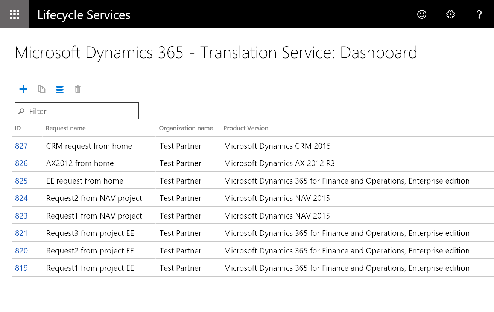
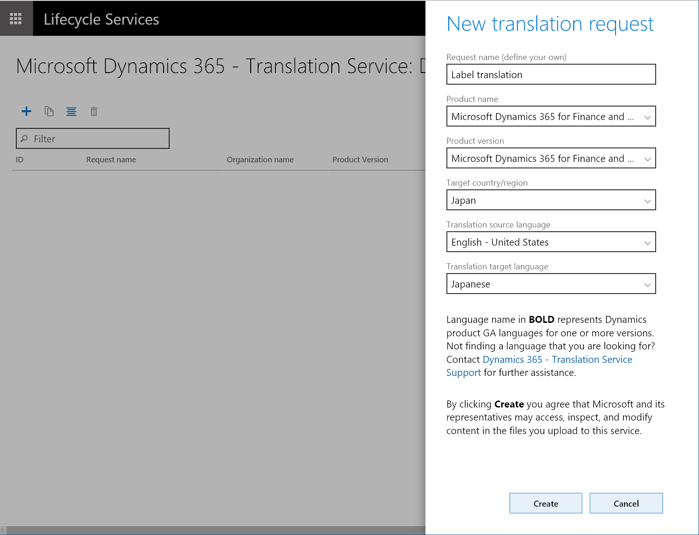
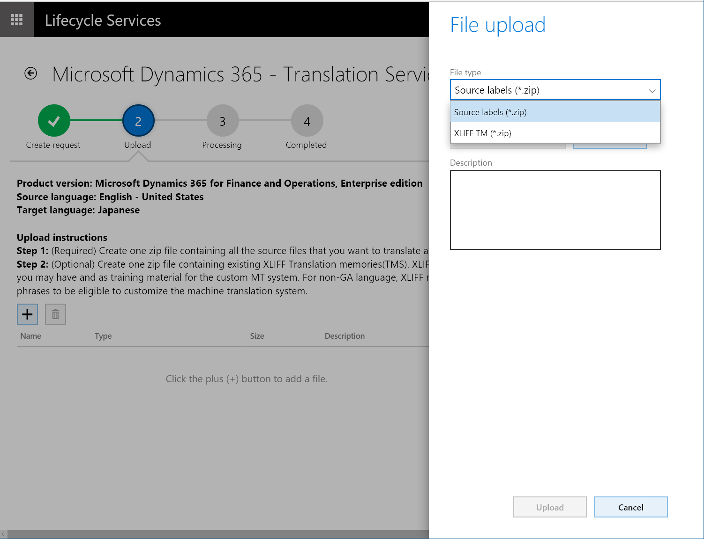
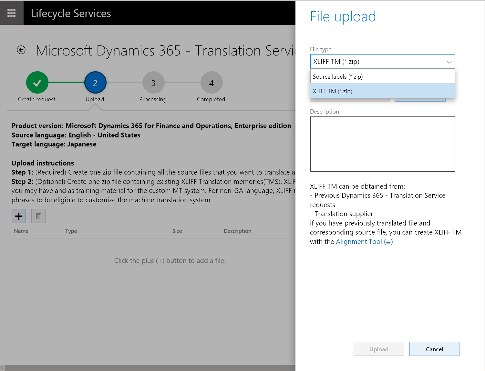
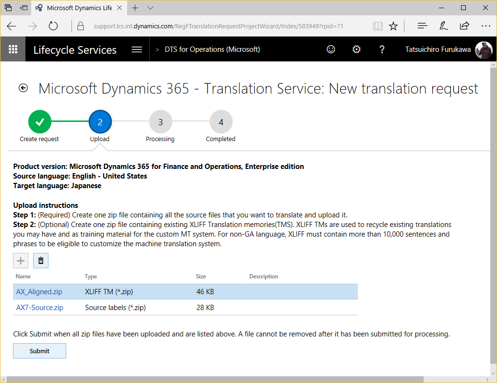
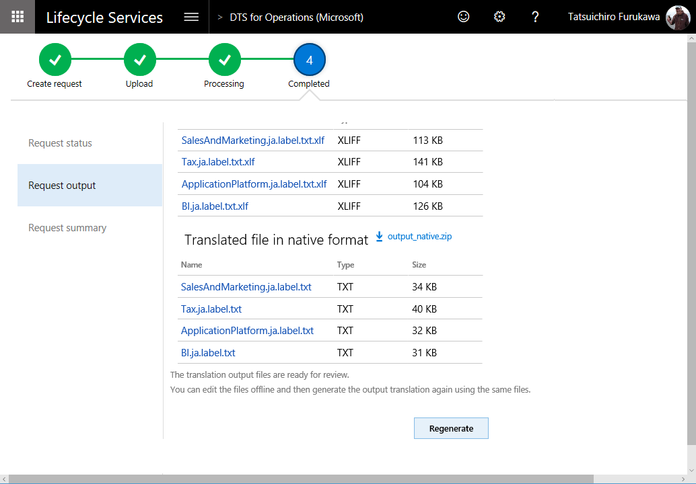
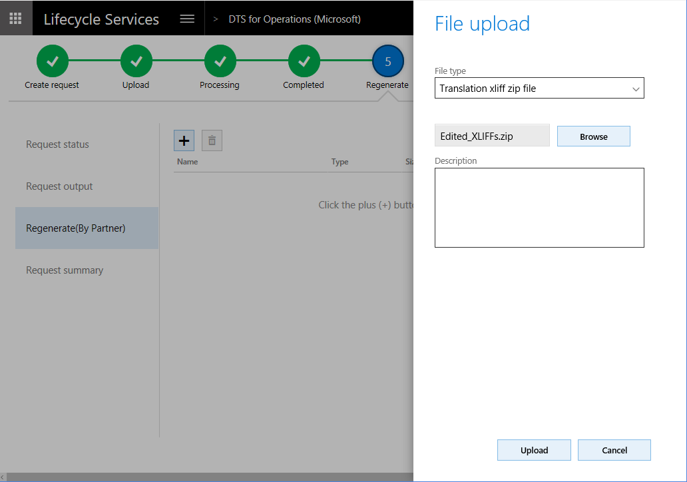

---
# required metadata

title: Microsoft Dynamics 365 Translation Service user guide
description: This topic provides information about how to use the translation service for Microsoft Dynamics 365 products.
author: kfend
manager: AnnBe
ms.date: 09/29/2017
ms.topic: article
ms.prod: 
ms.service: dynamics-ax-platform
ms.technology: 

# optional metadata

# ms.search.form: 
# ROBOTS: 
audience: Developer, IT Pro
# ms.devlang: 
ms.reviewer: kfend
ms.search.scope: Operations
# ms.tgt_pltfrm: 
ms.custom: 6154
ms.assetid: 
ms.search.region: Global
# ms.search.industry: 
ms.author: ejchoGIT
ms.search.validFrom: 2016-02-28
ms.dyn365.ops.version: AX 7.0.0

---

# Microsoft Dynamics 365 Translation Service user guide 

[!include[banner](../includes/banner.md)]

## Accessing the Dynamics 365 Translation Service
You can access the Microsoft Dynamics 365 Translation Service (DTS) from two places in Microsoft Dynamics Lifecycle Services (LCS):

- From the LCS home page
- From within an LCS project

### Accessing DTS from the LCS home page
Sign in to LCS, and scroll to the right side of the page. Expand the tiles waffle, and then select the **Translation service** tile to open the dashboard view for DTS.

### Accessing DTS from within an LCS project
Create a new project, or open an existing project. In the project, in the **More tools** section, select the **Translation service** tile.

### Accessing DTS from the LCS home page vs. accessing it from within an LCS project
When you access DTS from the LCS home page and create a translation request, you can select the product to use for the request. You can then add more requests that use different products by switching the product selection. You don't have to exit the service and open a different translation project. This option is convenient when you work on multiple product translation projects. However, because you access the service outside an LCS project, no other users can view your requests on the DTS dashboard. This option gives you your own DTS dashboard that shows all the translation requests that you've made across all LCS projects and from the LCS home page. The following illustration shows an example of the DTS dashboard that you open from the LCS home page.

Because an LCS project is always tied to a product, any translation request that you submit from a project automatically carries the product type and version information from the project. You can't select a different product for the request. In an LCS project, the project owner and the users will have permission to access the DTS dashboard and the translation requests that are submitted from within that project. This option is useful when you work with a group of people on one product translation project in LCS. The following illustration shows an example of the DTS dashboard that you open from within an LCS project.

## Alignment
If you have files that were previously translated, you can recycle the translated files for a newer version of the source files by creating a translation memory (TM) that uses XML Localization Interchange File Format (XLIFF). On the DTS dashboard, select the **Align** button to access the Align tool.

On the **Align** page, select the source language and target language, and select the files to align. Then select **Align** to complete the alignment. When the alignment is completed, a message box appears.

> [!NOTE]
> You might have to explicitly allow pop-up windows in your browser.

To create the best XLIFF TM, make sure that the following conditions are met:

- Both the source file and the target file have the same number of resources.
- The resources are in the same order in both the source file and the target file.
- There are no empty strings. The following illustration shows examples of empty strings from the source and the target.

    

    These empty strings are inherited by the XLIFF TM. If a **Rebate** string in the source has an empty string in the target, it will likely be translated as an empty string if this XLIFF TM is used.

    

Although the Align tool can resolve some of these issues, it's easier if you prevent them before you see unexpected results in the output.

Review the aligned XLIFF file before you use it as a TM. Translation units (TUs) that have been reviewed should be marked as **Final** or **Signed off**, so that they aren't mistaken for unreviewed TUs.

## Create a translation request
1. On the DTS dashboard, select the **Add** button to create a new translation request.

    

2. Enter the required information for the request. When you select the languages, you will notice that the names of some languages are **bold**. Microsoft releases those languages commercially for the supported products, and they are known as General Availability (GA) languages. Therefore, Microsoft-trained machine translation (MT) systems are available in those languages. In other words, the MT system is trained on Microsoft Dynamics terminology. For non-GA languages, the MT system falls back to the general domain training.

    > [!NOTE]
    > To take advantage of the Microsoft-trained MT system on Microsoft Dynamics linguistic assets, you must select **English – United States** as either the source language or the target language.

    Here is an example.

    | Source language         | Target language         | MT system that will be used |
    |-------------------------|-------------------------|-----------------------------|
    | English – United States | Japanese	              | Microsoft-trained MT system |
    | Japanese                | English – United States	| Microsoft-trained MT system |
    | German                  | Japanese                | Generic MT system, unless the user provides an XLIFF TM that has more than 10,000 TUs |

    
 
3. Select **Create**.

## Upload the files
Select the plus sign (**+**) button to open the **File upload** dialog box. You can upload one zip file for each of two files types: the source labels file and the XLIFF TM file. 

### Source labels zip file
The source labels zip file contains all the source files that should be translated in the translation request. The source labels file can include files that have different file types, provided that the file types are supported for the product. For more information about supported file types, see [Supported products](./translation-service-overview.md#supported-products).

### XLIFF TM zip file (Optional)
If you have XLIFF files from a previous translation request, or if you used the Align tool to create an XLIFF TM, you can zip the XLIFF files and then upload them. Strings that match are recycled into the new source files to help you remain consistent between product versions. For details about XLIFF files, see the [XLIFF TM](./use-translation-service.md#xliff-tm) section of this topic.

In addition to using the XLIFF TM for the recycling process, DTS uses the XLIFF TM to create a customized MT system, based on the following rules:

+ Either the source language or the target language is a Microsoft GA language, and the other language is **English – United States**.
+ Neither the source language or the target language is a Microsoft GA language, and the XLIFF TM contains more than 10,000 TUs.

If neither the source language or the target language is a Microsoft GA language, and the XLIFF TM contains fewer than 10,000 TUs, DTS uses a general domain MT system after the recycling. This behavior occurs because of the requirements that are set by MT Hub.

After you've uploaded the required files, select **Submit** to start the translation process.

Note that the processing time depends on the number of requests that are in the DTS queue and the volume of the word count in the files that you submit.

+ Requests that don't have an XLIFF TM can be completed in a few minutes, depending on the file size.
+ For requests that have an XLIFF TM, the time that is required depends on the type of MT system:

    + Creation of a custom MT system requires two to three days.
    + If you're using a generic MT system, requests can be completed in a few minutes, depending on the file size.

## After translation is completed
When the translation process is completed, you receive an email notification. The result is available on the **Request output** tab.

After the translation process is completed, two types of output file are available:

+ **File for translation review** – Download the XLIFF file to review and, as required, edit the translations in this file. The file shows the side-by-side source and target languages.
+ **Translated file in native format** – Download this file if you don't intend to review or edit the translations. (Native format means that the files is in the same format as the source file.)

We recommend that you post-edit the translations in the XLIFF file that is provided, by using the free Multilingual Editor that is provided or any XLIFF editor. At a minimum, you should review the translations to verify that the translation output meets your product's quality standards.

## Editing the translation in the XLIFF file
When you open the XLIFF file in the Multilingual Editor, it resembles the following illustration.

Notice that there is a circle near the beginning of each line. The color of the circle indicates the state of the translation. Depending on where the translation came from, DTS automatically assigns these states.

+	**Red circle** – The text is machine translated. DTS assigns the **Needs Review** state.

    > [!NOTE]
    > The state value that is shown might differ slightly, depending on the XLIFF editor that you're using.

+	**Yellow, green/yellow, or green circle** – The text is recycled. DTS inherited the state from the XLIFF TM that was used in the request.

To verify the translation, you can apply a filter to show only strings that are in the **Needs Review** state.

Strings that have been reviewed should be marked as **Translated**, **Final**, or **Signed off**, so that they can be used for recycling. Translations that are marked as **Needs Review** won't be included for recycling.

## Regenerate output files
When you've finished reviewing and editing the translation files, you must regenerate the output files, based on the changes that you made in the XLIFF files.

Select **Regenerate** to open the **File upload** dialog box, where you can upload the edited XLIFF files. Be sure to zip the edited XLIFF files before you upload them.

After you select **Upload**, you're prompted to confirm that action. DTS regenerates the new output immediately after confirmation.

You can repeat the regeneration process as many times as you require.

## XLIFF TM
DTS uses a bilingual XLIFF format to store source language and target language pairs. The XLIFF format is based on XML. Therefore, you can open XLIFF files in any text editor. However, we recommend that you use XLIFF editors that are specifically designed to work with this format. You can use the free Microsoft Multilingual Editor that is available in the [Multilingual App Toolkit (MAT)](https://developer.microsoft.com/en-us/windows/develop/multilingual-app-toolkit).

In DTS, you can obtain an XLIFF TM in two ways:

+ **Run the Align tool** – When you have files that were previously translated, and corresponding source files, you can use the Align tool to create an XLIFF TM. For more details, see the [Alignment](./use-translation-service.md#alignment) section of this topic.
+ **Complete a translation request** – When a translation request is completed, DTS provides XLIFF TMs. It also provides the translated files in the source format.

XLIFF files contain a series of TUs that are extracted from the source files. The following illustration shows an example of a TU.

The following illustration shows the same TU (highlighted in blue) in the Multilingual Editor.

## State
Each translation in the XLIFF file is associated with a state value. The value that DTS assigns to each translation depends on the way that the string is translated. When an XLIFF TM is created by using the Align tool, all translations are marked as **Translated**, because the aligned TUs are produced from known good translations, such as a previous product version.

However, when the XLIFF files are generated as a result of a translation request, two types of states can be used:

+ **Needs Review** – The string has been machine translated.
+ **Translated**, **Final**, or **Signed off** – The string has been recycled. The states were inherited from the XLIFF TM.

In this way, you can immediately identify the **Needs Review** strings during the post-editing process. After strings have been reviewed, they should be marked as **Translated**, **Final**, or **Signed off**, so that they can be used for recycling. Translations that are marked as **Needs Review** won't be included for recycling.

Inherited state values for recycled strings are also helpful, because you will never have to review the same string (that is, a string that has the same ID) again.

## Glossary
| Term                   | Description |
|------------------------|-------------|
| XLIFF                  | XML Localization Interchange File Format. XLIFF is an XML-based format that was created to standardize the way that localizable data is passed between tools during a localization process, and to serve as a common format for computer-aided translation (CAT) tool files. |
| Microsoft GA languages | A general availability of the Microsoft produced languages. This list varies depending on the product. |
| TU                     | A translation unit which typically contains a source string, translation, state, state qualifier, and note. |
