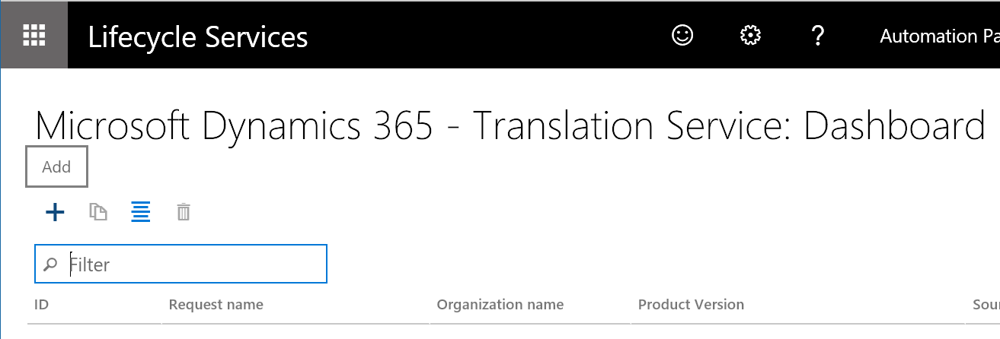
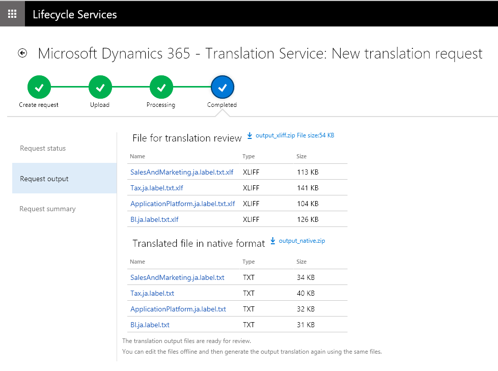

---
# required metadata

title: Microsoft Dynamics 365 Translation Service user guide
description: This topic provides information about how to use the translation service for Microsoft Dynamics 365 products.
author: kfend
manager: AnnBe
ms.date: 09/29/2017
ms.topic: article
ms.prod: 
ms.service: dynamics-ax-platform
ms.technology: 

# optional metadata

# ms.search.form: 
# ROBOTS: 
audience: Developer, IT Pro
# ms.devlang: 
ms.reviewer: kfend
ms.search.scope: Operations
# ms.tgt_pltfrm: 
ms.custom: 6154
ms.assetid: 
ms.search.region: Global
# ms.search.industry: 
ms.author: ejchoGIT
ms.search.validFrom: 2016-02-28
ms.dyn365.ops.version: AX 7.0.0

---

# Microsoft Dynamics 365 Translation Service user guide 

[!include[banner](../includes/banner.md)]

This topic describes the steps you can follow to translate a user interface file for the Dynamics products or solutions. 
+ Create a new translation request
+ Review and edit the translation
+ Upload the edited translation to regenerate the target language file  

See [Dynamics 365 - Translation Service Overview topic](./translation-service-overview.md#microsoft-dynamics-365---translation-service-overview) to learn how the service works and how to access it. 
See  for the steps to translate a documentation file. 

## Create a translation request
1. On the DTS dashboard, select the **Add** button to create a new translation request.  

    

2. Enter the required information for the request. See below for details of each field.  

    | Field name        | Description |
    |-------------------|-------------|
    | Request name      | Type your own description |
    | File type      | **User Interface** - select this if you are translating software file(s) for a product or solution. **Documentation** - select this if you are translating Microsoft Word .docx file(s). Documentation request type will be available only if you have turn on the **Dynamics 365 Translation Service - Documentation Translation Support** from LCS Preview features. |
    | Product name      | Select a product name. If you accessed DTS from within a LCS project, this field is automatically filled in as read-only. |
    | Product version   | Select a product version. If you accessed DTS from within a LCS project, this field will show the product version information from the project as a default and you can select a different version if needed.|
    | Target country/region | select a country where the translated file will be released to.|
    | Translation source/target languages | Select the language pair from/to which translation will be done. All languages that are supported for the selected product name and version will be available in these fields. Language name in BOLD in the list represents Dynamics product General Availability (GA) language. Microsoft-trained machine translation (MT) systems are available in those languages. In other words, the MT system is trained on Microsoft Dynamics terminology. For non-GA languages, the MT system falls back to the general domain training.|

3. Click **Create** to go to the next step.
        
    > [!NOTE]
    > To take advantage of the Microsoft-trained MT system on Microsoft Dynamics linguistic assets, you must select **English – United States** as either the source language or the target language.

    Here is an example.

    | Source language         | Target language         | MT system that will be used |
    |-------------------------|-------------------------|-----------------------------|
    | English – United States | Japanese	              | Microsoft-trained MT system |
    | Japanese                | English – United States	| Microsoft-trained MT system |
    | German                  | Japanese                | Generic MT system, unless the user provides an XLIFF TM that has more than 10,000 TUs |

## Upload the files
Select the plus sign (**+**) button in each section to open the **File upload** form. You can upload one zip file per section. 

### Upload files to translate (Required)
For User Interface request type, create one zip file that contains all the source software files that you would like to translate in the request. The zip file can include different file types, provided the file types are supported for the product. For more information about supported file types, see [Supported products](./translation-service-overview.md#supported-products).

For Documentation request type, create one zip file that contains all the Word document files (.docx) that you want to translate. 

### Upload XLIFF translation memory files (Optional)
If you have XLIFF translation memory (TM) files from a previous User Interface translation request, or if you used the Align tool to create an XLIFF TM, you can zip the XLIFF files and upload them. Strings that match are recycled into the new source files to help you remain consistent between product versions. For details about XLIFF files, see the [XLIFF TM](./use-translation-service.md#xliff-translation-memory-tm) section of this topic.

In addition to using the XLIFF TM for the recycling process, DTS uses the XLIFF TM to create a customized MT system, based on the following rules:

+ Either the source language or the target language is a Microsoft GA language, and the other language is **English – United States**.
+ Neither the source language or the target language is a Microsoft GA language, and the XLIFF TM contains more than 10,000 TUs.

If neither the source language or the target language is a Microsoft GA language, and the XLIFF TM contains fewer than 10,000 TUs, DTS uses a general domain MT system after the recycling. This behavior occurs because of the requirements that are set by MT Hub.

### Upload XLIFF or TMX translation memory files (Optional)
For Documentation request type, you can provide XLIFF you got from user interface file type translations and/or TMX translation memory files from previous documentation translations to recycle the translations in the new request. Zip the files before you can upload it.

After you've uploaded the required files, select **Submit** to start the translation process. Once submitted and a new request is created in the DTS dashboard, you can click the request ID to see the summary of your request and the status in **Request status** tab. 

Note that the processing time depends on the number of requests that are in the DTS queue and the volume of the word count in the source files that you submit.

+ User Interface type requests that don't have an XLIFF TM may be completed in a few minutes, depending on the file size.
+ User Interface type requests that have an XLIFF TM, the time that is required depends on the type of MT system:

    + Creation of a custom MT system requires two to three days.
    + If you're using a generic MT system, requests can be completed in a few minutes, depending on the file size.

+ Documentation type requests processing time varies and may be completed in a few days.

## After translation is completed
When the translation process is completed, you will receive an email notification from DTS. The result is available on the **Request output** tab of your request details page.

For User Interface request type, after the translation process is completed, two types of output file are available:

+ **File for translation review** – Download the XLIFF file to review and, as required, edit the translations in this file. The file shows the side-by-side source and target languages.
+ **Translated file in source format** – Download this file if you don't intend to review or edit the translations. Native format means that the file is in the same format as the source file you submitted.

For Documentation request type, after the translation process is completed, three types of output files are available:

+ **File for translation review** - Doenload this file to review and edit the translated document strings in a table view. The file provides the side-by-side source and target languages segments.
+ **Translated file in source format** - Download this file if you don't intend to review or edit the translations. Native format means that the file is in the same format as the source file you submitted. 
+ **Translation memory** - Download this file if you want to recycle these translations in a newer version of source document. 

### Review and edit the UI translation in XLIFF file
We recommend that you review and edit the translations in the provided XLIFF file by using the free Multilingual Editor that is provided or any other XLIFF editor. At a minimum, you should review the translations to verify that the translation output meets your product's quality standards.

When you open the XLIFF file in the Multilingual Editor, it resembles the following illustration.

Notice that there is a circle near the beginning of each line. The color of the circle indicates the state of the translation. Depending on where the translation came from, DTS automatically assigns these states.

+	**Red circle** – The text is machine translated. DTS assigns the **Needs Review** state.

    > [!NOTE]
    > The state value that is shown might differ slightly, depending on the XLIFF editor that you're using.

+	**Yellow, green/yellow, or green circle** – The text is recycled. DTS inherited the state from the XLIFF TM that was used in the request.

To verify the translation, you can apply a filter to show only strings that are in the **Needs Review** state.

Strings that have been reviewed should be marked as **Translated**, **Final**, or **Signed off**, so that they can be used for recycling. Translations that are marked as **Needs Review** won't be included for recycling.

### Review and edit the Documentation translation
DTS provides the Documentation translation review file in .docx format. You can open it in Microsoft Word to review and edit in a convenient table view as shown in the example below. Once the review is done to this file, you will have to upload it back to DTS to generate the refreshed .docx file output in the original source style. See the next [Regenerate output files](./use-translation-service.md#regenerate-output-files) section for this step.    

 
 
When editing the review .docx file, please make note of the following:

+ Only edit the text in the **Target segment** column.
+ Do not add/remove any row.
+ Do not change the order of the rows or columns.
+ Do not add/remove the red tags. Most red tags represent formatting and styles in .docx. 
+ If it is necessary to move the red tags, be careful not to switch a start tag (i.e. <116>) and its end tag (i.e. </116>).

### Regenerate output files
When you've finished reviewing and editing the translation files, you must regenerate the output files in the source file format so you can include the latest translations you edited into your software or documentation files.

In the Request output tab, click **Regenerate** button. It will add a new tab **Regenerate(By Partner)**. Using the plus (**+**) button, open the **File upload** form and upload the edited files. Be sure to zip the files before you upload them.

+ For User interface file type request, zip the edited XLIFF file(s) and upload it. Do not change the XLIFF file name from what DTS provided in **Request output** tab. DTS will also regenerate the refreshed output file in the source format in the same file name as provided in **Request output** tab. 
+ For Documentation file type request, zip the edited .docx file(s) and upload it. Do not change the .docx review file name from what DTS provided in **Request output** tab. 

After you select **Upload** button, you're prompted to confirm that action. 
+ For User interface file type request, DTS regenerates the new output files shortly after confirmation in the **Regenerate(By Partner)** tab. 
+ For Documentation file type request, it may take a while for DTS to process to regenerate the refreshed docx in the source format and send you an automated email notification. Then you can come back to the request to download the final output files. Check **Regenerate(By Partner)** tab to see the files you uploaded and download the new output files. 

You can repeat the regeneration process as many times as you require.

## XLIFF Translation Memory (TM)
DTS uses a bilingual XLIFF format to store source language and target language pairs. The XLIFF format is based on XML. Therefore, you can open XLIFF files in any text editor. However, we recommend that you use XLIFF editors that are specifically designed to work with this format. You can use the free Microsoft Multilingual Editor that is available in the [Multilingual App Toolkit (MAT)](https://developer.microsoft.com/en-us/windows/develop/multilingual-app-toolkit).

In DTS, you can obtain an XLIFF TM in two ways:

+ **Run the Align tool** – When you have files that were previously translated, and corresponding source files, you can use the Align tool to create an XLIFF TM. For more details, see the [Alignment](./use-translation-service.md#preparing-a-translation-memory---alignment) section of this topic.
+ **Complete a translation request** – When a translation request is completed, DTS provides XLIFF TMs. It also provides the translated files in the source format.

XLIFF files contain a series of TUs that are extracted from the source files. The following illustration shows an example of a TU.

The following illustration shows the same TU (highlighted in blue) in the Multilingual Editor.

### State
Each translation in the XLIFF file is associated with a state value. The value that DTS assigns to each translation depends on the way that the string is translated. When an XLIFF TM is created by using the Align tool, all translations are marked as **Translated**, because the aligned TUs are produced from known good translations, such as a previous product version.

However, when the XLIFF files are generated as a result of a translation request, two types of states can be used:

+ **Needs Review** – The string has been machine translated.
+ **Translated**, **Final**, or **Signed off** – The string has been recycled. The states were inherited from the XLIFF TM.

In this way, you can immediately identify the **Needs Review** strings during the post-editing process. After strings have been reviewed, they should be marked as **Translated**, **Final**, or **Signed off**, so that they can be used for recycling. Translations that are marked as **Needs Review** won't be included for recycling.

Inherited state values for recycled strings are also helpful, because you will never have to review the same string (that is, a string that has the same ID) again.

## Glossary
| Term                   | Description |
|------------------------|-------------|
| XLIFF                  | XML Localization Interchange File Format. XLIFF is an XML-based format that was created to standardize the way that localizable data is passed between tools during a localization process, and to serve as a common format for computer-aided translation (CAT) tool files. |
| Microsoft GA languages | A general availability of the Microsoft produced languages. This list varies depending on the product. |
| TU                     | A translation unit which typically contains a source string, translation, state, state qualifier, and note. |
