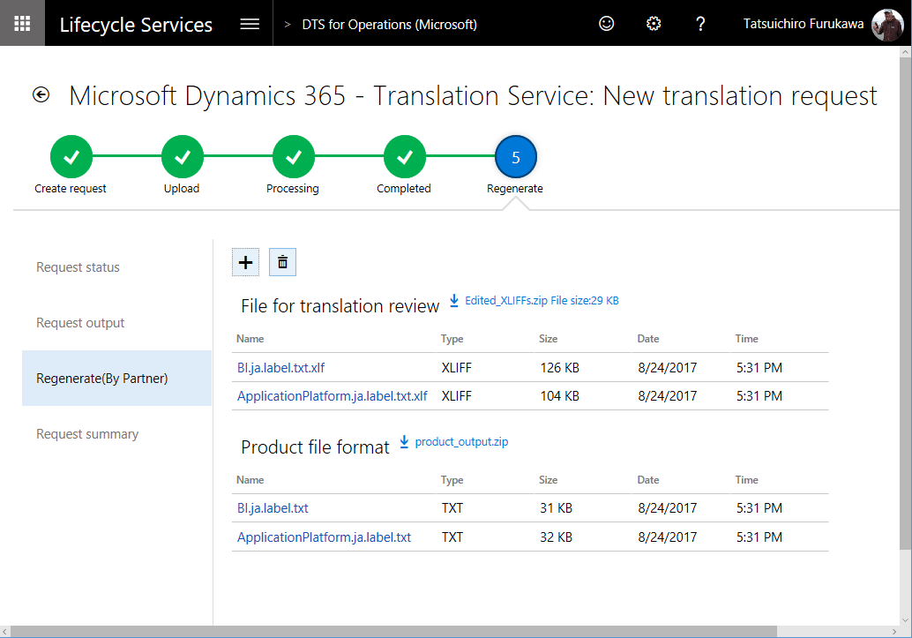

----
# required metadata

title: Microsoft Dynamics 365 Translation Service user guide
description: This topic provides information about how to use the translation service for Microsoft Dynamics 365 products.
author: kfend
manager: AnnBe
ms.date: 09/29/2017
ms.topic: article
ms.prod: 
ms.service: dynamics-ax-platform
ms.technology: 

# optional metadata

# ms.search.form: 
# ROBOTS: 
audience: Developer, IT Pro
# ms.devlang: 
ms.reviewer: kfend
ms.search.scope: Operations
# ms.tgt_pltfrm: 
ms.custom: 6154
ms.assetid: 
ms.search.region: Global
# ms.search.industry: 
ms.author: ejchoGIT
ms.search.validFrom: 2016-02-28
ms.dyn365.ops.version: AX 7.0.0

---

# Microsoft Dynamics 365 Translation Service user guide - User interface file translation

[!include[banner](../includes/banner.md)]

This topic describes the steps you can follow to translate a user interface file for the Dynamics products or solutions. 
+ Create a new translation request
+ Review and edit the translation
+ Upload the edited translation to regenerate the target language file  

See [Dynamics 365 - Translation Service Overview topic](./translation-service-overview.md#microsoft-dynamics-365---translation-service-overview) to learn how the service works and how to access it.  
See [Dynamics 365 - Translation Service user guide - Documentation file translation](./use-translation-service-ua.md) for the steps to translate a documentation file. 

## Create a translation request
1. On the DTS dashboard, select the **Add** button to create a new translation request.  

    

2. Enter the required information for the request. See below for details of each field.  

    | Field name        | Description |
    |-------------------|-------------|
    | Request name      | Type your own description |
    | File type      | Select **User Interface**. |
    | Product name      | Select a product name. If you accessed DTS from within a LCS project, this field is automatically filled in as read-only. |
    | Product version   | Select a product version. If you accessed DTS from within a LCS project, this field will show the product version information from the project as a default and you can select a different version if needed.|
    | Target country/region | select a country where the translated file will be released to.|
    | Translation source/target languages | Select the language pair from/to which translation will be done. All languages that are supported for the selected product name and version will be available in these fields. Language name in BOLD in the list represents Dynamics product General Availability (GA) language. Microsoft-trained machine translation (MT) systems are available in those languages. In other words, the MT system is trained on Microsoft Dynamics terminology. For non-GA languages, the MT system falls back to the general domain training.|

3. Click **Create** to go to the next step.
        
    > [!NOTE]
    > To take advantage of the Microsoft-trained MT system on Microsoft Dynamics linguistic assets, you must select **English – United States** as either the source language or the target language.

    Here is an example.

    | Source language         | Target language         | MT system that will be used |
    |-------------------------|-------------------------|-----------------------------|
    | English – United States | Japanese	              | Microsoft-trained MT system |
    | Japanese                | English – United States	| Microsoft-trained MT system |
    | German                  | Japanese                | Generic MT system, unless the user provides an XLIFF TM that has more than 10,000 TUs |

## Upload the files
Select the plus sign (**+**) button in each section to open the **File upload** form.  

### Upload files to translate (Required)
Create one zip file that contains all the user interface files in source language that you would like to translate in the request. The zip file can include different file types, provided the file types are supported for the product. For more information about supported file types, see [Supported products](./translation-service-overview.md#supported-products). Note the source files you are uploading are not altered by DTS but used to create the corresponding target language files from them. 

### Upload XLIFF translation memory files (Optional)
If you have XLIFF translation memory (TM) files from a previous User Interface translation request, or if you used the [Align](./use-translation-service-tm.md#creating-a-translation-memory---alignment) tool to create an XLIFF TM, you can zip them upload. Strings that match are recycled to help you remain consistent between product versions. For more details about XLIFF TM, see the [Dynamics 365 - Translation service user guide - Translation memory](./use-translation-service-tm.md) topic.

In addition to using the XLIFF TM for the recycling process, DTS uses the XLIFF TM to create a customized [MT system](./translation-service-overview.md#custom-trained-mt-system), based on the following rules:

+ Either the source language or the target language is a Microsoft GA language, and the other language is **English – United States**.
+ Neither the source language or the target language is a Microsoft GA language, and the XLIFF TM contains more than 10,000 TUs.

If neither the source language or the target language is a Microsoft GA language, and the XLIFF TM contains fewer than 10,000 TUs, DTS uses a general domain MT system after the recycling. This behavior occurs because of the requirements that are set by MT Hub.

After you've uploaded the required files, select **Submit** to start the translation process. Once submitted and a new request is created in the DTS dashboard, you can click the request ID to see the summary of your request and the status in **Request status** tab. 

Note that the processing time depends on the number of requests that are in the DTS queue and the volume of the word count in the source files that you submit.

+ User Interface type requests that don't have an XLIFF TM may be completed in a few minutes, depending on the file size.
+ User Interface type requests that have an XLIFF TM, the time that is required depends on the type of MT system:

    + Creation of a custom MT system requires two to three days.
    + If you're using a generic MT system, requests can be completed in a few minutes, depending on the file size.

## After translation is completed
When the translation process is completed, you will receive an email notification from DTS. The result is available on the **Request output** tab of your request details page.

For User Interface request type, after the translation process is completed, two types of output file are available:

+ **File for translation review** – Download the XLIFF file to review and, as required, edit the translations in this file. The file shows the side-by-side source and target languages.
+ **Translated file in source format** – Download this file if you don't intend to review or edit the translations. Native format means that the file is in the same format as the source file you submitted.

### Review and edit the UI translation in XLIFF file
We recommend that you review and edit the translations in the XLIFF file that DTS provided to verify that the translation output meets your product's quality standards. See [Editing an XLIFF translation memory](./use-translation-service-tm.md#editing-an-xliff-translation-memeory) for the details on the steps. 

### Regenerate output files
When you've finished reviewing and editing the translation files, you must regenerate the output files in the source file format so you can apply the latest translations you edited into your target language user interface files.

In the **Request output** tab, click **Regenerate** button. It will add a new tab **Regenerate(By Partner)**. Using the plus (**+**) button, open the **File upload** form. Be sure to zip the edited XLIFF file(s) and upload it. Do not change the XLIFF file name from what DTS provided in **Request output** tab. DTS will also regenerate the refreshed output file in the source format in the same file name as provided in **Request output** tab. 

After you select **Upload** button, you're prompted to confirm that action. DTS regenerates the new output files shortly after confirmation in the **Regenerate(By Partner)** tab. 

You can repeat the regeneration process as many times as you require.

