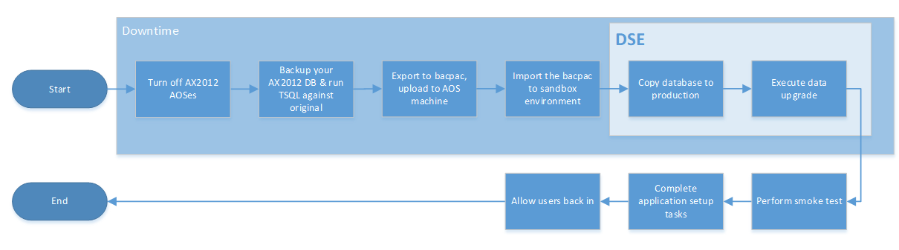

---
# required metadata

title: Upgrade from AX 2012 - Go live
description: This topic explains the final cutover process that starts after you turn off AX 2012 and completes with Dynamics 365 for Finance and Operations running an upgraded version of your code and database.
author: robadawy
manager: AnnBe
ms.date: 03/22/2018
ms.topic: article
ms.prod: 
ms.service: dynamics-ax-platform
ms.technology: 

# optional metadata
# ms.search.form: 
audience: Developer, IT Pro
# ms.devlang: 
ms.reviewer: margoc
ms.search.scope:  Operations
# ms.tgt_pltfrm: 
# ms.custom: 
ms.search.region: Global
# ms.search.industry: 
ms.author: robadawy
ms.search.validFrom: 2018-03-31
ms.dyn365.ops.version: Platform update 12
---

# Upgrade from AX 2012 - Cutover process (Go live)

[!include[banner](../includes/banner.md)]

[!include[upgrade banner](../includes/upgrade-banner.md)]

After you have successfully completed upgrade testing in a Standard or Premier Acceptance Test environment (Sandbox Tier 2 or higher), and you have also completed a successful test cutover, the moment has arrived to upgrade your production environment and go live.

*Cutover* is the term that we use for the final process of getting a new system live. This cutover process consists of the tasks that occur after Microsoft Dynamics AX 2012 is turned off but before Microsoft Dynamics 365 for Finance and Operations, is turned on. Before you plan your final cutover, you need to successfully complete one successful mock cutover as described in [Cutover testing](./upgrade-cutover-testing.md)

The following illustration shows the overall process for cutover to go-live as it will occur in the production environment.

> [!NOTE]
> In this article, we use the term *sandbox* to refer to a Standard or Premier Acceptance Testing (Tier 2 or 3) or higher environment connected to a SQL Azure database.

## Overall process

These are the high-level steps of the production environment upgrade process.

1.	Submit an **Other type** service request through Lifecycle Services (LCS) to notify the Microsoft Service Engineering (DSE) team of your intention to upgrade a production environment. Work with your Microsoft solution architect and ensure you do this with plenty of notice (2 to 3 weeks in advance). Indicate in the service request that this is a final cutover.
    - Make sure you have already completed a successful mock cutover.
    - Cutover requests are subject to availability of the DSE team, please plan ahead.
2.  Turn off all AX 2012 AOS instances.
3.	Back up the AX 2012 database and run the T-SQL scripts against the original database.
4.	Export the copied database to a bacpac file by using the SQLPackage.exe (a free SQL Server tool available for download). This tool provides a special type of database backup that can be imported into SQL Database. 
5.	Upload the bacpac file.
6.	Download the bacpac file to the Application Object Server (AOS) virtual machine in the sandbox environment, and then import it by using SQLPackage.exe. 
7.	Notify the Microsoft DSE team that your database is ready for upgrade – they will copy the imported database from sandbox to the production environment.
8.	The Microsoft DSE team will run the data upgrade against the imported database.
9.	The Microsoft DSE team will notify you once the data upgrade is complete – at this point you can log in and complete any functional configuration tasks required post-upgrade before you allow the end users back into the new system.

The steps above resemble the steps you have performed during the mock cutover, refer to [Cutover testing](./upgrade-cutover-testing.md) for detailed instructions.

## Prerequisites 
Before you can perform an upgrade in the production environment the following prerequisites must be met:
-	Complete the code upgrade and data upgrade in a sandbox environment and successfully completed a functional test pass
-	Deploy the production environment. Before the option to request the deployment of the production environment lights up you must have completed:
    - The Subscription estimator in LCS. We use this to help us size your production environment because it provides details of the throughput you’ll require.
    - The Test phase of the methodology in LCS. This is to help ensure that you’re at the stage in your project where you’re ready to start testing in the production environment.
    - After a request is submitted to Microsoft to deploy the production environment, it will take roughly 24 hours to deploy, so ensure that you leave enough time for this to happen.
-	Apply all necessary updates and customizations (AOT deployable packages) to the production environment.
-	Work with your Microsoft Solution Architect to schedule your upgrade. To schedule an upgrade, request a timeslot with the DSE team by submitting “Other” type service requests from LCS. This is to ensure that the preferred timeslots will be available for you. Be aware that there is significantly higher demand for slots during the weekend, so requesting these as far in advance as possible will help attain your preferred schedule.

## Related articles
- [Onboarding](../../fin-and-ops/imp-lifecycle/onboard.md)
- [Submit a service request](../lifecycle-services/submit-request-dynamics-service-engineering-team.md).
- [Upgrade from AX 2012 - Cutover testing](./upgrade-cutover-testing.md)
