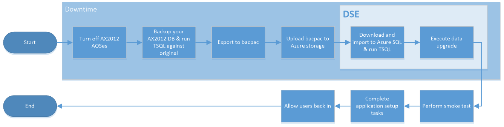

---

# required metadata

title: Upgrade from AX 2012 - Go live
description: This topic explains the final cutover process that starts after you turn off AX 2012 and completes with Dynamics 365 for Finance and Operations running an upgraded version of your code and database.
author: tariqbell
manager: AnnBe
ms.date: 03/30/2018
ms.topic: article
ms.prod: 
ms.service: dynamics-ax-platform
ms.technology: 

# optional metadata
# ms.search.form: 
audience: Developer, IT Pro
# ms.devlang: 
ms.reviewer: margoc
ms.search.scope:  Operations
# ms.tgt_pltfrm: 
# ms.custom: 
ms.search.region: Global
# ms.search.industry: 
ms.author: robadawy
ms.search.validFrom: 2018-03-31
ms.dyn365.ops.version: Platform update 12
---

# Upgrade from AX 2012 - Cutover process (Go live)

[!include[banner](../includes/banner.md)]

[!include[upgrade banner](../includes/upgrade-banner.md)]

*Cutover* is the term that we use for the final process of getting a new system live. This cutover process consists of the tasks that occur after Microsoft Dynamics AX 2012 is turned off but before Microsoft Dynamics 365 for Finance and Operations, Enterprise edition, is turned on. Before you plan your final cutover, you need to successfully complete one successful mock cutover as described in [Cutover testing](./upgrade-cutover-testing.md)

The following illustration shows the overall process for cutover to go-live as it will occur in the production environment.

> [!NOTE]
> In this article, we use the term *sandbox* to refer to a Standard or Premier Acceptance Testing (Tier 2/3) or higher environment connected to a SQL Azure database.

## Overall process

These are the high-level steps of the production environment upgrade process.

1.	Submit an **Other type** service request through LCS to notify DSE of your intention to upgrade a production environment. Work with your Microsoft solution architect and ensure you do this with plenty of notice (2 to 3 weeks in advance). Indicate in the service request that this is a final cutover.
    - Make sure you have already completed a successful mock cutover.
    - Mock cutovers requests are subject to availability of the DSE team, please plan ahead.
2.  Turn of AX 2012 AOS instances.
3.	Create a copy of the AX 2012 database. We strongly recommend that you use a copy, because you must delete some objects in the copy that will be exported.
4.	Export the copied database to a bacpac file by using a free SQL Server tool that is named SQLPackage.exe. This tool provides a special type of database backup that can be imported into SQL Database.
5.	Upload the bacpac file to the AOS machine.
6.	Download the bacpac file to the Application Object Server (AOS) machine in the sandbox environment, and then import it by using SQLPackage.exe. 
7.	Notify the Microsoft DSE team that your database is ready for upgrade – they will copy the imported database from sandbox to the production environment.
8.	Microsoft DSE team will run the data upgrade against the imported database.
9.	Microsoft DSE team will notify you once the data upgrade is complete – at this point you can log in and complete any functional configuration tasks required post-upgrade before you allow the end users back into the new system.

The next sections contain more details.
