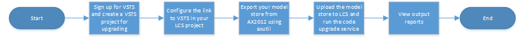

---
# required metadata

title: Upgrade from AX 2012 - Use the Code upgrade service to estimate effort
description: This topic explains how to use the Code upgrade service in LCS to help estimate the tasks and effort that are required in order to upgrade a code base from Microsoft Dynamics AX 2012 to Dynamics 365 for Finance and Operations.
author: tariqbell
manager: AnnBe
ms.date: 01/31/2018
ms.topic: article
ms.prod: 
ms.service: dynamics-ax-platform
ms.technology: 

# optional metadata

# ms.search.form: 
# ROBOTS: 
audience: Developer
# ms.devlang: 
ms.reviewer: margoc
ms.search.scope: Operations
# ms.tgt_pltfrm: 
ms.custom: 106163
ms.assetid: 
ms.search.region: Global
# ms.search.industry: 
ms.author: tabell
ms.search.validFrom: 2017-05-31
ms.dyn365.ops.version: Platform update 8

---

# Upgrade from AX 2012 - Use the Code upgrade service to estimate effort

[!include[banner](../includes/banner.md)]

[!include[upgrade banner](../includes/upgrade-banner.md)]

This topic explains how to use the Code upgrade service in Microsoft Dynamics Lifecycle Services (LCS) to help estimate the tasks and effort that are required in order to upgrade a code base from Microsoft Dynamics AX 2012 to Microsoft Dynamics 365 for Finance and Operations.

The Code upgrade service converts an export of your AX 2012 model store to the correct format for Finance and Operations. However, the new version of your code won’t be fully functional until a developer resolves any issues that the service identifies but can’t resolve itself.

The Code upgrade service performs these actions:

- Directly resolve some types of conflict issues.
- For other issues, log Microsoft Visual Studio Team Services (VSTS) tasks.
- Create a version of your code in the Finance and Operations format, and check the new version into a new branch of your VSTS project.

In the Analyze phase, we use the report to help estimate the effort that is required in order to complete code conversion activities.

The following illustration shows an overview of the process for configuring the Code upgrade service.

For information about how to configure the Code upgrade service, see [Configure the code upgrade service in Lifecycle Services](../lifecycle-services/configure-execute-code-upgrade.md).

The output of the Code upgrade service is designed to be consumed by a Finance and Operations developer. This output will help the developer estimate the effort that is required in order to complete the code upgrade tasks. To form an estimate, the developer must review the tasks that the service generates in VSTS and the new version of the code that the service generates.
