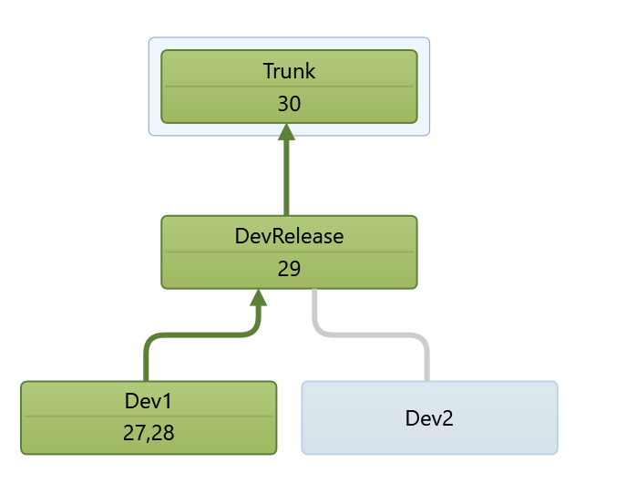
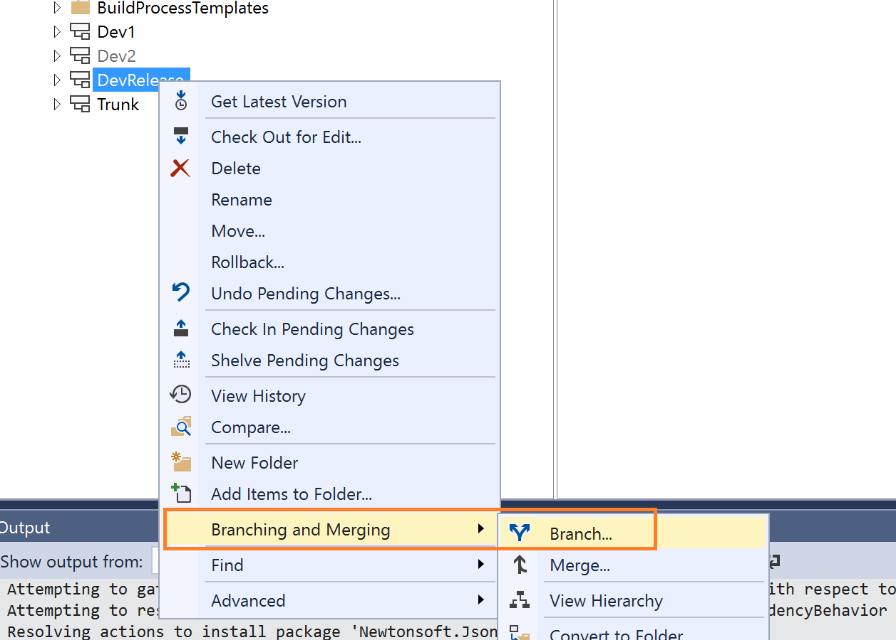

---
# required metadata

title: Update environments from version 8.0 to 8.1
description: This topic explains the steps required to update existing Finance and Operations 8.0 environments to the 8.1 application release.
author: laneswenka
manager: AnnBe
ms.date: 10/16/2018
ms.topic: article
ms.prod: 
ms.service: dynamics-ax-platform
ms.technology: 

# optional metadata

# ms.search.form: 
# ROBOTS: 
audience: Developer, IT Pro
# ms.devlang: 
ms.reviewer: sericks
ms.search.scope: Operations
# ms.tgt_pltfrm: 
# ms.custom: 
ms.search.region: Global
# ms.search.industry: 
ms.author: laswenka
ms.search.validFrom: 2018-10-31
ms.dyn365.ops.version: 8.1

---

# Update environments from version 8.0 to 8.1

[!include [banner](../includes/banner.md)]

This topic explains the steps required to update existing Dynamics 365 for Finance and Operations 8.0 environments to the 8.1 application release.

> [!NOTE]
> The 8.1 binary update package is currently not available, but will be released soon. This package impacts steps 5-7, which means that steps 1-4 can be started after October 1, 2018.

## Background

Traditionally, moving to a newer application version has involved a rigorous upgrade that includes deployment of additional virtual machines, code upgrade, data upgrade, and scheduling several days in advance with the Microsoft Dynamics Service Engineering (DSE) team.  You will notice that we are making the uptake of the latest version simpler, and this will continue to improve over time.

> [!NOTE]
> We are supporting an update experience as compared to a full upgrade.  This is possible because there are **no Data Upgrade or Code Upgrade** steps between the 8.0 and 8.1 application schema. The target environments will be updated just like you would apply a Platform update.

The high-level process to update from version 8.0 to 8.1 includes the following:

1. Deploy 8.1 developer and build environments.
2. Branch in version control and remove any application hotfixes.
3. Recompile custom extensions and/or ISV solutions.
4. Produce a single software deployable package.
5. Merge a deployable package with the 8.1 binary update package.
6. Deploy to target environments for validation.
7. Deploy to Production.

## Deploy 8.1 developer and build environments
Using Lifecycle Services, deploy at least one developer environment and a single, new build environment on application 8.1 release.

On average this takes 3-4 hours and can be done simultaneously. For the build environment, **Create a new agent pool** and assign it to this environment on the **Advanced options** screen.

In Azure DevOps, visit your existing Build Definition and ensure that it is not using your new agent pool for 8.1. This will keep your new build agent from trying to compile older application code.

## Begin branch work for version control and remove any application hotfixes
While the new environments are deploying, begin the branching work for your update. Use the following branch structure in version control as an example.  Branching design varies for each customer, so be careful to adjust your steps accordingly based on how your branches are set up.

### Prepare using Visual Studio
On any other development machine (other than the new ones being deployed), open Visual Studio and visit the Source Control Explorer. You will create a new branch that will be isolated for the 8.1 update.

Next, delete any Microsoft package folders in this branch. You may have packages, such as ApplicationSuite, checked in from applying hotfixes on 8.0 which need to be removed. When only your custom packages or ISVs remain, check these changes in to the branch.

>[!Important]
> It is critical that this is done before you map version control workspaces on your new development environments. This is to avoid the deletion of the Microsoft hotfixes to cascade to your working environment and delete untouched 8.1 application code.

## Recompile custom extensions and/or ISV solutions
Now you are ready to map this branch to a new development environment and compile your extensions and ISV solutions if they have provided you with source code.  If your ISVs have only provided binary packages, you can check them in to source control, and the build environment will merge the binaries with your extension package to produce a single software deployable package. Additional information on this process can be found at [Deployable packages from third parties](../dev-tools/manage-runtime-packages.md#deployable-packages-from-third-parties).  This will help later when you merge your package with the 8.1 binary update.

>[!NOTE]
> This **step is necessary** as the 8.1 application code is not backward compatible with 8.0 from a binary level. In future application releases this step will be optional.

## Produce a single software deployable package
After you have compiled in a developer environment and there are no errors to resolve, start a build in Azure DevOps using your new 8.1 build environment agent that was setup earlier. When this is complete, a deployable package artifact will be attached to your build results. Download this package and upload it to the Lifecycle Services Asset Library.  This single package should have all of your extensions and ISV solutions.

## Merge the deployable package with the 8.1 binary update package
In Lifecycle Services, go to the Asset Library, and then click the **Software deployable packages** section. Click the **Import** button, and on the next screen you will see an option for the 8.1 application release. Import this package to your Asset Library.  

Locate both your new 8.1 software deployable package and the 8.1 binary update package that was just saved.  Highlight both packages and select **Merge**. This will combine the files in to a merged update package.  You are now ready to apply this package to your various test environments.

## Deploy to target environments for validation
Using the merged update package, deploy this to your various test environments.  For more on how to do this, see [Apply updates to cloud environments](../deployment/apply-deployable-package-system.md).  At a minimum, you must deploy this to the sandbox Tier-2 environment that comes with your subscription.  After you have finished with validation, mark the merged update package as a Release Candidate.

## Deploy to Production
After you have marked the Release Candidate in your Asset Library, you can schedule the deployment to your Production environment.  This will follow the same process for applying other software deployable packages.
