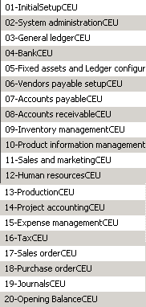

---
# required metadata

title: AX 2009 upgrade - Create templates 
description: This topic provides information about how to create package templates that you can use to migrate data from Dynamics AX 2009 to Finance and Operations.
author: kfend
manager: AnnBe
ms.date: 06/26/2018
ms.topic: article
ms.prod: 
ms.service: dynamics-ax-platform
ms.technology: 

# optional metadata

# ms.search.form:  
audience: Developer, IT Pro
# ms.devlang: 
ms.reviewer: kfend
ms.search.scope:  Operations
# ms.tgt_pltfrm: 
# ms.custom: 
ms.search.region: Global
# ms.search.industry:
ms.author: kfend
ms.search.validFrom: 2018-06-21
ms.dyn365.ops.version: Platform update 17
---

# AX 2009 upgrade - Create package templates

[!include [banner](../includes/banner.md)]

Packages are created following a pre-defined sequence. This sequence is defined following the dependencies that the data entities have on one another. Because of these dependencies, when you import data entities into Microsoft Dynanmics 365 for Finance and Operations, you must import the data entities in the defined order. If you do not follow the package template sequence order, you may encounter issues during import and configuration. 

The Data migration tool (DMT) tool provides twenty pre-defined templates as shown in the following graphic.

You can customize an existing template and you can create your own templates as needed. However, if you are customizing a template, you must run the pre-defined list of data entities before you can run the customized entities. 
Complete the following steps to view and select the entity lists that will be used in the templates for migration.

1. In Dynamics AX2009, click **Data migration** > **Common forms** > **Entity List**, and then click **Apply sequence**. Close the message box.
2. Verify that the correct legal entity is selected and then in the **Show** field, select to view all entities or only those that are to be considered for migration. 
3. In the **Template name** field, select a template. 
4. In the **Module selected** pane, select teh module that contains the data entities that you want to migrate.
5. On the **Entity details** tab, mark the **Select for migration** check box for each entity line that you want to migrate.
6. Click **Apply sequence** again.
7. To create a customized template, go to **AOT** > **Resources** and create a new template that follows the xml format.
