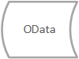
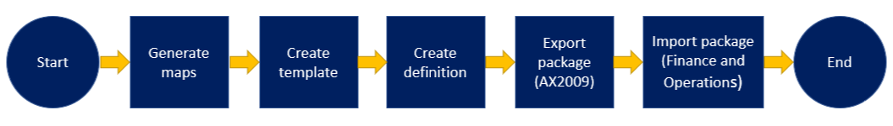

---
# required metadata

title: Data migration tool 
description:  This topic provides information about the Data migration tool (DMT) that you can use to migrate data from Microsoft Dynamics AX 2009 to Dynamics 365 for Finance and Operations.
author: kfend
manager: AnnBe
ms.date: 06/21/2018
ms.topic: article
ms.prod: 
ms.service: dynamics-ax-platform
ms.technology: 

# optional metadata

# ms.search.form:  
audience: Developer, IT Pro
# ms.devlang: 
ms.reviewer: margoc
ms.search.scope:  Operations
# ms.tgt_pltfrm: 
# ms.custom: 
ms.search.region: Global
# ms.search.industry:
ms.author: tabell
ms.search.validFrom: 2018-06-21
ms.dyn365.ops.version: Platform update 8
---

# Data migration tool

[!include [banner](../includes/banner.md)]

You can use the Data migration tool (DMT) to migrate your data from Microsoft Dynamics AX 2009 to Dynamics 365 for Finance and Operations successfully. The DMT will also locate and fill any gaps between the schema of tables.

The following graphic shows the technical flow from the source system (Dynamics AX 2009) to the target system (Finance and Operations).

and the process flow of collecting and preparing the appropriate data in your Dynamics AX 2009 instance and then importing the data into your Finance and Operations environment. 

With the DMT, you can export data from the source environment (Dynamics AX 2009) after the data has been through the pre-processing tasks. These tasks include:
-	Pre-processing staging
-	Mapping the table fields between the source and target environments
-	Application of conversions to source data 
-	Default value setup for source data 
-	Query filter application
