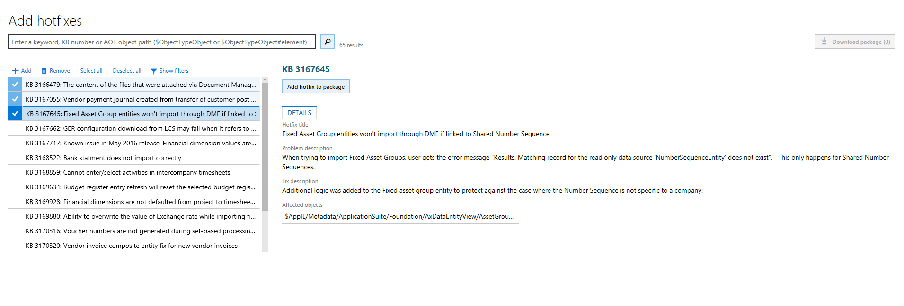
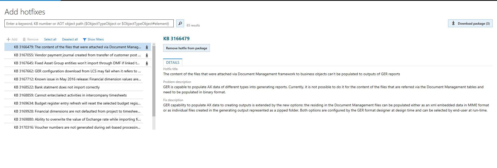
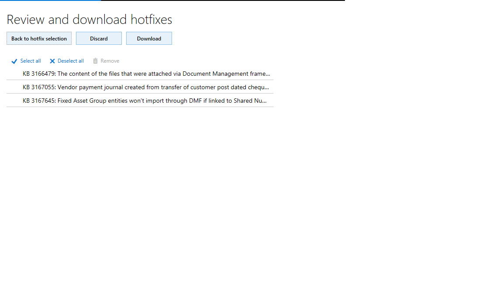

---
# required metadata

title: Download hotfixes from Lifecycle Services
description: Use this tutorial to download the Microsoft Dynamics 365 for Finance and Operations hotfixes from Lifecycle Services (LCS).
author: kfend
manager: AnnBe
ms.date: 10/20/2017
ms.topic: article
ms.prod: 
ms.service: dynamics-ax-platform
ms.technology: 

# optional metadata

# ms.search.form: 
# ROBOTS: 
audience: Developer
# ms.devlang: 
ms.reviewer: robinr
ms.search.scope: AX 7.0.0, Operations, UnifiedOperations
# ms.tgt_pltfrm: 
ms.custom: 56171
ms.assetid: 61069cf2-6c3f-4ebc-bbee-b21b1c99626a
ms.search.region: Global
# ms.search.industry: 
ms.author: anupams
ms.search.validFrom: 2016-02-28
ms.dyn365.ops.version: AX 7.0.0

---

# Download updates from Lifecycle Services

[!include[banner](../includes/banner.md)]

Use this tutorial to download updates from Microsoft Dynamics Lifecycle Services (LCS). This tutorial is a part of the [Servicing environments](..\dev-tools\developer-home-page.md#service-environments) content.

## Types of updates

- **Binary updates** are pre-compiled and cumulative. Every subsequent binary update includes all previous updates. These do not need to be compiled in a development environment and can be directly applied on a non-development environment from LCS. 

  If you are running an environment with retail functionality and a customized instance of Cloud POS, you will need to perform the additional steps listed under Retail SDK packaging. For Microsoft Dynamics 365 for Retail, all updates including those for application models are released as binary updates.

- **X++ updates** include updates to specific application functionality in application models and can be independently downloaded and applied. You may select specific X++ updates to be applied to your environment. Any other dependent X++ updates will be auto-selected and downloaded. X++ updates are source code updates and need to be compiled (and merged with any customizations) in a developer environment, before these can be applied on a non-development environment. X++ updates are only applicable to Microsoft Dynamics 365 for Finance & Operations. 

## Download an udpate

1.  Log in to LCS with your credentials.

2.  Select an environment from the LCS project.

3.  On the **Environment** page, under the **Monitoring** section, update tiles are shown. For Finance and Operations, you will see 2 update tiles (X++ updates and Binary updates). These two types of updates can be independently downloaded and applied, although certain X++ updates may depend on binary updates and vice versa, which will be described in the update description.

4.  Select one of the update tiles to view the list of available hotfixes that can be used to create a hotfix package for download.

5.  Select the applicable KBs, and then click **Add hotfix to package**. 

     

     > [!Note]
     > For X++ updates, if you want to download all available updates at this point, you should click on Select all and then click on **Add** instead of **Add hotfix to package**.
  
6.  Click **Download package** to download the hotfix package. 

      

      After you select **Download package**, the **Review and download hotfixes** page will open. Use this page to review selected hotfixes, discard the package, return to the hotfix selections, or download the final package. 
  
     

