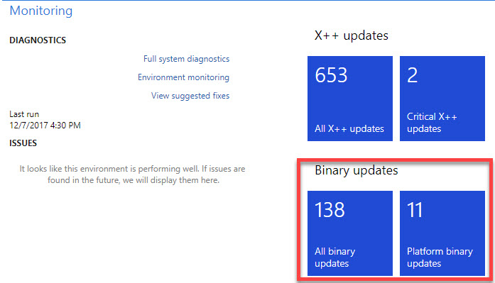
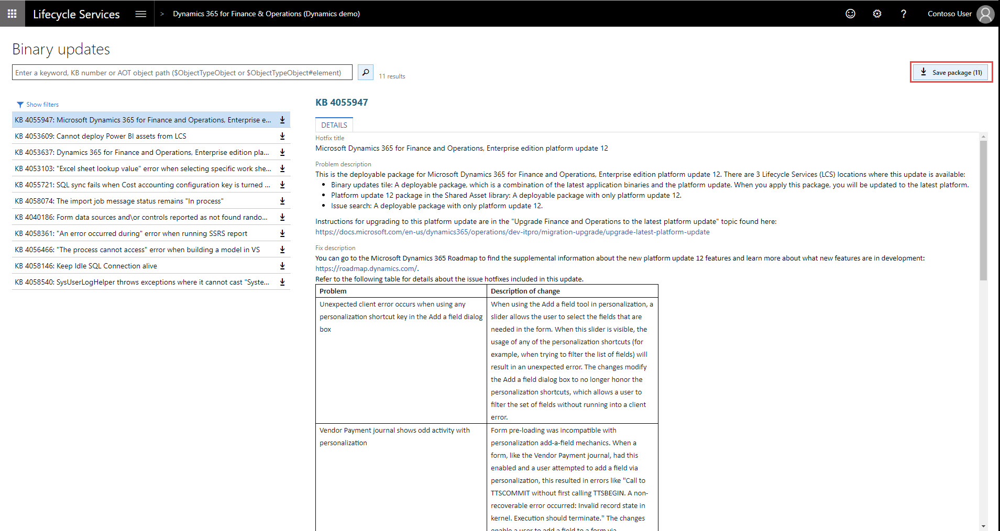
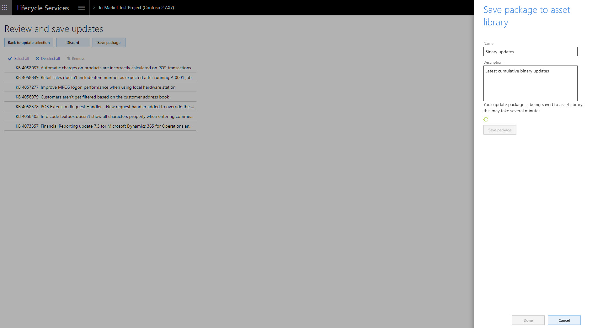
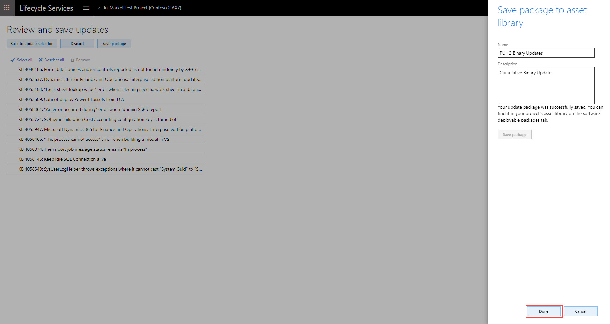
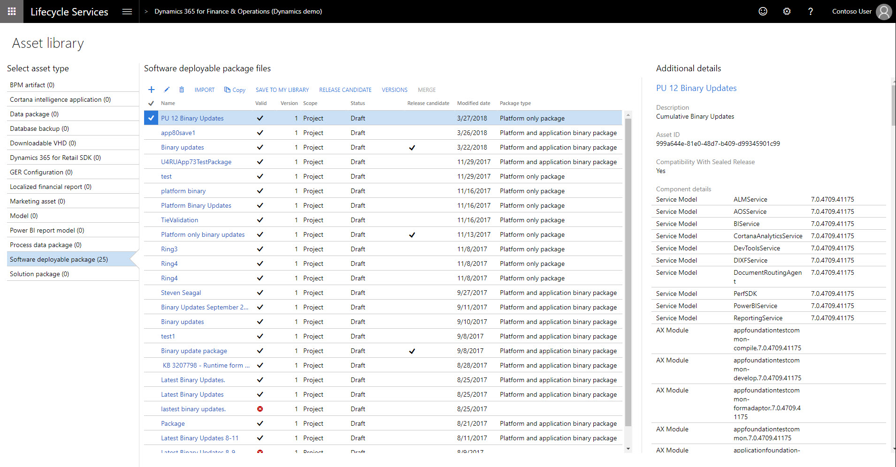
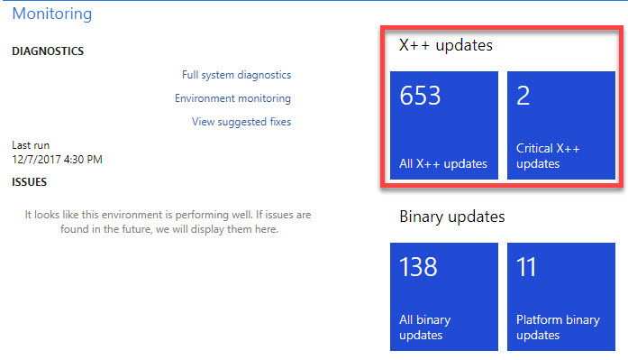
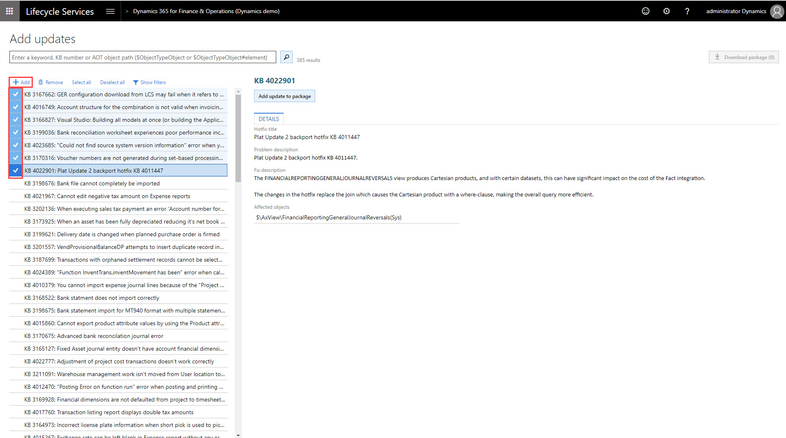
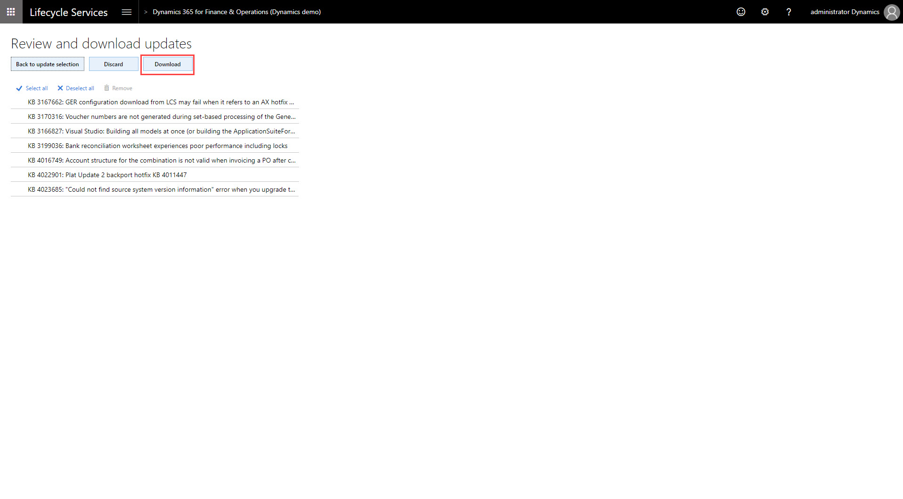
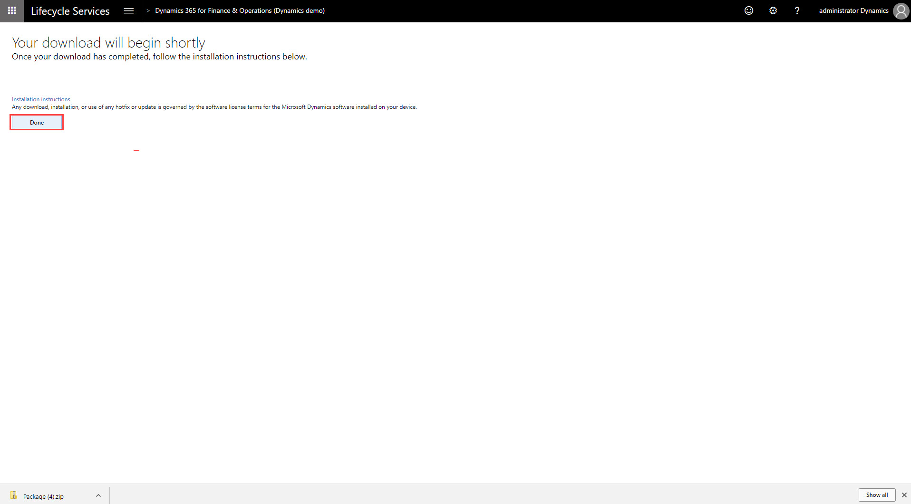

---
# required metadata

title: Download updates from Lifecycle Services (LCS)
description: This topic covers what updates you should expect to see and how you can get the updates from Lifecycle Services (LCS).
author: AngelMarshall
manager: AnnBe
ms.date: 10/02/2018
ms.topic: article
ms.prod: 
ms.service: dynamics-ax-platform
ms.technology: 

# optional metadata

# ms.search.form: 
# ROBOTS: 
audience: Developer
# ms.devlang: 
ms.reviewer: margoc
ms.search.scope: Operations
# ms.tgt_pltfrm: 
ms.custom: 56171
ms.assetid: 61069cf2-6c3f-4ebc-bbee-b21b1c99626a
ms.search.region: Global
# ms.search.industry: 
ms.author: amarshall
ms.search.validFrom: 2016-02-28
ms.dyn365.ops.version: AX 7.0.0

---

# Get updates from Lifecycle Services (LCS)

[!include [banner](../includes/banner.md)]

This topic covers what updates you should expect to see and how you can get the updates from Lifecycle Services (LCS).

## Types of updates

- **Binary updates** are pre-compiled and cumulative. Every subsequent binary update includes all previous updates. These updates don't have to be compiled in a development environment, and they can be applied directly to a non-development environment from LCS.
        
    If you're running an environment that has retail functionality and a customized instance of Cloud point of sale (POS), you must complete the additional steps that are listed under Retail SDK packaging. For Microsoft Dynamics 365 for Retail, all updates, even updates for application models, are released as binary updates.    

- **X++ updates** include updates to specific application functionality in application models. These updates can be independently downloaded and applied. You can select specific X++ updates to apply to your environment.  Dependent X++ updates are automatically selected and downloaded. Any X++ updates are source code updates, before they can be applied to a non-development environment, they must be compiled in a developer environment and merged with any customizations. X++ updates apply only to Microsoft Dynamics 365 for Finance and Operations.   

## Get updates

To view available updates:
1. Sign in to LCS using your credentials.
2. In the LCS project, select an environment.
3. On the **Environment** page, the **Monitoring** section includes update tiles. 

## Types of tiles

There are 4 different types of tiles: 
1. **All X++ updates** - This tile shows all the granular X++ updates released by Microsoft. 
2. **Critical X++ updates** - This tile shows recommended KBs that are based on the telemetry data in your production environment. This tile will only show *Production environments* and a subset of the updates shown under the **All X++ updates** tile that are recommended for your environments. 
3. **All binary updates** - This tile shows a combined cumulative binary update for both the Application and Platform.
4. **Platform binary updates** - This tile shows only the Platform binary updates. If you want to update only the platform, you can get the update from this tile. 

Depending on the product and version, the tiles you see will differ.

- **Dynamics 365 for Retail** - Customers that have Dynamics 365 for Retail deployed will see a single tile that is a cumulative combined binary update of all the application and platform changes. 

- **Dynamics 365 for Finance and Operations** 
   1. Application version 8.1 onwards - Starting with this release, you will see a **single tile** for service updates because any customizations are done via extensions and there is no code overlayering. This tile will be a cumulative combined binary update of all the application and platform changes. There will be no granular X++ updates starting with this release. Everything will be a cumulative update. 
 
   2. Application version 7.x or 8.0 with Platform update 4 or higher - For customers that are on this combination, you will see all the 4 tiles listed above. This release will still have the granular X++ updates. Starting with Platform update 4, no overlayering is allowed on the platform modules, which means that the **Platform binary updates** tile is available to provide the platform updates as a cumulative update. 

  3. Application version 7.x with Platform update 3 or lower - For customers that are on this combination, you will see 3 tiles - **All X++ updates**, **Critical X++ updates**, and **All binary updates**. Because this release platform can still be overlayered, there is no **Platform binary updatess** tile. 
  > [!NOTE]
    > If you are on this release, you need to upgrade as soon as possible. 
   
## Download binary updates

1. Click the **All binary update** tile to view the combined list of application and platform binary updates, or click the **Platform binary updates** tile for platform only binary updates. 

   

2. On the **Binary updates** page, select **Save package**.

   

3. On the **Review and save updates** page, select **Save package**.

4. On the **Save package to asset library** slider, enter the **Name** and **Description**, and click **Save package**.

   

5. Click **Done** to return to environment page.

   
 
6. You'll see the saved binary package in the asset library. 

   

## Download X++ updates

1. Click the **All X++ updates** tile to view the list of available application updates to an environment, or click the **Critical X++ updates** tile for recommended application updates to your production environment. 

      
  
2. On the **Add updates** page, select the applicable Knowledge Base (KB) numbers, and then click **Add** to add selected KBs to the **Download package**.

    

    > [!NOTE]
    > For X++ updates, you can download all available updates at this point. Click **Select all**, and then click **Add** to add all KBs to  the **Download package**.

3. Select **Download package**.

    

4. On the **Review and download hotfixes** page, you can review the hotfixes that you selected, discard the package, return to the hotfix selections, or download the final hotfix package.

    
    
5. Download the package, and click **Done**.
    
    

## Additional resources
- [Apply updates to a cloud environment](../deployment/apply-deployable-package-system.md)
- [Install a metadata hotfix](./install-metadata-hotfix-package.md) 
