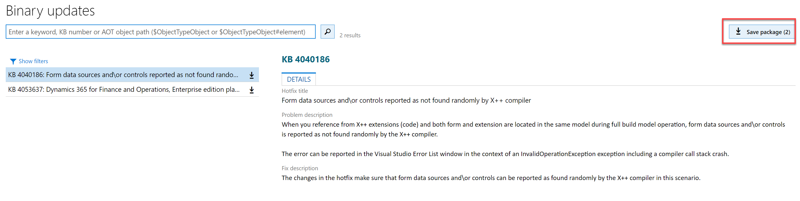
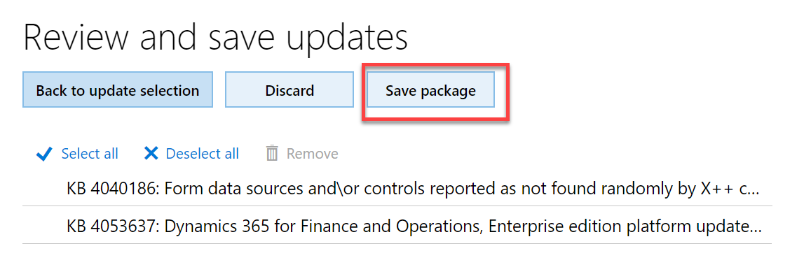
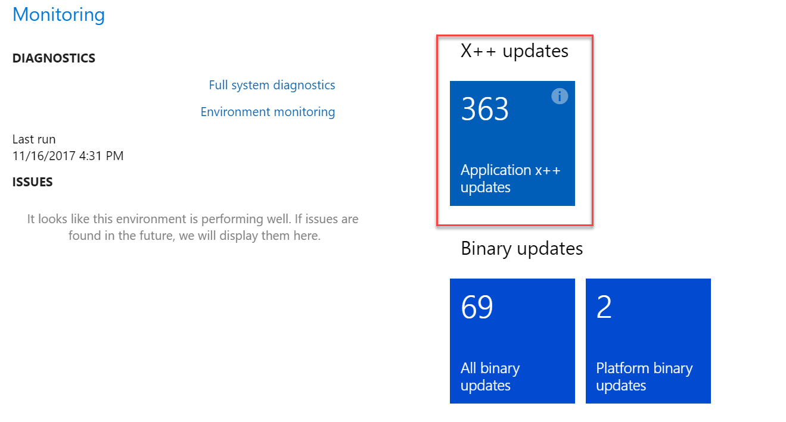

---
# required metadata

title: Download updates from Lifecycle Services
description: Use this tutorial to download hotfixes for Microsoft Dynamics 365 for Finance and Operations, Enterprise edition, from Lifecycle Services (LCS).
author: kfend
manager: AnnBe
ms.date: 10/20/2017
ms.topic: article
ms.prod: 
ms.service: dynamics-ax-platform
ms.technology: 

# optional metadata

# ms.search.form: 
# ROBOTS: 
audience: Developer
# ms.devlang: 
ms.reviewer: robinr
ms.search.scope: Operations
# ms.tgt_pltfrm: 
ms.custom: 56171
ms.assetid: 61069cf2-6c3f-4ebc-bbee-b21b1c99626a
ms.search.region: Global
# ms.search.industry: 
ms.author: anupams
ms.search.validFrom: 2016-02-28
ms.dyn365.ops.version: AX 7.0.0

---

# Download updates from Lifecycle Services

[!include[banner](../includes/banner.md)]

Use this tutorial to download updates from Microsoft Dynamics Lifecycle Services (LCS).

## Types of updates

- **Binary updates** are pre-compiled and cumulative. Every subsequent binary update includes all previous updates. These updates don't have to be compiled in a development environment, and they can be applied directly to a non-development environment from LCS.
        
    If you're running an environment that has retail functionality and a customized instance of Cloud point of sale (POS), you must complete the additional steps that are listed under Retail SDK packaging. For Microsoft Dynamics 365 for Retail, all updates, even updates for application models, are released as binary updates.
    
    [!NOTE]
    If your environment is on Platform Update 4 and above, you will have the option to download **All binary udpates** and **Platform binary updates** from the LCS environment page.  
    - **All binary updates** tile includes a combined package of application and platform binary updates.  
    - **Platform binary updates** tile includes the latest platform only updates or hotfixes. 
    

- **X++ updates** include updates to specific application functionality in application models. These updates can be independently downloaded and applied. You can select specific X++ updates to apply to your environment. Any dependent X++ updates are then automatically selected and downloaded. X++ updates are source code updates. Before they can be applied to a non-development environment, they must be compiled in a developer environment and merged with any customizations. X++ updates apply only to Microsoft Dynamics 365 for Finance and Operations, Enterprise edition.

## Download updates

To view available updates:
1. Sign in to LCS by using your credentials.
2. In the LCS project, select an environment.
3. On the **Environment** page, the **Monitoring** section includes update tiles. 

   >[!NOTE]
   > For Retail, you will see tile for binary updates only. For Finance and Operations, you will see tiles for both X++ updates and binary updates. These two types of updates can be independently downloaded and applied. However, some X++ updates might depend on binary updates, and some binary updates might depend on X++ updates. Any dependencies are included in the update description.
   
## Download Binary updates

1. Click **All binary update** tile to view the combined list of application and platform binary updates, or **Platform binary updates** tile for platform only binary updates. 

   

2. On the **Binary Updates** page, select **Save Package**.

   

3. On the **Review and Save Updates** page, select **Save package**.

4. From the **Save package to asset library** slider, enter the **Name** and **Description**, and click **Save package**.

   

5. Click **Done** to return to environment page.

## Download X++ updates

1. Click on **Application X++ update** tile to view the list of available application updates.

      
  
2. On the **Add updates** page, select the applicable Knowledge Base (KB) numbers, and then click **Add** to add selected KBs to the **Download package**.

    

    > [!NOTE]
    > For X++ updates, you can download all available updates at this point. Select **Select all**, and then click **Add** to add all KBs to  the **Download package**.

3. Select **Download package**.

    

4. On the **Review and download hotfixes** page, you can review the hotfixes that you selected, discard the package, return to the hotfix selections, or download the final hotfix package.

    
