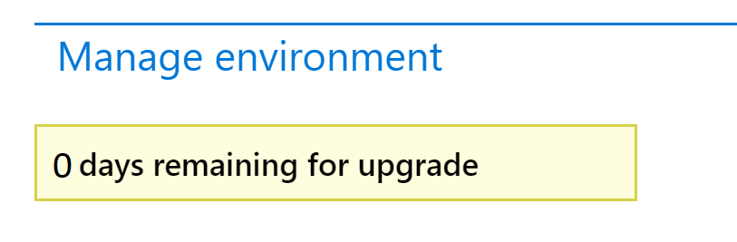

---
# required metadata

title: Self-service upgrade to the latest version
description: This topic explains the process for moving to the latest update of Microsoft Dynamics 365 for Finance and Operations.
author: laneswenka
manager: AnnBe
ms.date: 03/14/2019
ms.topic: article
ms.prod: 
ms.service: dynamics-ax-platform
ms.technology: 

# optional metadata

# ms.search.form: 
# ROBOTS: 
audience: Developer, IT Pro
# ms.devlang: 
ms.reviewer: margoc
ms.search.scope: Operations
# ms.tgt_pltfrm: 
ms.custom: 102343
ms.assetid: e48d7424-371a-49ee-882c-07b7ceb00183
ms.search.region: Global
# ms.search.industry: 
ms.author: tabell
ms.search.validFrom: 2016-05-31
ms.dyn365.ops.version: Platform update 1

---

# Self-service upgrade to the latest version
*Applicable starting version: Microsoft Dynamics365 for Finance and Operations 7.0 (RTW), 7.1 (1611), 7.2 (July 2017), 7.3.*

In this tutorial, you will learn how to:

> [!div class="checklist"]
> * Understand what version to select
> * Refactor your customizations to Extension
> * Execute the data upgrade in a development environment
> * Perform self-service upgrade in Sandbox UAT
> * Perform self-service upgrade in Production

## Understand which version to select for upgrade
To align the Self-service upgrade process to support continuous updates, each new release will cause the oldest release version to be discontinued.  

As an example, imagine your current application version is 7.3 with Platform Update 23.  As of this writing the supported upgrade versions are 8.1.3 PU23, 10.0.0 PU24, and 10.0.1 PU25.  When the next release, 10.0.2 PU26, is made generally available we will add it to available upgrade options and will remove 8.1.3 PU23.

With this continuous adding of a new version and removal of the oldest version, it is our recommendation that customers upgrade to the latest available version so that you have 2 months in which you can upgrade your Sandbox and then later upgrade your Production environment to the same version.

If you chose 8.1.3 PU23 to upgrade your Sandbox, and then we released 10.0.2 PU26 thereby removing 8.1.3 PU23 as an option, you will be blocked from upgrading Production.  You would then need to start over in Sandbox to upgrade to a newer supported release.

**Targeted release schedule (dates subject to change)**
| Selectable Versions | Latest Version GA for New Customers | Latest Version GA for Upgrade |
|---------|-----------------|---------------------------|---------------------|
|7.3 PU23-PU25 8.1.3 PU23 - 10.0.1 PU25 |  Week of April 8, 2019 | Week of April 29, 2019 | 
|7.3 PU24-PU26 10.0.0 PU24 - 10.0.2 PU26 |  Week of May 13, 2019 | Week of May 27, 2019 | 
|7.3 PU25-PU27 10.0.1 PU25 - 10.0.3 PU27 |  Week of June 10, 2019 | Week of June 24, 2019 | 
|7.3 PU26-PU28 10.0.2 PU26 - 10.0.4 PU28 |  Week of July 8, 2019 | Week of July 29, 2019 | 

## Refactor your customizations to Extension

In preparation for Upgrade, it is required that you refactor your customizations that were overlays in to Extensions. We recommend deploying a new developer environment on the latest version, creating a new branch in Version Control and following the guidance in [Migrate from overlayering to extensions](../extensibility/migrate-overlayer-extension.md).

If you have no overlays and are already operating 100% extension, we still recommend branching in version control for the upgrade effort.  If you have any Microsoft X++ hotfixes installed you will be required to delete those from Version Control as they are not applicable on the latest version.

## Execute the data upgrade in a development environment

Run the data upgrade process on a copy of your source database. If your environment is already live in production, the source database is a copy of the production database. Otherwise, the source database is your most current database running the old version. Run this process in the development environment that is running the release that you're upgrading towards. This step is a validation process that is done by a developer. It helps the developer verify that the data upgrade can be completed successfully by using the specific set of customizations in this environment without any manual intervention.

To make a copy of your production database, follow the steps in [Export a copy of the standard user acceptance test (UAT) database](../database/dbmovement-scenario-exportuat.md).

To run the data upgrade process, follow the steps in [Upgrade data in development, demo, or sandbox environments](../upgrade-data-to-latest-update.md).

> [!IMPORTANT]
> - Data upgrade in a development environment is a required step. It helps reduce the risk of extended downtime and upgrade errors later, when you upgrade sandbox user acceptance testing (UAT) and production environments.
> - Several application hotfixes might be required before you can upgrade data. Before you redeploy your existing development environment, verify whether these hotfixes are required. Install the required hotfixes, and check them in to Azure DevOps. This step can be completed only in the old version of your development environment. For a list of the hotfixes that are required in various situations, see [Upgrade data in develop, demo, or sandbox environments](upgrade-data-to-latest-update.md#before-you-begin).
 
## Upgrade your Tier2+ Standard Acceptance Test sandbox environment

When you've completed the code upgrade and have been able to do an end-to-end data upgrade in your development environment, without having to manipulate data in Microsoft SQL Server, you can then begin the process in your sandbox environment.

### Prerequisite

Before you begin your upgrade, we highly recommend that you make sure that your sandbox environment has the latest production data. If the data set is up to date, you can have more confidence that the upgrade will work in production. To complete this step, use the [Refresh for training purposes](../database/dbmovement-scenario-general-refresh.md) tutorial.

### Begin the upgrade

In your sandbox environment, on the **Maintain** menu, select **Upgrade**.

A dialog box appears, where you can select the latest application and platform combination.

> [!IMPORTANT]
> If you receive an error that states that preparation failed, see the [Known issues](#known-issues) section later in this topic.

### Preparation

The environment details page will be refreshed, and options for two sandbox environments will now appear in the upper-right corner. By selecting the options, you can switch between your old sandbox and your new upgrade-in-progress sandbox.

The preparation stage can take eight hours or longer, because it's similar to a full environment deployment. The upgrade-in-progress environment is connected to an empty Microsoft Azure SQL database to speed up deployment, and it's running on the newer version that you selected to deploy.

During this time, your original sandbox is left untouched, and there is no downtime impact at this stage. 

> [!IMPORTANT]
> If you receive an error that states that staging deployment failed, the Microsoft Dynamics Service Engineering (DSE) team will be notified and will proactively resolve the issue for you. This issue can occur if Azure doesn't have the required resources available in your region. Microsoft DSE will work with the Azure engineers to allocate more resources. When staging deployment is successfully completed, you will receive an email. 

### Package application

After staging deployment is completed, go back to the environment details page, and switch to the **Upgrade in progress** view. In this view, you will now see an **Upgrade** menu.

The **Upgrade** menu will include an **Apply updates** option. You can select this option to apply your software deployable packages to the new environment. These packages include any binary package, whether it's from an independent software vendor (ISV) solution, your own customization packages, or platform binary update packages. 

**We highly recommend** applying the latest platform update as your first step. If you are upgrading to version 8.1, we recommend getting the latest binary update package such as 8.1.3 for example, which will also include the latest platform update. This ensures you have the latest hotfixes available and will reduce errors further along in the process.

When you apply a new package to the environment, the process is the same as the process for regular environment servicing. When package application is completed, you must use the **Sign Off** button for that package before you can move on or apply another package.

If package deployment fails, you can use the **Rollback** button to reverse it. Note that this button is **not** the same as the **Rollback** option on the **Upgrade** menu.

### Critical hotfixes
With increased use of the self-service upgrade process, we have found several hotfixes to be critical to success for various target versions. For example, if you're upgrading to version 7.3 a list of KBs that have consistently resolved issues with data upgrade, retail components, or performance will display.

The goal is to have this list empty before you start the **Data Upgrade** step of the process.  These KBs need to be installed on your Upgrade-in-progress environment.

### Data upgrade and environment swap

After all packages are applied to your upgrade-in-progress sandbox, and you've signed off on them, you can begin the data upgrade.

> [!IMPORTANT]
> This stage will begin the downtime for your original sandbox environment.

On the **Upgrade** menu, select **Data upgrade**. Your original sandbox environment will be turned off, and the database connection will be swapped so that your new environment is connected to the original database. This process can take up to one hour.

Next, the data upgrade package for your target version will be automatically applied. The time that is required to apply the data upgrade package varies, depending on the size of your database.

If the data upgrade fails, you need to select **Rollback** on the **Upgrade** menu to restore your database to the point that it was at before the data upgrade began. Before you do a rollback, we highly recommend that you download the logs to determine the root cause of the failure. This helps to ensure that your next Data Upgrade execution will go more smoothly.

### Upgrade days remaining
Because the self-service upgrade process provides a parallel environment at no additional cost to you, there is a time limit on how long this environment can be used.  Currently, this time limit is set to 10 calendar days and begins when you use the **Maintain** menu > **Upgrade** button to start the process.

*What happens when the time runs out?*  

There are three possible outcomes when the timer reaches zero:
- If you have not yet started the Data Upgrade step, then the new environment will be queued for deletion. In this scenario, the upgrade in the progress environment was provisioned, and optionally had customizations and packages applied but no data was upgraded and the original environment never incurred downtime.  
- If you have executed the Data Upgrade step, and then later rolled back the new environment will be queued for deletion.  In this scenario, the Old environment is the primary since the Data Upgrade was rolled back.
- If you have executed the Data Upgrade step but not yet committed the upgrade, then no actions will be performed and no environments will be deleted. You can remain here until you commit or rollback. If you decide to rollback and the timer is at zero, then the new environment will be deleted.

Only after you commit the upgrade as a success, is the original environment queued for deletion.

### Commit or rollback

After the data upgrade package is applied, you can review the environment, and your users can perform business validation activities. If this validation is successful, you can mark the entire upgrade as a success by selecting **Commit** on the **Upgrade** menu. You must commit the upgrade before you can move on to your production environment. After you commit, the original environment is queued for deletion.

If the business validation fails, you can select **Rollback** on the **Upgrade** menu. This option will perform a point-in-time restore of the database, swap the database connection back to your original sandbox, and bring your original sandbox back online. The sandbox will then be back in its previous state.

### Post upgrade actions

After you have signed off on your upgrade, there are a few actions which must be performed on the environment. These are listed below:

* Aggregate Measurements - these must be refreshed after a major upgrade.  To do this, go to **System Administration** > **Setup** > **Entity Store** and then click **Refresh**.  
> [!NOTE]
> These can be scheduled to run using Batch.

### Upgrade production

After you have committed the upgrade in Sandbox UAT, you've finished the upgrade process in Sandbox. You can now begin the same process in your production environment. The steps that you follow are exactly the same. 

If you encounter an issue that causes excessive downtime during your production upgrade, use the [Report production outage](https://docs.microsoft.com/business-applications-release-notes/April18/dynamics365-finance-operations/report-production-outage) process to alert Microsoft and get help.

### Upgrade additional environments

You can upgrade additional sandbox environments in this same way. You also can deallocate and delete your other sandbox environments, and then redeploy on the newer version. By using the [Database Refresh](../database/database-refresh.md) self-service action, you can copy in the upgraded database from another sandbox or production environment.

### Known issues

**Prepare operation could not start. Microsoft support has been notified. If the issue persists, please contact support with this ID.**

This known issue involves environment certificates on the LCS back end. If it affects you, submit a support ticket, and include the activity ID from the error message. Microsoft will work to resolve the issue. Microsoft is compiling a list of affect environments and intends to proactively fix this issue in the future.

**I want to cancel the upgrade and try again later.**

To cancel an upgrade, you can select **Cancel Upgrade** on the **Maintain** menu.  The **Maintain** menu is available in the **Old** view (for the original sandbox), not in the **Upgrade in progress** view (for the new sandbox).

**Upgrade failed at step X: DVT script for service model: MRProcessService.**

This DVT error is intermittent and can be resolved by using the **Resume** button for your data upgrade package. When you select **Resume**, the process will resume at this step. Microsoft is trying to reliably reproduce this issue and intends to produce a fix in the future.

**Application configuration sync failed. Call to TTSCOMMIT without first calling TTSBEGIN.**

This TTSCOMMIT error is intermittent and can be resolved by using the **Resume** button for your data upgrade package. When you select **Resume**, the process will resume at this step. (This is fixed in Platform update 21.)
