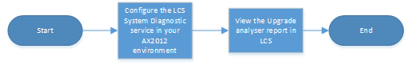

---
# required metadata

title: Upgrade from AX 2012 - Use the Upgrade analyzer tool to plan
description: This topic explains how to use the Upgrade analyzer tool to plan upgrade from Dynamics AX 2012 to Dynamics 365 for Finance and Operations.
author: tariqbell
manager: AnnBe
ms.date: 01/31/2018
ms.topic: article
ms.prod: 
ms.service: dynamics-ax-platform
ms.technology: 

# optional metadata

# ms.search.form: 
# ROBOTS: 
audience: Developer
# ms.devlang: 
ms.reviewer: margoc
ms.search.scope: Operations
# ms.tgt_pltfrm: 
ms.custom: 106163
ms.assetid: 
ms.search.region: Global
# ms.search.industry: 
ms.author: tabell
ms.search.validFrom: 2017-05-31
ms.dyn365.ops.version: Platform update 8

---

# Upgrade from AX 2012 - Use the Upgrade analyzer tool to plan

[!include[banner](../includes/banner.md)]

[!include[upgrade banner](../includes/upgrade-banner.md)]

This topic explains how to use the Upgrade analyzer tool to plan your upgrade from Microsoft Dynamics AX 2012 to Microsoft Dynamics 365 for Finance and Operations. This tool is run against an AX 2012 environment and identifies data that you should clean up in AX 2012 to help reduce the subscription cost for Finance and Operations. The tool also suggests SQL configuration optimizations that can help speed up the upgrade processes. Additionally, the tool warns you if any features that you use in AX 2012 are obsolete in Finance and Operations. Therefore, you can plan ways to replace or work around those features.

Upgrade analyzer gathers data from your AX 2012 environment as part of the regular System diagnostic service in Microsoft Dynamics Lifecycle Services (LCS). For an overview of the System diagnostic service, and for information about how data is collected and pushed back into the cloud so that you can consume it through LCS, see [System diagnostics (AX 2012)](../lifecycle-services/ax-2012/system-diagnostics-lcs.md).

You can view the results of the System diagnostic service in a Microsoft Power BI report in LCS. The report presents a list of tasks that you should complete in the AX 2012 environment.

The following illustration shows an overview of the procedure for using Upgrade analyzer.

If you already use the System diagnostic service in your AX 2012 environment, you must configure a new instance of the service on a machine that differs from the existing machine.

For information about how to configure the System diagnostic service in your AX 2012 environment, see [Install and run System diagnostics (AX 2012)](../lifecycle-services/ax-2012/install-run-system-diagnostics-lcs.md).

Within a few minutes after you configure the System diagnostic service, the AX 2012 environment will appear in your LCS project.
