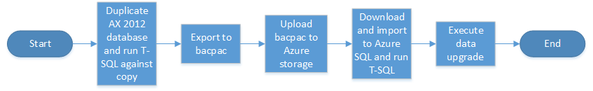

---
# required metadata

title: Data upgrade in a sandbox environment
description: This topic explains how to perform a data upgrade from AX 2012 to Dynamics 365 for Finance and Operations in a sandbox environment. 
author: tariqbell
manager: AnnBe
ms.date: 06/16/2017
ms.topic: article
ms.prod: 
ms.service: dynamics-ax-platform
ms.technology: 

# optional metadata

# ms.search.form: 
audience: Developer, IT Pro
# ms.devlang: 
ms.reviewer: margoc
ms.search.scope:  Operations, UnifiedOperations, Platform
# ms.tgt_pltfrm: 
# ms.custom: 
ms.search.region: Global
# ms.search.industry: 
ms.author: tabell
ms.search.validFrom: 2017-06-16
ms.dyn365.ops.version: Platform update 8
---

# Data upgrade in a sandbox environment

[!include[banner](../includes/banner.md)]

[!include[upgrade banner](../includes/upgrade-banner.md)]

The output of this task is an upgraded database that you can use in a sandbox environment. A sandbox environment is a Tier 2 or higher environment where business users and functional team members can validate application functionality. This functionality includes customizations and the data that was brought forward from Microsoft Dynamics AX 2012.

We strongly recommend that you run the data upgrade process in a development environment before you run it in a shared sandbox environment, because this approach will help reduce the overall time that is required for a successful data upgrade. For more information, see [Data upgrade in a development environment](prepare-data-upgrade.md).

## Overview of the sandbox data upgrade process
A sandbox environment for the purposes of this article is a Tier 2 or higher non-production environment. 

Before you start to upgrade data in a sandbox environment, you will have already upgraded data in a development environment, as explained in [Data upgrade in a development environment](prepare-data-upgrade.md). The two processes are very similar. The main difference is that a sandbox environment uses Microsoft Azure SQL Database for data storage, whereas a development environment uses Microsoft SQL Server. This technical difference in the database layer requires that you  modify the data upgrade procedure slightly in a sandbox environment, because a backup from the AX 2012 database instance can't just be restored to SQL Database.



Here are the high-level steps in the upgrade process.

1. Create a copy of the AX 2012 database. We strongly recommend that you use a copy, because you must delete some objects in the copy that will be exported.
2. Export the copied database to a bacpac file by using a free SQL Server tool that is named SQLPackage.exe. This tool provides a special type of database backup that can be imported into SQL Database.
3. Upload the bacpac file to Azure storage.
4. Download the bacpac file to the Application Object Server (AOS) machine in the sandbox environment, and then import it by using SQLPackage.exe. You must then run a script against the imported database to reset the SQL database users.
5. Run the MajorVersionDataUpgrade.zip package to run the data upgrade against the imported database.

## Create a copy of the AX 2012 database

You must create a copy of the AX 2012 database that you're upgrading, because you must delete some objects from the database. These objects include any Microsoft Windows authentication users. These changes make the modified database unusable for AX 2012. During this step, you will create a copy of the database and delete these objects.

This step must be done by the database administrator (DBA) or a person who has similar knowledge and experience.

To create a database copy, make a backup of the original database, and restore it under a new name. Make sure that enough space is available for both databases. You can create the copy on a different server. The version of the SQL Server instance that runs the database isn't important.

Here is an example of the code that creates a database copy. You must modify this example to reflect your specific database names.

```
	BACKUP DATABASE [AxDB] TO  DISK = N'D:\Backups\axdb_copyForUpgrade.bak' WITH NOFORMAT, NOINIT,  
	NAME = N'AxDB_copyForUpgrade-Full Database Backup', SKIP, NOREWIND, NOUNLOAD, COMPRESSION,  STATS = 10
	GO

	RESTORE DATABASE [AxDB_copyForUpgrade] FROM  DISK = N'D:\Backups\axdb_copyForUpgrade.bak' 	WITH  FILE = 1,  
	MOVE N'AXDBBuild_Data' TO N'F:\MSSQL_DATA\AxDB_copyForUpgrade.mdf',  
	MOVE N'AXDBBuild_Log' TO N'G:\MSSQL_LOGS\AxDB_CopyForUpgrade.ldf',  
	NOUNLOAD,  STATS = 5

```

After the copy is created, run the following Transact-SQL (T-SQL) script against it.

```
	--remove NT users as these are not supported in Azure SQL Database
	declare 
	@SQL varchar(255),
	@UserName varchar(255)

	set quoted_identifier off

	declare     userCursor CURSOR for
	select name from sys.sysusers where (isntuser = 1 or isntgroup =1) and name <> 'dbo'

	OPEN userCursor
	    FETCH userCursor into @UserName
	    WHILE @@Fetch_Status = 0
		  BEGIN
			set @SQL = 'DROP USER [' + @UserName + ']'
			exec(@SQL)
			FETCH userCursor into @UserName
		  END
	CLOSE userCursor
	DEALLOCATE userCursor

	go
	
	--remove any AX 2012 RTM model store procedures that still exist
	declare 
	@SQL varchar(255),
	@procname varchar(255)

	set quoted_identifier off

	declare     procCursor CURSOR for
	select name from sys.procedures where name like 'XI_%' or name like 'XU_%'

	OPEN procCursor
	    FETCH procCursor into @procname
	    WHILE @@Fetch_Status = 0
		  BEGIN
			set @SQL = 'DROP PROCEDURE [' + @procname + ']'
			exec(@SQL)
			FETCH procCursor into @procname
		  END
	CLOSE procCursor
	DEALLOCATE procCursor

	go
	
	--If you receive a message that you cannot delete users because they own a schema, then check which schema the user owns. 
	--Either change the ownership to another user (for example to dbo) or drop the schema if it does not contain any objects. 
	--The examples below are for an AX 2012 demo environment. You will need to edit this for your specific environment.

        if exists (select 1 from sys.schemas where name = 'contoso\admin')
	begin
		drop schema [contoso\admin]
	end
	if exists (select 1 from sys.schemas where name = 'contoso\Domain Users')
	begin
		drop schema [CONTOSO\Domain Users]
	end
	go
	--drop all views in the current database because some refresh the tempDB, which is not a supported action in Azure SQL Database

	declare 
	@SQL2 varchar(255),
	@ViewName varchar(255)

	set quoted_identifier off

	declare     viewCursor CURSOR for

	select viewname = v.name
	from sys.views v
	order by v.name

	OPEN viewCursor

	FETCH viewCursor into @ViewName
	    WHILE @@Fetch_Status = 0
		  BEGIN
			set @SQL2 = 'DROP VIEW ' + @ViewName
			exec(@SQL2)
			FETCH viewCursor into @ViewName
		  END
	CLOSE viewCursor
	DEALLOCATE viewCursor
	go

	-- Drop the following procedure because it contains a tempDB reference that is not supported in Azure SQL Database
	If exists (select 1 from sys.procedures where name = 'MaintainShipCarrierRole')
	begin
		drop procedure MaintainShipCarrierRole
	end	
```

### Export the copied database to a bacpac file

Export the copied database to a bacpac file by using the SQLPackage.exe tool. This step should be done by the DBA or a team member who has equivalent knowledge.

It's very important that you install the latest version of SQL Server Management Studio before you start this step. Although SQLPackage is present in earlier versions of Management Studio, it won't work correctly for this step unless you first install the latest version.

This step is important, because the export will have to be done again during the downtime before go-live. Here are some tips:

- The bacpac process is very I/O and CPU intensive. Therefore, run the export on a high-powered machine.
- SQLPackage should be run locally on the machine that hosts the database. Don't run SQLPackage on a local laptop that you connect to the database machine, because this process is also network intensive.

Next, open a **Command Prompt** window as an administrator, and run the following commands.

```
cd C:\Program Files (x86)\Microsoft SQL Server\130\DAC\bin\

SqlPackage.exe /a:export /ssn:localhost /sdn:<database to export> /tf:D:\Exportedbacpac\my.bacpac /p:CommandTimeout=1200 /p:VerifyFullTextDocumentTypesSupported=false
```

Here is an explanation of the parameters:

- **ssn** (source server name) – The name of the SQL Server to export from. For our process, this parameter should always be set to **localhost**.
- **sdn** (source database name) – The name of the database to export.
- **tf** (target file) – The path and name of the file to export to. The folder should already exist, but the file will be created by the process.
- **/p:CommandTimeout** – The per-query timeout value. This parameter enables larger tables to be exported without hitting a timeout.

### Upload the bacpac file to Azure storage

The bacpac file you have created will need to be copied to the AOS machine in your Azure hosted sandbox environment. There are several reasons for this:
1. The Azure SQL Database instance used by your Tier 2 (or higher) sandbox environment has firewall rules preventing access from outside of the environment itself.
2. Performance of bacpac import is multiple times faster when importing from a machine within the same Azure datacenter as the Azure SQL database instance.

You can choose how you would like to move the bacpac file to the AOS machine - you may have your own SFTP or other secure file transfer service. We recommend to use our Azure storage, which would require that you acquire your own Azure storage account on your own Azure subscription (this is not provided within the Dynamics subscription itself). There are free tools to help you to move files between Azure storage, from a command line you can use [Azcopy](/azure/storage/storage-use-azcopy), or for a GUI experience you can use [Microsoft Azure storage explorer](http://storageexplorer.com/). Use one of these tools to first upload the backup from your on-prem environment to Azure storage and then on your download it on your development environment.

### Import the bacpac file into SQL Database

During this step, you will import the exported bacpac file to the SQL Database instance that your sandbox environment uses. You must first install the latest version of Management Studio on your sandbox AOS machine. You will then import the file by using the SQLPackage.exe tool.


You will perform these tasks directly on the AOS machine in your sandbox environment, because there are firewall rules that restrict access to the SQL Database instance. However, by using the AOS machine, you can gain access.

As for the export step, you must have the latest version of Management Studio before you start the import. This step won't work if you have an older version.

For performance reasons, we recommend that you put the bacpac file on drive D on the AOS machine. On Azure virtual machines (VMs), drive D is a physical disk that typically has higher performance than other available disks.

Open a **Command Prompt** window as an administrator, and run the following commands.

```
	cd C:\Program Files (x86)\Microsoft SQL Server\130\DAC\bin\

	SqlPackage.exe /a:import /sf:D:\Exportedbacpac\my.bacpac /tsn:<azure sql database server name>.database.windows.net /tu:sqladmin /tp:<password from LCS> /tdn:<New database name> /p:CommandTimeout=1200 /p:DatabaseEdition=Premium /p:DatabaseServiceObjective=P1
```

Here is an explanation of the parameters:

- **tsn** (target server name) – The name of the SQL Azure server to import to. The name can be found in LCS. Suffix it with **.database.windows.net**.
- **tdn** (target database name) – The name of the database to import to. The database should not already exist. The import process will create it.
- **sf** (source file) – The path and name of the file to import from.
- **tp** (target password) – The SQL password for the target SQL Database instance.
- **tu** (target user) – The SQL user name for the target SQL Database instance. We recommend that you use **sqladmin**. You can retrieve the password for this user from your LCS project.
- **/p:CommandTimeout** – The per-query timeout value. This parameter enables larger tables to be exported without hitting a timeout.
- **/p:DatabaseServiceObjective** – The service tier level of the database that is created. You can check the value for the existing database by using Management Studio. Right-click the database, and then select **Properties**.

After you run the commands, you will receive the following warning. You can safely ignore it.


### Run a script to update the database
Run the following script against the imported database. The script performs the following actions:

-   Recreate database users.
-   Set the correct performance parameters.
-   Enable the SQL Query Store feature.

```
	CREATE USER axdeployuser FROM LOGIN axdeployuser
	EXEC sp_addrolemember 'db_owner', 'axdeployuser'

	CREATE USER axdbadmin WITH PASSWORD = 'password from lcs'
	EXEC sp_addrolemember 'db_owner', 'axdbadmin'

	CREATE USER axruntimeuser WITH PASSWORD = 'password from lcs'
	EXEC sp_addrolemember 'db_datareader', 'axruntimeuser'
	EXEC sp_addrolemember 'db_datawriter', 'axruntimeuser'

	CREATE USER axmrruntimeuser WITH PASSWORD = 'password from lcs'
	EXEC sp_addrolemember 'ReportingIntegrationUser', 'axmrruntimeuser'
	EXEC sp_addrolemember 'db_datareader', 'axmrruntimeuser'
	EXEC sp_addrolemember 'db_datawriter', 'axmrruntimeuser'

	CREATE USER axretailruntimeuser WITH PASSWORD = 'password from lcs'
	EXEC sp_addrolemember 'UsersRole', 'axretailruntimeuser'
	EXEC sp_addrolemember 'ReportUsersRole', 'axretailruntimeuser'

	CREATE USER axretaildatasyncuser WITH PASSWORD = 'password from lcs'
	EXEC sp_addrolemember 'DataSyncUsersRole', 'axretaildatasyncuser'

	ALTER DATABASE SCOPED CONFIGURATION  SET MAXDOP=2
	ALTER DATABASE SCOPED CONFIGURATION  SET LEGACY_CARDINALITY_ESTIMATION=ON
	ALTER DATABASE SCOPED CONFIGURATION  SET PARAMETER_SNIFFING= ON
	ALTER DATABASE SCOPED CONFIGURATION  SET QUERY_OPTIMIZER_HOTFIXES=OFF
	ALTER DATABASE imported-database-name SET COMPATIBILITY_LEVEL = 130;
	ALTER DATABASE imported-database-name SET QUERY_STORE = ON;
```

### Run the MajorVersionDataUpgrade.zip and MajorVersionDataUpgrade_Retail.zip packages

Run the data upgrade deployable packages, which are called MajorVersionDataUpgrade.zip and MajorVersionDataUpgrade_Retail.zip as described in [Upgrade data in development, demo, or sandbox environments](upgrade-data-to-latest-update.md). You must run both packages, one after the other.

### Upgrade a copy of the database in a development environment

It's useful to upgrade the same database in a development environment. If you have a copy of the database available for development environments, it will be much easier to investigate bugs that are found in the upgraded sandbox environment.
