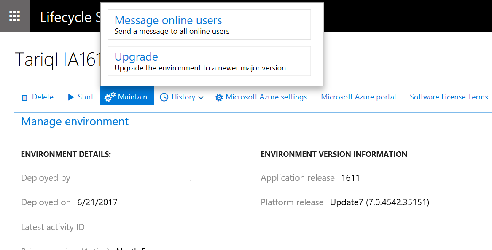
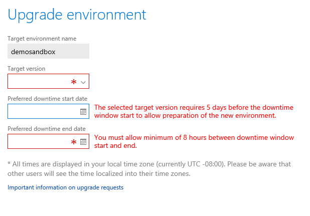
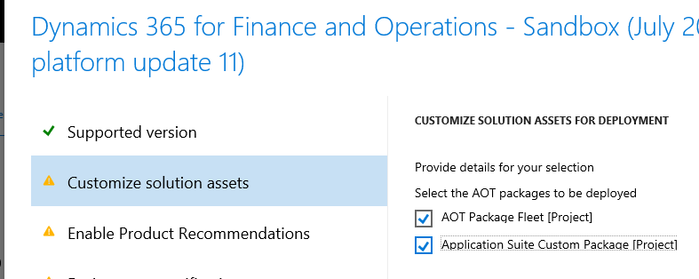

---
# required metadata

title: Process for moving to the latest update of Finance and Operations
description: This topic describes the process for upgrading to the latest update for Microsoft Dynamics 365 for Finance and Operations. 
author: tariqbell
manager: AnnBe
ms.date: 07/28/2017
ms.topic: article
ms.prod: 
ms.service: dynamics-ax-platform
ms.technology: 

# optional metadata

# ms.search.form: 
# ROBOTS: 
audience: Developer, IT Pro
# ms.devlang: 
ms.reviewer: margoc
ms.search.scope: Operations
# ms.tgt_pltfrm: 
ms.custom: 102343
ms.assetid: e48d7424-371a-49ee-882c-07b7ceb00183
ms.search.region: Global
# ms.search.industry: 
ms.author: tabell
ms.search.validFrom: 2016-05-31
ms.dyn365.ops.version: Platform update 1

---

# Process for moving to the latest update of Finance and Operations

[!include[banner](../includes/banner.md)]

This topic describes the process for upgrading to the latest update for Microsoft Dynamics 365 for Finance and Operations. This topic is intended to describe the overall process and supported scenarios, not to provide detailed instructions for every step of the process.

Overview
--------

This topic describes the overall process and the supported scenarios that are related to an upgrade from earlier releases to the current update for Finance and Operations. It isn't intended to provide detailed instructions for every step of the process. For details of the contents of each available upgrade see [What's new or changed](../../fin-and-ops/get-started/whats-new-changed.md).

## Definitions
Finance and Operations platform updates consist mainly of the following components: Application Object Server (AOS), analytics and reporting, Microsoft Office integration, data management, integration services, the web client, and other binaries. It also includes the following Application Object Tree (AOT) models:

-   Application Platform
-   Application Foundation
-   Directory and Test Essentials

All other components are referred to as the Finance and Operations application.

## Introduction to scenarios
### Scenario 1: Update to a specific application hotfix

Use this scenario when one or more small hotfixes are required to address a specific issue and business factors, such as time or cost limitations, prohibit a complete application update.

### Scenario 2: Upgrade your custom code

This process is required before embarking on Scenario 3 and is to be completed by a developer before other activities can begin.

### Scenario 3: Upgrade to the most current application release
Use this scenario when business factors, such as time or cost limitations, prohibit the complete latest application release. Some examples of application updates are Release 1611 (also known as 7.1) and the July 2017 release (also known as 7.2). If installing a platform-only update, refer to scenario 4 below instead. Some examples of platform updates are the August 2016 release, Platform update 6 or Platform update 7. If you have any questions about your update contains, contact Microsoft Support for confirmation.

### Scenario 4: Upgrade to the most current platform only

Use this scenario to update to the latest release of the platform, when no application updates are required at that time. Note that platform updates are always cumulative. Some examples of platform updates are the August 2016 release, Platform update 9, and Platform update 11. 

> [!IMPORTANT]
> Platform update 1 and Platform update 2 allowed overlayering of platform X++ code. Later platform updates had the platform-level X++ locked for overlayering. If you are upgrading from Platform update 1 or Platform update 2, your developers will need to refactor the overlayering as extensions before you can upgrade. If you are upgrading from Platform update 3 or higher to a later platform update, you can do so without refactoring your X++ code.

## Scenario 1: Update to a specific application hotfix
Use this scenario when one or more small hotfixes are required to address a specific issue, and when business factors such as time or cost prohibit taking an entire major application update at that moment. It is not necessary to perform a complete upgrade of your application to uptake new features of the application. All features in the current update of the application are available individually on Microsoft Dynamics Lifecycle Services (LCS). For more information about how to download hotfixes from LCS, see [Download hotfixes from Lifecycle Services](download-hotfix-lcs.md).

## Scenario 2: Upgrade your custom code
This scenario describes the process for upgrading code from an earlier release to the current release. This process is required before you can perform Scenario 3 and is to be completed by a developer before other activities can begin. Code upgrade is needed when you deploy new environments as part of the process of upgrading your application to a new major or cumulative release. Code upgrade is not required for platform updates.

| Source environment                                     | Expected content of AX7.version file for source | Target environment                                           | Do I need the code upgrade service? |
|--------------------------------------------------------|-------------------------------------------------|--------------------------------------------------------------|-------------------------------------|
| Release 1611 (Application 7.1.0)                       | 7.1.1541.3036                                   | July 2017 Release (Application 7.2.0)                        | Yes                                 |
| August 2016 (Application 7.0.1 with Platform update 2) | 7.0.1265.27075                                  | July 2017 Release (Application 7.2.0)                        | Yes                                 |
| August 2016 (Application 7.0.1 with Platform update 2) | 7.0.1265.27075                                  | Release 1611 (Platform update 3 or newer, Application 7.1.0) | Yes                                 |
| May 2016 (Application 7.0.1)                           | 7.0.1265.23014                                  | July 2017 Release (Application 7.2.0)                        | Yes                                 |
| May 2016 (Application 7.0.1)                           | 7.0.1265.23014                                  | Release 1611 (Platform update 3 or newer, Application 7.1.0) | Yes                                 |
| February 2016 (Application 7.0.0)                      | 7.0.1265.3015                                   | July 2017 Release (Application 7.2.0)                        | Yes                                 |
| February 2016 (Application 7.0.0)                      | 7.0.1265.3015                                   | Release 1611 (Platform update 3 or newer, Application 7.1.0) | Yes                                 |
| Microsoft Dynamics AX 2012                             | Not applicable                                  | July 2017 Release (Application 7.2.0)                        | Yes                                 |
| July 2017 (Platform update 8, application 7.2)         |                                                 | Newer version of the platform                                | No                                  |
| Release 1611 (Platform update 3, Application 7.1.0)    |                                                 | Newer version of the platform                                | No                                  |
| May 2016 (Platform update 1, Application 7.0.1)        |                                                 | August 2016 (Platform update 2, Application 7.0.1)           | No                                  |                           |

Regardless of whether you're a live customer or you're still in the implementation phase of your project, follow these steps to upgrade your code to the latest platform and application updates.

1.  Use the Code upgrade service on Lifecycle Services to upgrade your code, see [Configure the code upgrade service in Lifecycle services](../lifecycle-services/configure-execute-code-upgrade.md). We recommend running the code upgrade service even if you do not have custom code, because the service will still help you by removing any old Microsoft X++ hotfixes you have installed, which is a required step.

2.  You will need to deploy a new development environment, which is running the **new version** that you are upgrading to. You will use this environment to complete code merging and refactoring of your custom code. Submit a request for a new Dev/Test environment that is running the latest update.
    -   You might have to delete your existing Dev/Test environment if your subscription doesn't allow for a new one.
    -   Depending on your project type, these are the other options to deploy a developer VM:
        -   Download a Dev VHD.
        -   If you're running in your own Microsoft Azure subscription, deploy a new developer topology.
    -   If you want to keep your development data from your old development environment then create a database backup and retain the BAK file. When you have completed code upgrade, you can then restore the retained database backup to your new development environment and perform a data upgrade by following the steps in [Upgrade data in develop, demo or sandbox environments](upgrade-data-to-latest-update.md)

3.  Complete the code migration steps.
    1.  Connect your development virtual machine (VM) to Microsoft Visual Studio Team Services (VSTS), and map your local metadata folder to the VSTS branch that contains your upgraded code.
    2.  Synchronize, resolve conflicts (when applicable), build, and test.
    3.  Merge the VSTS branch that contains your upgraded code with your main development branch. For more information, see [Merge folders and files](https://www.visualstudio.com/en-us/docs/tfvc/merge-folders-files).
    4.  Build and test.
    5.  Create deployable packages of your code.

4.  Install any hotfixes that apply to the environment.

5.  Upload deployable packages to the LCS Asset library of your project.
For more details on code migration steps, see [Code Migration](../dev-tools/developer-home-page.md#code-migration). After code migration is complete, continue to Scenario 3.

## Scenario 3: Upgrade to the most current application release
These steps apply to customers who are live on an earlier release and want to perform a full upgrade to the most recent platform and application releases. Customers who have already deployed and configured a production environment might also fall into this category, even if they haven't gone live yet. If you are not upgrading your application, but want to only upgrade your platform to the latest bits, use Scenario 4 below.

### Upgrade your code

First, upgrade your code as described in Scenario 2. This is a developer task and will happen on a developer environment running the new release you are upgrading to.

### Upgrade your data on a development environment

Execute the data upgrade process on a copy of your target database – if your environment is already live in production then the target database is a copy of production; if your environment is not yet live, it will be your most current database. Execute this process on the development environment running the release you are upgrading to. This is a validation process performed by a developer to ensure that the data upgrade completes successfully with the specific set of customizations within this environment.
Follow the steps in [Copy a Microsoft Dynamics 365 for Finance and Operations database from Azure SQL Database to a SQL Server environment](../database/copy-database-from-azure-sql-to-sql-server.md).
To execute the data upgrade process, follow the steps in [Process for data upgrade for development or demo environments](upgrade-data-to-latest-update.md).

> [!IMPORTANT]

> Upgrading data on a development environment is a required step, completion of this step helps reduce the risk of extended downtime and upgrade errors during the upgrade process of sandbox UAT and production environments later.

> There are several application hotfixes which may be required before you can upgrade data. Before you redeploy your existing  development environment, check whether these hotfixes are needed, and install and check them into VSTS. This step can only be performed on the old version of your development environment. Hotfixes required in different situations are listed here: [Upgrade data in develop, demo, or sandbox environments](upgrade-data-to-latest-update.md#before-you-begin).
 
### Upgrade your sandbox UAT environment

You must make a request via LCS for the Microsoft Servicing Engineering (DSE) Team to run this process for you, when the following conditions are met:

- You are live in production or have already deployed your production environment
- DSE will perform the data upgrade in one Tier 2 or higher sandbox UAT environment. This is used as a control - to perform the identical upgrade process in this sandbox as will be performed in production.
- DSE will perform the data upgrade in the production environment

To upgrade any additional Tier 2 or higher sandbox environments: you do not need to upgrade these. Instead, delete them, redeploy, and then make a database refresh request to copy a database from a Tier 2 or higher environment that hase already been upgraded. Alternatively you can upgrade them manually by following [Process for Upgrading a Sandbox Environment](upgrade-sandbox-environment.md)
For upgrading any Tier 1 environments (also known as dev boxes or one-boxes). You can deploy these with the new version and just sync to your upgraded VSTS branch. To get data for the Tier 1 environments, a developer can upgrade the database following [Process for data upgrade for development or demo environments](upgrade-data-to-latest-update.md)

#### Use LCS to submit an upgrade request to DSE
1. Go to the **Environment details** page for the environment that you want to upgrade, click **Maintain**, and then select **Upgrade**. A window will display where you can enter the upgrade request.

2. Select the taget version you are upgrading to, and the preferred downtime window.
3. You must submit your upgrade request a minimum of 5 working days before you expect to upgrade, to help ensure that the upgrade can be performed within your expected timeframe. The advanced notice is required to prepare a new environment before your downtime window.

   If, due to high demand, your chosen time slot is not available, the Microsoft Team will respond with the closest available time slots for you to chose from. The more advanced notice you give, the more likely you will get your first choice.

4. You must allow at least 8 hours between the downtime start and downtime end times. This time is required to perform the swap in of the new environment and the data upgrade process.
5. If you have custom code or X++ hotfixes that must be part of your upgraded environment, you must select Application deployable packages during your upgrade request. Select the deployable packages that contain your upgraded custom code and the X++ hotfixes that were created on your development or build environment during the code upgrade process.

  Use the Customize solution assets tab to select the required Application deployable packages (These are deployable package containing your custom code and any required X++ hotfixes).

 > [!IMPORTANT]
 > - If you do not select your application deployable packages in the service request, your service request may be rejected by DSE.
 > - If an error causes the upgrade process to stop, DSE will roll the environment back to its original state. The issue that caused the failure can then be resolved, and the upgrade can be rescheduled at a new time.
 > - A minimum 16 hour downtime is required if you are using Retail features, because additional upgrade steps are needed.

#### Validate your sandbox environment
- The updated environment will have the same URL, same environment name, and same machine names as the former environment.
- Complete your validation and testing. If you discover a problem and want to rollback to the old environment, notify the DSE team using an LCS ticket.
- You have up to 5 working days to request a rollback, after which Microsoft will retire the old environment.

### Upgrade your production environment

1.  Use LCS to submit an Upgrade request to update the production environment in exactly the same way as you did for the sandbox environment in the previous step.
2.  Validate.
3.  Complete your validation and testing. If you discover a problem and want to rollback to the old environment, notify the DSE team using an LCS ticket. You have up to 5 working days to request a rollback, after which Microsoft will retire the old environment.

## Scenario 4: Upgrade to the most current platform only
If you're running an environment that doesn't contain any customization of the platform AOT models (Application Platform, Application Foundation, Directory and Test Essentials), you can do an in-place update of your platform, without upgrading to a new environment. For more information about this process, see [Upgrade Finance and Operations to the latest platform update](upgrade-latest-platform-update.md). If you only upgrade your platform, there is no need to do code upgrade (Scenario 2 above) or run data upgrade scripts.

