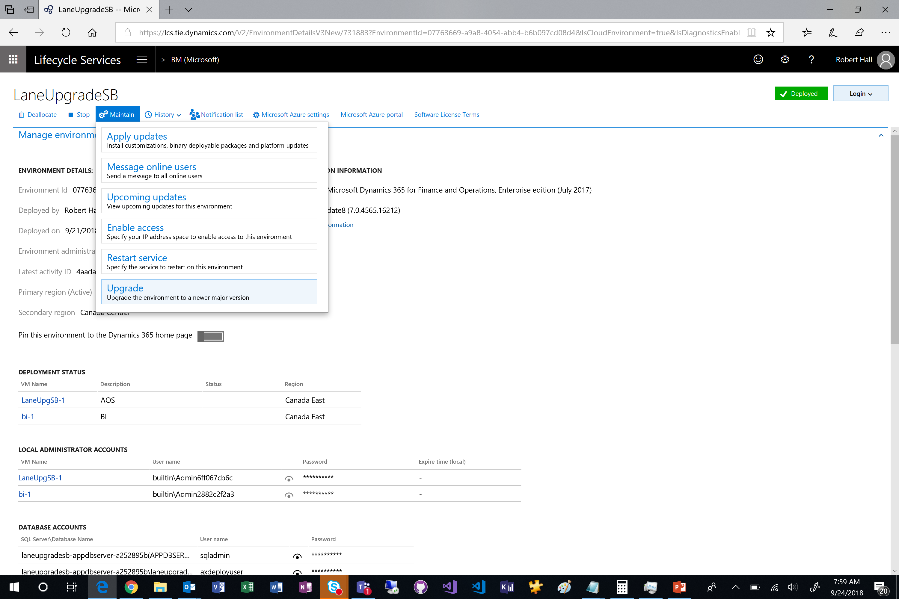
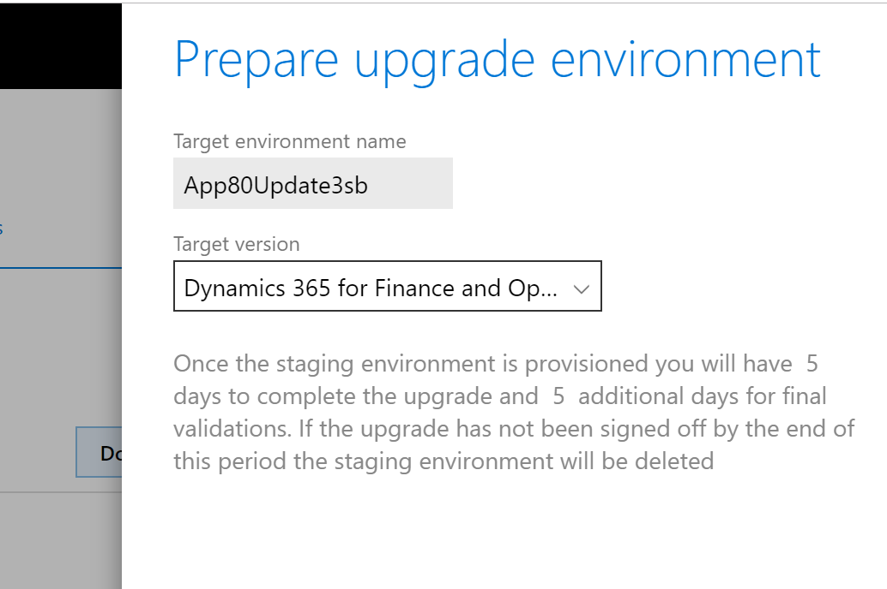
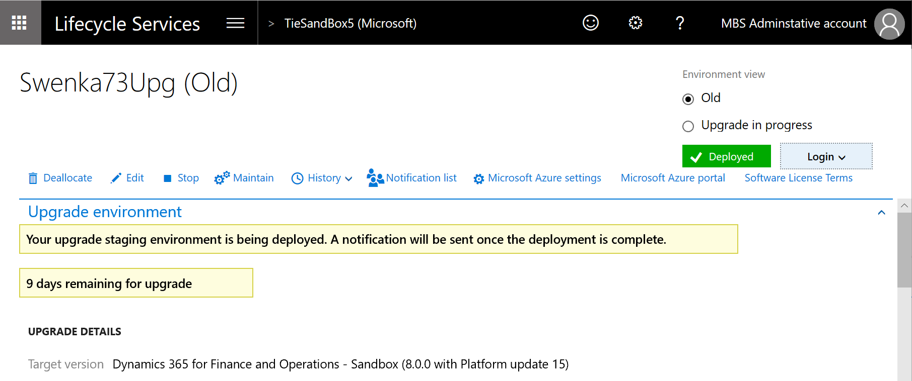
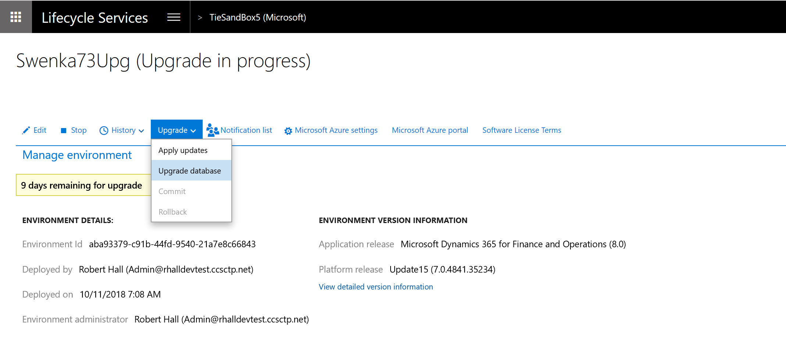
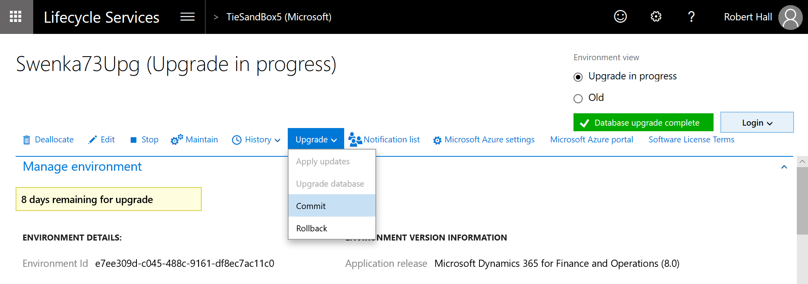

---
# required metadata

title: Process for moving to the latest update of Finance and Operations
description: This topic explains the process for moving to the latest update of Microsoft Dynamics 365 for Finance and Operations.
author: laneswenka
manager: AnnBe
ms.date: 12/10/2018
ms.topic: article
ms.prod: 
ms.service: dynamics-ax-platform
ms.technology: 

# optional metadata

# ms.search.form: 
# ROBOTS: 
audience: Developer, IT Pro
# ms.devlang: 
ms.reviewer: margoc
ms.search.scope: Operations
# ms.tgt_pltfrm: 
ms.custom: 102343
ms.assetid: e48d7424-371a-49ee-882c-07b7ceb00183
ms.search.region: Global
# ms.search.industry: 
ms.author: tabell
ms.search.validFrom: 2016-05-31
ms.dyn365.ops.version: Platform update 1

---

# Process for moving to the latest update of Finance and Operations

[!include [banner](../includes/banner.md)]

This topic explains the process of updating or upgrading to the latest release of Microsoft Dynamics 365 for Finance and Operations. It describes the overall process and supported scenarios, but it doesn't provide detailed instructions for every step of the process.

For information about the contents of each release of Finance and Operations, see [What's new or changed](../../fin-and-ops/get-started/whats-new-changed.md).

## Definitions

- **Public Preview** – A feature that has been made generally available to everyone, and the functionality is supported. There might be additional functionality improvements, or known issues, that must be resolved before the preview phase can end.
- **Deprecation** – A feature or process that won't be supported in the long term. The date when support for the feature or process will end should be stated.
- **Upgrade** – The process of moving from one official release of Finance and Operations to the next release, for source environments prior to version 8.0. Some examples are the move from 7.1 to 7.3, or from 7.3 to 8.0. The process involves setup of a free sandbox environment, code upgrade, and data upgrade.
- **Update** – The process of applying a binary package to an environment to move it from one official release of Finance and Operations to the next release, for source environments starting with version 8.0. This process has lower downtime requirements and doesn't involve data upgrade.

## Introduction to the scenarios

### Scenario 1: Update to a specific application hotfix (To be deprecated)

> [!IMPORTANT]
> This scenario will be deprecated by April 2019, when all customers should be on version 8.1 or later. Version 8.1 no longer releases or supports individual X++ hotfixes.

Use this scenario when one or more small hotfixes are required in order to address a specific issue, but business factors such as time or cost limitations prohibit a complete application update.

### Scenario 2: Upgrade your custom code

This scenario is required before you can use scenario 3. A developer must complete the upgrade of custom code before other activities can begin.

In version 8.0 and later, customization can't be done by overlayering Microsoft models. Before you upgrade, you must have a plan to refactor your customizations into extensions. For more information, see [Extensibility homepage](../extensibility/extensibility-home-page.md) and [Refactor overlayering on 8.0 environments](../extensibility/refactoring-over-layering.md).

### Scenario 3: Upgrade to the latest application release (Public Preview)

Use this scenario to move to the latest release of Finance and Operations.

By using the process that is defined later in this topic, you can set up a free sandbox environment. You will be in full control of the downtime window in both your pre-production and production environments.

### Scenario 4: Upgrade to the latest platform only

Use this scenario to update to the latest release of the platform when no application updates are required. Platform updates are always cumulative. Here are some examples of platform updates:

- Microsoft Dynamics AX with platform update 2 (August 2016)
- Microsoft Dynamics 365 for Finance and Operations, Enterprise edition with platform update 9 (July 2017)
- Microsoft Dynamics 365 for Finance and Operations, Enterprise edition with platform update 11 (October 2017)

> [!IMPORTANT]
> In Microsoft Dynamics AX with platform update 1 (May 2016) and Platform update 2, platform-level X++ code could be overlayered. In later platform updates, the platform-level X++ code is locked for overlayering. If you're upgrading from Platform update 1 or Platform update 2, your developers must refactor the overlayering as extensions before you can upgrade. If you're upgrading from Microsoft Dynamics 365 for Operations with platform update 3 (November 2016) or later to a later platform update, you don't have to refactor your X++ code.

## Scenario 1: Update to a specific application hotfix (To be deprecated)

> [!IMPORTANT]
> This scenario will be deprecated by April 2019, when all customers should be on version 8.1 or later. Version 8.1 no longer releases or supports individual X++ hotfixes.

Use this scenario when one or more small hotfixes are required in order to address a specific issue, but business factors such as time or cost limitations currently prevent you from doing a complete major application update.

To incorporate new features of the application, you don't have to do a complete upgrade of your application. All features in the current update of the application are available individually on Microsoft Dynamics Lifecycle Services (LCS). For more information about how to download hotfixes from LCS, see [Download hotfixes from Lifecycle Services](download-hotfix-lcs.md).

## Scenario 2: Upgrade your custom code

This scenario describes the process for upgrading code from an earlier release to the current release. This process is required before you can use scenario 3. A developer must complete this process before other activities can begin. A code upgrade is required when you deploy new environments as part of the process of upgrading your application to a new major or cumulative release. A code upgrade isn't required for platform updates.

| Source environment | Expected content of the AX7.version file for the source | Target environment | Is the code upgrade service required? |
|--------------------|---------------------------------------------------------|--------------------|---------------------------------------|
| Application 7.3 | 7.3.11971.56116 | Application release 8.x | Yes |
| July 2017 release (Application 7.2) | 7.2.11792.56024 | Application release 8.x or 7.3 | Yes |
| Release 1611 (Application 7.1) | 7.1.1541.3036 | Application release 8.x, 7.3, or July 2017 (7.2) | Yes |
| August 2016 release (Application 7.0.1 with Platform update 2) | 7.0.1265.27075 | Application release 8.x, 7.3, July 2017 (7.2) or 1611 (7.1) | Yes |
| May 2016 release (Application 7.0.1) | 7.0.1265.23014 | Application release 8.x, 7.3, July 2017 (7.2) or 1611 (7.1) | Yes |
| February 2016 release (Application 7.0) | 7.0.1265.3015 | Application release 8.x, 7.3, July 2017 (7.2) or 1611 (7.1) | Yes |
| Microsoft Dynamics AX 2012 | Not applicable | Application release 7.3 or July 2017 (7.2) | Yes |
| Application release 7.3 | Not applicable | Newer version of the platform | No |
| July 2017 release (Application 7.2) | Not applicable | Newer version of the platform | No |
| Release 1611 (application 7.1) | Not applicable | Newer version of the platform | No |
| May 2016 release (Platform update 1, application 7.0.1) | Not applicable | August 2016 release (Platform update 2, application 7.0.1) | No |

Regardless of whether you're a live customer or are still in the implementation phase of your project, follow these steps to upgrade your code to the latest platform and application updates.

1. Use the Code upgrade service in LCS to upgrade your code. For more information, see [Configure the code upgrade service in Lifecycle services](../lifecycle-services/configure-execute-code-upgrade.md).

    > [!NOTE]
    > The Code upgrade service also removes any old Microsoft X++ hotfixes that you've installed. Because the removal of old Microsoft X++ hotfixes is a required step, we recommend that you use the Code upgrade service even if you don't have custom code.

2. Deploy a new development environment that runs the new version that you're upgrading to. You will use this environment to merge code and refactor your custom code. Submit a request for a new development/test environment that runs the latest update.

    - You might have to delete your existing development/test environment if your subscription doesn't allow for a new development/test environment.
    - Depending on your project type, you might have these other options for deploying a developer virtual machine (VM):

        - Download a development virtual hard disk (VHD).
        - If you're running in your own Microsoft Azure subscription, deploy a new developer topology.

    - If you want to keep the development data from your old development environment, create a database backup, and keep the BAK file. Then, when you've completed the code upgrade, you can restore the database backup to your new development environment and do a data upgrade by following the steps in [Upgrade data in development, demo or sandbox environments](upgrade-data-to-latest-update.md).

3. Follow the code migration steps:

    1. Connect your development VM to Microsoft Azure DevOps, and map your local metadata folder to the Azure DevOps branch that contains your upgraded code.
    2. Synchronize, resolve any conflicts, build, and test.
    3. Merge the Azure DevOps branch that contains your upgraded code with your main development branch. For more information, see [Merge folders and files](https://www.visualstudio.com/docs/tfvc/merge-folders-files).
    4. Build and test.
    5. Create deployable packages of your code.

4. Install any hotfixes that apply to the environment.
5. Upload deployable packages to the LCS Asset library for your project.

For details about the code migration steps, see [Code migration](../dev-tools/developer-home-page.md#code-migration). After you've completed the code migration, continue to scenario 3.

## Scenario 3: Upgrade to the latest application release

> [!IMPORTANT]
> If you're using application version 8.0 and want to move to the 8.1 release, follow the simplified steps in [Update environments from 8.0 to 8.1](./appupdate-80-81.md).

These steps apply to customers who are live on an earlier release, and who want to do a full upgrade to the most recent platform and application releases. The steps might also apply to customers who have already deployed and configured a production environment, even if they haven't yet gone live. If you aren't upgrading your application but just want to upgrade your platform, use scenario 4 instead.

### Upgrade your code

First, upgrade your code as described in scenario 2. This step is a developer task. It's done in a developer environment that is running the new release that you're upgrading to.

### Upgrade your data in a development environment

Run the data upgrade process on a copy of your source database. If your environment is already live in production, the source database is a copy of the production database. Otherwise, the source database is your most current database. Run this process in the development environment that is running the release that you're upgrading to. This step is a validation process that is done by a developer. It helps the developer verify that the data upgrade can be completed successfully by using the specific set of customizations in this environment.

To make a copy of your production database, follow the steps in [Copy a Microsoft Dynamics 365 for Finance and Operations database from Azure SQL Database to a SQL Server environment](../database/copy-database-from-azure-sql-to-sql-server.md).

To run the data upgrade process, follow the steps in [Process for data upgrade for development or demo environments](upgrade-data-to-latest-update.md).

> [!IMPORTANT]
> - Data upgrade in a development environment is a required step. It helps reduce the risk of extended downtime and upgrade errors later, when you upgrade sandbox user acceptance testing (UAT) and production environments.
> - Several application hotfixes might be required before you can upgrade data. Before you redeploy your existing development environment, verify whether these hotfixes are required. Install the required hotfixes, and check them in to Azure DevOps. This step can be completed only in the old version of your development environment. For a list of the hotfixes that are required in various situations, see [Upgrade data in develop, demo, or sandbox environments](upgrade-data-to-latest-update.md#before-you-begin).
 
### Upgrade your Tier2+ Standard Acceptance Test sandbox environment

When you've completed the code upgrade and have been able to do an end-to-end data upgrade in your development environment, without having to manipulate data in Microsoft SQL Server, you can then begin the process in your sandbox environment.

#### Prerequisite

Before you begin your upgrade, we highly recommend that you make sure that your sandbox environment has the latest production data. If the data set is up to date, you can have more confidence that the upgrade will work in production. To complete this step, use the [Database Refresh](../database/database-refresh.md) self-service action.

#### Begin the upgrade

In your sandbox environment, on the **Maintain** menu, select **Upgrade**.

A dialog box appears, where you can select the latest application and platform combination.

> [!IMPORTANT]
> If you receive an error that states that preparation failed, see the [Known issues](#known-issues) section later in this topic.

#### Preparation

The environment details page will be refreshed, and options for two sandbox environments will now appear in the upper-right corner. By selecting the options, you can switch between your old sandbox and your new upgrade-in-progress sandbox.

The preparation stage can take eight hours or longer, because it's similar to a full environment deployment. The upgrade-in-progress environment is connected to an empty Microsoft Azure SQL database to speed up deployment, and it's running on the newer version that you selected to deploy.

During this time, your original sandbox is left untouched, and there is no downtime impact at this stage. 

> [!IMPORTANT]
> If you receive an error that states that staging deployment failed, the Microsoft Dynamics Service Engineering (DSE) team will be notified and will proactively resolve the issue for you. This issue can occur if Azure doesn't have the required resources available in your region. Microsoft DSE will work with the Azure engineers to allocate more resources. When staging deployment is successfully completed, you will receive an email. 

#### Package application

After staging deployment is completed, go back to the environment details page, and switch to the **Upgrade in progress** view. In this view, you will now see an **Upgrade** menu.

The **Upgrade** menu will include an **Apply updates** option. You can select this option to apply your software deployable packages to the new environment. These packages include any binary package, whether it's from an independent software vendor (ISV) solution, your own customization packages, or platform binary update packages. 

When you apply a new package to the environment, the process is the same as the process for regular environment servicing. When package application is completed, you must use the **Sign Off** button for that package before you can move on or apply another package.

If package deployment fails, you can use the **Rollback** button to reverse it. Note that this button is **not** the same as the **Rollback** option on the **Upgrade** menu.

**Upgrade Financial Reporting Binaries**
Database Refresh and other operations are blocked if your Sandbox and Production environments aren't on the same version of Financial Reporter.  During upgrade, it is an opportune time to uptake the latest binaries for Financial Reporting.  
* Visit the Asset Library in your implementation project, and then click *Software deployable package*.
* Click the *Import* button and find the latest Microsoft Dynamics Financial Reporting binary update package and select this for import.
* Apply this package to your Upgrade-in-progress enviroment.

Deployment of packages typically lasts about one hour.

#### Data upgrade and environment swap

After all packages are applied to your upgrade-in-progress sandbox, and you've signed off on them, you can begin the data upgrade.

> [!IMPORTANT]
> This stage will begin the downtime for your original sandbox environment.

On the **Upgrade** menu, select **Data upgrade**. Your original sandbox environment will be turned off, and the database connection will be swapped so that your new environment is connected to the original database. This process can take up to one hour.

Next, the data upgrade package for your target version will be automatically applied. The time that is required to apply the data upgrade package varies, depending on the size of your database.

#### Commit or rollback

After the data upgrade package is applied, you can review the environment, and your users can perform business validation activities. If this validation is successful, you can mark the whole upgrade as a success by selecting **Commit** on the **Upgrade** menu. You must commit the upgrade to move on to your production environment.

If the validation fails, you can select **Rollback** on the **Upgrade** menu. This option will perform a point-in-time restore of the database, swap the database connection back to your original sandbox, and bring your original sandbox back online. The sandbox will then be back in its previous state.

#### Upgrade production

When you reach this stage, you've finished the upgrade process. You can now begin the same process in your production environment. The steps that you follow are exactly the same.

If you encounter an issue that causes excessive downtime during your production upgrade, use the [Report production outage](https://docs.microsoft.com/business-applications-release-notes/April18/dynamics365-finance-operations/report-production-outage) process to alert Microsoft and get help.

#### Upgrade additional environments

You can upgrade additional sandbox environments in this same way. You also can deallocate and delete your other sandbox environments, and then redeploy on the newer version. By using the [Database Refresh](../database/database-refresh.md) self-service action, you can copy in the upgraded database from another sandbox or production environment.

#### Known issues

**Prepare operation could not start. Microsoft support has been notified. If the issue persists, please contact support with this ID.**

This known issue involves environment certificates on the LCS back end. If if affect you, submit a support ticket, and include the activity ID from the error message. Microsoft will work to resolve the issue. Microsoft is compiling a list of affect environments and intends to proactively fix this issue in the future.

**I want to cancel the upgrade and try again later.**

To cancel an upgrade, you can select **Cancel Upgrade** on the **Maintain** menu.  The **Maintain** menu is available in the **Old** view (for the original sandbox), not in the **Upgrade in progress** view (for the new sandbox).

**Upgrade failed at step X: DVT script for service model: MRProcessService.**

This DVT error is intermittent and can be resolved by using the **Resume** button for your data upgrade package. When you select **Resume**, the process will resume at this step. Microsoft is trying to reliably reproduce this issue and intends to produce a fix in the future.

**Application configuration sync failed. Call to TTSCOMMIT without first calling TTSBEGIN.**

This TTSCOMMIT error is intermittent and can be resolved by using the **Resume** button for your data upgrade package. When you select **Resume**, the process will resume at this step. Microsoft is trying to reliably reproduce this issue and intends to produce a fix in the future.

## Scenario 4: Upgrade to the most current platform only

If you're running an environment that doesn't have any customization of the platform Application Object Tree (AOT) models (Application Platform, Application Foundation, and Directory and Test Essentials), you can do an in-place update of your platform without upgrading to a new environment. For more information about this process, see [Upgrade Finance and Operations to the latest platform update](upgrade-latest-platform-update.md). If you upgrade only your platform, you don't have to do a code upgrade (scenario 2 in this topic) or run data upgrade scripts.
