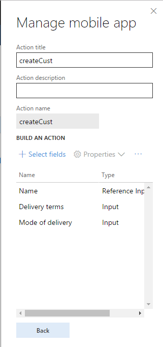
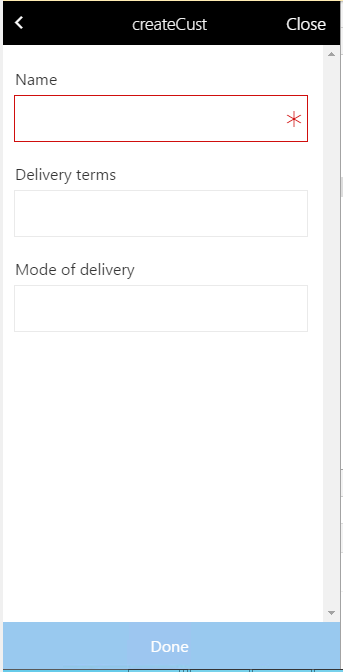
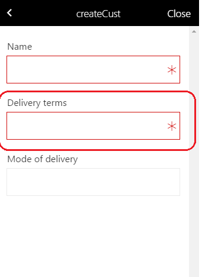

---
# required metadata

title: Set up mandatory fields through workspace classes
description: This topic explains how to use workspace classes to make a field mandatory.
author: makhabaz
manager: AnnBe
ms.date: 07/01/2017
ms.topic: article
ms.prod: 
ms.service: Dynamics365Operations
ms.technology: 

# optional metadata

# ms.search.form: 
# ROBOTS: 
audience: Developer, IT Pro
# ms.devlang: 
ms.reviewer: robinr
ms.search.scope: Operations, Platform
# ms.tgt_pltfrm: 
ms.custom: 255544
ms.assetid: 
ms.search.region: Global
# ms.search.industry: 
ms.author: makhabaz
ms.search.validFrom: 2017-07-20
ms.dyn365.ops.version: Platform update 3

---

# Set up mandatory fields through workspace classes
When you use the mobile app designer to select fields for actions, some properties can be inferred. These properties include the field length, the type, and whether the field is mandatory. The workspace classes can be used to update these properties. For example, you might want to specify that the **Name** field is mandatory when a customer record is created, as shown in the following images.





Follow these steps to make the **Delivery terms** field mandatory by using the workspace class.

1. Get the control name by using the app designer. In this example, the control name is **DynamicDetail_DlvTerm**.
2. Add the following code to set the **Mandatory** property for the control. This code uses the reflection-based **setProperty** method to set the **Mandatory** property.

    ```javascript
    public SysAppWorkspaceMetadata getWorkspaceMetadata()
    {
        SysAppWorkspaceMetadata appMetadata;
        appMetadata = super();
        var createCustAction = appMetadata.getAction("createCust");
        this.setCustAccountMandatory(createCustAction);
        return appMetadata;
    }
    private void setCustAccountMandatory(SysAPpActionMetadata _createCustAction)
    {
        var custAccount = +createCustAction.getControl("DynamicDetail_DlvTerm");
        custAccount.setProperty("Mandatory", true);
    }
    ```

3. Build the solution, and then update the app metadata on the mobile app.

The **Delivery terms** field is now marked as **Mandatory**, as shown in the following illustration.


