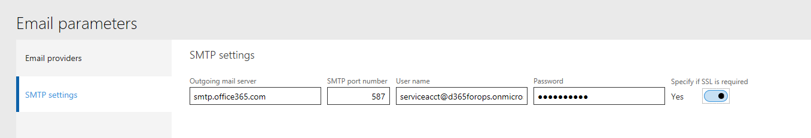
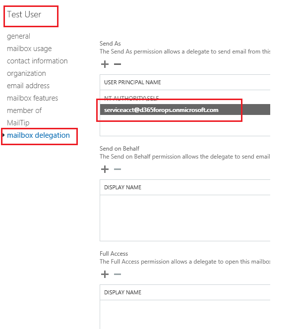

---
# required metadata

title: Troubleshoot the Office integration
description: This topic provides answers to questions, tips, and troubleshooting information for the Microsoft Office integration capabilities. The questions and issues that are discussed range across user, administration, and development scenarios.
author: ChrisGarty
manager: AnnBe
ms.date: 06/20/2017
ms.topic: article
ms.prod: 
ms.service: dynamics-ax-platform
ms.technology: 

# optional metadata

ms.search.form: OfficeAppParameters
# ROBOTS: 
audience: Developer, IT Pro
# ms.devlang: 
ms.reviewer: sericks
ms.search.scope: Operations
# ms.tgt_pltfrm: 
ms.custom: 72263
ms.assetid: 89588fed-b47f-4f01-9328-325518f016d6
ms.search.region: Global
# ms.search.industry: 
ms.author: cgarty
ms.search.validFrom: 2016-02-28
ms.dyn365.ops.version: AX 7.0.0

---

# Troubleshoot the Office integration 

[!include[banner](../includes/banner.md)]

This topic provides answers to questions, tips, and troubleshooting information about the capabilities of the Microsoft Office integration. The questions and issues that are discussed range across user, administration, and development scenarios.

## Frequently asked questions

### What platforms do the Office Add-ins support?

The Microsoft Excel Add-in and Microsoft Word Add-in are built by using the Office Web/JavaScript Add-in framework. This framework was originally released for Microsoft Office 2013 but received significant updates in Microsoft Office 2016. For more information, see [Office Add-in host and platform availability](http://dev.office.com/add-in-availability). The Excel Add-in requires ExcelAPI 1.2. Therefore, use the [Office Add-in host and platform availability](http://dev.office.com/add-in-availability) matrix to determine which platforms support the Excel Add-in. For many users, the phrase "Excel 2016 with the latest updates" is sufficient.

### Are the Office Add-ins safe?

In an age of malware, full connectivity, and compliance risks, nothing is completely secure. However, the web add-ins, like other websites, are basically a web application that interacts with the Office client products via a limited application programming interface (API). For more details, see [What can an Office Add-in do?](https://dev.office.com/docs/add-ins/overview/office-add-ins#what-can-an-office-add-in-do)

### Does the Excel Add-in support Office for Mac?

No. Support for Apple Mac and iOS is currently under development. The Office JavaScript (JS) APIs work differently in Apple Safari and Internet Explorer, especially in respect to authentication. For details about platform support for the Office JS APIs, see [Office Add-in host and platform availability](http://dev.office.com/add-in-availability).

### What version of Office is required for the Excel Add-in to support AD FS?

For more information, see the "Troubleshooting issue" section later in this topic.

### How can I force an update of Office?

If your Office build isn't updated, you might be on the deferred track ([Microsoft Office 365 ProPlus update channel option](https://technet.microsoft.com/en-us/library/mt455210.aspx)). In this case, you can [use the Office Deployment Tool to move to the Current channel](https://technet.microsoft.com/en-us/library/jj219422.aspx?f=255&MSPPError=-2147217396) or sign up for the [Office Insider program](https://products.office.com/en-us/office-insider) to help guarantee that you have the latest updates. The easiest method is to use the Office Deployment Tool to switch to the Current channel. In this case, the latest updates will be installed immediately.

### Why can't you tell me what version of Office or Excel a particular issue is fixed in?

Office has many releases. These releases receive updates at different times and have different version numbers that don't correspond. Some frequently used Office versions and update methods are Click to Run (C2R) Current channel, C2R Deferred, C2R First Update Deferred, Office Insider Fast, Office Insider Slow, and MSI/MSO (install from DVD). For more information about Office versions, see the [Office 365 client update channel releases](https://technet.microsoft.com/en-us/office/mt465751?f=255&MSPPError=-2147217396) page.

### Why am I having trouble signing into the Excel Add-in?

The Excel Add-in runs inside an Internet Explorer window. By default, the Excel Add-in picks up stored credentials from Internet Explorer, and Internet Explorer provides the current Microsoft Windows credentials if there are no stored credentials. Make sure that you're using the correct credentials to sign in. In the Excel Add-in, explicitly sign out, and then sign in to help guarantee that the correct credentials are used.

### The Excel Add-in seems to be slow when it publishes records. How can I learn more about what is occurring?

Most of the work that the Excel Add-in does should occur on the server. To learn where the time is being spent, you can use [Fiddler (a free download)](http://www.telerik.com/fiddler) to make sure that the Excel Add-in works as you expect.

The Excel Add-in sends the published records as a request. When those records are processed, the response is sent back from the server. The Excel Add-in then creates another message that contains the next set of records to publish, and sends that request. Five to ten seconds of processing time in the Excel Add-in should be required between the previous response from the server and the next request to the server.

To check processing time in the Excel Add-in versus the server/service, follow these steps.

1. Start [Fiddler](http://www.telerik.com/fiddler). 
2. Publish a few records to test the process.
3. Make sure that you can view that request and response in Fiddler ([make sure that HTTPS traffic is being decrypted](http://docs.telerik.com/fiddler/Configure-Fiddler/Tasks/DecryptHTTPS)).
4. Publish a larger number of records. 
5. In Fiddler, watch the time that is required from a request to its response, and from a response to the next request.

    - If the time from a request to its response is large, the bottleneck is the server/service.
    - If the time from a response to the next request is large, the bottleneck is the Excel Add-in (that is, the client).

## Troubleshooting issues

### \[Fixed\] Issue: During sign-in to the Excel Add-in, I receive the following error message: "AADSTS65001: The user or administrator has not consented to use the application with ID XYZ"

**Issue:** During sign in to the Excel Add-in, you receive the following error message: "AADSTS65001: The user or administrator has not consented to use the application with ID XYZ."

**Explanation:** Typically, this issue occurs because Microsoft Azure Active Directory (Azure AD) can't find the Azure AD application that represents the Excel Add-in. That issue occurs because, during the [configuration of Microsoft Power BI](..\analytics\configure-power-bi-integration.md), an Azure AD application was added that has the App ID URI set to the environment URL. 

**Fix:** Make sure that no Azure AD apps have the App ID URI set to the environment URL. App ID URIs should be fabricated, unique URIs, such as `https://contosoAXPowerBI`.

### \[Fixed\] Issue: During sign-in to the Excel Add-in, I receive the following error message: "AADSTS50001: The application named ABC was not found in the tenant named XYZ"

**Issue:** During sign-in to the Excel Add-in, you receive the following error message: "AADSTS50001: The application named ABC was not found in the tenant named XYZ."

**Explanation:** This issue probably occurs because an error in the deployment system caused the environment to get a URL that wasn't added to the configured list of service principals for the tenant. 

**Fix:** File a support issue for your environment, so that the problem can be investigated and the configuration can be adjusted.

### \[Fixed\] Issue: After the Excel Add-in starts and updates data, I receive the following error message: "An error occurred while writing to the data cache"

**Issue:** After the Excel Add-in starts and updates data, you receive the following error message: "An error occurred while writing to the data cache." The details of the error state, "The argument is invalid or missing or has an incorrect format." 

**Explanation:** You receive this error message if the client is open in Internet Explorer, and the user clicks **Open** immediately after he or she selects the **Open in Excel** option. The way that Internet Explorer handles temporary Internet files causes an issue in Excel. This issue, in turn, causes API calls to fail. 

**Workaround:** In Internet Explorer, when you open a workbook, click **Save** first, and then click **Open**. The file will then be opened from your Downloads folder. Alternately, use the Edge or Google Chrome browser. By default, both these browsers save files to a Downloads folder. Therefore, the issue doesn't occur. 

**Long-term fix:** We are working with the Office team to understand this issue so that it can be fixed in Excel.

### Issue: When I send email by using SMTP, the server response is "5.7.60 SMTP; Client does not have permissions to send as this sender"

**Issue:** When you send email by using Simple Mail Transfer Protocol (SMTP), you might receive an error message that states that the server response was "5.7.60 SMTP; Client does not have permissions to send as this sender." Alternatively, the error message might state, "Something went wrong while generating the report."

**Explanation:** This issue is usually caused by incorrect setup of the Send As permissions for the email account. 

**Fix:** You can configure Send As permissions in the Office 365 admin center (portal.office.com/Admin). Click **Users** > **Active users** > **User** > **Edit mailbox permissions** > **Send email from this mailbox**. For more information, see [Give mailbox permissions to another user in Office 365 - Admin Help](https://support.office.com/en-us/article/Enable-sending-email-from-another-user-s-mailbox-in-Office-365-2B828C5F-41AB-4904-97B9-3B63D8129C4E). 

The following illustration shows the setup of SMTP on the **Email parameters** page. Here, you must provide the outgoing mail server, port, user name, password, and Secure Sockets Layer (SSL) requirements. 

The permissions SMTP user account is `serviceacct@d365forops.onmicrosoft.com1`. 

> [!IMPORTANT]
> All users must give the SMTP account Send As permissions on their email setup in Office 365. This configuration is done in the mailbox permissions in Microsoft Exchange or in the Office 365 Admin portal. The following illustration shows the setup for the Test User account, where the STMP service account is added in the **Send As** section. 

### \[Fixed\] Issue: The Office Add-ins don't yet support AD FS

**Affected versions:** CTP8 and the February 2016 releases 

**Issue:** When users from an Azure AD tenant that uses Active Directory Federation Services (AD FS) try to sign in to the Office Add-ins (in other words, when the users enter their account, and then press Tab or click in the field to enter their password), a separate browser window opens. This browser window usually has a URL that starts with `https://az689774.vo.msecnd.net/dynamicsofficeapp/v1.2.1.0/App/DynamicsApp.html\#id\_token=`. The user can't sign in. 

**Explanation:** During sign-in to the Office add-ins (both the Excel Add-in and the Word Add-in), a redirect to the AD FS site for the tenant occurs. However, that site is an unknown and therefore disallowed application domain (AppDomain). 

**Long-term fix:** The long-term fix for this issue was put in place on May 10, 2016. The Office Add-ins now use a new Dialog API that the Office team added. 

**Taking advantage of the add-in updates that support AD FS:** All Office installations should be updated via **File** > **Account** > **Updates** (for click-to-run installations) or via Windows Update (for MSI installations). The AD FS Dialog API was included in the May update ([16.0.6868.2060](http://answers.microsoft.com/en-us/office/forum/office_2016-office_install/may-update-16068682060-for-office-2016-on-windows/ea082237-7ec3-4b06-895b-83490980e6d2?auth=1)). For information about updates, see the [Office 365 client update channel releases](https://technet.microsoft.com/en-us/office/mt465751?f=255&MSPPError=-2147217396) page. 

If your Office build isn't updated, you might be on the deferred track ([Microsoft Office 365 ProPlus update channel option](https://technet.microsoft.com/en-us/library/mt455210.aspx)). In this case, you can [use the Office Deployment Tool to move to the Current channel](https://technet.microsoft.com/en-us/library/jj219422.aspx?f=255&MSPPError=-2147217396) or sign up for the [Office Insider program](https://products.office.com/en-us/office-insider) to help guarantee that you have the latest updates. Additionally, see [Install the latest version of Office 2016](https://dev.office.com/docs/add-ins/develop/install-latest-office-version) and [Office 2016 Deployment Guides for Admins](https://technet.microsoft.com/en-us/library/cc303401(v=office.16).aspx). 

If Office updates can't be installed, the following workaround can unblock users.

#### Workaround: Use Internet Explorer to sign in to the client before you use the Office Add-ins

This workaround requires user knowledge and extra steps. After users have been educated about this workaround, it should be straightforward for them. 

**User steps:** Before users open Excel (or Word), they should sign in to the client by using Internet Explorer. 

**Explanation:** The Excel or Word Add-in will use the sign-in context, and no redirect will be required. The earlier sign-in must occur in Internet Explorer, because the Office Add-ins run inside an Internet Explorer window in Excel and Word. The sign-in context lasts 6 to 24 hours, depending on policies. Therefore, a new sign-in through Internet Explorer is required only occasionally.

1.  Exit Internet Explorer and Excel.
2.  Start Internet Explorer, and sign in to the client.
3.  Test the Excel Add-in by using an Open in Excel experience. (For example, click **Fleet Management** &gt; **Customers** &gt; **Customer** &gt; **Open in Microsoft Office** &gt; **Open in Excel** &gt; **Fleet Management Customers**.)

### \[Fixed\] Issue: The Excel Add-in doesn't correctly run or enable sign-in

**Issue:** When users try to sign into the Excel Add-in, a blank authentication dialog box appears, or an error message is shown instead of the authentication page. The user can't sign in. 

**Explanation:** The Excel Add-in relies on the Office Web JS Add-in platform and uses Azure AD for authentication. If a proxy is used, several URLs must be accessible for users to run and sign in to the Excel Add-in. Additionally, if AD FS is used, the AD FS URL must use HTTPS. 

**Solution:** Because this issue is a customer-specific network issue, it requires a customer-specific resolution. If AD FS is used, make sure that the AD FS URL uses HTTPS. Additionally, make sure that all the following URLs are accessible from the user's computer.

The following URLs are accessed for loading:

- `http://az689774.vo.msecnd.net:443`
- `https://az689774.vo.msecnd.net`
- `http://appsforoffice.microsoft.com:443`
- `https://appsforoffice.microsoft.com`
- `http://secure.aadcdn.microsoftonline-p.com:443`
- `https://secure.aadcdn.microsoftonline-p.com`
- `http://az416426.vo.msecnd.net:443`
- `https://az416426.vo.msecnd.net`
- `http://telemetryservice.firstpartyapps.oaspapps.com:443`
- `https://telemetryservice.firstpartyapps.oaspapps.com`
- `http://nexus.officeapps.live.com:443`
- `https://nexus.officeapps.live.com`
- `http://browser.pipe.aria.microsoft.com:443`
- `https://browser.pipe.aria.microsoft.com`
- `http://schemas.microsoft.com`

The following URLs are accessed for authentication:

- `http://login.windows.net:443`
- `https://login.windows.net`
- `http://login.microsoftonline.com:443`
- `https://login.microsoftonline.com`

## See also

[Office integration](office-integration.md)

[Office integration tutorial](office-integration-tutorial.md)

[Configuring Power BI integration](..\analytics\configure-power-bi-integration.md)
