---
# required metadata

title: Multi-user testing with Performance SDK and local test controller
description: This topic provides information about how tocomplete multi-user testing by using Visual Studio and Performance SDK with performance test scripts that are generated from Task Recorder. 
author: hasaid
manager: AnnBe
ms.date: 05/15/2019
ms.topic: article
ms.prod: 
ms.service: dynamics-ax-platform
ms.technology: 

# optional metadata

# ms.search.form: 
# ROBOTS: 
audience: Developer
# ms.devlang: 
ms.reviewer: kfend
ms.search.scope: Operations
# ms.tgt_pltfrm: 
ms.custom: 9954
ms.assetid: 7b605810-e4da-4eb8-9a26-5389f99befcf
ms.search.region: Global
# ms.search.industry: 
ms.author: jujoh
ms.search.validFrom: 2016-02-28
ms.dyn365.ops.version: AX 7.0.0

---

# Multi-user testing with Performance SDK and local test controller
[!include [banner](../includes/banner.md)]

## Prerequisites
Before you work through the steps in this topic, verify that you have the following prerequisites:

- A Dynamics 365 for Finance and Operations development environment with Platform Update 21 or above in own your Azure subscription
- Visual Studio 2015 Enterprise edition in development environment
- A tier 2 or above sandbox with the same release (App + PU) as your development environment
- You had configured development environment based on Single user testing with Task recorder and Performance SDK 
- C# performance testing classes for your E2E scenarios had been generated and you’re able to run single user test based on Single user testing with Task recorder and Performance SDK 

## Configure a Finance and Operations development environment for multi-user testing

1. Download [ODBC Driver 17 for SQL Server](https://download.microsoft.com/download/E/6/B/E6BFDC7A-5BCD-4C51-9912-635646DA801E/en-US/msodbcsql_17.2.0.1_x64.msi), rename the download file **msodbcsql**, and copy it to **Visual Studio Online** under the **perfSDK** folder.

	[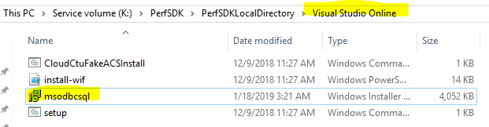](./media/multi-user-test-local-01.png)

2. Create a new environment variable, **TestRoot** and point it to teh **PerfSDK** folder by running the following cmdlet in powershell:

		[ENVIRONMENT]::SETENVIRONMENTVARIABLE("TESTROOT", "K:\PERFSDK\PERFSDKLOCALDIRECTORY", "USER")
 
   
	
3. Open a command prompt as an administrator and use the following commands to enerate and install the required certificate. When you’re prompted for a private key password, select None.

		"C:\Program Files (x86)\Windows Kits\8.1\bin\x64\makecert" -n "CN=127.0.0.1" -ss Root -sr LocalMachine -a sha256 -len 2048 -cy end -r -eku 1.3.6.1.5.5.7.3.1 -sv c:\temp\authcert.pvk c:\temp\authcert.cer

		"c:\Program Files (x86)\Windows Kits\8.1\bin\x64\pvk2pfx" -pvk c:\temp\authCert.pvk -spc c:\temp\authcert.cer -pfx c:\temp\authcert.pfx

Elements in above commands:

-n "CN=127.0.0.1" gives a human-readable name to the certificate. It's very important that the name of this certificate be 127.0.0.1. Otherwise, the single-user tests won't be able to run.
-eku 1.3.6.1.5.5.7.3.1 gives the purpose of the certificate. It indicates that the certificate can be used as a Secure Sockets Layer (SSL) server certificate.

Following certificates would be generated and saved in C:\Temp by above commands

- Authcert.pvk
- Authcert.cer
- Authcert.pfx

	
 
4. Install the **authcert.pfx** and **authcert.cer** certificates in the  **Local Machine\My** certificate store.
 
	
 
5. Copy the **authcert.pfx** certificate to the **PerfSDK** folder.

	
 
6. In the **Visual Studion Online** folder, replace **setup.md** with the following commands:
		
		setx testroot "%DeploymentDirectory%"
		ECHO Installing D365 prerequisites
		ECHO MSIEXEC /a %DeploymentDirectory%\msodbcsql /passive /norestart IACCEPTMSODBCSQLLICENSETERMS=YES
		MSIEXEC /a %DeploymentDirectory%\msodbcsql /passive /norestart IACCEPTMSODBCSQLLICENSETERMS=YES
		%windir%\sysnative\windowspowershell\v1.0\powershell.exe -File %DeploymentDirectory%\install-wif.ps1
		Md %DeploymentDirectory%\Common\Team\Foundation\Performance\Framework
		%DeploymentDirectory%\CloudCtuFakeACSInstall.cmd %DeploymentDirectory%\authcert.pfx

	[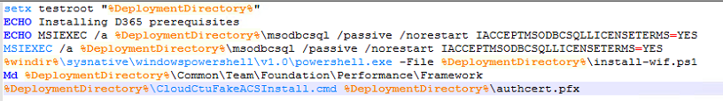](./media/multi-user-test-local-06.png)

7. Remove **%TestCertPassword%** from the CloudCtuFakeACSInstall.cmd import command.

	[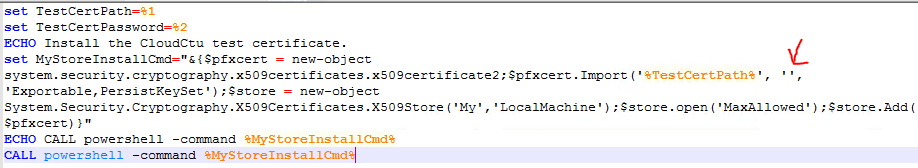](./media/multi-user-test-local-07.png)

## Prepare the PerfSDKSample solution for multi-user testing

1. In Visual Studio, go to **Test** \> **Test settings**, and then set **Default processor architecture** to **x64**.
 
	[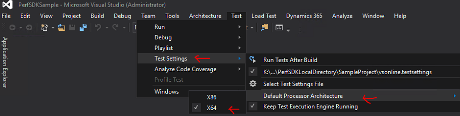](./media/multi-user-test-local-08.png)

2. Retrieve the thumbprint of the **authcert.pfx** certificate in your development environment by running the following cmdlets as an administrator, and then save the thumbprint somewhere as you will need this when you configure tier-2 or above sandbox.

		cd Cert:\LocalMachine\My
		Get-ChildItem | Where-Object { $_.Subject -like "CN=127.0.0.1" }
	 
	 [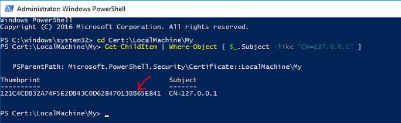](./media/multi-user-test-local-09.png)
	 
> [!NOTE]
> In an environment with Platform update 21 or later, there is a certificate automatically installed with 127.0.0.1 as the issuer. Verify that you retrieved the thumbprint of the certificate you generated.

3. Update **CloudEnvironment.config** to reflect your configurations. This includes:

    - Verify that **HostName** and **SOAPHostName** match your tier-2 or above sandbox environment.
    - Add the thumbprint of the **authcert.pfx** certificate as a value of **SelfSigningCertificateThumbprint** in **CloudEnviornment.Config**.
    - Update **UserCount** to reflect the number of testing users in your case.
    - Update **UserFormat** to reflect your test users naming convention.
    
    [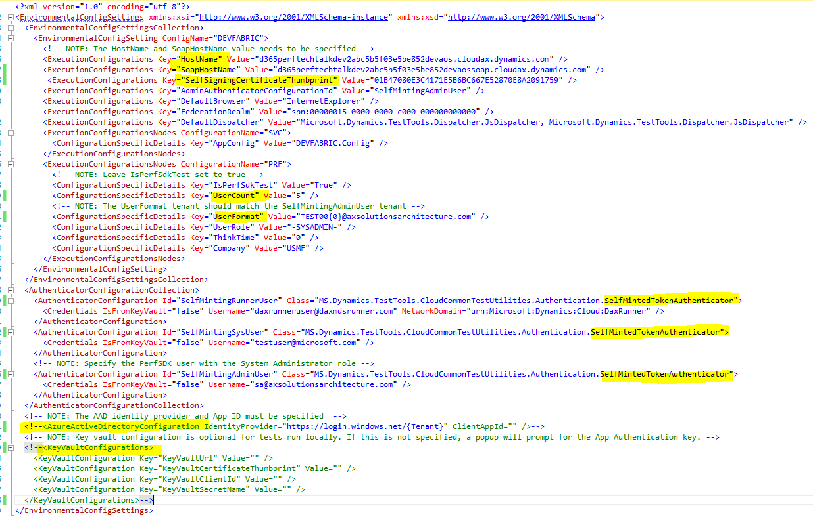](./media/multi-user-test-local-10.png)
 
4. Configure **vsonline.testsettings** by setting the **Set Test Run Location** as **Run tests using local computer or a test controller** on the **General** tab.

	[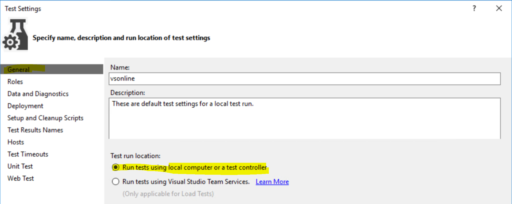](./media/multi-user-test-local-11.png)
 
> [!NOTE]
> If you don’t see **vsonline.testsettings**, reopen the solution.

5. On the **Deployment** tab, mark the **Enable deployment** check box and add the follwoing files or folders to the **Additional files and directories to deploy** section.

Add directory	K:\PerfSDK\PerfSDKLocalDirectory\SampleProject\PerfSDKSample\bin\Debug
Add directory	K:\PerfSDK\PerfSDKLocalDirectory\Visual Studio Online
Add file	K:\PerfSDK\PerfSDKLocalDirectory\CloudEnvironment.Config
Add file	K:\PerfSDK\PerfSDKLocalDirectory\authcert.pfx
Add file	K:\PerfSDK\PerfSDKLocalDirectory\MS.Dynamics.Test.Team.Foundation.WebClient.InteractionService.dll.config

 [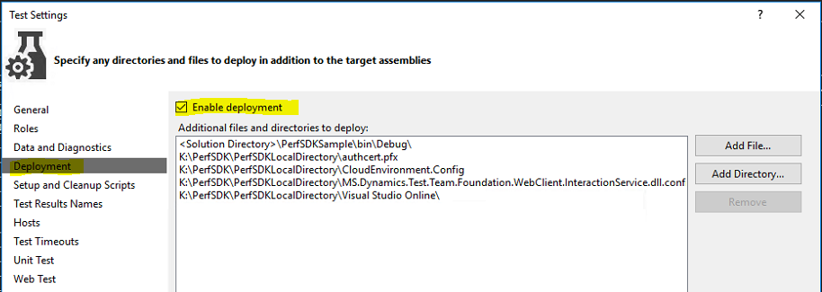](./media/multi-user-test-local-12.png)

> [!NOTE]
> When the warning, “Deployment item not in solution folder” appears, click **OK** to proceed.

6. Select **Run test in 64 bits process on 64 bits machine** as the value of **Run tests in 32 bits or 64 bits process** on the **Hosts** tab.

	
 
7. Click **Apply** and then close the **Test Settings** window.
8. Modify your C# performance class by adding the following statement to your C# perf tests:

		using MS.Dynamics.TestTools.UIHelpers.Core;

	[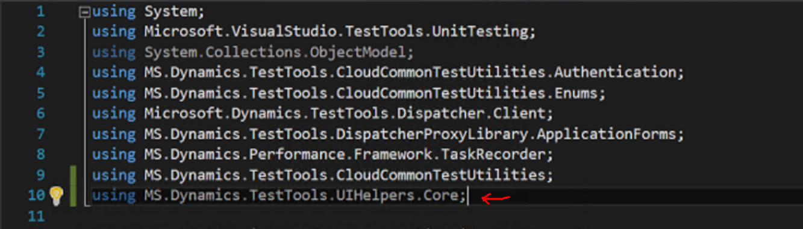](./media/multi-user-test-local-14.png)

9. Modify the method, **TestSetup** by adding the following codes to the beginning of the method **TestSetup()**:
			
			var testroot = System.Environment.GetEnvironmentVariable("DeploymentDir");
				    if (string.IsNullOrEmpty(testroot))
				    {
					testroot = System.IO.Directory.GetCurrentDirectory();
				    }
				    Environment.SetEnvironmentVariable("testroot", testroot); 

	

10. Remove comment codes with multi-user comments and comment out the line *Client = DispatchedClient.DefaultInstance;”* in the **TestSetup** method.

	[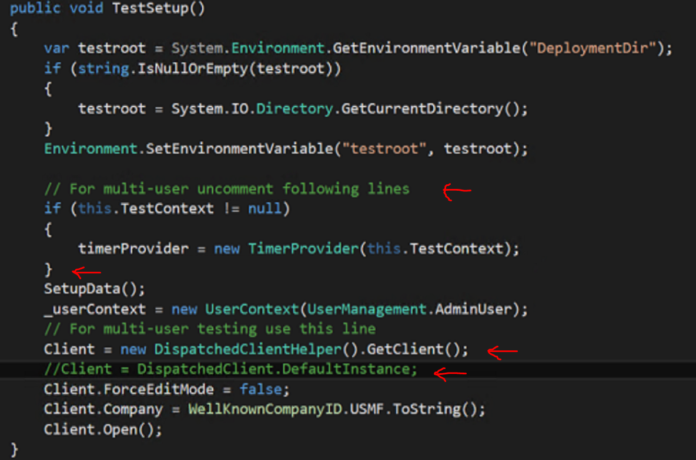](./media/multi-user-test-local-16.png)
 
11. Modify the **TestCleanup** method with the following code:
	
		public void TestCleanup()
		{
			Client.Close();
			Client.Dispose();
			Client = Null;
			//_userContext.Dispose();
		}

12. Repeat the previous ten steps for all C# performance test classes you have and then build the solution.
13. Select your test class in **Test Mix** of **SampleLoadTest.loadtest**.
 
 [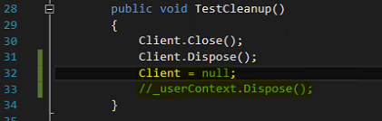](./media/multi-user-test-local-17.png)
 
14. Update **Timing** fields, including **Warm-up**, **Run**, and **Cool-down Duration** of **Run Settings1 [Active]** in **SampleLoadTest.loadtest**.

	[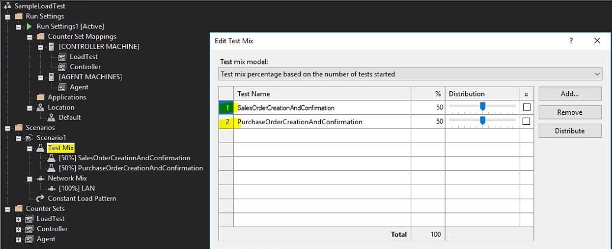](./media/multi-user-test-local-18.png)
 
15. Update the **Constant User Count** in **Constant Load Pattern** as the total number of users you want to run the test with.
 
 	
	
## Configure a tier-2 or above sandbox for multi-user testing

1. Install the **authcert.pfx** and **authcert.cer** certificates under **Local Machine\My** in each of AOS machines.
 
   
 
2. Add the thumbprint of the **authcert.pfx** certificate in the **wif.config** of your tier-2 or above sandbox.
3. Start **Internet Information Services (IIS) Manager** from **Administrative Tools** and then, under **Sites**, click **AOSService**.
4. On the right, click **Explore in Actions**, and locate **wif.config** in the bottom of your screen.
5. Add the thumbprint of the generated certificateto the bottom of authority [https://fakeacs.accesscontrol.windows.net/](https://fakeacs.accesscontrol.windows.net/)

   
   
6. Save the change and do an IIRESET.
7. Repeat steps three to six in each of AOS machines.
8. Open the **SampleLoadTest.load** test to create and import test users in your target environment, and then assign the System Administrator security role to each user.

  
 
> [!NOTE]
> You can also create test users by running MS.Dynamics.Performance.CreateUsers.exe. If you choose to do this, you don't need to complete an IISRESET.

## Run multi-user testing with local test controller

1. Click **Run Load Test**.
 
 
 
 
2. Review the test output.

   

## Troubleshooting
For information about single or multi-user testing with PerformanceSDK, see [Troubleshooting guide](troubleshoot-perf-sdk-user-testing.md).
