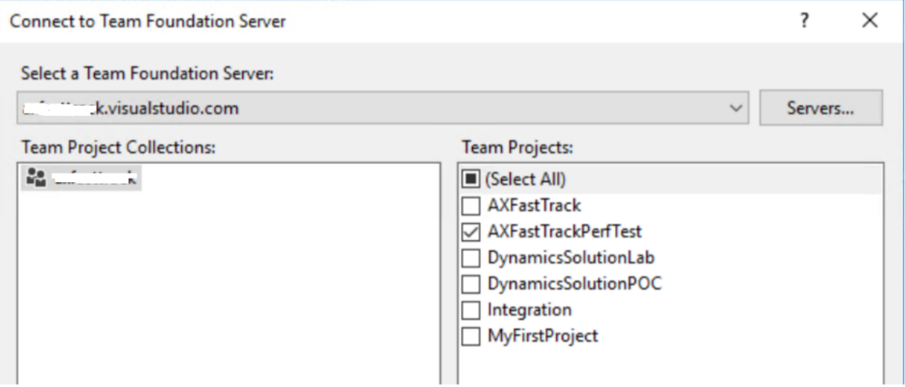
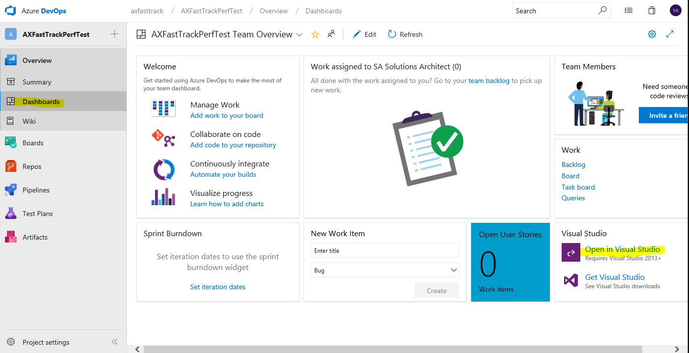
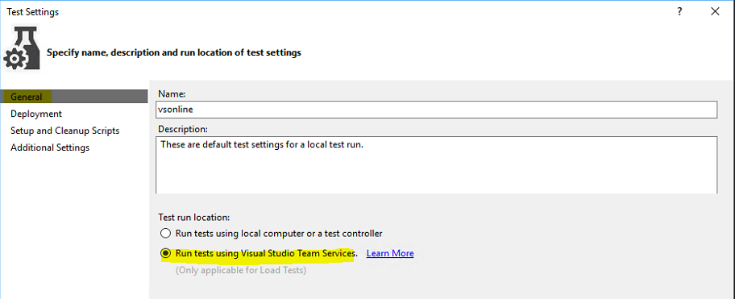
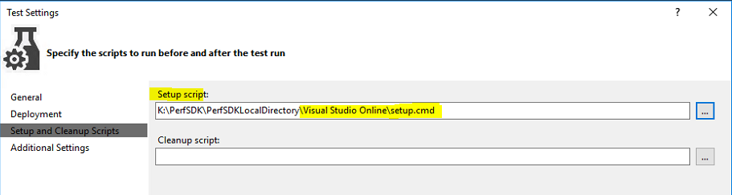
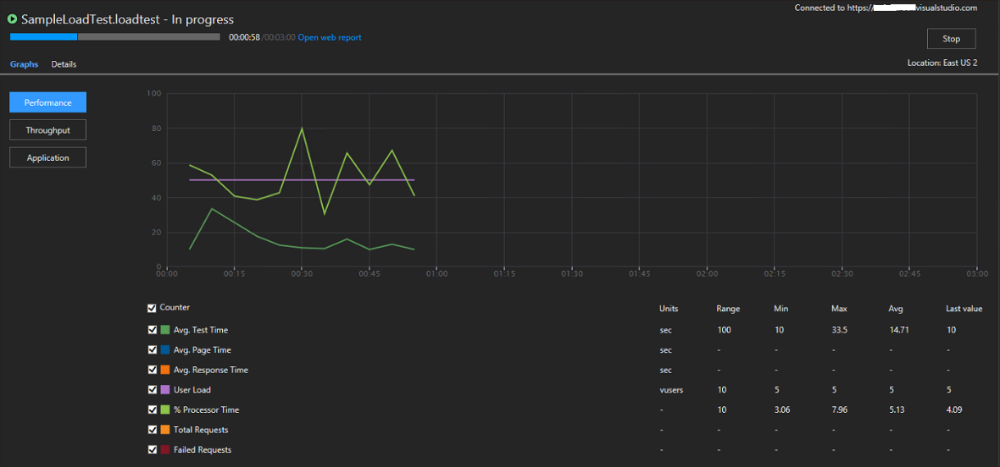
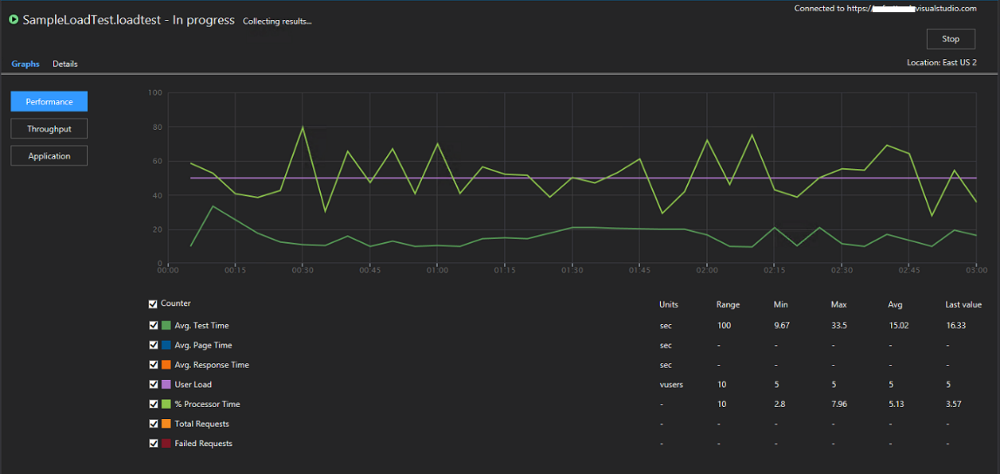
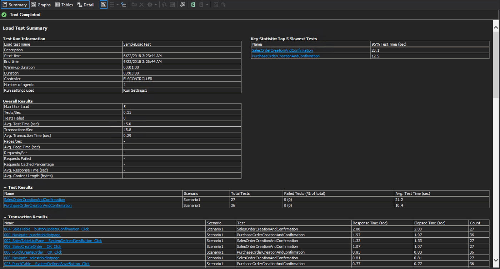
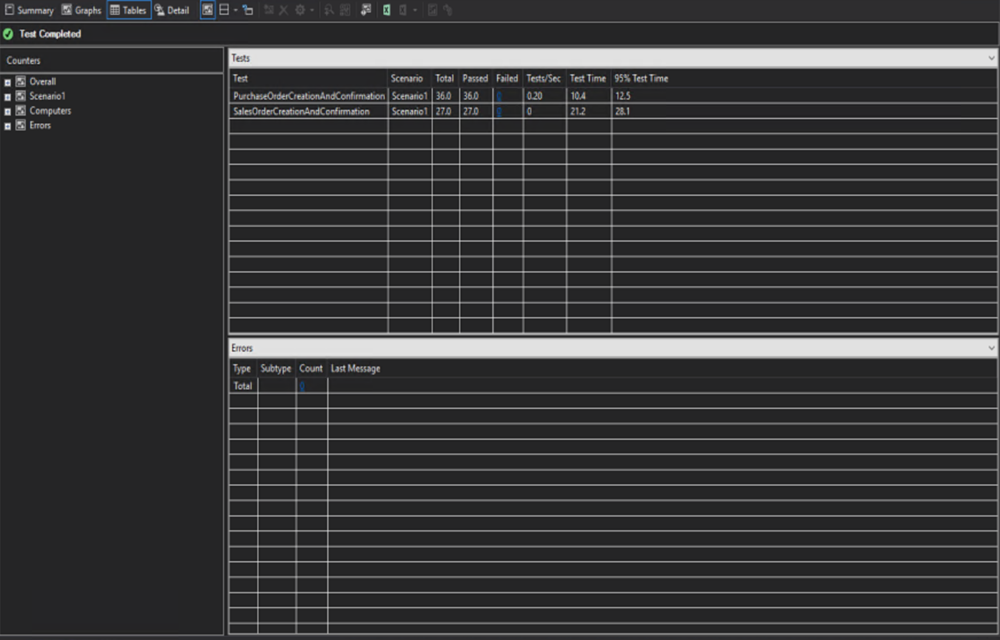

---
# required metadata

title: Multi-user testing with the Performance SDK and Azure DevOps
description: This topic explains how to do multi-user testing by using the Performance SDK and Microsoft Azure DevOps together with performance test scripts that are generated by using Task recorder. 
author: hasaid
manager: AnnBe
ms.date: 05/15/2019
ms.topic: article
ms.prod: 
ms.service: dynamics-ax-platform
ms.technology: 

# optional metadata

# ms.search.form: 
# ROBOTS: 
audience: Developer
# ms.devlang: 
ms.reviewer: kfend
ms.search.scope: Operations
# ms.tgt_pltfrm: 
ms.custom: 9954
ms.assetid: 7b605810-e4da-4eb8-9a26-5389f99befcf
ms.search.region: Global
# ms.search.industry: 
ms.author: jujoh
ms.search.validFrom: 2016-02-28
ms.dyn365.ops.version: AX 7.0.0

---

# Multi-user testing with the Performance SDK and Azure DevOps

[!include [banner](../includes/banner.md)]

## Prerequisites

Before you can complete the steps in this topic, verify that the following prerequisites are met:

- You have a Microsoft Dynamics 365 for Finance and Operations development environment that has platform update 21 or later in own your Microsoft Azure subscription
- You have Microsoft Visual Studio 2015 Enterprise edition in a development environment.
- You have a tier-2 or above sandbox that has the same release (application version and platform update) as your development environment.
- You've completed all the steps in [Single-user testing with Task recorder and the Performance SDK](single-user-test-perf-sdk.md) and all the steps except "Run multi-user testing with local test controller" in [Multi-user testing with Performance SDK and local test controller](multi-user-testing-local-test-controller.md).

## Prepare the PerfSDKSample solution for multi-user testing

1. Connect Microsoft Visual Studio in a development environment to an Azure DevOps project.

    

    > [!NOTE]
    > When you add the Azure DevOps server, use **https://\<YourAzureDevOpsAccount\>.visualstudio.com**.

2. On your Azure DevOps project dashboard, select **Open in Visual Studio**, and then select **Allow in prompted window**.

    

3. After Visual Studio is opened, verify that you're running it as an admin. If you aren't, close it, and then reopen it as an admin.
4. Change **vsonline.testsettings** for Azure DevOps.
5. In the **Test Settings** dialog box, on the **General** tab, select the **Run tests using Visual Studio Team Services** option.

    

6. On the **Deployment** tab, leave all the fields set as they were set in [Multi-user testing with Performance SDK and local test controller](multi-user-testing-local-test-controller.md).

    

7. On the **Setup and Cleanup Scripts** tab, point the **Setup script** field to the **setup.cmd** file under the **Visual Studio Online** folder.

    

8. On the **Additional Settings** tab, leave all the fields set as they were set in [Multi-user testing with Performance SDK and local test controller](multi-user-testing-local-test-controller.md).

    

9. Select **Apply and Close**.

## Run multi-user testing by using Azure DevOps

1. Open **SampleLoadTest.loadtest**.
2. Select **Run Load Test**.

    

    

    

3. Review the test output.

    

    

    

## Tips

To switch multi-user testing between the local test controller and Azure DevOps, create a copy of **testsettings** for each, and then select the copy that you want as **Active Test Settings**.

## Troubleshooting

For information about single-user or multi-user testing that uses the Performance SDK, see [Troubleshooting guide](troubleshoot-perf-sdk-user-testing.md).
