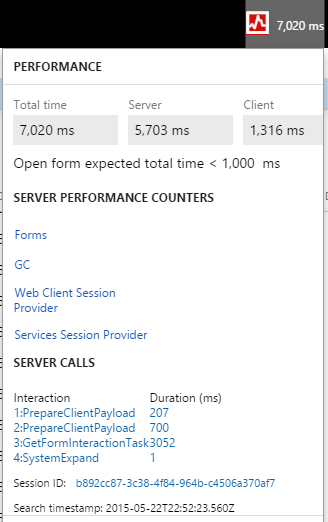
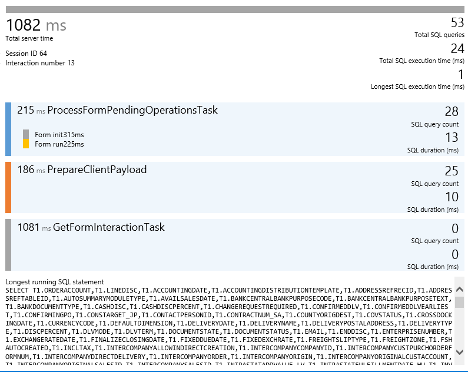

---
# required metadata

title: Performance timer
description: This topic provides an overview of the Performance timer, which is a tool that helps you to determine why your system's performance might be slow. 
author: RobinARH
manager: AnnBe
ms.date: 06/20/2017
ms.topic: article
ms.prod: 
ms.service: dynamics-ax-platform
ms.technology: 

# optional metadata

# ms.search.form: 
# ROBOTS: 
audience: Developer
# ms.devlang: 
ms.reviewer: robinr
ms.search.scope: AX 7.0.0, Operations, UnifiedOperations
# ms.tgt_pltfrm: 
ms.custom: 27191
ms.assetid: 64b8f266-a9e1-48ee-93c7-e082f21ddfa7
ms.search.region: Global
# ms.search.industry: 
ms.author: chwolf
ms.search.validFrom: 2016-02-28
ms.dyn365.ops.version: AX 7.0.0

---

# Performance timer

[!include[banner](../includes/banner.md)]

This topic provides an overview of the Performance timer, which is a tool that helps you to determine why your system's performance might be slow. 

To open the Performance timer, open your webpage with the added parameter debug=develop: https://*yoursite*.cloud.test.dynamics.com/en/?cmp=USMF&debug=develop **Note: **When you run in debug mode you will notice slower performance. You can quickly get an overview of most performance issues by pressing F12 and working with the debugging tools that are available in your browser. The timer will show up here. 

 

To open a list page, for example, such as the purchase order list page, click the Performance timer. The following screenshot shows the separation between client time and server time, and the total time. Additionally, you can see a set of performance counters and expensive server calls. 

 

For more information about the server performance counters, click on any of the links.

-   **Forms** - Forms will show how many forms are currently open, plus the rate at which they opened and closed (per second), and a set of counters, such as the total amount of created or closed forms.
-   **GC** - This is information about the garbage collection processes on the server.
-   **Web client session** - This shows how many web client sessions you currently have and how many are in use.
-   **Services Session provider** - This is the total number of sessions created.

For more information, click a link. In the next screen, you can see how many SQL queries were triggered by this individual call and which SQL query was the most expensive. 

 

This information can help you to understand what to trace and where to start troubleshooting. In addition to this topic, you can watch this video for more information: [PERF The Performance Timer and Other Tools](https://mix.office.com/watch/ij5cqidra5q3)

