---
# required metadata

title: PerfSDK and multiuser testing with Visual Studio Online
description: Take a tour of Performance SDK and multiuser testing with Visual Studio Online and learn how convert a scenario recorded with Task Recorder into a single user test and then a multiuser test.
author: RobinARH
manager: AnnBe
ms.date: 11/08/2017
ms.topic: article
ms.prod: 
ms.service: dynamics-ax-platform
ms.technology: 

# optional metadata

# ms.search.form: 
# ROBOTS: 
audience: Developer
# ms.devlang: 
ms.reviewer: robinr
ms.search.scope: Operations
# ms.tgt_pltfrm: 
ms.custom: 9954
ms.assetid: 7b605810-e4da-4eb8-9a26-5389f99befcf
ms.search.region: Global
# ms.search.industry: 
ms.author: chwolf
ms.search.validFrom: 2016-02-28
ms.dyn365.ops.version: AX 7.0.0

---

# PerfSDK and multiuser testing with Visual Studio Online

[!include[banner](../includes/banner.md)]


Take a tour of Performance SDK and multiuser testing with Visual Studio Online and learn how convert a scenario recorded with Task Recorder into a single user test and then a multiuser test.

*Time:* 30 minutes In this lab, you will take a tour of Performance SDK and multi user testing with Visual Studio Online. You will see how to convert a scenario recorded with Task Recorder and convert it to a single user test and then a multi user test. **Note:** This lab requires that you access the environment as an administrator. For more information, refer to the document named [Access Instances](..\dev-tools\access-instances.md). **Prerequisites**

-   Visual Studio 2015 Enterprise
-   Deployment with Volume Data
-   PerfSDK (look for a folder with that name in the C: or F: drive, depending on your environment)

## Steps to create a single user C\# test from an XML recording
A video about how to create a single user test can be found here: [https://mix.office.com/watch/qtdlasy2rcf3](https://mix.office.com/watch/qtdlasy2rcf3)

1.  Create a recording of a scenario that you want to test with Task Recorder.
2.  Run Visual Studio as Administrator. Build the PerfSDKSample project, which is in the PerfSDK folder. If you have already done this, skip this step.
3.  Open **Dynamics 365** &gt; **Addins** &gt; **C\#** perf test generator add-in from Visual Studio. Go to **Dynamics 365 **&gt; **Addins** &gt; **Create C\# perf test from recording**.
4.  You should see the following dialog. Fill in the required details and click **Import**.

    [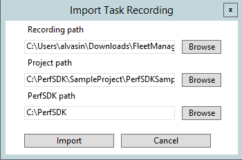](./media/perf103a.png)
    
5.  You should see generated C\# test in Generated folder in the project that you’ve selected.

## Steps to run single user performance test with Perf SDK:
-   Check that testroot environment variable is set to Perf SDK folder. Go to **Control Panel** &gt; **System and Security** &gt; **System** &gt; **Advanced System Settings**. 

    [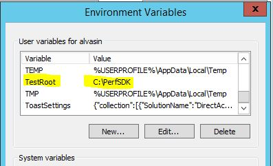](./media/testroot.jpg)[](./media/perf103c.png)
    
-   Download *selenium-dotnet-strongnamed-2.42.0.zip* and *IEDriverServer\_Win32\_2.42.0.zip* from [*http://selenium-release.storage.googleapis.com/index.html?path=2.42/*](http://selenium-release.storage.googleapis.com/index.html?path=2.42/).

<!-- -->

-   Make sure to copy download dll's to the following folder and add a reference to WebDriver.dll to your project

    [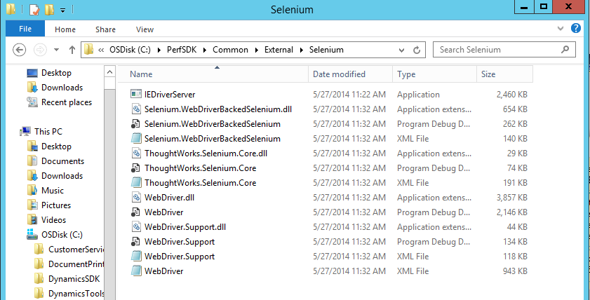](./media/perf103d.png)
    
-   Generate certificate and install it. To generate a certificate file, run the following commands: 

    [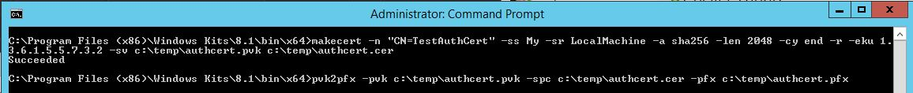](./media/generatecert.jpg)
    
    When prompted for private key password, select **None.** You should see the following files: 
    
    [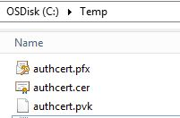](./media/tempcert.jpg)**Notable pieces:**
-   -n “CN=TestAuthCert” is giving a human-readable name to the cert, feel free to tweak for your scenario.
-   -eku 1.3.6.1.5.5.7.3.2 is certificate purpose. This is a client authentication cert, as opposed to code signing, encryption or something else. Next, install \*.pfx file (make sure to select Local Machine when you install it)  and copy this certificate file to PerfSDK folder.

Open Powershell window as Administrator and run the following command to get a thumbprint of installed certificate: 

[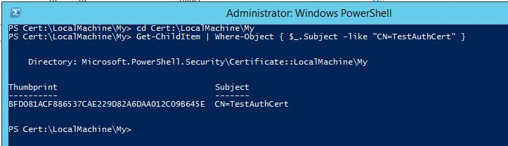](./media/get-thumbprint.jpg)

Put this thumbprint value in **CloudEnvironment.Config** file: 

[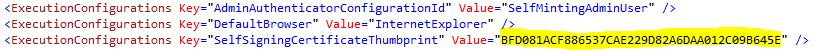](./media/config-thumbprint.jpg) 

The next step is to update **wif.config** to make AOS trust this certificate. To do that, open IIS and find Microsoft Dynamics 365 for Finance and Operations, Enterprise edition in the list of sites. Click **Explore** to open and find a file **wif.config**. 

[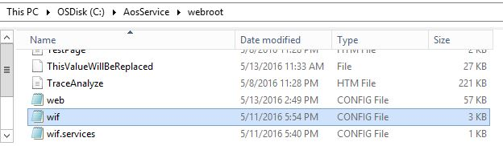](./media/wifconfig.jpg) 

Update this file by putting your certificate and authority name: 

[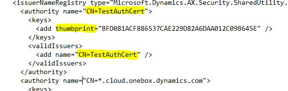](./media/wif-updated.jpg) 

And restart IIS. Open Sample project in Visual Studio and edit the file PurchaseReq.cs, which is a sample single user test. Comment the following lines in this file: 

[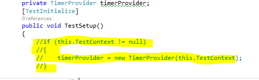](./media/perf103e.png) 

Modify your CloudEnvironment.Config file by entering your admin username. The following code is an example. **Note:** The ConfigName must be DEVFABRIC. 

[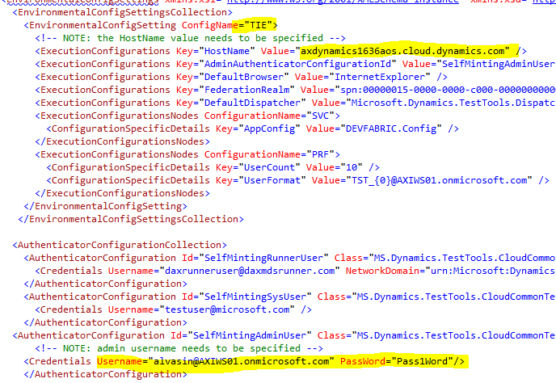](./media/perf103f.png) 

Enter your endpoint in CloudEnvironment.Config. **Note**: If you have an ARR-enabled environment, i.e. you have 2 endpoints like this:

-   apr-arr8aos**soap**.axcloud.test.dynamics.com
-   apr-arr8aos.axcloud.test.dynamics.com

You would need to enter both endpoints in CloudEnvironment.Config: 

[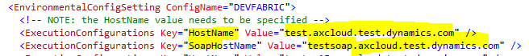](./media/perf103upd.png) 

Go to **Test** &gt; **Test settings** &gt; **Default processor architecture** and set it to x64. Build the solution. Go to **Test** &gt; **Windows** &gt; **Test Explorer** **Note:** Sometimes Visual Studio may not update the list of tests. In this case, restart Visual Studio and re-open the test Explorer. **Note:** Your newly created test will be named TestMethod. If you change the method name of TestMethod your test will get an individual name. Now you can run the test. You should see Internet Explorer starting and replaying the scenario that you've recorded.

## Steps to create a multiuser test from a single-user test
To convert a single-user test generated in the previous section to multiuser test, add MS.Dynamics.TestTools.UIHelpers.Core; to your test script and replace the following line in TestSetup method.

    Client = DispatchedClient.DefaultInstance;
    With
    DispatchedClientHelper helper = new DispatchedClientHelper();
    Client = helper.GetClient();

Make sure the values that you have entered during task recording are randomized. You may need to use the Data Expansion Tool first to generate test data.

## Setup Visual Studio Online for multiuser testing
For this example ProcureToPay.cs will be used. You need to go to log in to [Visual Studio Online portal](https://app.vssps.visualstudio.com/profile/view) and launch Visual Studio from there. Note: you need to do this only once. Once you have logged in in VSO, those settings are saved. 

[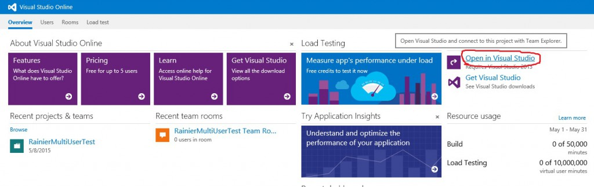](./media/vsonline-5.jpg) 

Open PerfSDK sample project. Make sure to update UserFormat entry in CloudEnvironment.Config file to reflect the admin user URL. Example: for [admin@example.com]() use [TST\_{0}@example.com]() as user format. Also make sure to change the UserCount to the amount of users you want to have in your performance test. 

[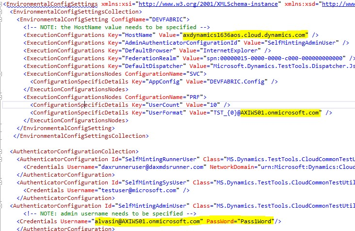](./media/vsonline-12.jpg) 

Run this command in PerfSDK folder: **MS.Dynamics.Performance.CreateUsers.exe** to create test users for your environment. You may create as many users as you want to, for this example 150 is used. *Example: **MS.Dynamics.Performance.CreateUsers.exe 150 USMF** will create 150 test users for company USMF.* Make sure that users were created in the system. Login to your endpoint as admin user and check.

### Testing sandbox

This step assumes you have a developer topology. Please follow the instructions from previous paragraph. There is one additional step you need to do in order to establish trust between your developer topology and/or Visual Studio Online test agent to communicate to sandbox machines: You would need to remote desktop to your AOS machine, copy over .cer file, install it by double-clicking on the file. When prompted for certificate store select **Personal:**

[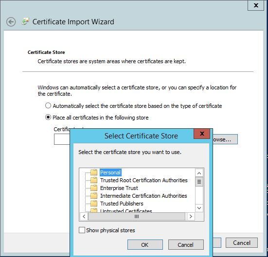](./media/personalstore.jpg) 

And update file **wif.config**. To update file **wif.config**, open IIS, find AOSService among websites and click Explore 

[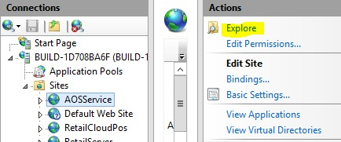](./media/vsonline-231.jpg) 

This action would open Explorer, you should be able to find **wif.config** in the opened folder. Update this file by putting certificate thumbprint and CN values (use the values from certificate you've generated on previous steps): 

[](./media/wif-updated.jpg) 

And restart IIS. Now you can run performance tests against this topology. **Note:** if your topology has multiple AOS machines, you need to install certificate and update wif.config on each of those machines.

## Run performance test
Open ProcureToPay.cs in Visual Studio editor and append the following lines in TestSetup method:

    var testroot = System.Environment.GetEnvironmentVariable("DeploymentDir"); 
    if (string.IsNullOrEmpty(testroot)) 
    {
        testroot = System.IO.Directory.GetCurrentDirectory(); 
    } 
    Environment.SetEnvironmentVariable("testroot", testroot);

Double click on file vsonline.testsettings in your solution files, use the following settings (your PerfSDK folder may be different): 

[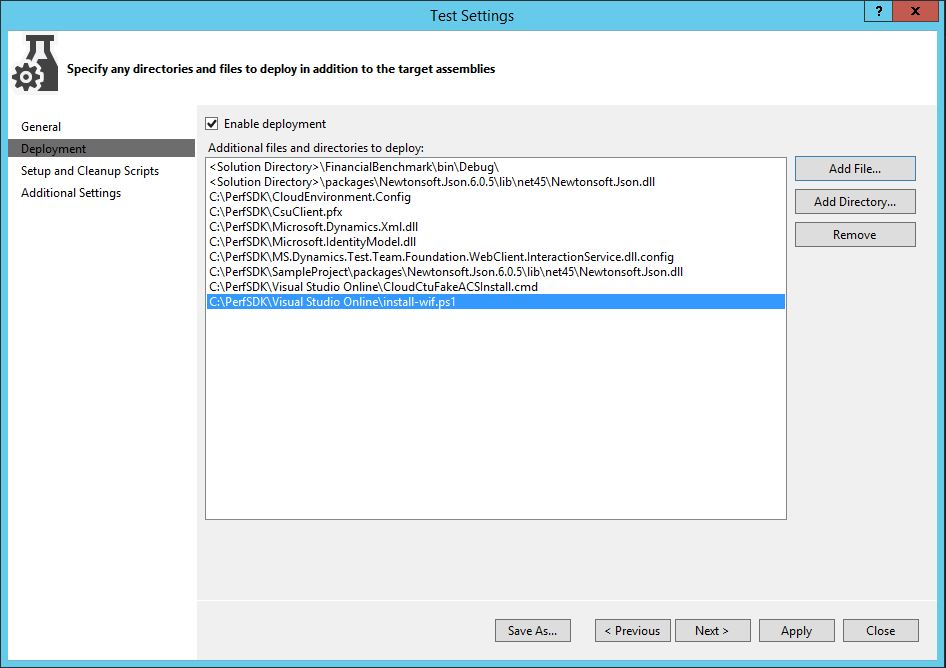](./media/vsonline-29.jpg) 

In **Setup and Cleanup Scripts** select setup.cmd located in %testroot%Visual Studio Onlinesetup.cmd. **Notable pieces:** you may need to update your deployment configuration to reflect your certificate name (for this demo **CsuClient.pfx **is used) and password. Make sure add \*.pfx file you've generated previously and update the following files:

-   **setup.cmd** with %DeploymentDirectory%CloudCtuFakeACSInstall.cmd %DeploymentDirectory%**YourCertificate.pfx**
-   **CloudCtuFakeACSInstall.cmd** with the password of your cert (that should be an empty string)

In **Additional Settings** select **Run tests in 64 bit process on 64 bit machine.** To run the test, open the **SampleLoadTest.loadtest** file and select **Run Load Test**. 

[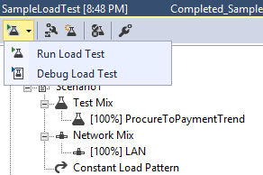](./media/perf103u.png) 

When the test finishes, you should see a summary with transaction results. 

[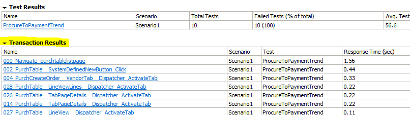](./media/perf103v.png) 

You can switch to **Graphs view** to view different indicators for the test controller and test scenario. **Note:** Information about your System under Test is not available in this view. To access this information you would have to use LCS to monitor your AOS CPU and memory usage, or set up perfmon directly on the AOS and set up the SQL/Windows Azure portal to monitor SQL DTU usage. 

[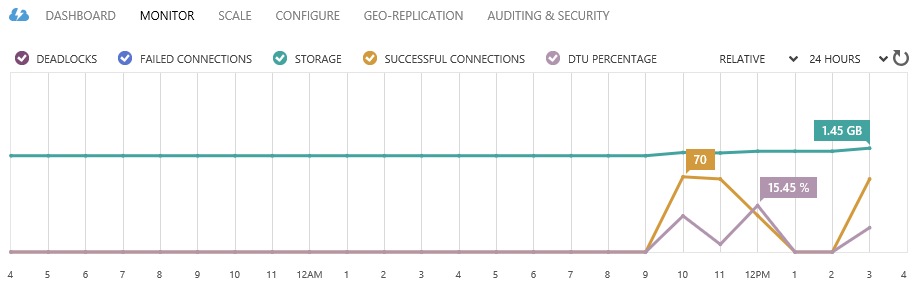](./media/perf103w.png)

## Troubleshooting

### Blank Web Client for Single User Test
The single user test runs and opens a web client.  A website is never loaded.  Instead, there is an empty web client with a white screen with the message "This is the initial start page for the WebDriver server" at the top of the page.  The test will eventually timeout and fail with an error message.

#### Error Example

```
Initialization method <Test class name>.TestSetup threw exception. System.TimeoutException: System.TimeoutException: No client was opened in the timeout period.
```
#### Solution
This problem can happen if trust has not been established with the LocalHostSSL certificate that was installed in the **SSL Certificate Add Failed** section above. To establish trust, ensure that the LocalHostSSL.cer has been installed in the **Trusted Root Certification Authorities** store.

### Zoom Factor
This issue occurs during single user tests. The test will fail very quickly with an error message.

#### Error Example

```Initialization method <Test class name>.TestSetup threw exception. System.InvalidOperationException: System.InvalidOperationException: Unexpected error launching Internet Explorer. Browser zoom level was set to 200%. It should be set to 100% (NoSuchDriver).
```
#### Solution
The IE zoom factor can be set to 100% by changing the following keys:
•	Computer\HKEY_CURRENT_USER\SOFTWARE\Microsoft\Internet Explorer\Zoom\ResetZoomOnStartup = 0
•	Computer\HKEY_CURRENT_USER\SOFTWARE\Microsoft\Internet Explorer\Zoom\ResetZoomOnStartup2 = 0
•	Computer\HKEY_CURRENT_USER\SOFTWARE\Microsoft\Internet Explorer\Zoom\Zoomfactor = 80000
 
Depending on the version of the local machine that is being used, before starting the RDP session it may be necessary to click **Change the size of text, apps and other items**. This field is available in the Windows **Display settings**. 
 
If none of this works, try changing the size of your remote desktop before starting the RDP session so that the default Internet Explorer zoom level is 100%. This is only necessary for single user tests.

### Certificate Thumbprint Errors

#### Error Example

```
Initialization method MS.Dynamics.Performance.Application.TaskRecorder.TestRecord1Base.TestSetup threw exception. 
System.TypeInitializationException: System.TypeInitializationException: The type initializer for 
'MS.Dynamics.TestTools.CloudCommonTestUtilities.Authentication.UserManagement' threw an exception. --> 
MS.Dynamics.TestTools.CloudCommonTestUtilities.Exceptions.WebAuthenticationException: 
Failed finding the certificate for minting tokens by thumbprint: b4f01d2fc42718198852cd23957fc60a3e4bca2e
```

#### Solution
There are a number of reasons that you could be seeing this error message:
1.	There could be invisible unicode characters in the certificate's thumbprint when you copied it into CloudEnvironment.config and wif.config.  To check this, paste your thumbprint into a Unicode code converter and see if extra characters show up in the HTML/XML field:


 

 
2.	The certificate may not be installed on the AOS machine. Check that the certificate can be found on the AOS machine by running the following PowerShell script:

```
cd Cert:\LocalMachine\My
Get-ChildItem | Where-Object { $_.Subject -like "CN=<your certificate's name>" }
```

If the thumbprint is not printed in the PowerShell console after running the script, this means the certificate cannot be found and must be installed following the steps described earlier in the instructions
 
3.	If this issue is present when running load tests, it is possible that the corresponding .pfx file is not being installed correctly by the setup scripts.  Check that the password specified in CloudCtuFakeACSInstall.cmd matches the password that the certificate was created with:
 

 
### No Endpoint Listening
This issue can show up when running single or multi-user tests, or when creating users with MS.Dynamics.Performance.CreateUsers.exe.
#### Error Example
Failed with the following error:

```
System.TypeInitializationException: The type initializer for 'MS.Dynamics.TestTools.CloudCommonTestUtilities.Authentication.UserManagement' threw an exception. ---> System.ServiceModel.EndpointNotFoundException: There was no endpoint listening at <web address> that could accept the message. This is often caused by an incorrect address or SOAP action. 
```

#### Solution
This issue indicates that the host specified in the CloudEnvironment.config is not accessible from the machine which is attempting to run the tests or create users.
 
In the CloudEnvironment.config file, check the values specified by the following keys:

```
<ExecutionConfigurations Key="HostName" Value="web address of host" />
<ExecutionConfigurations Key="SoapHostName" Value="web address of SOAP" />
```
The web addresses specified here must be the environment that you are testing.  Ensure that you can navigate to this web address within a web browser from your developer machine.
 
In the case of online load tests, the environment specified by the HostName field in the CloudEnvironment.config must be publicly accessible from any machine.  This means that you will not be able to load test a OneBox environment using Visual Studio Online.

### Could Not Enumerate AX Users
This issue can show up when running multi-user tests or creating users with MS.Dynamics.Performance.CreateUsers.exe.

#### Error Example

```System.TypeInitializationException: The type initializer for 'MS.Dynamics.TestTools.CloudCommonTestUtilities.Authentication.UserManagement' threw an exception. ---> System.InvalidOperationException: Could not enumerate AX users ---> System.ServiceModel.FaultException'1[System.ComponentModel.Win32Exception]: Forbidden
```

#### Solution
The user specified as the SelfMintingAdminUser must have the System Administrator role. This error will occur when the wrong user is specified as the SelfMintingAdminUser. You can check that you are specifying the correct user by logging onto the endpoint and viewing the user's roles.


### Forbidden Request with Client Authentication Scheme 'Anonymous'

#### Error Example
```
Initialization method <Test class name>.TestSetup threw exception. System.ServiceModel.Security.MessageSecurityException: System.ServiceModel.Security.MessageSecurityException: The HTTP request was forbidden with client authentication scheme 'Anonymous'. ---> System.Net.WebException: The remote server returned an error: (403) Forbidden..
```

#### Solution
This issue can occur when the number of users specified by the UserCount field in the CloudEnvironment.config  is greater than the number of test users created by running MS.Dynamics.Performance.CreateUsers.exe.  Ensure that you created more test users than you are requesting in CloudEnvironment.config
 


### At Least One Security Token Could Not Be Validated
This issue can show up when running multi-user tests or creating users with MS.Dynamics.Performance.CreateUsers.exe. The issue tends to be present when the AOS machine is a different machine than the developer machine. 

#### Error Example

```System.TypeInitializationException: The type initializer for 'MS.Dynamics.TestTools.CloudCommonTestUtilities.Authentication.UserManagement' threw an exception. ---> System.ServiceModel.Security.MessageSecurityException: An unsecured or incorrectly secured fault was received from the other party. See the inner FaultException for the fault code and detail. ---> System.ServiceModel.FaultException: At least one security token in the message could not be validated.
```

#### Solution
This issue is caused by the AOS endpoint not being able to validate the thumbprint of the certificate you created. The two possible reasons for this are the following:
1.	The certificate has not been installed on the AOS machine.
2.	The thumbprint of the certificate was not added to the wif.config file on the AOS machine.
 
For the case where the certificate has not been installed on the AOS machine, copy the .cer file that you created earlier in the instructions to the AOS machine. Install the .cer file in the "Trusted Root Certification Authorities" store on the AOS machine
 
For the case where the thumbprint of the certificate has not been added to the wif.config, please refer back to the section that describes the lines that must be added to the wif.config. Be sure to perform IISRESET after modifying wif.config.
 
### Missing MS.Dynamics.Test.Team.Foundation.WebClient.InteractionService.dll.config in Deployment Items
This issue usually only occurs when performing load tests.

#### Error Example

```
<Test class name>.TestSetup threw exception. System.InvalidOperationException: System.InvalidOperationException: Could not find endpoint element with name 'ClientCommunicationManager' and contract 'Microsoft.Dynamics.Client.InteractionService.Communication.Reliable.IReliableCommunicationManager' in the ServiceModel client configuration section. This might be because no configuration file was found for your application, or because no endpoint element matching this name could be found in the client element.. at System.ServiceModel.Description.ConfigLoader.LoadChannelBehaviors(ServiceEndpoint serviceEndpoint, String configurationName)
```

#### Solution
This is caused by being unable to locate the MS.Dynamics.Test.Team.Foundation.WebClient.InteractionService.dll.config file when the load tests run. This happens when the MS.Dynamics.Test.Team.Foundation.WebClient.InteractionService.dll.config file was not added as a deployment item. To verify that this is the case, check if the MS.Dynamics.Test.Team.Foundation.WebClient.InteractionService.dll.config is in the out folder for the test run: 

```
<solution path>\TestResults\<your test run>\Out
```

If the config file is missing, simply add it to the deployment items in the test settings in the same way as in Issue 6.
 
Note that there are two very similarly named files. One is *.dll and one is *.dll.config. The *.dll.config must be in the deployment items in the test settings.
 
### Missing CloudEnvironment.config in Deployment Items
This issue usually only occurs when performing load tests.

#### Error Example

```
Initialization method <Test class name>.TestSetup threw exception. 
System.TypeInitializationException: System.TypeInitializationException: The type initializer for 'MS.Dynamics.TestTools.CloudCommonTestUtilities.Authentication.UserManagement' threw an exception. ---> MS.Dynamics.TestTools.TestLogging.EvaluateException: Assert.Fail failed. DateTime="10/13/2017 14:42:55" "The type initializer for 'MS.Dynamics.TestTools.CloudCommonTestUtilities.Authentication.SecretSettingsHelper' threw an exception.".
```

#### Solution
This issue is caused when the CloudEnvironment.config file is not present when the tests run. Typically shows up when running load tests and the CloudEnvironment.config file was not added as a deployment item. To verify that this is the case, check if the CloudEnvironment.config is in the out folder for the test run: <solution path>\TestResults\<your test run>\Out
If the config file is missing, simply add it to the deployment items in the test settings:


### InteractiveClientID was not Specified in Settings

#### Error Example
```The type initializer for 'MS.Dynamics.TestTools.CloudCommonTestUtilities.Authentication.SecretSettingsHelper' threw an exception. --->
Microsoft.CE.VaultSDK.SecretProviderException: InteractiveClientId was not specified in settings
```

#### Solution
This error occurs when the field SelfSigningCertificateThumbprint is left blank in the CloudEnvironment.config file. Paste the thumbprint of the certificate you created and installed in the following line in the CloudEnvironment.config file:

```
<ExecutionConfigurations Key="SelfSigningCertificateThumbprint" Value="" />
``` 
### An Existing Connection was Forcibly Closed by the Remote Host

#### Error Example

```
System.TypeInitializationException: System.TypeInitializationException: The type initializer for
'MS.Dynamics.TestTools.CloudCommonTestUtilities.Authentication.UserManagement' threw an exception. --->
System.ServiceModel.CommunicationException: An error occurred while making the HTTP request to
<Host name>/Services/AxUserManagement/Service.svc/ws2007FedHttp. This could be due to the fact 
that the server certificate is not configured properly with HTTP.SYS in the HTTPS case. This could also be caused 
by a mismatch of the security binding between the client and the server.** ---> System.Net.WebException: 
The underlying connection was closed: An unexpected error occurred on a send. ---> System.IO.IOException: 
Unable to read data from the transport connection: An existing connection was forcibly closed by the remote host. ---> 
System.Net.Sockets.SocketException: An existing connection was forcibly closed by the remote host. 
```

#### Solution
Run the following Windows PowerShell script on the development machine:

```
Set-ItemProperty HKLM:\SOFTWARE\Microsoft\.NETFramework\v4.0.30319 -Name SchUseStrongCrypto -Value 1 -Type dword -Force -Confirm:$false
if ((Test-Path HKLM:\SOFTWARE\Wow6432Node\Microsoft\.NETFramework\v4.0.30319)) 
{ 
 Set-ItemProperty HKLM:\SOFTWARE\Wow6432Node\Microsoft\.NETFramework\v4.0.30319 -Name SchUseStrongCrypto -Value 1 -Type dword -Force -Confirm:$false 
}
```
