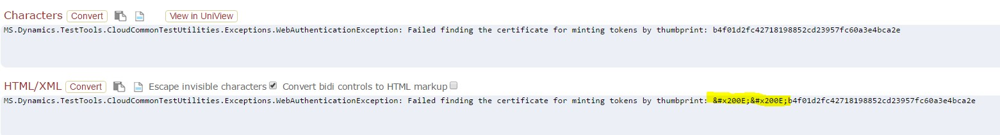

---
# required metadata

title: Performance SDK and multiuser testing via Visual Studio Online
description: This tutorial introduces the Performance SDK and shows how to do multiuser testing via Visual Studio Online. It also shows how to convert a scenario that you recorded in Task recorder to a single-user test and then a multiuser test.
author: RobinARH
manager: AnnBe
ms.date: 11/08/2017
ms.topic: article
ms.prod: 
ms.service: dynamics-ax-platform
ms.technology: 

# optional metadata

# ms.search.form: 
# ROBOTS: 
audience: Developer
# ms.devlang: 
ms.reviewer: robinr
ms.search.scope: Operations
# ms.tgt_pltfrm: 
ms.custom: 9954
ms.assetid: 7b605810-e4da-4eb8-9a26-5389f99befcf
ms.search.region: Global
# ms.search.industry: 
ms.author: chwolf
ms.search.validFrom: 2016-02-28
ms.dyn365.ops.version: AX 7.0.0

---

# Performance SDK and multiuser testing via Visual Studio Online

[!include[banner](../includes/banner.md)]

This tutorial introduces the Performance software development kit (SDK) and shows how to do multiuser testing via Microsoft Visual Studio Online. It also shows how to convert a scenario that you recorded in Task recorder to a single-user test and then a multiuser test.

**Time to complete this tutorial:** 30 minutes

> [!NOTE]
> This tutorial requires that you access the environment as an administrator. For more information, see [Access instances](..\dev-tools\access-instances.md).

## Prerequisites

- Microsoft Visual Studio 2015 Enterprise
- A deployment that has volume data
- Performance SDK (Look for a folder that is named **PerfSDK** on drive C or F, depending on your environment.)

## Create a single-user C# test from an XML recording

To view a video that shows how to create a single-user test, go to [https://mix.office.com/watch/qtdlasy2rcf3](https://mix.office.com/watch/qtdlasy2rcf3).

1. Use Task recorder to create a recording of the scenario that you want to test.
2. Start Microsoft Visual Studio as administrator, and build the **PerfSDKSample** project. This project is in the **PerfSDK** folder. If you've already built the project, skip this step.
3. Select **Dynamics 365** > **Addins** > **Create C# perf test from recording**.
4. In the **Import Task Recording** dialog box, enter the required details, and then select **Import**.

    [](./media/perf103a.png)

    A C# test is generated in the **Generated** folder for the project that you selected.

## Run a single-user performance test by using the Performance SDK

1. In Control Panel, select **System and Security** > **System** > **Advanced System Settings**. Verify that the **TestRoot** environment variable is set to the path of the PerfSDK folder.

    [](./media/testroot.jpg)[](./media/perf103c.png)

2. Download **selenium-dotnet-strongnamed-2.42.0.zip** and **IEDriverServer\_Win32\_2.42.0.zip** from [http://selenium-release.storage.googleapis.com/index.html?path=2.42/](http://selenium-release.storage.googleapis.com/index.html?path=2.42/).
3. Extract the files, and copy the dynamic-link libraries (DLLs) to the **PerfSDK\\Common\\External\\Selenium** folder. Add a reference to **WebDriver.dll** to your project.

    [](./media/perf103d.png)

4. Generate and install a certificate. To generate a certificate file, open a Command Prompt window as an administrator, and run the following commands.

    ```
    C:\Program Files (x86)\Windows Kits\8.1\bin\x64>makecert -n "CN=TestAuthCert" -ss My -sr LocalMachine -a sha256 -len 2048 -cy end -r -eku 1.3.6.1.5.5.7.3.2 -sv c:\temp\authcert.pvk c:\temp\authcert.cer

    C:\Program Files (x86)\Windows Kits\8.1\bin\x64>pvk2pfx -pvk c:\temp\authcert.pvk -spc c:\temp\authcert.cer -pfx c:\temp\authcert.pfx
    ```

    Note the following elements in these commands:

    - **-n "CN=TestAuthCert"** gives a human-readable name to the certificate. You can adjust the name to suit your scenario.
    - **-eku 1.3.6.1.5.5.7.3.2** gives the purpose of the certificate. This certificate is a client authentication certificate instead of a code signing certificate, an encryption certificate, or some other type of certificate.

    When you're prompted for a private key password, select **None**.

    You should see the following files:

    - authcert.pfx
    - authcert.cer 
    - authcert.pvk

5. Install the **\*.pfx** certificate file. When you install it, make sure that you select **Local Machine**. Then copy the file to the **PerfSDK** folder.
6. Open a Microsoft Windows PowerShell window as an administrator, and run the following command to get the thumbprint of the installed certificate.

    ```
    PS Cert:\LocalMachine\My> cd Cert:\LocalMachine\My
    PS Cert:\LocalMachine\My> Get-ChildItem | Where-Object { $_.Subject -like "CN=TestAuthCert" }
    ```

    [](./media/get-thumbprint.jpg)

7. In the **CloudEnvironment.Config** file, enter the thumbprint as the value for the **SelfSigningCertificateThumbprint** key.

    [](./media/config-thumbprint.jpg)

8. Follow these steps to update the **wif.config** file so that Application Object Server (AOS) trusts the certificate:

    1. Start Internet Information Services (IIS), and find **Microsoft Dynamics 365 for Finance and Operations, Enterprise edition** in the list of sites.
    2. Select **Explore**, and find the **wif.config** file.

        [](./media/wifconfig.jpg)

    3. Update this file by entering the certificate and authority name.

        [](./media/wif-updated.jpg)

    4. Restart IIS.

9. In Visual Studio, open the **PerfSDKSample** project, and find the **PurchaseReq.cs** file. This file is a sample single-user test. In the file, comment out the following lines.

    ```
    if (this.TestContext !=null)
    {
        timerProvider = new TimerProvider(this.TestContext);
    }
    ```

    [](./media/perf103e.png)

10. Modify the **CloudEnvironment.Config** file by entering your admin user name. Here is an example.

    > [!NOTE]
    > **ConfigName** must be set to **DEVFABRIC**. 

    [](./media/perf103f.png) 

11. In the **CloudEnvironment.Config** file, enter your endpoint.

    > [!NOTE]
    > If the environment is enabled for Application Request Routing (ARR), you have two endpoints. Here is an example:
    >
    > - apr-arr8aos**soap**.axcloud.test.dynamics.com
    > - apr-arr8aos.axcloud.test.dynamics.com
    >
    > In this case, you must enter both endpoints in the CloudEnvironment.Config file.
    >
    > [](./media/perf103upd.png)

12. Select **Test** &gt; **Test settings**, set **Default processor architecture** to **x64**, and then build the solution.
13. Select **Test** &gt; **Windows** &gt; **Test Explorer** to view the list of tests.

    > [!NOTE]
    > Sometimes, Visual Studio might not update the list of tests. In this case, restart Visual Studio, and then reopen Test Explorer.

    Your new test will be named **TestMethod**. If you change the method name of **TestMethod**, your test will get an individual name. 

You can now run the test. When you run the test, Internet Explorer should be started, and it should replay the scenario that you recorded.

## Create a multiuser test from a single-user test

After you create a single-user test by using the information in the previous section, you can convert it to a multiuser test. Add **MS.Dynamics.TestTools.UIHelpers.Core;** to your test script, and replace the following line in the **TestSetup** method.

```
Client = DispatchedClient.DefaultInstance;
With
DispatchedClientHelper helper = new DispatchedClientHelper();
Client = helper.GetClient();
```

Make sure that the values that you entered when you made the task recording are randomized. You might have to use the Data Expansion Tool first to generate test data.

## Set up Visual Studio Online for multiuser testing

For this example, you will use the ProcureToPay.cs file. To start Visual Studio, you must sign in to the [Visual Studio Online portal](https://app.vssps.visualstudio.com/profile/view), and then select **Open in Visual Studio**.

> [!NOTE]
> You must complete this step only one time. After you've signed in to Visual Studio Online, the settings are saved.

[](./media/vsonline-5.jpg)

1. Open the **PerfSDKSample** project.
2. In the **CloudEnvironment.Config** file, update the **UserFormat** entry so that it reflects the admin user URL. For example, for `admin@example.com`, use **TST\_{0}@example.com** as the user format. Additionally, change the **UserCount** value to the number of users that you want to have in your performance test.

    [](./media/vsonline-12.jpg)

3. In the **PerfSDK** folder, run the following command to create test users for your environment.

    ```
    MS.Dynamics.Performance.CreateUsers.exe
    ```

    You can create as many users as you want. For example, the following command creates 150 test users for the USMF company.

    ```
    MS.Dynamics.Performance.CreateUsers.exe 150 USMF
    ```

4. Sign in to your endpoint as the admin user, and verify that users were created in the system.

### Test the sandbox environment

For this step, you must have a developer topology. Follow the instructions in the previous section. You must follow these additional steps to establish trust between your developer topology and/or the Visual Studio Online test agent.

1. Establish a Remote Desktop connection to your AOS machine, and copy over the .cer file. Double-click the file to install it. When you're prompted for the certificate store, select **Personal**.
2. Start IIS, and find **AOSService** in the list of sites. Then select **Explore**, and find the **wif.config** file. Update this file by entering the certificate and authority name. (Use the values from the certificate that you generated earlier.)

    [](./media/wif-updated.jpg)

3. Restart IIS.

You can now run performance tests against the topology.

> [!NOTE]
> If your topology has multiple AOS machines, you must install certificate and update the wif.config file on each of them.

## Run the performance test

1. In the Visual Studio editor, open the **ProcureToPay.cs** file, and append the following lines in the **TestSetup** method.

    ```
    var testroot = System.Environment.GetEnvironmentVariable("DeploymentDir"); 
    if (string.IsNullOrEmpty(testroot)) 
    {
        testroot = System.IO.Directory.GetCurrentDirectory(); 
    } 
    Environment.SetEnvironmentVariable("testroot", testroot);
    ```

2. In your solution files, double-click the **vsonline.testsettings** file. In the **Test Settings** dialog box, on the **Deployment** tab, use the following settings:

    - Select the **Enable deployment** check box.
    - In the **Additional files and directories to deploy** field, make sure that the following files are listed:

        - &lt;Solution Directory&gt;\\FinancialBenchmark\\bin\\Debug\\
        - &lt;Solution Directory&gt;\\packages\\Newtonsoft.Json.6.0.5\\lib\\net45\\Newtonsoft.Json.dll
        - C:\\PerfSDK\\CloudEnvironment.Config
        - C:\\PerfSDK\\CsuClient.pfx
        - C:\\PerfSDK\\Microsoft.Dynamics.Xml.dll
        - C:\\PerfSDK\\Microsoft.IdentityModel.dll
        - C:\\PerfSDK\\MS.Dynamics.Test.Team.Foundation.WebClient.InteractionService.dll.config
        - C:\\PerfSDK\\SampleProject\\packages\\Newtonsoft.Json.6.0.5\\lib\\net45\\Newtonsoft.Json.dll
        - C:\\PerfSDK\\Visual Studio Online\\CloudCtuFakeACSInstall.cmd
        - C:\\PerfSDK\\Visual Studio Online\\install-wif.ps1

        > [!NOTE]
        > Your PerfSDK folder might differ.

3. On the **Setup and Cleanup Scripts** tab, select **setup.cmd**, which is located in **%testroot%Visual Studio Onlinesetup.cmd**.

    You might have to update your deployment configuration to reflect the certificate name (**CsuClient.pfx** in this tutorial) and password. Make sure that you add the \*.pfx file that you generated earlier, and update the following files:

    - **setup.cmd** – Update this file with **%DeploymentDirectory%CloudCtuFakeACSInstall.cmd %DeploymentDirectory%YourCertificate.pfx**.
    - **CloudCtuFakeACSInstall.cmd** – Update this file with the password of your certificate. (The password should be an empty string.)

4. On the **Additional Settings** tab, select **Run tests in 64 bit process on 64 bit machine**.
5. To run the test, open the **SampleLoadTest.loadtest** file, and select **Run Load Test**.

    [](./media/perf103u.png)

    When the test has finished running, you should see a summary that shows transaction results. Here is an example.

    [](./media/perf103v.png)

6. To view different indicators for the test controller and test scenario, you can switch to the **Graphs** view.

    [](./media/perf103w.png)

    > [!NOTE]
    > Information about your system while testing isn't available in this view. To access this information, you must use Microsoft Dynamics Lifecycle Services (LCS) to monitor the CPU and memory usage of your AOS machine. Alternatively, you can set up perfmon directly on the AOS machine, and set up the Windows Azure portal to monitor SQL Server usage of Database Transaction Units (DTUs).

## Troubleshooting

### System.TypeInitializationException

You might receive an error message that resembles the following example.

#### Error example

```
System.TypeInitializationException: System.TypeInitializationException: The type initializer for
'MS.Dynamics.TestTools.CloudCommonTestUtilities.Authentication.UserManagement' threw an exception. --->
System.ServiceModel.CommunicationException: An error occurred while making the HTTP request to
https://sandbox.ax.dynamics.com/Services/AxUserManagement/Service.svc/ws2007FedHttp. This could be due to the fact 
that the server certificate is not configured properly with HTTP.SYS in the HTTPS case. This could also be caused 
by a mismatch of the security binding between the client and the server.** ---> System.Net.WebException: 
The underlying connection was closed: An unexpected error occurred on a send. ---> System.IO.IOException: 
Unable to read data from the transport connection: An existing connection was forcibly closed by the remote host. ---> 
System.Net.Sockets.SocketException: An existing connection was forcibly closed by the remote host. 
```

#### Solution

Run the following Windows PowerShell script on your development machine.

```
Set-ItemProperty HKLM:SOFTWAREMicrosoft.NETFrameworkv4.0.30319 -Name SchUseStrongCrypto -Value 1 -Type dword -Force -Confirm:$false
if ((Test-Path HKLM:SOFTWAREWow6432NodeMicrosoft.NETFrameworkv4.0.30319)) 
{ 
    Set-ItemProperty HKLM:SOFTWAREWow6432NodeMicrosoft.NETFrameworkv4.0.30319 -Name SchUseStrongCrypto -Value 1 -Type dword -Force -Confirm:$false 
}
```

### Certificate thumbprint errors

#### Error example

```
Result StackTrace: 

at MS.Dynamics.TestTools.CloudCommonTestUtilities.Authentication.SelfMintedTokenAuthenticator.MintToken(String email, 
    String nameId, String identityProvider, String audience, String certThumbprint)
at MS.Dynamics.TestTools.CloudCommonTestUtilities.Authentication.SelfMintedTokenAuthenticator.SignIn()
at MS.Dynamics.TestTools.CloudCommonTestUtilities.Authentication.UserManagement.get_Service()
at MS.Dynamics.TestTools.CloudCommonTestUtilities.Authentication.UserManagement.PopulateAxUsers()
at MS.Dynamics.TestTools.CloudCommonTestUtilities.Authentication.UserManagement..cctor()
--- End of inner exception stack trace ---
at MS.Dynamics.TestTools.CloudCommonTestUtilities.Authentication.UserManagement.get_AdminUser()
    at MS.Dynamics.Performance.Application.TaskRecorder.TestRecord1Base.TestSetup() in 
        J:PerfSDKPerfSDKLocalDirectorySampleProjectPerfSDKSampleGeneratedTestRecord1Base.cs:line 45

Result Message: 

Initialization method MS.Dynamics.Performance.Application.TaskRecorder.TestRecord1Base.TestSetup threw exception. 
System.TypeInitializationException: System.TypeInitializationException: The type initializer for 
'MS.Dynamics.TestTools.CloudCommonTestUtilities.Authentication.UserManagement' threw an exception. --> 
MS.Dynamics.TestTools.CloudCommonTestUtilities.Exceptions.WebAuthenticationException: 
Failed finding the certificate for minting tokens by thumbprint: b4f01d2fc42718198852cd23957fc60a3e4bca2e
```

#### Solution

Verify that the thumbprint in the CloudEnvironment.Config file doesn't have invisible Unicode characters. Paste your error message into a tool that shows invisible Unicode characters. An example of this type of tool is [Unicode code converter](https://r12a.github.io/apps/conversion/).



### Zoom factor

Sometimes, you might receive the following the error message that is related to the zoom factor in Internet Explorer.

#### Error example

```
Result StackTrace:
at OpenQA.Selenium.Remote.RemoteWebDriver.UnpackAndThrowOnError(Response errorResponse) in c:\Projects\webdriver\dotnet\src\webdriver\Remote\RemoteWebDriver.cs:line 1108
    at OpenQA.Selenium.Remote.RemoteWebDriver.Execute(String driverCommandToExecute, Dictionary`2 parameters) in c:\Projects\webdriver\dotnet\src\webdriver\Remote\RemoteWebDriver.cs:line 862
    at OpenQA.Selenium.Remote.RemoteWebDriver.StartSession(ICapabilities desiredCapabilities) in c:\Projects\webdriver\dotnet\src\webdriver\Remote\RemoteWebDriver.cs:line 830
    at OpenQA.Selenium.Remote.RemoteWebDriver..ctor(ICommandExecutor commandExecutor, ICapabilities desiredCapabilities) in c:\Projects\webdriver\dotnet\src\webdriver\Remote\RemoteWebDriver.cs:line 89
    at OpenQA.Selenium.IE.InternetExplorerDriver..ctor(InternetExplorerDriverService service, InternetExplorerOptions options) in c:\Projects\webdriver\dotnet\src\webdriver\IE\InternetExplorerDriver.cs:line 127
    at MS.Dynamics.TestTools.CloudCommonTestUtilities.Authentication.Browser.InternetExplorerBrowser.GetWebDriver(Uri initialUri)
    at MS.Dynamics.TestTools.CloudCommonTestUtilities.Authentication.Browser.SeleniumBrowser.LaunchWithAuthentication(Uri targetUri)
    at MS.Dynamics.TestTools.CloudCommonTestUtilities.Authentication.Browser.AuthenticatedBrowser.CreateSession(SupportedBrowser browser, IAuthenticator authenticator, Uri launchUri)
    at Microsoft.Dynamics.TestTools.Dispatcher.JsDispatcher.OpenPipeline()
    at Microsoft.Dynamics.TestTools.Dispatcher.JsDispatcher.OpenClient(ClientState initialState, ClientBehavior behavior)
    at Microsoft.Dynamics.TestTools.Dispatcher.Client.DispatchedClient.SetClientState(ClientState state)
    at Microsoft.Dynamics.TestTools.Dispatcher.Client.DispatchedClient.set_Company(String value)
    at MS.Dynamics.Performance.Application.TaskRecorder.Free_Text_InvoiceBase.TestSetup() in C:\PerfSDK\Scripts\SampleProject\PerfSDKSample\Generated\Free_Text_InvoiceBase.cs:line 50
Result Message:              Initialization method MS.Dynamics.Performance.Application.TaskRecorder.Free_Text_InvoiceBase.TestSetup threw exception. System.InvalidOperationException: System.InvalidOperationException: Unexpected error launching Internet Explorer. Browser zoom level was set to 200%. It should be set to 100% (NoSuchDriver).
```

#### Solution

You can change the zoom factor in Internet Explorer to 100 percent by changing the following keys:

- Computer\\HKEY\_CURRENT\_USER\\SOFTWARE\\Microsoft\\Internet Explorer\\Zoom\\ResetZoomOnStartup = 0
- Computer\\HKEY_CURRENT\_USER\\SOFTWARE\\Microsoft\\Internet Explorer\\Zoom\\ResetZoomOnStartup2 = 0
- Computer\\HKEY\_CURRENT\_USER\\SOFTWARE\\Microsoft\\Internet Explorer\\Zoom\\Zoomfactor = 80000

Depending on the version of the local machine that is used, you might have to change the size of text, apps, and other items before you start the RDP session. To access the **Change the size of text, apps, and other items** field, right-click in a blank area your desktop, and then select **Display settings**.

### Missing configuration file

#### Error example

```
Result Stack Trace:
System.ServiceModel.Description.ConfigLoader.LoadChannelBehaviors(ServiceEndpoint serviceEndpoint, String configurationName)
System.ServiceModel.ChannelFactory.ApplyConfiguration(String configurationName, Configuration configuration)
System.ServiceModel.ChannelFactory.InitializeEndpoint(String configurationName, EndpointAddress address, Configuration configuration)
System.ServiceModel.Configuration.ConfigurationChannelFactory`1..ctor(String endpointConfigurationName, Configuration configuration, EndpointAddress remoteAddress)
MS.Dynamics.TestTools.CloudCommonTestUtilities.Services.ConfigurationClientBase`1.InitConfigurationChannelFactory(Configuration config, String endpointConfigurationName, EndpointAddress remoteAddress)
MS.Dynamics.Test.Team.Foundation.WebClient.Common.InteractionService.ReliableCommunicationManagerProxy..ctor(String endpointConfigurationName, EndpointAddress remoteAddress)
MS.Dynamics.Test.Team.Foundation.WebClient.Common.InteractionService.ClientCommunicationManager..ctor(String endpointConfigurationName)
MS.Dynamics.Test.Team.Foundation.WebClient.Common.InteractionService.ClientCommunicationManager..ctor()
Microsoft.Dynamics.TestTools.Dispatcher.ISDispatcher.ISDispatcher.OpenClient(ClientState initialState, ClientBehavior behavior)
Microsoft.Dynamics.TestTools.Dispatcher.Client.DispatchedClient.SetClientState(ClientState state)
Microsoft.Dynamics.TestTools.Dispatcher.Client.DispatchedClient.set_Company(String value)
MS.Dynamics.Performance.Application.GFM.PDLTrend.ProcureToPayTrend.ProcureToPaymentTrend() in 

Debug Trace:
Default: DateTime="09/20/2016 23:53:42" "Changing company from  to USMF"
Default: DateTime="09/20/2016 23:53:43" "Opening ISDispatcher client."
Default: DateTime="09/20/2016 23:53:43" "Reliable communication manager proxy pointing to URL: https://<BaseURL>/Services/ReliableCommunicationManager.svc"
```

#### Solution
This error message indicates that you're missing the MS.Dynamics.Test.Team.Foundation.WebClient.InteractionService.dll.config file. Verify that this file has been added to the vsonline.testsettings file. Note that there are two files that have similar names. However, the name of one file is **\*.dll**, and the name of the other file is **\*dll.config**.
