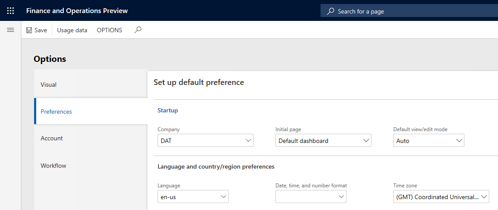
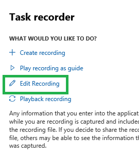

---
# required metadata

title: Regression suite automation tool best practices
description: This topic describes how to use the Regression suite automation tool (RSAT)/Task recorder to record client functions.
author: robadawy
manager: AnnBe
ms.date: 08/01/2019
ms.topic: article
ms.prod: 
ms.service: dynamics-ax-platform
ms.technology: 

# optional metadata

# ms.search.form: 
# ROBOTS: 
audience: Developer
# ms.devlang: 
ms.reviewer: rhaertle
ms.search.scope: Operations
# ms.tgt_pltfrm: 
ms.custom: 21631
ms.search.region: Global
# ms.search.industry: 
ms.author: robadawy
ms.search.validFrom: 2019-08-01
ms.dyn365.ops.version: AX 7.0.0

---

# Regression suite automation tool best practices

[!include [banner](../../includes/banner.md)]

This topic describes how to use the Regression suite automation tool (RSAT)/Task recorder to record client functions.

## Authoring test cases using the Task recorder

1. Make sure all your recordings start on the main dashboard of Finance and Operations (or Retail).
2. Keep individual recordings short and focus on a business task performed by one user, like creating a sales order. This simplifies maintainability and reusability of test cases.
3. Chart controls are not supported. Any task recording actions related to charts will be ignored by RSAT during test case playback.
4. When creating a recording make sure to select a tab header even if the tab is already open. For example, you can switch to another tab and then select the needed tab again to activate it before using a control on it. This will make your recording more reliable during test case playback.
5. RSAT cannot play back any test step that is not recognized by the task recorder. For example, you cannot upload a file from the local disk during play back of a test case.
6. RSAT cannot play back a **page refresh** step. Avoid refreshing a page while recording your test.

## Using the Regression suite automation tool 

1. Upon opening the tool for the first time, select **Settings** and ensure that you have all the needed settings. 
2. Before installing a new version of the tool, it is recommended to close and uninstall the previous version. 
3. When you install a new version of the tool, regenerate **all** test execution files.
 
    

    It is not necessary to regenerate Microsoft Excel parameter files unless you want to take advantage of new features available in a newer format of parameter files.

4. For test parameters that need a unique value, for example, the product receipt number in the **Product Receipt** form or the invoice number in the **Vendor Invoice** form, use the **RandBetween(a,b)** Excel function to generate a unique number every time the test case is executed.
5. The default values in Excel come from the task recording. For **Reference Group** controls such as storage dimensions or tracking dimensions, it stores the key of the lookup instead of the value, for example, **2** instead of **SiteWH**. We recommend that you update these fields with the actual value in Excel so that the test is more robust and resilient to changes.
6. It is recommended to set the same locale for **Language** and **Date ,time, and number format** settings of your Finance and Operations environment prior to running RSAT. If these values are inconsistent, it may result in validation errors.   

    

The following are typical usage sequences.

**Sequence A: Load > New > Edit > Run > Upload**

1. Select **Load**.
2. Select a test cases.
3. If some test cases have no parameter file, select **New** to generate them. 
4. Optional: Edit Excel file to run tests with different parameters.
5. Select **Run**.
6. Optional: After a successful run, select **Upload** to upload all generated automation files (including Excel test parameter files) to Azure DevOps. 

**Sequence B: Load > Edit > Run > Upload**

1. Select **Load**. If all parameter files already exist, you do not need to select **New** to regenerate them.
2. Optional: Edit Excel file to run tests with different parameters.
3. Select **Run**.
4. Optional: After a successful run, select **Upload** to upload all generated automation files (including Excel test parameter files) to Azure DevOps. 

**Sequence C: Load > New (for all test cases) > Run > Upload**

This sequence is recommended after installing a new version of the tool. 

1. Select **Load**. 
2. Select all test cases in the test plan and select **New**.
3. Edit Excel parameter files.
4. Select **Run**.
5. After a successful run, select **Upload** to upload all generated test artifacts to Azure DevOps. 

## How to modify a Task recording

If you want to modify an existing task recording, note these best practices. 

In the Finance and Operations web client, open the Task recorder pane and start editing the recording using the **Edit Recording** option.

  
When you finish editing, save or download the recording, then play it back in the Finance and Operations client and verify that all the steps work correctly.

 
After playing back an edited recording, save it. It is then ready to be used by RSAT.

